# Sign-in, sessions and authorisation

How a reader gets an account, what happens to their record when they do, and who
is allowed to read what. Diagrams render on GitHub.

The one thing to hold on to: **the account is optional and it gates nothing.**
Every sheet, every quick check and every sign-off works signed out. An account
moves the record off one browser; it does not unlock anything.

---

## 1 · The three states a reader can be in

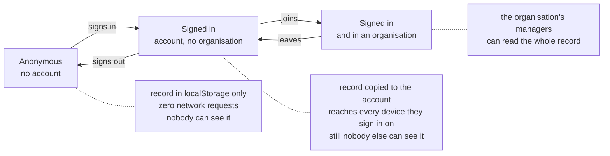

Only the third state makes anyone else's view of the record possible, and
reaching it takes a deliberate click on a screen that says so first.

---

## 2 · Signing in

Three methods are implemented: GitHub, Google and an emailed link. **The panel
offers only the ones the Supabase project actually has**, read at runtime from
Supabase's own public `/auth/v1/settings`.

That check is not decoration. A provider needs code *and* configuration, and
before it existed the panel offered all three unconditionally — so on a project
with GitHub switched off, pressing its button produced a server error and the
reader had no way to know it was never going to work. §14.1's argument about the
kill switch applies to itself: a button that cannot work is worse than no button,
because the reader blames themselves.

If the probe cannot be read, the panel **fails open** and offers everything.
Hiding a provider that works would lock a reader out of an account they could
have had; offering one that does not leaves them an error the panel already
draws.

> **Enabled in the `lokumai` project today: the email link only.** GitHub and
> Google are implemented and switched off (`external_github_enabled: false`), so
> their buttons do not render and section 2a below describes a path this
> deployment does not currently take. Turning either on is a dashboard job:
> create an OAuth app, set the callback to
> `https://<project-ref>.supabase.co/auth/v1/callback`, paste the client id and
> secret into Authentication → Providers. Nothing in this repository changes.
>
> Enabling GitHub also switches on submittal verification (§14.8.2):
> `profiles.github_login` starts being written, and the manager's evidence
> column can resolve. Until then every submittal reads as unattributable.

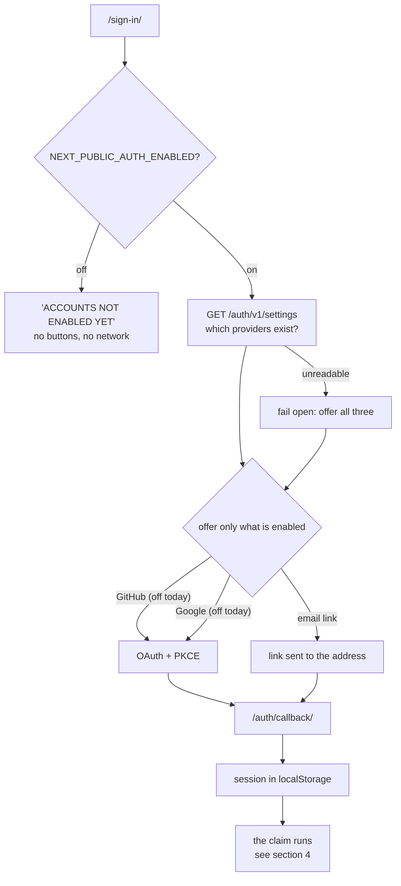

### 2a · OAuth — implemented, not enabled in this project

There is no server in this site, so the code is exchanged in the browser. PKCE
is what makes that safe: the token never appears in a URL.

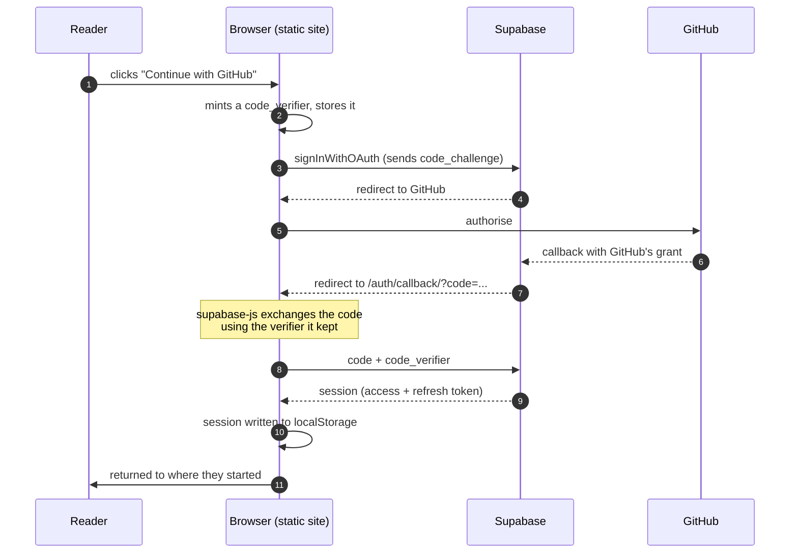

The callback page **observes**; it does not perform the exchange itself.
`detectSessionInUrl` means supabase-js is already doing it, and a second call
would race it for a single-use code — the loser reporting a failure for a
sign-in that actually succeeded. If nothing arrives within 10 seconds the page
says so rather than spinning for ever.

### 2b · An emailed link opened on another device

The path this deployment actually uses today, and the common one anywhere: the
`code_verifier` lives in the browser that *asked*, and people request a link on a
laptop and tap it on a phone. That browser has no verifier, so Supabase hands the
session over whole, in the URL fragment, and there is no code to exchange.

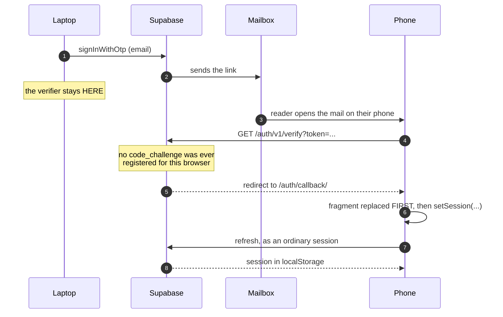

The fragment is stripped before the tokens are used, not after: it is the step
that has to happen whatever the result, and a refresh token sitting in
`location.hash` is readable by anything that reads the URL.

Before this path existed the page waited for a code that was never coming and
timed out on a sign-in that had succeeded.

---

## 3 · What a session is worth

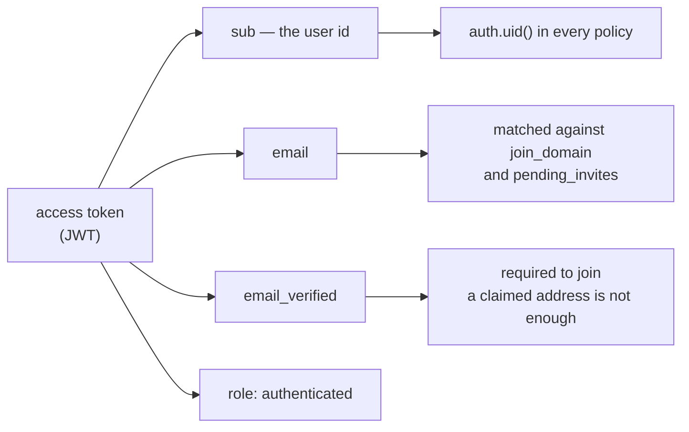

A session is treated as usable until **30 seconds before** its stated expiry.
supabase-js refreshes on its own timer, and that margin is the width of the
window in which the page would otherwise print SIGNED IN over a token the next
request rejects.

---

## 4 · The claim: an anonymous record meeting an account

This runs once per sign-in, and it is the only moment two records can exist for
one person.

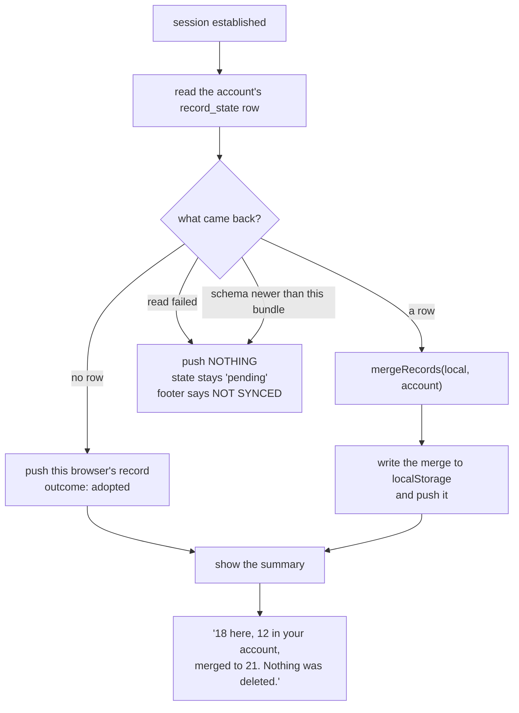

**The read-failed branch is the important one.** If the account's row could not
be read, pushing over it would destroy it. So nothing is sent, the footer reads
`NOT SYNCED` with the export affordance beside it, and no data is lost. A stuck
`pending` is a state the reader can act on; a silent overwrite is not.

A push is gated on the claim having completed, for the same reason: between
signing in and reading the row there is a window in which the throttled flush
could fire and upsert this browser's record over the account's. Twelve signed
sheets, gone, and the summary would then report "nothing was deleted" because it
merged against what it had just destroyed.

### Merge rules

| Field | Rule |
|---|---|
| `signedOff` | **earliest** wins — a signature is an event, and a late-syncing old device must not be able to un-sign a sheet |
| `signedRevision` | whichever signature won |
| `submittals` | union, most recent kept |
| `checklist[i]` | per index, last writer |
| `days`, `sources` | set union |
| `dwellSeconds` | larger |
| `quiz` | the further state (assessed > answered > none) |
| `name`, `mark`, `markSeed`, `role` | the **account's** wins; blank counts as absent, so a local value is carried up |

Commutative and idempotent, both asserted in the unit suite. That is what lets
the whole design work without an event log to replay.

---

## 5 · Staying in sync afterwards

A local write **never waits for the network.** The record is written to
`localStorage` synchronously, the footer is told a push is owed, and the send
rides the existing throttle.

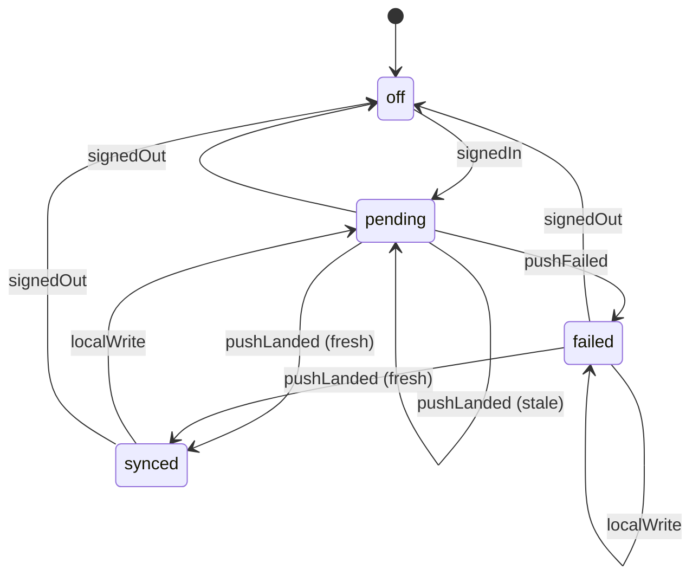

The footer carries this as `data-sync`, and each value is a claim:

| value | what the page is saying |
|---|---|
| `off` | "I am not saying anything about a server" — signed out |
| `synced` | local equals server |
| `pending` | local is ahead; a send is owed |
| `failed` | a send was tried and did not land → **NOT SYNCED · EXPORT YOUR RECORD** |

Two decisions worth knowing:

- **Signing in yields `pending`, never `synced`.** Nothing has been exchanged
  yet, so "local equals server" is unverified even when both happen to be empty.
- **`failed` is sticky under a local write.** A reader who keeps working after a
  failed push still has their record in one browser only. Relabelling that
  `pending` would retire the export advice on the strength of a keystroke. Only
  a landed push clears it.

Events (`learner_event`) queue in memory, capped at 500, and are resent whole —
each row's id is minted by the client, so a resend lands as
`on conflict do nothing`.

---

## 6 · Joining an organisation

There is **no invite token and no invite link**. A token would have to be
validated by reading its row, and whoever can read one row can read them all;
with no database functions there is nowhere to hide the check. The identity in
the JWT is already verified, so no secret is needed.

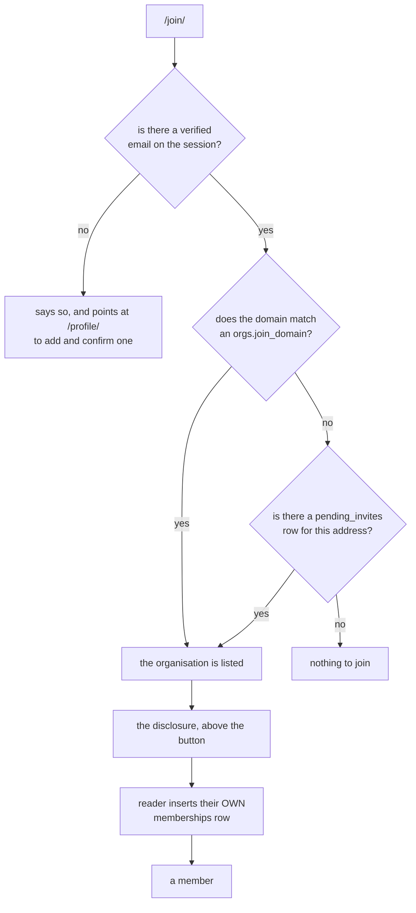

**The reader writes the membership row.** A manager cannot insert one for
somebody else — no policy allows it — and that is not a limitation, it is the
consent mechanism. The click is the agreement, and this is what it agrees to,
shown before the button and not behind a link:

> The organisation's managers will see your whole record: signed sheets, quiz
> attempts, submittals, timeline. If you belong to more than one organisation,
> all of their managers see the same record. Erasing your record later does not
> erase the history the organisation already holds.

### Can somebody type an address they do not own?

No. Tested rather than assumed:

```
signUp('fake.email@intellica.net')   →  user created, NO SESSION
signInWithPassword(same address)     →  "Email not confirmed", no session
```

No session means no JWT, and no JWT satisfies any policy. **Possession of the
mailbox is the verification** and the emailed link is the proof.

Both join policies additionally require the `email_verified` claim, which closes
the OAuth case: a provider hands over an address along with its own opinion of
whether it checked it, and GitHub will report a primary address it has not
verified. See [`../SECURITY.md`](../SECURITY.md), including the warning never to
enable Supabase's autoconfirm while `join_domain` is in use.

---

## 7 · Authorisation

Every rule lives in Postgres row-level security. No Edge Functions, no RPC, no
views — so the schema is portable, and there is no second place where a rule
could be written differently.

**Authorisation is not a chain.** There are two independent paths and both end
at `auth.uid()`:

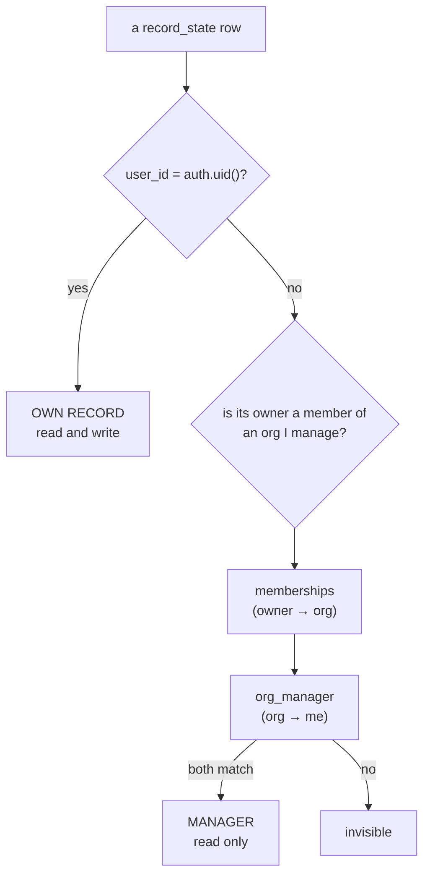

| | own record | colleagues' | another organisation's |
|---|---|---|---|
| member | read + write | ✗ | ✗ |
| in `org_manager` | read + write | **read** | ✗ |

Three invariants:

1. **Authority is not transferable.** There is no "manager of a manager". A row
   in `org_manager` either exists or it does not.
2. **A manager reads and never writes.** The only writer of a record is its
   owner. There is no policy anywhere that lets one person modify another's.
3. **A manager is also a learner** — but only if they joined. Being in
   `org_manager` does not put you in `memberships`, so a manager who wants to
   appear in their own roster has to join like everybody else.

### Why managership is a table and not a column

A policy that queries its own table raises `42P17 infinite recursion` — at query
time, not when the policy is created, so it ships green and fails in production.
Writing "manager" as a `role` column on `memberships` would have needed exactly
that. Making it a separate table means every policy reads a *different* table
and the chain terminates.

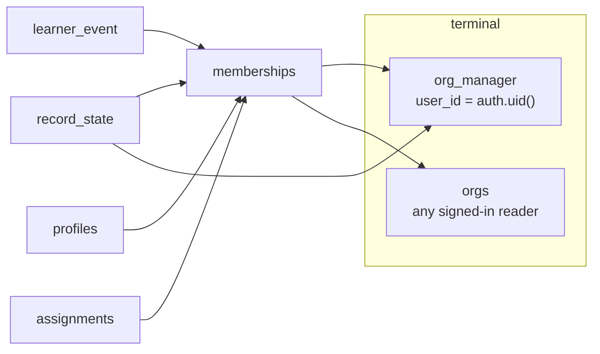

Nothing appears in its own transitive closure. The suite in
`scripts/test-rls.mjs` runs all of it through PostgREST with real sessions — 33
checks — because a too-loose policy never raises an error. It just answers, with
rows it should not have returned.

---

## 8 · Signing out, and erasing

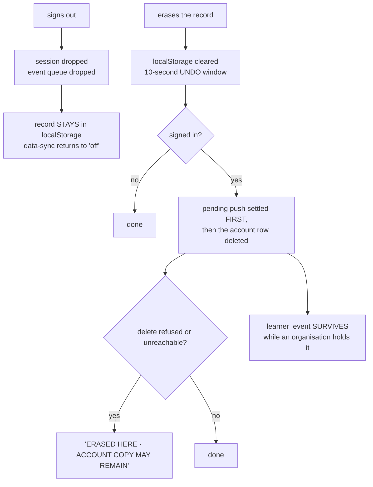

The queue is dropped on sign-out and that is the safe direction: a queued row
carries no `user_id` — the server takes it from `auth.uid()` — so flushing it
after a different account signs in would file one reader's history under
another's name.

The pending push is settled **before** the account row is deleted. Delete first
and the throttled flush lands afterwards, recreating the row the reader was just
told had gone.

And `learner_event` is not erasable from a browser while the reader belongs to an
organisation: there is no delete policy at all in that case. The erase dialog
says this rather than promising a total erase it cannot perform. A reader who
belongs to no organisation *can* remove their own history, which is the one case
the schema originally made impossible for anybody.

---

## Where this lives in the code

| Concern | File |
|---|---|
| The kill switch and config | `src/lib/supabase/env.ts` |
| The browser client (PKCE) | `src/lib/supabase/client.ts` |
| Session shape, callback plan | `src/lib/auth/session.ts` |
| Session as React context | `src/components/auth/SessionProvider.tsx` |
| Sign-in and callback UI | `src/components/auth/SignInPanel.tsx`, `AuthPanels.tsx` |
| Which providers exist | `parseProviderAvailability` in `src/lib/auth/session.ts` |
| **The seam** — where it is all joined | `src/components/record/AccountSync.tsx` |
| Sync state machine | `src/lib/record/sync.ts` |
| Merge rules | `src/lib/record/merge.ts` |
| The claim and its summary | `src/lib/record/claim.ts` |
| Joining | `src/lib/org/join.ts`, `src/components/org/JoinPanel.tsx` |
| Tables and policies | `supabase/migrations/` |
| Policy tests | `scripts/test-rls.mjs` |
| Browser tests | `tests/e2e/accounts.spec.ts`, `accounts-disabled.spec.ts` |

Tables, columns and manager queries: [`manager-queries.md`](manager-queries.md).
Threat notes and accepted risks: [`../SECURITY.md`](../SECURITY.md).
