# Where the data lives, and how it moves

The record, `localStorage`, Supabase, and the sync between them. Diagrams render
on GitHub.

The sentence the whole design hangs on:

> **The browser is the source. Supabase is a replica and a query surface.**

Not a preference. The site is a static export with no server, and the reader's
own progress marks have to be correct in the first painted frame — before any
React, before any network. A `fetch` cannot be synchronous, so the network is
kept off the critical path entirely.

Companion documents: [`auth-flow.md`](auth-flow.md) for sign-in and who may read
what, [`manager-queries.md`](manager-queries.md) for the tables and SQL.

---

## 1 · The whole picture

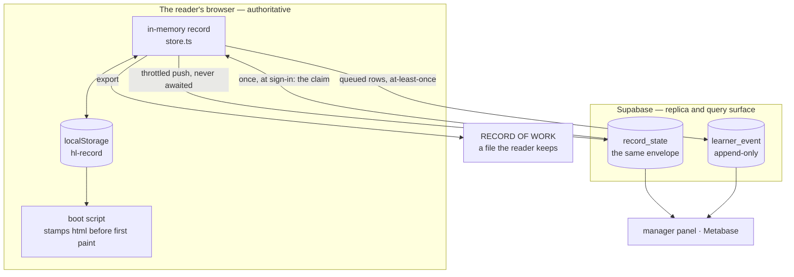

Three properties fall out of this shape, and each is worth stating because each
constrains everything else:

- **A local write never waits for the network.** Sign a sheet with the cable
  unplugged and the record is written, the marks redraw, and the footer says a
  send is owed.
- **Signed out, nothing leaves the browser.** Not "little" — nothing. Seven
  routes are asserted to make zero requests to Supabase with accounts off.
- **The server row is the same envelope as the local one.** One shape, one
  validator, one migration ladder.

---

## 2 · What a record is

One JSON envelope. `localStorage` holds it under `hl-record`; `record_state`
holds the identical thing.

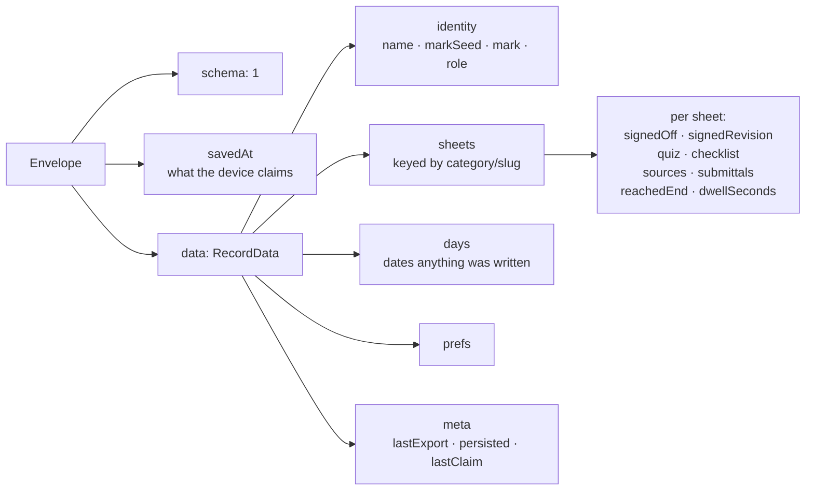

`meta.lastClaim` holds the last claim that **moved something** — the counts,
the identity outcome and the instant, as `summariseClaim` reported them.
`events.noteClaim` is its only writer and it writes only when `claimIsNews`
holds, so signing in and then reloading does not rewrite it. `mergeRecords`
resolves `meta` local-wins, which makes the receipt a fact about THIS browser:
a second browser signing into the same account never prints a merge that
happened in the first one. An erase drops it; `carriesNothing` does not consult
it, so a receipt alone is not a record.

Sizes and caps, all of them named constants rather than numbers in a condition:

| Constant | Value | Why it exists |
|---|---|---|
| `SCHEMA_VERSION` | `1` | Inside the envelope, never in the key |
| `SOFT_CAP_BYTES` | 512 KiB | Well under the 5 MiB the origin gets — and that quota is **shared** with every sibling site on the host. A record of 32 sheets is a few KB; the cap is there to stop an imported file eating the shared quota |
| `DWELL_CAP_SECONDS` | 3600 | A tab left open cannot dominate |
| `MAX_SUBMITTALS` | 3 | Per sheet |
| `MAX_QUEUED_EVENTS` | 500 | The in-memory log tail, bounded so a long session against a dead server is not unbounded |
| `FLUSH_MS` | 500 | The write throttle — and, for free, the network debounce |

---

## 3 · Reading: two channels, and why both exist

This is the part that decides the whole architecture. A static export prerenders
every page once, for everyone; there is no request-time server, so no cookie and
no header can carry reader state into the HTML.

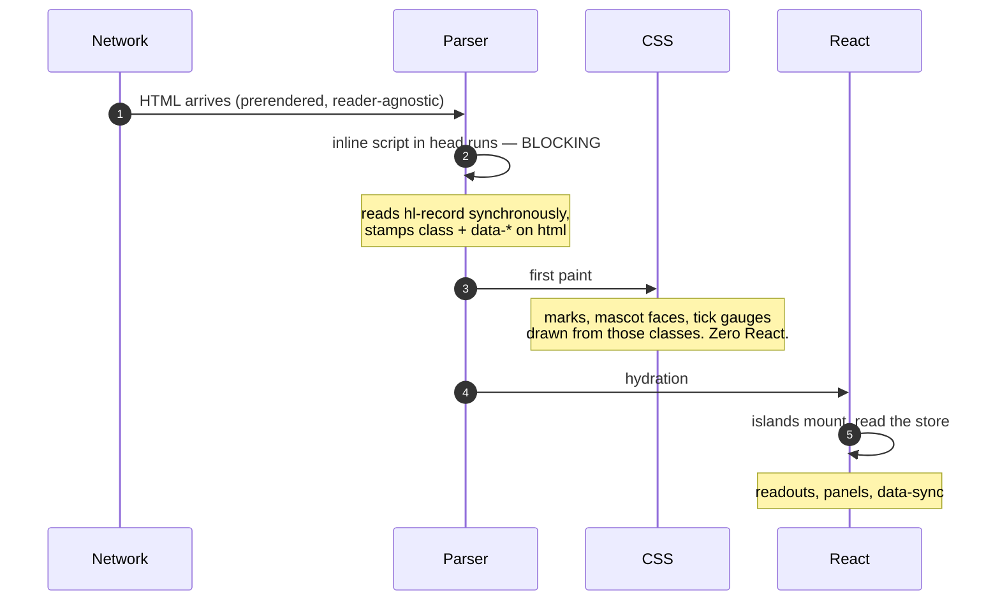

**Channel A — the boot script.** Blocking, in `<head>`, before first paint. It
stamps `<html>`:

```
class="hl-signed-12"              one per signed-off module number
class="hl-cat-intermediate-started"
class="hl-cat-fundamentals-complete"
class="hl-role-devops"
data-hl-record="1"                a readable record exists
data-hl-storage="ok" | "blocked"
```

CSS draws everything from those. No flicker, no hydration, correct in frame one.
The whole body is inside a `try/catch` that does nothing on failure, which lands
the page in an honest empty state rather than a half-drawn one.

Because the script runs **once** and every navigation here is a client
transition, a second island keeps the stamps true for the rest of the session.
Without it, a reader who signs off a sheet and keeps reading would carry frame
one's answer all session.

**Channel B — the islands.** Post-mount React, for everything CSS cannot do:
readouts, panels, the sync indicator. `getServerSnapshot` returns a frozen empty
record — "nothing signed off, every sheet dashed, readouts at `--`" is the only
non-lying thing build-time HTML can say about a reader it has never met.

---

## 4 · Writing: one path, and nothing on it waits

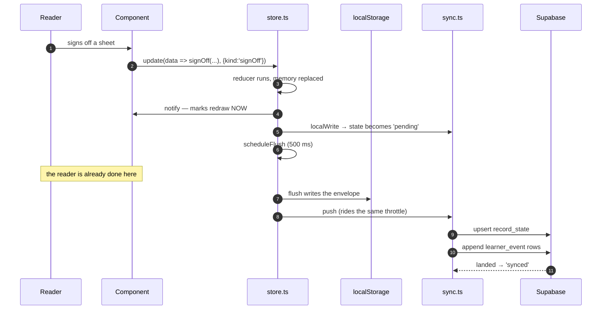

Every layer is slower than the one above it, and each is allowed to be:

| Layer | Latency | If it fails |
|---|---|---|
| memory | none | — (authoritative) |
| `localStorage` | 500 ms throttle | footer names the reason, export offered |
| Supabase | whenever | `data-sync="failed"`, record still in the browser |

The reducers are pure and take the clock as an argument. Which reducer ran is
named by the caller, because the caller is the only code that knows: the
envelope records the state *after*, the log records the *act*, and three quiz
attempts with one lucky answer leave the same envelope behind.

---

## 5 · The storage layer, and its four honest failures

One module names the key and touches `Storage`. Nothing else may.

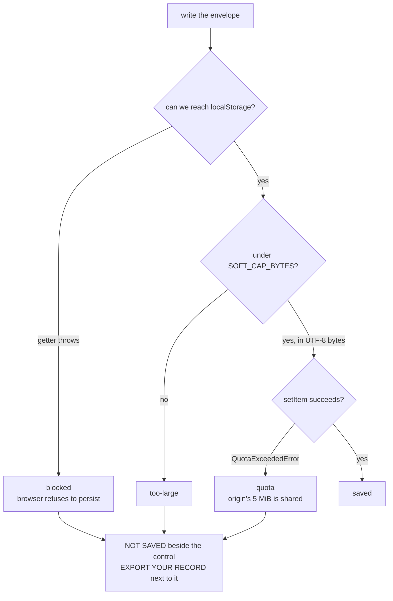

Three details that are each a bug avoided:

- The **property access itself** is inside the `try`. `window.localStorage` throws
  `SecurityError` when the origin is opaque or the browser is told not to persist
  — before any key is read. Blocking cookies is commonly read as exactly that
  instruction.
- The size check counts **UTF-8 bytes**, not `json.length`. String length counts
  UTF-16 units and would pass a payload two or four times the size on the way in.
- The quota branch reads `err.name`, never `instanceof`. `QuotaExceededError` is
  mid-transition from a plain `DOMException` to its own interface, so `instanceof`
  is unreliable in both directions.

### Reading, and the quarantine

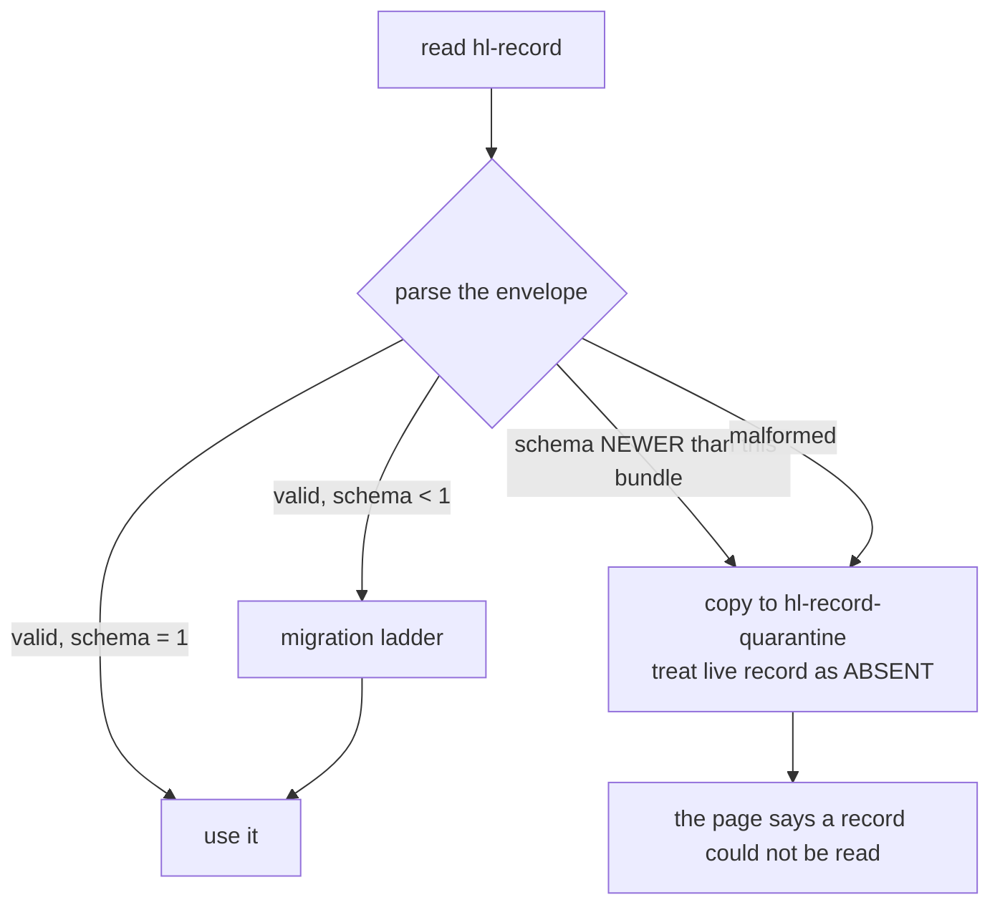

**A quarantine never deletes `hl-record`.** GitHub Pages serves cached bundles,
so an older bundle can load *after* a newer one has written, and this is the only
copy of the record in existence. The live record is treated as absent; the
verbatim copy under `hl-record-quarantine` is what makes that safe.

The same rule is applied to the network: a `record_state` row whose `schema` is
ahead of this bundle is neither read nor overwritten. There it matters more, not
less — the row is shared by every device the reader owns, so a bundle that "fixed"
it by overwriting would corrupt the copy the others read.

---

## 6 · What crosses the network, and what never does

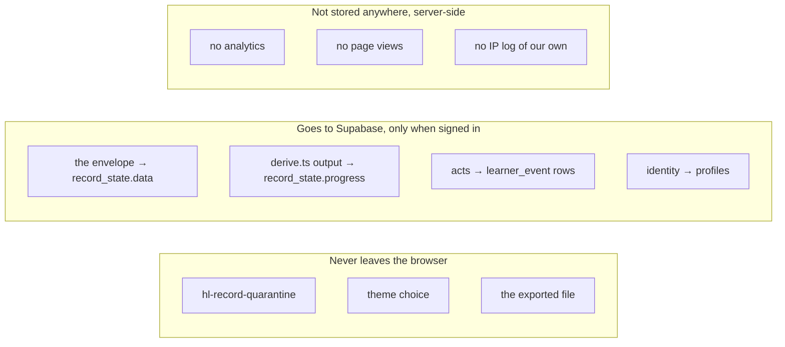

The record goes **whole**, not field by field. That is what makes the merge
possible and the push idempotent: re-sending the same envelope twice is the same
as sending it once.

The log is different — rows, not state — so it has a queue. Each row's `id` is
minted by the client, which is what makes the send at-least-once and safe:
a resent batch lands as `on conflict (id) do nothing`. Overflow drops the
**oldest** rows, because the envelope already carries the current state and what
a drop costs is the granularity of how the reader got there.

### The `progress` column, and the rule it protects

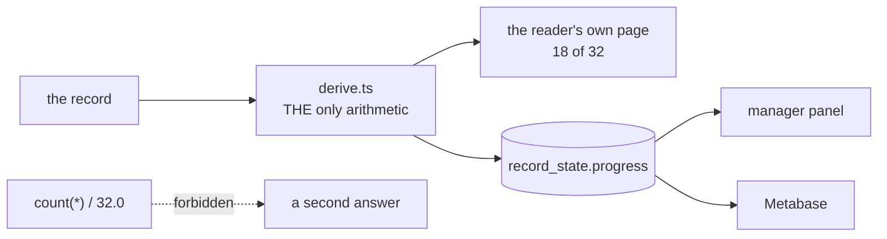

`derive.ts` is where "how far along is this person" is defined, once. Its output
is stored so a dashboard reads the same number the learner reads. A `count(*)`
in a report is how a panel comes to say `18/32` while the reader's own page says
`17/32` — two people told two different things about the same progress.

SQL filters and authorises. It does not compute.

---

## 7 · Sync states

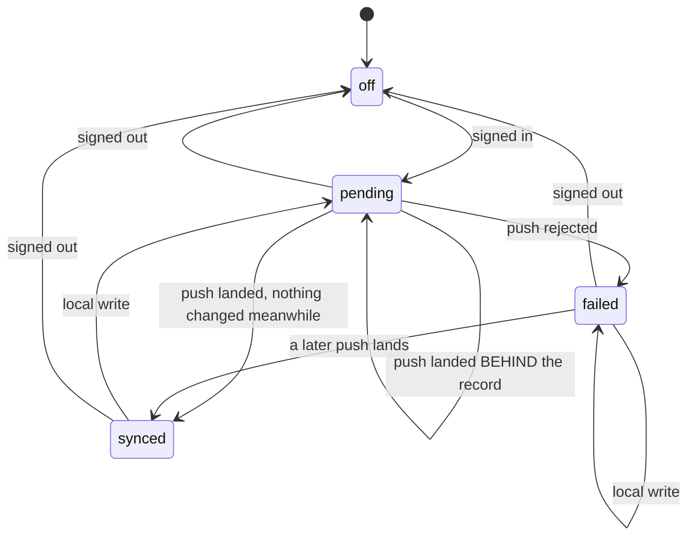

The footer publishes this as `data-sync`, and every value is a claim:

| value | the page is saying |
|---|---|
| `off` | "I am not saying anything about a server" |
| `synced` | local equals server |
| `pending` | local is ahead; a send is owed |
| `failed` | a send was tried and did not land → **NOT SYNCED · EXPORT YOUR RECORD** |

- **Signing in yields `pending`, never `synced`.** Nothing has been exchanged
  yet, so "local equals server" is unverified even when both sides are empty.
- **A push that lands behind the record stays `pending`.** The write succeeded
  and the claim would still be false.
- **`failed` is sticky under a local write.** A reader who keeps working after a
  failed push still has their record in one browser only; calling that `pending`
  would retire the export advice on the strength of a keystroke.

---

## 8 · Two devices

The only case where two records exist for one person. Field-by-field, and no
signature is ever taken back.

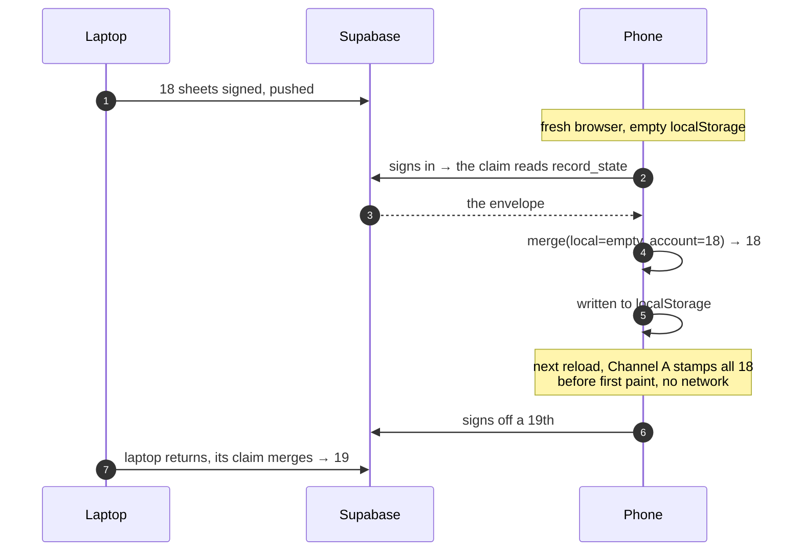

| Field | Rule |
|---|---|
| `signedOff` | **earliest** wins — a late-syncing old device must not un-sign a sheet |
| `submittals` | union, most recent kept, capped |
| `checklist[i]` | per index, last writer |
| `days`, `sources` | set union |
| `dwellSeconds` | larger |
| `quiz` | the further state |
| identity | the **account's** wins; blank counts as absent |

Commutative and idempotent, both asserted. That is what lets this work with no
event log to replay: the merge does not care what order things arrived in.

### Same browser, two tabs

Two mechanisms, deliberately:

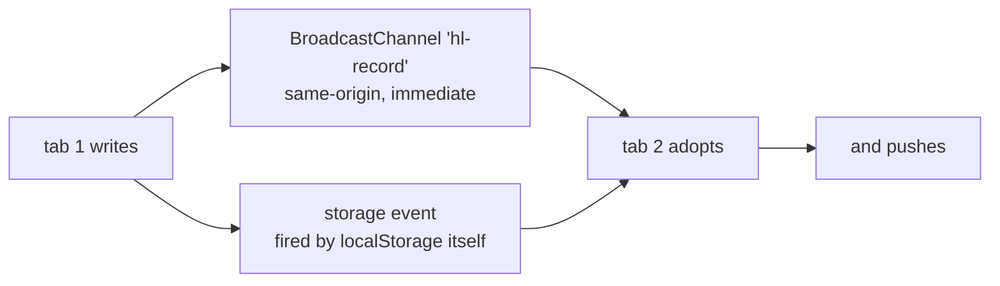

The channel is the direct path; the `storage` event is what fires even where the
channel is unavailable, and it also covers a key removed from under the tab
entirely — a `null` key or a `null` value means an erase happened elsewhere, and
this tab adopts the empty record rather than keeping marks for a record that no
longer exists.

A **quarantine** arriving from another tab is deliberately not adopted. The copy
is already preserved under the quarantine key by whichever context read it, and
this tab's readable state is the better thing to keep on screen.

The adopting tab then pushes, and that push is deliberate too: the write came
from another tab of the same browser, so from the account's point of view it is a
local write — and this tab cannot know whether the tab that made it got it
through. Saying nothing would leave this footer claiming `synced` for a record
the server may not hold; marking `pending` without sending would claim a send is
owed that nothing will ever perform. The cost is one idempotent request against
a page that would otherwise lie.

---

## 9 · The file the reader keeps

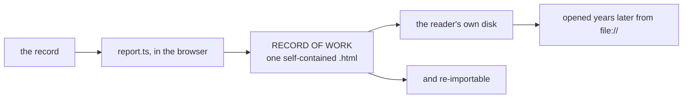

One `<style>`, one classic inline `<script>`, inline SVG, system fonts, the data
in a JSON block. Nothing is fetched, because a `file://` document is an opaque
origin and anything not inlined is a broken asset in front of an employer.

This is the answer to every storage failure above. Whatever the browser or the
network does, there is a path that produces a file the reader owns — which is
why `EXPORT YOUR RECORD` sits next to every failed-write message rather than in
a menu.

---

## 10 · Where this lives

| Concern | File |
|---|---|
| The record's shape and keys | `src/lib/record/schema.ts` |
| The only module touching `Storage` | `src/lib/record/storage.ts` |
| Channel A, before first paint | `src/lib/record/boot.ts` |
| Keeping the stamps true after it | `src/lib/record/stamp.ts` |
| Memory, notify, throttled flush | `src/lib/record/store.ts` |
| The reducers | `src/lib/record/events.ts` |
| The validator and quarantine | `src/lib/record/validate.ts` |
| The migration ladder | `src/lib/record/migrate.ts` |
| Every number that prints | `src/lib/record/derive.ts` |
| The `progress` column | `src/lib/record/progress.ts` |
| Sync state machine | `src/lib/record/sync.ts` |
| Merge rules | `src/lib/record/merge.ts` |
| The network vocabulary | `src/lib/record/wire.ts` |
| Supabase implementation of the port | `src/lib/supabase/remote-store.ts` |
| **The seam** | `src/components/record/AccountSync.tsx` |
| The exported document | `src/lib/record/report.ts` |
| Erase, local and remote | `src/lib/record/erase.ts` |
| Tables and policies | `supabase/migrations/` |
