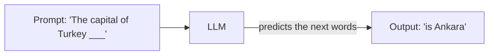
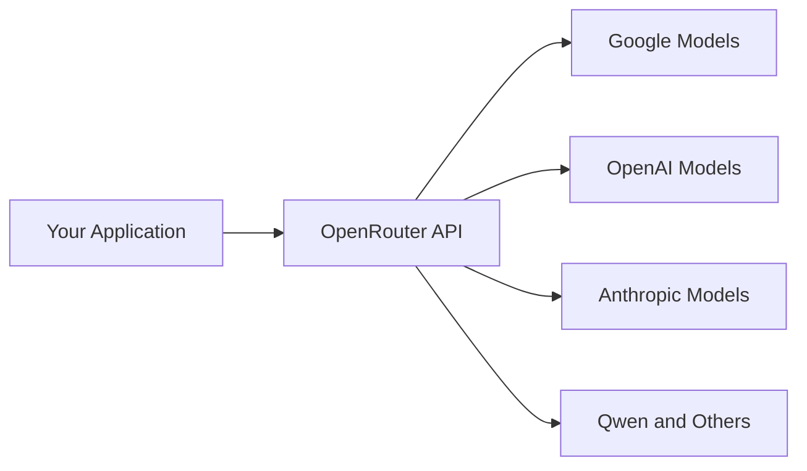
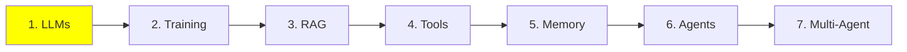

# Module 1: LLM Fundamentals

Everything else in this series sits on top of this module. An LLM is a simple thing to
describe: text goes in, text comes out. But almost every idea later on (RAG, tools, memory,
agents) exists because of one specific limit that we will get to in a minute.

So let's start with the model itself, then the limit, then how you actually run one.

## What is an LLM?

An LLM is a model that takes text as input and gives you text as output. You send it some
words (the **prompt**) and it sends back more words (the **generation**).

Under the hood it is a deep neural network trained on a huge amount of text: books,
websites, code. What it learned from all that text is one skill, guessing the most likely
next word.



That is genuinely all it does. Everything impressive an LLM appears to do is that one
guess, repeated over and over, one word at a time.

## How big is an LLM?

An LLM is a neural network with a huge number of **parameters**. Think of parameters a bit
like the connections in a brain. The more of them there are, the more the network can hold.

Why does this matter to you? Because as a rough rule, more parameters means a more capable
model with better reasoning, and a bigger machine needed to run it. Model size is the main
thing that decides whether you can run a model at all.

This is not just folklore, it was measured. The 2020 paper
[Scaling Laws for Neural Language Models](https://arxiv.org/abs/2001.08361) showed that
performance improves smoothly and predictably as you grow parameters, training data and
compute together, following a power law instead of jumping around. Those **scaling laws**
are the reason the whole industry spent the following years simply building bigger models.

Three rough sizes:

| Size | Parameters | Where it runs |
| --- | --- | --- |
| Small | 0.6B – 8B | Your own machine, if you have a GPU |
| Medium | 8B – 128B | Server-grade or enterprise GPUs |
| Large | 128B – 2.4T (yes, trillion) | Data centers only |

The large ones are the frontier models behind tools like Claude Code and ChatGPT. You will
never run those locally, and that is fine, because you call them over an API instead.

To compare specific models and their benchmark scores, use
[artificialanalysis.ai](https://artificialanalysis.ai/).

## The context window

Here is the limit that shapes everything else.

Every LLM has a **context window**: the maximum amount of text it can handle in one go,
input and output together. Think of it as the model's working desk. Everything it is
allowed to look at right now has to fit on that desk.

The easiest way to picture it is your chat history with ChatGPT. At the start of a new
conversation it is empty. As you talk back and forth, your messages and the model's replies
keep getting added to it, until eventually it fills up.

So the context is really just a **stack of messages** that gets built up and sent to the
model. The LLM takes that whole stack as input, processes it, and generates the next
message.

**What happens if you exceed it?** You get an error. That is it, the request simply fails.

There are techniques for working around this, and they are important enough to have their
own topic later: [Context Engineering](../2_intermediate/9_context_engineering.md) in the
Intermediate section.

### What goes into the context

Three kinds of message make up a normal chat:

- **HumanMessage**: what you type. Your request. This is what people mean by "the prompt".
- **AIMessage**: the model's reply.
- **SystemMessage**: a default instruction set written by the vendor or the developer
  (OpenAI, Anthropic, or you). It is placed once at the top and tells the model how to
  behave: what to do, when, and which tool to use.

These messages stack up every time you interact with the system:

<p align="center">
  <br>
  <em>Two turns of a plain chat: two Human Messages and two AI Messages. Nothing is ever
  removed, so on the second turn the model is reading everything from the first one as
  well.</em>
</p>

One HumanMessage plus the AIMessage that answers it is called a **turn**. In a plain LLM chat
there is nothing in between: you send the prompt, you get the reply. The figure above is two
turns.

That stack has several names depending on who is talking: **context**, **working memory**,
**message history**, or **short-term memory**. Don't rush, short-term memory gets its own
module: [Module 5: Memory](5_memory.md).

The SystemMessage is worth a closer look, because it is not one plain blob of text. It
normally holds the behaviour instructions *and* the **tool schemas**, meaning the list of
tools the model is allowed to call, with their names and arguments:

<p align="center">
  <br>
  <em>Inside a system prompt: the behaviour instructions, the tool schemas, and sometimes a
  block of static reference text. All of it sits at the very top of the context.</em>
</p>

In the API the tool schemas are a separate field rather than part of the system text, but
the model receives them as one block up front, so it is fair to picture them together.

You can read real leaked system prompts from many products here:
[system_prompts_leaks](https://github.com/asgeirtj/system_prompts_leaks).

There are also **two more message types** you will meet once we get to agents. An agent is
just an LLM that can call tools, and a tool is nothing exotic: it is a function, usually a
plain Python function that you wrote.

Say you ask about the weather in Istanbul. The model cannot look that up itself, so it says
it wants to run one of your functions: it emits a **ToolCall**, something like
`get_weather(city="Istanbul")`. Your machine is the one with Python installed, so your
machine runs the function, gets `34°C` back, and hands that to the model as a **ToolResult**.
Both messages are added to the same stack.

So the part worth remembering: **the ToolCall is generated by the LLM, but the ToolResult is
generated by the host machine**, meaning your laptop or a server, because that is what
actually executes the function. The model asks; something else does the work.

An agent turn has more inside it. After your HumanMessage, the model decides whether it needs
a tool to answer you. If it does, the ToolCall and the ToolResult get added to the context as
well, and only then does the model write the final answer. All of that is still **one turn**:
a HumanMessage, any tool messages, and the AIMessage at the end.

<p align="center">
  <br>
  <em>A single turn of an agent: you prompt, the AI thinks, the AI calls a tool, then the AI
  answers. Watch who writes what: the LLM produces the thinking, the Tool Call and the answer,
  while the Tool Result comes from the host machine that runs the function.</em>
</p>

That split is the whole basis of how agents work, and we come back to it in
[Module 4: Tools](4_tools.md) and [Module 6: Agents](6_agents.md).

## Generation settings you should know

You can change how the model responds using **hyperparameters**. Note the "hyper": these
affect generation, unlike the parameters above, which are the model's size.

Two you will use constantly:

- **Temperature**: the creativity dial, usually from 0.0 to 1.0. Low (0.1) gives
  predictable, consistent answers. High (0.9) gives more creative but less reliable ones.
- **Max output tokens**: the maximum length of the reply. Set it to control cost and to
  stop the model from rambling. 2K is plenty for short answers.

## Running an LLM: cloud or local

Running a model is called **inference**. It means exactly what we described earlier: you
send the context, the model processes it, and it completes it.

As the name Large Language Model implies, these things are big, so inference needs a GPU.
That gives you two options.

**1. Cloud inference (API calls).** You call a service like ChatGPT or Google AI Studio.
They own the huge GPUs and run the model for you.

- **Pros:** access to the biggest, most capable models, and no hardware to buy.
- **Cons:** costs money, needs internet, can be slow.

**2. Local inference.** The model runs on your own computer.

- **Requirement:** a decent GPU with enough memory (VRAM).
- **Pros:** free after setup, since you only pay for electricity, and it works offline.
- **Cons:** you are limited to the smaller models.

Let's take those one at a time.

## Running one locally

### Quantization

**What is quantization?** Compressing the model so it fits in less memory. Models normally
ship with 16-bit weights; quantizing drops each weight to 4 bits, which cuts the memory
needed by about four times.

The numbers make it obvious. Take a 32B model:

| Precision | Memory needed | Fits on a consumer GPU? |
| --- | --- | --- |
| 16-bit (as it ships) | ~64 GB | No |
| 4-bit (quantized) | ~16 GB, plus a bit for context | Yes, comfortably on a 24 GB or 32 GB card |

Same model, same weights, one quarter of the memory. That is the difference between "I
cannot run this at all" and "this runs on my desktop".

**Do you have to quantize models yourself?** No, and you almost never should.
[Ollama](https://ollama.com/) and [Unsloth](https://unsloth.ai/) already publish
ready-made quantized versions of the popular models: Qwen, Llama, Mistral, Gemma and
more. Just pull one and run it.

### The engines that actually run the model

Underneath everything there is an **inference engine** doing the real work:

- **llama.cpp**
- **vLLM** (NVIDIA, AMD, TPUs)
- **SGLang** (NVIDIA only)
- **TensorRT-LLM** (NVIDIA, AMD)
- **MLX** (Apple only)

These are not beginner friendly and take a lot of wiring to get running. Luckily you rarely
touch them directly. Other tools use them under the hood, hide the interfaces, and get you
from zero to a running model in a few lines of code, or straight from the terminal.

### The easy tools

- **[LMStudio](https://lmstudio.ai/)**: a simple GUI for downloading and chatting with
  models. Great for getting started.
- **[Ollama](https://ollama.com/)**: a command-line tool for pulling and serving models
  fast. Better once you are comfortable in a terminal.

**Try it now:** pull a very small 0.6B model with the Ollama CLI and chat with it in your
terminal. It takes a couple of minutes and it makes everything above concrete.

## Running one in the cloud

For the larger models, or just to avoid setup entirely, you use an **inference provider**.
They give you an API key, and you call their models from your code with a client library.

Both of these have a free tier with daily limits, which is enough to learn on.

### Google AI Studio

Start here: [aistudio.google.com](https://aistudio.google.com/). Sign up and get your
personal API key. The free tier covers the basic models with daily limits.

### OpenRouter

[OpenRouter](https://openrouter.ai/) is a gateway that forwards your request to many
different providers. Because it is a router, one API key reaches almost every model instead
of you juggling separate keys for Google, OpenAI, Qwen and the rest.



It also has free models with daily limits, and switching model is a one-line change, which
makes it the fastest way to compare models on your own task.

## A first look at prompt engineering

**Prompt engineering** is writing the input so you get the output you want. Same idea as
giving instructions to a student: clear instructions get the homework done properly, vague
instructions get you whatever each person felt like doing.

Remember what the model actually computes, the probability of the next token given
everything in the context:

```
P(next token | context)
```

Your prompt *is* that context. So the job is to find the input that makes the output you
want the most likely one:

```
best prompt = the prompt that maximises P(the output you want | prompt)
```

That is the whole discipline in one line. There are many named techniques, and we cover
them in [Module 8: Prompt Engineering](../2_intermediate/8_prompt_engineering.md). But most
of the real work is experimenting: try a phrasing, look at the output, change it, try again.

Worth reading, to see how much effort goes into production prompts:

- [System prompts of AI tools](https://github.com/x1xhlol/system-prompts-and-models-of-ai-tools)
- [System prompt leaks](https://github.com/asgeirtj/system_prompts_leaks)
- [Leaked system prompts](https://github.com/jujumilk3/leaked-system-prompts)

## Where this fits in the series



You now know what an LLM is, the one limit that matters (the context window), what lives
inside that context, and how to run a model either locally or in the cloud.

Keep the context window in mind as you go. RAG, memory, agents and context engineering are
all, in one way or another, answers to the question: *what do we put on that limited desk?*

## References

- [Scaling Laws for Neural Language Models](https://arxiv.org/abs/2001.08361): Kaplan et
  al., 2020, the measurement behind "bigger models are better"
- [Artificial Analysis](https://artificialanalysis.ai/): model comparisons and benchmarks
- [Ollama](https://ollama.com/): pull and serve models locally
- [LMStudio](https://lmstudio.ai/): GUI for running models locally
- [Unsloth](https://unsloth.ai/): pre-quantized model releases
- [Google AI Studio](https://aistudio.google.com/): free-tier API keys
- [OpenRouter](https://openrouter.ai/): one key for many providers
- [System prompt leaks](https://github.com/asgeirtj/system_prompts_leaks)

**Next Module:** [Module 2: Training LLMs](2_training.md)
