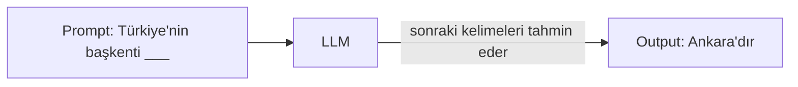
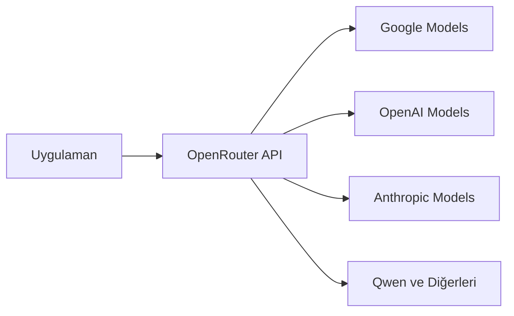
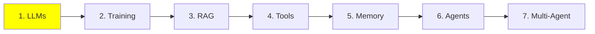

# Modül 1: LLM Temelleri

Bu serideki her şey bu modülün üstüne kuruluyor. Bir LLM'i tanımlamak kolay: metin girer,
metin çıkar. Ama sonraki konuların neredeyse tamamı (RAG, tools, memory, agents) tek bir
sınır yüzünden var. Birazdan o sınıra geliyoruz.

Önce modelin kendisiyle başlayalım, sonra sınıra, sonra da bir modeli gerçekte nasıl
çalıştırdığına.

## LLM nedir?

Bir LLM, input olarak metin alıp output olarak metin veren bir modeldir. Ona birkaç kelime
yollarsın (**prompt**), o da sana daha fazla kelime yollar (**generation**).

Kapağın altında, çok büyük miktarda metinle eğitilmiş derin bir neural network var: kitaplar,
web siteleri, kod. Bütün o metinden öğrendiği tek bir beceri var, en olası sonraki kelimeyi
tahmin etmek.



Yaptığı gerçekten bundan fazlası değil. Bir LLM'in yaptığı etkileyici görünen her şey, bu tek
tahminin tekrar tekrar, kelime kelime yapılmasından ibaret.

## Bir LLM ne kadar büyük?

Bir LLM, çok sayıda **parameter**'a sahip bir neural network'tür. Parameter'ları biraz
beyindeki bağlantılar gibi düşün. Sayısı arttıkça network'ün tutabildiği de artar.

Bu senin için neden önemli? Çünkü kaba bir kural olarak, daha fazla parameter daha yetenekli
ve daha iyi reasoning yapan bir model demek, ve onu çalıştırmak için daha büyük bir makine
demek. Bir modeli çalıştırıp çalıştıramayacağını belirleyen ana şey model boyutudur.

Bu sadece kulaktan dolma bir şey değil, ölçüldü. 2020'de yayınlanan
[Scaling Laws for Neural Language Models](https://arxiv.org/abs/2001.08361) makalesi;
parameter, training data ve compute'u birlikte büyüttükçe performansın zıplamalar yapmadan,
düzgün ve öngörülebilir biçimde, bir power law'a uyarak arttığını gösterdi. Bu
**scaling laws**, sektörün sonraki yıllarını neden sadece daha büyük model üretmekle
geçirdiğini açıklıyor.

Kabaca üç boyut:

| Boyut | Parameter | Nerede çalışır |
| --- | --- | --- |
| Küçük | 0.6B – 8B | GPU'n varsa kendi makinende |
| Orta | 8B – 128B | Server sınıfı ve kurumsal GPU'lar |
| Büyük | 128B – 2.4T (evet, trilyon) | Sadece data center'lar |

Büyük olanlar, Claude Code ve ChatGPT gibi araçların arkasındaki frontier model'ler. Onları
local'de asla çalıştıramayacaksın, ve bu sorun değil, çünkü onları API üzerinden çağırırsın.

Belirli modelleri ve benchmark puanlarını karşılaştırmak için
[artificialanalysis.ai](https://artificialanalysis.ai/) kullan.

## Context window

Geri kalan her şeyi şekillendiren sınır burada.

Her LLM'in bir **context window**'u vardır: input ve output birlikte, tek seferde
işleyebileceği maksimum metin miktarı. Bunu modelin çalışma masası gibi düşün. Şu anda
bakmasına izin verilen her şeyin o masaya sığması gerekir.

En kolay resmetme yolu ChatGPT ile chat geçmişin. Yeni bir chat'in başında boştur. Karşılıklı
yazdıkça, senin mesajların ve modelin yanıtları oraya eklenir, ta ki dolana kadar.

Yani context aslında sadece modele oluşturulup gönderilen bir **message stack**'tir. LLM bu
stack'in tamamını input olarak alır, işler ve sıradaki mesajı üretir.

**Sınırı aşarsan ne olur?** Hata alırsın. Bu kadar, request basitçe fail eder.

Bunun etrafından dolaşmanın teknikleri var ve kendi başlığını hak edecek kadar önemli:
Intermediate bölümündeki
[Context Engineering](../2_intermediate/9_context_engineering_tr.md).

### Context'in içinde ne var

Normal bir chat'i üç tür mesaj oluşturur:

- **HumanMessage**: senin yazdığın şey. İsteğin. İnsanların "prompt" derken kastettiği bu.
- **AIMessage**: modelin yanıtı.
- **SystemMessage**: modelin sağlayıcısı ya da geliştiricisi (OpenAI, Anthropic veya sen)
  tarafından yazılan default instruction seti. En tepeye bir kez konur ve modele nasıl
  davranacağını söyler: neyi ne zaman yapacağını, hangi tool'u kullanacağını.

Bu mesajlar sistemle her etkileşiminde üst üste birikir:

<p align="center">
  <br>
  <em>Düz bir chat'in iki turu: iki Human Message ve iki AI Message. Hiçbir şey silinmez,
  yani ikinci turda model birinci turdaki her şeyi de okuyor.</em>
</p>

Bir HumanMessage ile ona cevap veren AIMessage'a birlikte **tur** denir. Düz bir LLM chat'inde
aralarında hiçbir şey yoktur: prompt'u yollarsın, cevabı alırsın. Yukarıdaki figürde iki tur
var.

Bu stack'in, kimin konuştuğuna göre birkaç adı var: **context**, **working memory**,
**message history** ya da **short-term memory**. Acele etme, short-term memory'nin kendi
modülü var: [Modül 5: Memory](5_memory_tr.md).

SystemMessage'a daha yakından bakmaya değer, çünkü tek parça düz bir metin değildir. Genelde
davranış instruction'larını *ve* **tool schema**'larını, yani modelin çağırmasına izin verilen
tool'ların listesini, isimleri ve argümanlarıyla birlikte tutar:

<p align="center">
  <br>
  <em>Bir system prompt'un içi: davranış instruction'ları, tool schema'ları ve bazen bir blok
  static reference metni. Hepsi context'in en tepesinde durur.</em>
</p>

API tarafında tool schema'lar system metninin parçası değil, ayrı bir field'dır; ama model
onları en başta tek blok olarak alır, dolayısıyla birlikte düşünmek yanlış olmaz.

Birçok üründen sızmış gerçek system prompt'ları burada okuyabilirsin:
[system_prompts_leaks](https://github.com/asgeirtj/system_prompts_leaks).

Agent'lara geldiğimizde tanışacağın **iki mesaj türü daha** var. Agent, tool çağırabilen bir
LLM'den başka bir şey değil. Tool ise egzotik bir şey değil: sadece bir fonksiyon, genelde
senin yazdığın düz bir Python fonksiyonu.

Diyelim İstanbul'un hava durumunu sordun. Model buna kendisi bakamaz, bu yüzden fonksiyonlardan
birini çalıştırmak istediğini söyler: bir **ToolCall** üretir, mesela
`get_weather(city="Istanbul")`. Python kurulu olan makine senin makinen, dolayısıyla fonksiyonu
senin makinen çalıştırır, `34°C` sonucunu alır ve bunu modele **ToolResult** olarak verir. İki
mesaj da aynı message stack'e eklenir.

Yani aklında tutmaya değer kısım: **ToolCall'ı LLM üretir, ama ToolResult'ı host makine
üretir**, yani laptop'un ya da bir server, çünkü fonksiyonu asıl çalıştıran odur. Model ister;
işi başka bir şey yapar.

Bir agent turunun içinde daha fazla şey olur. HumanMessage'ından sonra model, sana cevap vermek
için bir tool'a ihtiyacı olup olmadığına karar verir. İhtiyacı varsa ToolCall ve ToolResult da
context'e eklenir, ve model final cevabı ancak ondan sonra yazar. Bunların hepsi hâlâ **tek bir
tur**: bir HumanMessage, varsa tool mesajları, ve sonda AIMessage.

<p align="center">
  <br>
  <em>Bir agent'ın tek turu: sen prompt yazarsın, AI düşünür, AI tool çağırır, sonra AI
  cevaplar. Kimin ne yazdığına dikkat et: thinking'i, Tool Call'ı ve cevabı LLM üretir; Tool
  Result ise fonksiyonu çalıştıran host makineden gelir.</em>
</p>

Bu ayrım agent'ların nasıl çalıştığının temeli; [Modül 4: Tools](4_tools_tr.md) ve
[Modül 6: Agents](6_agents_tr.md) modüllerinde geri döneceğiz.

## Bilmen gereken generation ayarları

Modelin nasıl yanıt verdiğini **hyperparameter**'larla değiştirebilirsin. "Hyper" kısmına
dikkat: bunlar generation'ı etkiler; yukarıda konuştuğumuz parameter'lar ise modelin
boyutuydu.

Sürekli kullanacağın iki tanesi:

- **Temperature**: yaratıcılık ayarı, genelde 0.0 ile 1.0 arası. Düşük (0.1) öngörülebilir ve
  tutarlı yanıtlar verir. Yüksek (0.9) daha yaratıcı ama daha az güvenilir.
- **Max output tokens**: yanıtın maksimum uzunluğu. Maliyeti kontrol etmek ve modelin
  gevezelik etmesini engellemek için ayarla. Kısa yanıtlar için 2K bol bol yeter.

## Bir LLM'i çalıştırmak: cloud mu, local mi?

Bir modeli çalıştırmaya **inference** denir. Tam da yukarıda anlattığımız şey: context'i
gönderirsin, model işler ve tamamlar.

Large Language Model adının ima ettiği gibi bunlar büyük şeyler, dolayısıyla inference GPU
gerektirir. Bu da sana iki seçenek bırakır.

**1. Cloud inference (API çağrıları).** ChatGPT ya da Google AI Studio gibi bir servisi
çağırırsın. Devasa GPU'lar onların, modeli senin için onlar çalıştırır.

- **Artıları:** en büyük ve en yetenekli modellere erişim, ve satın alınacak donanım yok.
- **Eksileri:** para tutar, internet gerekir, yavaş olabilir.

**2. Local inference.** Model kendi bilgisayarında çalışır.

- **Gereksinim:** yeterli belleğe (VRAM) sahip düzgün bir GPU.
- **Artıları:** kurulumdan sonra bedava, sadece elektrik ödersin, ve internetsiz çalışır.
- **Eksileri:** küçük modellerle sınırlı kalırsın.

Sırayla bakalım.

## Local çalıştırmak

### Quantization

**Quantization nedir?** Modeli daha az bellekle sığacak şekilde sıkıştırmak. Modeller normalde
16-bit weight'lerle dağıtılır; quantization her weight'i 4 bite düşürür ve gereken belleği
yaklaşık dörde böler.

Sayılar durumu netleştiriyor. 32B'lik bir modeli ele al:

| Precision | Gereken bellek | Consumer GPU'ya sığar mı? |
| --- | --- | --- |
| 16-bit (dağıtıldığı hali) | ~64 GB | Hayır |
| 4-bit (quantize edilmiş) | ~16 GB, artı context için biraz | Evet, 24 GB veya 32 GB'lık bir kartta rahatça |

Aynı model, aynı weight'ler, belleğin dörtte biri. "Bunu hiç çalıştıramam" ile "bu benim
masaüstümde çalışır" arasındaki fark bu.

**Modelleri kendin quantize etmen gerekir mi?** Hayır, ve neredeyse hiç gerekmez.
[Ollama](https://ollama.com/) ve [Unsloth](https://unsloth.ai/) popüler modellerin hazır
quantize edilmiş sürümlerini yayınlıyor: Qwen, Llama, Mistral, Gemma ve daha fazlası. Sadece
çek ve çalıştır.

### Modeli asıl çalıştıran engine'ler

Her şeyin altında gerçek işi yapan bir **inference engine** var:

- **llama.cpp**
- **vLLM** (NVIDIA, AMD, TPU)
- **SGLang** (sadece NVIDIA)
- **TensorRT-LLM** (NVIDIA, AMD)
- **MLX** (sadece Apple)

Bunlar yeni başlayan dostu değil ve çalışır hale getirmek epey uğraş gerektirir. Neyse ki
onlara doğrudan pek dokunmazsın. Başka araçlar bunları arka planda kullanır, interface'leri
saklar ve seni birkaç satır kodla, hatta doğrudan terminalden çalışan bir modele ulaştırır.

### Kolay araçlar

- **[LMStudio](https://lmstudio.ai/)**: model indirip chat etmek için basit bir GUI. Başlamak
  için harika.
- **[Ollama](https://ollama.com/)**: modelleri hızlıca çekip serve etmek için bir CLI aracı.
  Terminalde rahatsan daha iyi.

**Hemen dene:** Ollama CLI ile çok küçük bir 0.6B model çek ve terminalde onunla chat et. İki
dakika sürer ve yukarıdaki her şeyi somutlaştırır.

## Cloud'da çalıştırmak

Daha büyük modeller için, ya da sadece kurulumdan tamamen kaçmak için, bir
**inference provider** kullanırsın. Sana bir API key verir, sen de kodundan bir client
kütüphanesiyle onların modellerini çağırırsın.

Aşağıdaki ikisinin de günlük limitli bir free tier'ı var; öğrenmek için yeter.

### Google AI Studio

Buradan başla: [aistudio.google.com](https://aistudio.google.com/). Kaydol ve kendi API
key'ini al. Free tier temel modelleri günlük limitlerle kapsıyor.

### OpenRouter

[OpenRouter](https://openrouter.ai/), request'ini birçok farklı provider'a yönlendiren bir
gateway. Bir router olduğu için; Google, OpenAI, Qwen ve diğerleri için ayrı ayrı key taşımak
yerine tek bir API key neredeyse her modele ulaşır.



Ayrıca günlük limitli free model'leri var ve model değiştirmek tek satırlık bir iş, bu da onu
kendi görevinde modelleri karşılaştırmanın en hızlı yolu yapıyor.

## Prompt engineering'e ilk bakış

**Prompt engineering**, istediğin output'u alacak şekilde input'u yazmaktır. Bir öğrenciye
talimat vermekle aynı fikir: net talimat ödevin düzgün yapılmasını sağlar, muğlak talimat ise
herkesin canının istediğini yapmasıyla sonuçlanır.

Modelin gerçekte ne hesapladığını hatırla, context'teki her şey verildiğinde sonraki token'ın
olasılığı:

```
P(sonraki token | context)
```

Senin prompt'un o context'in kendisi. Yani iş, istediğin output'u en olası hale getiren
input'u bulmaktır:

```
en iyi prompt = P(istediğin output | prompt) değerini en büyük yapan prompt
```

Bütün disiplin tek satırda bu. İsimlendirilmiş birçok teknik var ve onları
[Modül 8: Prompt Engineering](../2_intermediate/8_prompt_engineering_tr.md) modülünde ele
alıyoruz. Ama işin çoğu deneme yapmak: bir ifade dene, output'a bak, değiştir, tekrar dene.

Production prompt'larına ne kadar emek gittiğini görmek için okumaya değer:

- [AI araçlarının system prompt'ları](https://github.com/x1xhlol/system-prompts-and-models-of-ai-tools)
- [System prompt sızıntıları](https://github.com/asgeirtj/system_prompts_leaks)
- [Large Language Models explained briefly](https://youtu.be/LPZh9BOjkQs?si=8kH-lzHbfHRL1_8h): aynı
  konuları anlatan bir video, okumak yerine izlemek istersen
- [Sızmış system prompt'lar](https://github.com/jujumilk3/leaked-system-prompts)

## Bu serinin neresindeyiz



Artık bir LLM'in ne olduğunu, önemli olan tek sınırı (context window), o context'in içinde ne
yaşadığını, ve bir modeli local'de ya da cloud'da nasıl çalıştıracağını biliyorsun.

İlerlerken context window'u aklında tut. RAG, memory, agents ve context engineering, hepsi bir
şekilde şu sorunun cevabı: *o kısıtlı masaya ne koyacağız?*

## Kaynaklar

- [Scaling Laws for Neural Language Models](https://arxiv.org/abs/2001.08361): Kaplan ve
  arkadaşları, 2020, "daha büyük model daha iyi" fikrinin arkasındaki ölçüm
- [Artificial Analysis](https://artificialanalysis.ai/): model karşılaştırmaları ve benchmark'lar
- [Ollama](https://ollama.com/): modelleri local'de çekip serve etme
- [LMStudio](https://lmstudio.ai/): local'de model çalıştırmak için GUI
- [Unsloth](https://unsloth.ai/): hazır quantize edilmiş model sürümleri
- [Google AI Studio](https://aistudio.google.com/): free tier API key'leri
- [OpenRouter](https://openrouter.ai/): birçok provider için tek key
- [System prompt sızıntıları](https://github.com/asgeirtj/system_prompts_leaks)

**Sonraki Modül:** [Modül 2: LLM Training](2_training_tr.md)
