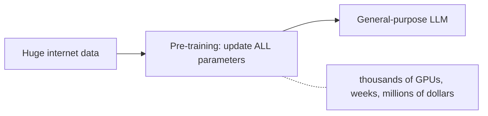
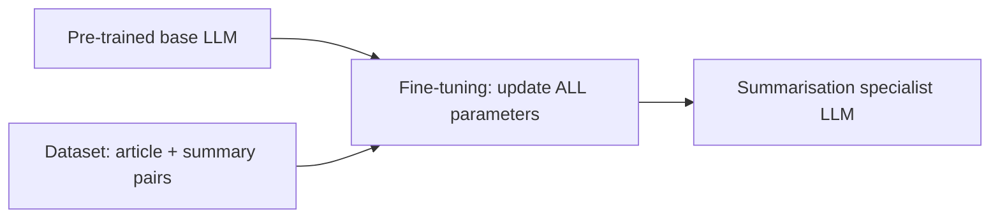
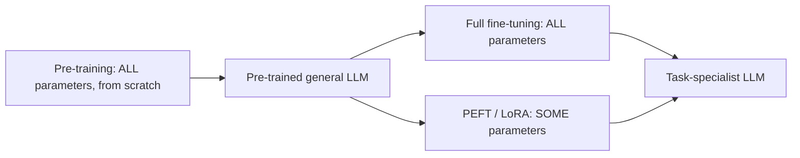
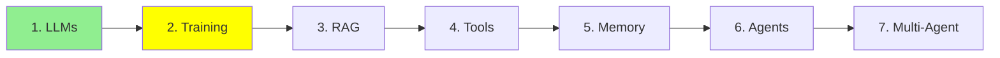

# Module 2: Training LLMs

Module 1 said an LLM is a network with a huge number of parameters, and that it predicts the
next word. This module is about where those parameters come from.

There are two steps, and they are almost nothing alike. One costs millions of dollars and only
a handful of labs can do it. The other you can run tonight on your own GPU.

## What training actually means

A model starts out knowing nothing. Every parameter is a random number, so its output is
random too.

Training means feeding it text and nudging those numbers, over and over, until its guesses
stop being random and start being right.

  
*The same network before and after training. Given "The students opened their", the random weights on the left produce "Sun", and the learned weights on the right produce "Laptops". Nothing about the shape changed, only the numbers inside it.*

That is the whole trick. Training does not add rules or facts in any form you could go and
read. It only adjusts numbers, and the knowledge ends up spread across billions of them. Which
is why Andrej Karpathy's description has stuck: you can think about it as **compressing the
internet**.

## Pre-training: how a model is born

The first and by far the largest step is **pre-training**.

- The model starts with random, untrained parameters (its "weights").
- It reads a massive slice of the internet, meaning books, websites, code and articles, and
  learns to predict the next word, over and over, billions of times.
- **All** of the model's parameters get updated. For a large model that is billions of numbers
  changing.
- It takes thousands of GPUs running for weeks or months, which is why pre-training a large
  model from scratch costs **millions of dollars**. Only a handful of big labs (OpenAI, Google,
  Anthropic, Meta and a few others) can afford it.



The result is a **general-purpose** model: good at many things, specialised in nothing.

> **NOTE, and this one is an advanced topic.** Notice that nobody labelled that internet text.
> There is no answer key. The model gets its own training signal by hiding the next word and
> checking its guess against the word that was actually there, which means the data labels
> itself. This is called **self-supervised learning**, and diagrams often label it
> "unsupervised" instead. We come back to it properly in
> [Module 24: Advanced Training](../3_expert/24_advanced_training.md).

## Pre-training and fine-tuning, side by side

You do not need to pre-train your own model. Someone else already spent the millions, and you
can start from their finished model and **fine-tune** it.

**Fine-tuning** means taking an already pre-trained model and continuing to train it, this time
on a small, task-specific dataset, so it gets good at one particular job.

The clearest way to see the difference is the data each step eats:

  
*Pre-training takes a pile of unlabelled text and no human in the loop, and produces general abilities like completing and understanding text. Fine-tuning takes pairs a human wrote, a prompt and the response it should get, and buys specific abilities like classification or question answering.*

So, in one line each:

- **Pre-training** eats **unlabelled** text, scraped at internet scale. Nobody writes the
  answers, because the next word *is* the answer.
- **Fine-tuning** eats a **collection of pairs**: input and output, or prompt and response,
  usually written or checked by people. Thousands of pairs, not billions of pages.

That difference is why one costs millions and the other fits on a single GPU.

## Fine-tuning: teaching one job really well

Say you want a model that is really good at summarising articles.

1. Start with a pre-trained base model.
2. Collect a dataset of examples: `(long article, human-written short summary)` pairs. A few
   thousand is often enough.
3. Keep training the model on these pairs, so it learns the pattern "long text in, short and
   accurate summary out".
4. The result is noticeably more consistent at summarising than the generic base model, with no
   pre-training bill.

Here is what a handful of training rows might actually look like. This is exactly what the model
sees, over and over, during step 3:

| Article (input) | Human summary (output) |
|---|---|
| "The city opened three new public parks this year, adding over 50 acres of green space. Officials say the parks will host weekend markets and free yoga classes starting next spring." | "The city added 50 acres of new parks, which will host markets and yoga classes." |
| "Scientists discovered a new species of frog in the Amazon rainforest. The frog has bright blue skin and is only 2 cm long, making it one of the smallest amphibians ever recorded." | "A tiny, 2cm blue frog was discovered in the Amazon, one of the smallest amphibians on record." |
| "The company's quarterly earnings report showed a 15% increase in revenue, driven mainly by strong sales in its cloud computing division." | "The company's revenue grew 15% this quarter, led by cloud computing sales." |
| "A new study found that drinking coffee in moderation may reduce the risk of heart disease. Researchers tracked 10,000 participants over five years." | "A 5-year study of 10,000 people found moderate coffee drinking may lower heart disease risk." |
| "The local football team won their championship game 3-1, securing their first title in a decade." | "The team won the championship 3-1, their first title in ten years." |

By seeing thousands of pairs like these the model does not memorise the answers. It learns the
*pattern*: take the key facts out of a longer text and compress them into one short, plain
sentence.

### Does it actually work?

Let's test it on a brand-new article the model has never seen, not one from the table above.

**Test article:**
> "The tech startup announced today that it raised $50 million in Series B funding, led by two
> major venture capital firms. The company plans to use the funds to expand its engineering team
> and launch operations in three new countries by next year."

**Base model, before fine-tuning:**
> "This is an interesting piece of news about a technology startup. The article talks about how
> the company managed to secure a significant amount of funding, specifically $50 million, in
> what is known as a Series B funding round, which was led by two prominent venture capital
> firms. According to the article, the startup intends to allocate this capital towards growing
> its engineering department and expanding its business operations into three additional
> countries within the coming year."

**Fine-tuned model, after:**
> "The startup raised $50 million in Series B funding to grow its engineering team and expand
> into three new countries next year."

Notice the difference. The base model rambles, restates the article almost sentence by sentence,
and opens with filler like "This is an interesting piece of news". The fine-tuned model picked
up the pattern from the table and applied it to an article it had never seen.

A tiny, simplified example using Hugging Face `transformers`:

```python
from transformers import AutoModelForSeq2SeqLM, AutoTokenizer, Trainer, TrainingArguments

model = AutoModelForSeq2SeqLM.from_pretrained("t5-small")  # already pre-trained
tokenizer = AutoTokenizer.from_pretrained("t5-small")

# dataset = a list of {"article": "...", "summary": "..."} pairs
trainer = Trainer(
    model=model,
    args=TrainingArguments(output_dir="./summarizer", num_train_epochs=3),
    train_dataset=dataset,  # your (article, summary) pairs
)
trainer.train()  # updates ALL of the model's parameters
```

This is **full fine-tuning**, because every parameter gets updated. Same mechanism as
pre-training, just on a much smaller dataset. Cheaper than pre-training, but for a big model it
still wants serious GPU memory.



## PEFT: the cheap way, and the common one

Full fine-tuning updates every parameter, which for a big model still means large GPUs. Most of
us do not have those.

**PEFT (Parameter-Efficient Fine-Tuning)** solves it by **freezing almost the whole model** and
training only a small number of new, extra parameters.

- The frozen part stays exactly as pre-training left it.
- Only a tiny slice of parameters, often under 1% of the total, actually changes.
- The most common PEFT technique is **LoRA** (Low-Rank Adaptation). You do not need the maths,
  just know it is the cheap fine-tuning trick almost everyone uses.

The payoff: it runs on a single consumer GPU, trains much faster, and produces a small file
holding just the extra parameters instead of a whole new copy of the model. This is what real
projects use most of the time.

A tiny, simplified LoRA example using Hugging Face `peft`:

```python
from peft import LoraConfig, get_peft_model
from transformers import AutoModelForSeq2SeqLM

model = AutoModelForSeq2SeqLM.from_pretrained("t5-small")  # frozen base model

lora_config = LoraConfig(r=8, task_type="SEQ_2_SEQ_LM")
model = get_peft_model(model, lora_config)  # freezes the base, adds small trainable layers

model.print_trainable_parameters()
# something like: "trainable params: 0.3M || all params: 60M || trainable%: 0.5%"
```

Do not confuse PEFT with quantization, which Module 1 covered. **PEFT is about training
cheaply; quantization is about running cheaply.** They are often used together.

## Unsloth: what people actually reach for

Writing the training loop yourself is a lot of wiring, and getting a model to fit in the memory
you have is its own skill. [Unsloth](https://unsloth.ai/docs) is an open-source library that
handles both.

What you get from it:

- **Fine-tuning that fits.** It rewrites the expensive parts of training so LoRA and
  quantized-LoRA runs need far less GPU memory and finish faster, which is often the difference
  between a job that runs on a free Colab GPU and one that does not.
- **Ready-made notebooks.** The [notebook collection](https://unsloth.ai/docs/get-started/unsloth-notebooks)
  covers the popular open models. You open one, point it at your dataset, and run it. That is
  the fastest honest route from "I have some pairs" to "I have a fine-tuned model".
- **Pre-quantized models for running, not just training.** Module 1 mentioned that you rarely
  quantize anything yourself. These are the releases it meant, so the same project covers
  compressing a model and training one.
- **A guide, and a reality check.** The
  [fine-tuning guide](https://unsloth.ai/docs/get-started/fine-tuning-llms-guide) walks the
  whole process. Read the FAQ,
  [is fine-tuning right for me](https://unsloth.ai/docs/get-started/fine-tuning-for-beginners/faq-+-is-fine-tuning-right-for-me),
  **before** you start, because the honest answer is often no. A better prompt or the retrieval
  we cover in Module 3 solves a lot of problems that look like fine-tuning problems.

## The three, side by side

| | Pre-training | Full fine-tuning | PEFT (e.g. LoRA) |
|---|---|---|---|
| Starting point | Random weights | Pre-trained model | Pre-trained model |
| Data needed | The whole internet, unlabelled | Task-specific pairs | Task-specific pairs |
| Parameters updated | ALL, from scratch | ALL | SOME, often under 1% |
| Typical cost | Millions of dollars | Expensive, but far below pre-training | Cheap, fits on one GPU |
| Who does it | A handful of big AI labs | Companies with real budgets | Most of us, most of the time |



## When not to fine-tune

Most people who think they need fine-tuning do not, so it is worth knowing the three cases where
the answer is no.

**Do not fine-tune to teach a model your company's knowledge.** That knowledge is alive: the
codebase gets commits, contracts get amended, policies change. Fine-tuning is a snapshot, and it
takes hours and real money, so you cannot rerun it every time a file changes. What you want there
is retrieval, which is [Module 3: RAG](3_rag.md).

**Fine-tune for tasks, not for facts.** It is good at teaching a *behaviour*, like summarising in a
particular shape or classifying into your categories. It is poor at teaching *facts*, because your
few hundred pages land among billions of parameters holding everything else the model ever read.

**And remember what you are racing.** Spend a month fine-tuning a model for your task, and by the
time you are finished the next frontier model is out, trained by a lab with resources you do not
have, and it is quite possibly better at your task out of the box than your fine-tune of the
previous generation. Fine-tuning still wins when the task is genuinely yours and genuinely narrow.
It loses when you are trying to out-train the labs.

## What is Hugging Face?

Both code examples above imported from it, so it is worth one paragraph.

[Hugging Face](https://huggingface.co/) is the place the open-source machine learning world
keeps its work. Its **Models** page is effectively the central registry for open models of every
kind, not only LLMs: computer vision, speech and audio, and plenty besides. If a research group
releases an open model, this is usually where it appears.

It also publishes the libraries everyone uses to work with those models. The main one is
**`transformers`**, which loads a model by name and runs it in a few lines, and there are
companions for the pieces around it, such as `peft` for the LoRA training above and `datasets`
for the data you feed it.

## Where this fits in the series



## Summary

Training is just the adjusting of a model's parameters. Pre-training does it from random, on
unlabelled internet text, for millions of dollars. Fine-tuning does it from someone else's
finished model, on pairs a human wrote, for very little. PEFT does the same job while touching
under 1% of the parameters, which is why it is what most projects use.

But even a fine-tuned model still knows nothing about your private codebase or today's data.
That gap is exactly what RAG fills, and it is next.

**Quick Check**: what is the difference between full fine-tuning and PEFT, and why is
pre-training so expensive?

## References

- [Unsloth documentation](https://unsloth.ai/docs): the library, top to bottom
- [Unsloth: is fine-tuning right for me?](https://unsloth.ai/docs/get-started/fine-tuning-for-beginners/faq-+-is-fine-tuning-right-for-me): read this before you fine-tune anything
- [Unsloth notebooks](https://unsloth.ai/docs/get-started/unsloth-notebooks): ready-made notebooks for training and for running quantized models
- [Unsloth fine-tuning guide](https://unsloth.ai/docs/get-started/fine-tuning-llms-guide): the whole process, end to end
- [Hugging Face](https://huggingface.co/): the model registry, and the `transformers` library
- [Fine-tuning AI models](https://cloud.google.com/use-cases/fine-tuning-ai-models?hl=en#fine-tuning-llms-and-ai-models): Google Cloud's overview, useful for the vocabulary
- [What is LLM Fine-Tuning? (Explained Simply)](https://youtube.com/shorts/Ei4E2lWStqw?si=q0PttlRmBsARGHZU): a short, if you want the whole idea in under a minute

**Previous Module:** [Module 1: LLM Fundamentals](1_llms.md)
**Next Module:** [Module 3: Retrieval-Augmented Generation (RAG)](3_rag.md)
