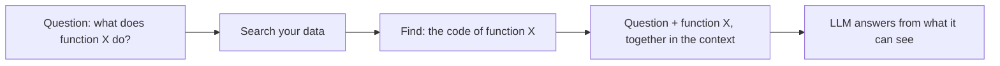
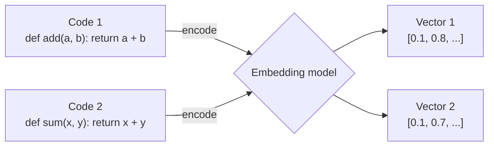
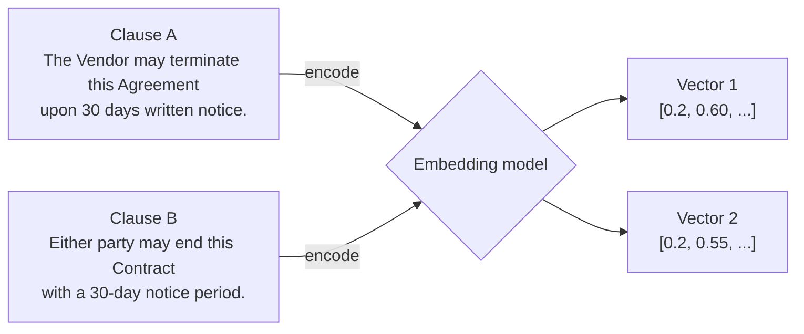
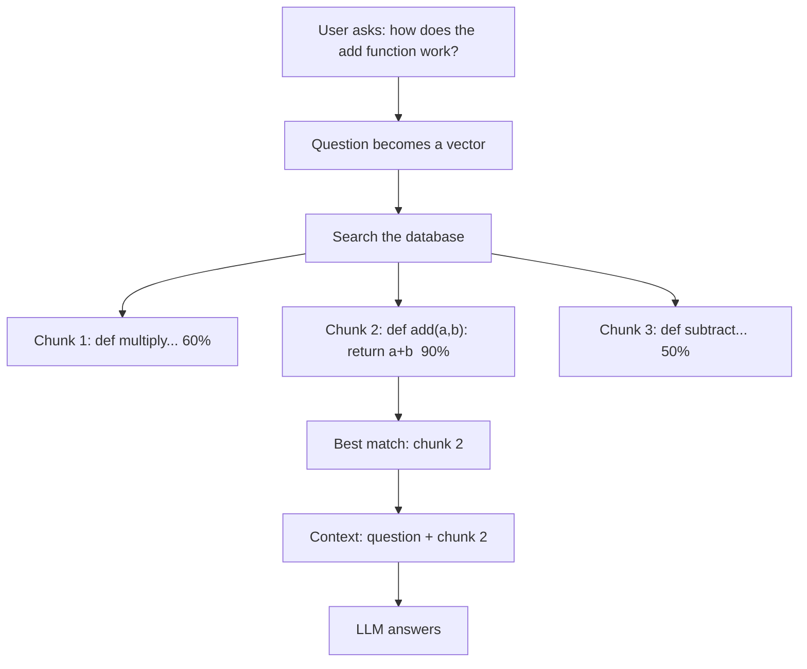
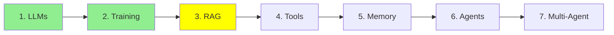

# Module 3: Retrieval-Augmented Generation (RAG)

Module 1 gave you the context window: the model's working desk, and everything on it has to fit.
Module 2 gave you fine-tuning: changing the model itself. This module is about the third option,
and the one you will reach for most.

## Why RAG exists

You have useful data. Your codebase, your company's documents, a folder of contracts, years of
support tickets. Far more of it than fits in a context window, and the window is a hard limit.

But here is the thing: **for any one question, you do not need all of it.** Somebody asking about
the termination clause in one vendor contract does not need the other two hundred contracts. They
need one clause.

So that is the whole idea. Keep the data outside the model, and when a question comes in, fetch
only the parts that answer it and put those in the context. **Retrieval-Augmented Generation** is
the name for that: retrieve first, then generate.

### The desktop and the library

Here is the way to hold this in your head.

**The model's weights are a library.** Enormous, and everything it learned in pre-training is in
there somewhere. **The context window is your desktop.** Small, and whatever you put on it is
right in front of you.

Remembering something out of a huge library is hard and unreliable. Reading a page that is open on
the desk in front of you is easy and exact.

RAG is choosing which pages to put on the desk.

<p align="center">
  <br>
  <em>The basic "naive" RAG flow. The query goes two places at once: through an embedding model to
  search the vector store index, and straight to the LLM alongside whatever that search returned
  as context.</em>
</p>

## What RAG does, in four steps



Same trick for anything made of text, not just code. Say you have a folder of legal contracts and
somebody asks "what is the termination notice period in the Acme vendor contract?". Instead of the
model guessing from memory, RAG searches across every contract you have, finds the clause that
answers it, and hands the model just that clause.

The mechanism underneath: turn text into vector embeddings using an encoder model, keep them in a
vector database, then turn the question into a vector too and find the closest matches.

## Embeddings: numbers that carry meaning

An embedding is a list of numbers that describes a piece of text. Think of it as a fingerprint. A
special model, an encoder, produces it.

The useful property is that **similar meaning gives similar numbers.** Like addresses in a city:
close addresses mean nearby places. We measure how close two fingerprints are with **cosine
similarity**, and a high score means very similar.

The classic picture of this uses four words:

<p align="center">
  <br>
  <em>Four words become four vectors, and those vectors become positions in space. "king" lands
  near "queen" and "man" near "woman". Now look at the two arrows: they are parallel, so the step
  from king to queen is the same move as the step from man to woman. Meaning has turned into
  geometry.</em>
</p>

That parallel is worth a second of your attention, because it is what makes the numbers more than
a lookup table. The embedding did not just place similar things together, it placed the
*relationship* between them in a consistent direction.

One honest simplification: the picture draws three dimensions so it fits on a page. Real
embeddings have hundreds or thousands, which is exactly why we measure closeness with cosine
similarity instead of looking at it.



Two different functions, and the numbers come out close together. That closeness is the whole
point: it is what lets a search find one by asking for the other.

The important part is that this catches *meaning*, not matching words:



Same meaning, almost no words in common, and the vectors still land next to each other.

That is why keyword search would miss Clause B and retrieval finds it.

## Where embeddings live: vector databases

A vector database stores millions of these fingerprints, keeps each one linked to the original
text, and searches them fast. You hand it a query vector, it returns the top N closest, and you
pass those to the LLM.

**Free and local:**

- **ChromaDB**: easiest to start with.
- **Milvus**: for bigger projects.
- **FAISS**: very fast in-memory search.

**Managed services:**

- **Pinecone**: simple and hosted.
- **Weaviate**: good when your data has structure worth keeping.

## The RAG process, step by step

**Setup, done once and then whenever the data changes:**

1. Load your source data: code files, contracts, policies, PDFs, any text.
2. Break it into small chunks, such as a function, a paragraph or a contract clause.
3. Turn each chunk into an embedding.
4. Store them in a vector database.

**Answering, done per question:**

1. Take the user's question.
2. Turn it into an embedding.
3. Search the database for the closest chunks.
4. Pull the real text of those chunks.
5. Put that text into the context alongside the question.
6. The LLM answers from what it can now see.



Swap "code chunks" for "contract clauses" and the flow is identical.

## Tools

You will almost never write the retrieval loop yourself. Pick a level and let something else do
the rest:

- **[LlamaIndex](https://www.llamaindex.ai/)**: the highest level. Point it at a folder, ask a
  question, get an answer. It handles chunking, embedding, storing and retrieving.
- **[Haystack](https://haystack.deepset.ai/)**: build the pipeline from ready-made parts when you
  want to see and change each step.
- **[ChromaDB](https://github.com/chroma-core/chroma)**: a vector database that stores your text
  next to its embeddings, so a search hands back the original chunk.
- **[FAISS](https://github.com/facebookresearch/faiss)**: the search layer and nothing else. Very
  fast, and it knows only about numbers.

Here is FAISS, which is the smallest thing worth showing, because it is the raw mechanic every
option above is wrapping:

```python
import faiss
import numpy as np

index = faiss.IndexFlatL2(128)                              # 128-dimension vectors
index.add(np.random.random((100, 128)).astype('float32'))   # your 100 chunk embeddings

query = np.random.random((1, 128)).astype('float32')        # the question, embedded
distances, indices = index.search(query, 5)                 # the five nearest chunks
```

That is the search step, and only the search step. FAISS returns positions, so it is on you to
keep the original text somewhere and look it up by index. The tools above exist to spare you that
bookkeeping: they store the text with the vector and hand you the chunk itself.

## Why not just fine-tune the model on your documents?

You learned fine-tuning in Module 2, so this is the obvious question. Why bother with embeddings
and a database at all?

**Because your company's knowledge is alive, and fine-tuning is a snapshot.** Your codebase gets
commits every day. Contracts get amended, new ones get signed, policies change. Fine-tuning takes
hours or days and costs real money, and you cannot rerun it every time a file changes. Fine-tuning
a model to hold your company's documents is solving a live problem with a photograph.

**Because fine-tuning is for tasks, not for data.** It is good at teaching a model a *behaviour*:
summarise like this, always answer in this format, classify into these categories. It is bad at
teaching a model *facts*, because your hundred pages land among billions of parameters full of
everything else the model ever read, and it is easy for a fine-tuned model to blur your details
with something it half-remembers from pre-training.

**Because you are racing a moving target.** Suppose you spend a month fine-tuning a model on your
task. By the time you are done, the next frontier model is out, trained by a lab with resources you
do not have, and it is probably better at your task out of the box than your fine-tune of the last
generation. That race is not winnable, and RAG does not enter it.

**Because retrieval puts the answer in front of the model.** Back to the desktop and the library.
Fine-tuning is trying to shelve your documents somewhere in a library of billions and hoping the
model remembers the right shelf. RAG puts the one page you need on the desk, open, at the moment
the question is asked.

In one line: **fine-tuning changes what the model *knows*; RAG changes what the model *sees*.**

Worth saying: this is not either-or. You can fine-tune a model for how it should behave and use
RAG for what it should know, and that combination is common in production.

## Where this fits in the series



## Summary

RAG keeps your data outside the model and fetches only the relevant part per question. Text becomes
embeddings, embeddings live in a vector database, and a question finds its matches by similarity.

Remember the split. The weights are the library, the context is the desk. Fine-tuning rearranges
the library; RAG chooses what goes on the desk.

Next: tools, which is how a model stops reading and starts doing.

**Quick Check**: what are the four steps of answering a question with RAG, why do embeddings find a
clause that shares no words with the question, and why is updating a RAG index cheaper than
fine-tuning again?

## References

- [RAG vs fine-tuning](https://www.redhat.com/en/topics/ai/rag-vs-fine-tuning): Red Hat's comparison, the long version of the section above
- [What is RAG?](https://youtube.com/shorts/KBRvB_NDY-o?si=DIUHt8lihi0EzgxT): the whole idea, in a short
- [Fine-Tuning vs RAG: Why Not Both?](https://youtube.com/shorts/24jqSMs10zE?si=zuhAbSZcFGkTKVfI): on using the two together
- [Haystack](https://haystack.deepset.ai/): RAG pipelines from ready-made parts
- [LlamaIndex](https://www.llamaindex.ai/): connecting an LLM to your data
- [ChromaDB](https://github.com/chroma-core/chroma): the easiest vector database to start with
- [FAISS](https://github.com/facebookresearch/faiss): the search layer on its own

**Previous Module:** [Module 2: Training LLMs](2_training.md)
**Next Module:** [Module 4: LLM Tool Calling](4_tools.md)
