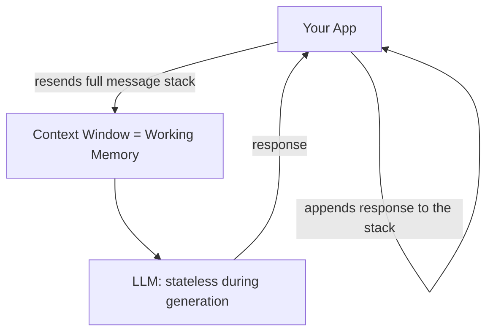
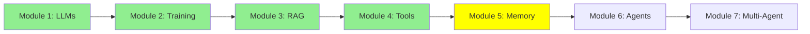

# Module 5: Memory

Before we get to agents, one idea that quietly underlies everything so far: an LLM does not remember anything on its own. And "memory" is not one thing. There are three kinds, they live in different places, and they behave nothing alike.

## Three types of memory

- **Parametric memory** (offline, permanent): knowledge baked into the model's weights during training or fine-tuning.
- **Short-term memory**, also called **working memory** (online, temporary): whatever is sitting inside the LLM's context window right now.
- **Long-term memory** (online, temporary): a summary or index of past conversations and documents, stored outside the model, retrieved back into working memory when needed.

Let's go through each one.

## Parametric memory: what is baked into the weights

Remember Module 2, where we trained and fine-tuned models? When you fine-tune a model on, say, a pile of legal documents, that information gets stored permanently inside the model's weights (its parameters).

- **Permanent**: it does not disappear when the session ends, and you do not need to resend it every call. It is just *in* the model.
- **Imprecise at scale**: the problem is that a model's weights hold an enormous amount of information, billions of documents' worth. Cramming your specific document in among all of that makes it hard for the model to memorize and retrieve it *exactly*.

Think of it like a person who has read 1,000 books. They generally know what those books were about, but ask them to quote page 214 of book #537 word-for-word, and they will struggle. The information is in there somewhere, just not precisely retrievable.

## Working memory: what is in the context right now

It's worth calling this memory what it really is: **working memory**. It's the memory the LLM is actively "working with" at this exact moment: whatever text is sitting inside its context window right now.

Compare it to the person-with-1000-books analogy: working memory is like that same person, except now they have *one specific book open right in front of their eyes*. They do not need to recall anything from a hazy memory of everything they have ever read, they can just read it. That is why LLMs do so much better with working memory than with parametric memory: the information is not buried among billions of other documents, it is right there in front of them.

**The catch**: working memory is limited in size (200K or 1M tokens, say) and it can fill up. And the moment you start a new session, opening a new Claude Code or ChatGPT conversation, it is gone. Every new session starts with a completely empty context window, because the LLM keeps no state of its own between sessions.

### An LLM is stateless during generation

Important distinction: LLMs are stateless **during generation** (this is different from training, which is a one-time process that produces parametric memory). During generation, meaning every time it is actually replying to you, the model saves nothing on its own. Every single message you send is, technically, a brand new, independent call to the LLM, as if it were a new session, because the LLM itself keeps no state of the conversation.

So how does it feel like a continuous conversation? Because *we* fake it. We keep a growing stack of every message exchanged so far, and every time something new happens, you sending a message or the LLM generating a reply, we append it to that stack, and then send the **entire stack** back to the LLM on the next call.

  
*This stack is working memory. You write a message, the model writes one back, and nothing is ever removed. On the second turn the model is re-reading everything from the first, because this whole container is what gets sent on every single call.*

Notice that every call sends the *whole* stack, not just the newest message, because the LLM remembers nothing from the previous call on its own. "Memory" here is really just us re-showing it everything, every single time.

*Short-term (working) memory is just this growing stack of Human and AI messages. Long-term memory is a separate store the stack gets saved into, and retrieved from, across sessions. The labels "Checkpointer" and "Store" come from the LangGraph framework; other frameworks use different names for the same idea.*

## Long-term memory: remembering across sessions

We go much deeper on this later, in the Expert track's [Advanced Memory](../3_expert/18_advanced_memory.md) module. Here is the basic idea for now.

Sometimes, instead of just letting working memory disappear when a session ends, we save a summary or an index of it somewhere outside the model. Later, in a completely different session, that saved information can be pulled back into working memory when it is actually needed, often using RAG (Module 3).

**Example**: say you upload 5 PDFs to ChatGPT in one session, then start a brand-new session later and ask a question about those PDFs. ChatGPT may still answer. Not because the model "remembers" them in its weights (parametric memory), and not because they are sitting in the new session's empty context window (working memory), but because it indexed those PDFs during the earlier session, and can retrieve the relevant parts back into context now that you're asking about them again.

## Putting it all together

| | Parametric | Working (Short-Term) | Long-Term |
|---|---|---|---|
| Stored in | Model weights | Context window | External storage (DB, vector store, files) |
| Persistence | Permanent | Temporary, gone when the session ends or the context fills up | Persists across sessions |
| Precision | Fuzzy, hard to recall exactly among billions of documents | Very precise, the LLM reads it directly | Precise once retrieved back into context |
| Created by | Training / fine-tuning (Module 2) | A growing stack of messages | Explicit save + retrieval, often via RAG (Module 3) |
| Analogy | Someone who has read 1,000 books | Someone reading a book open right in front of them | Someone's own notes, looked up later |

The takeaway: **the LLM itself has no memory of its own. Parametric memory is what training baked into its weights, working memory is what your app is currently showing it, and long-term memory is what your app saves and brings back later.**

## Where working memory actually lives

## Where this fits in the series

## Summary

There are three kinds of memory, and they're not interchangeable: **parametric memory** (permanent, but fuzzy at scale, baked in by training), **working memory** (precise but temporary, just a growing stack of messages re-sent every call), and **long-term memory** (saved outside the model and retrieved back into working memory when needed, often via RAG). Next: agents, which lean on this same working memory to plan and act across many steps.

**Quick Check**: What are the three types of memory? Why is parametric memory imprecise even though it's permanent? Why do we call short-term memory "working memory"? How does information from long-term memory make it back into the LLM's context?

## References

- [The three memory types every LLM developer must know](https://medium.com/@sahilnanga4/the-three-memory-types-every-llm-developer-must-know-3358c26fdff3): the same split, from another angle
- [Module 3: RAG](3_rag.md): how long-term memory gets retrieved back into working memory
- [Module 18: Advanced Memory](../3_expert/18_advanced_memory.md): where this goes next

**Previous Module:** [Module 4: LLM Tool Calling](4_tools.md)
**Next Module:** [Module 6: AI Agents: From Single Call to Multi-Step Reasoning](6_agents.md)
