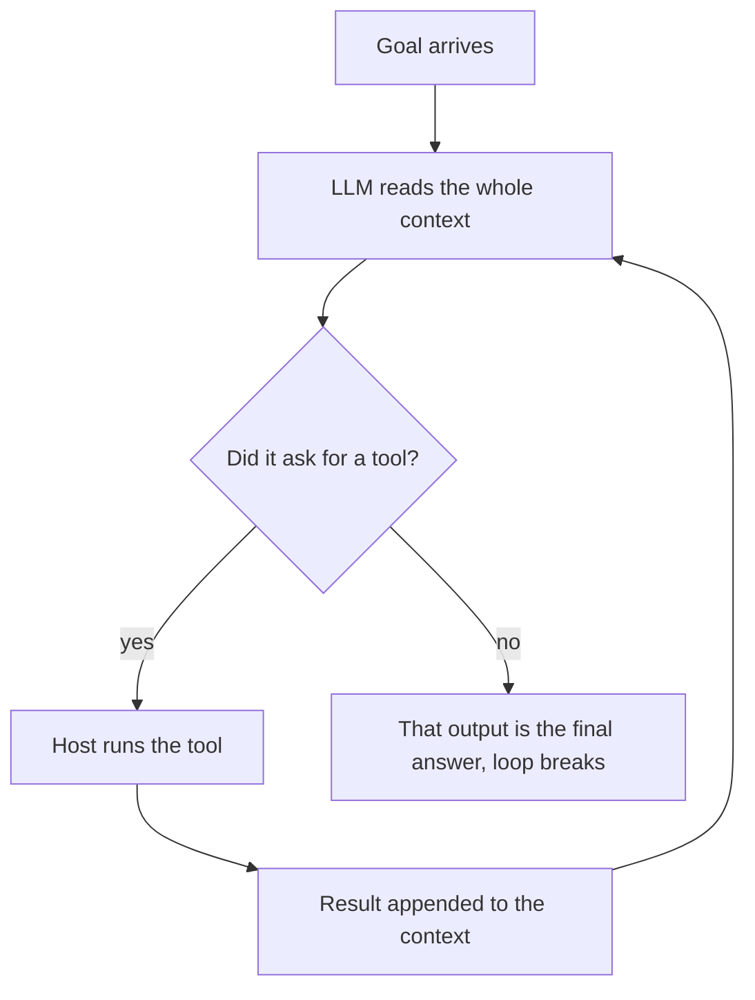
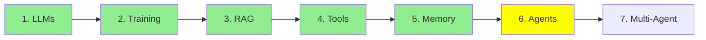

# Module 6: AI Agents

Everything so far has been building to this, and the definition is smaller than you would expect.

> **An AI agent is just a loop in which an LLM calls tools until it reaches its goal. When the LLM
> calls no tools, it generates a final answer, and the loop breaks.**

That is the whole thing. Read it twice, because most of the confusion around agents comes from
expecting something bigger.

  
*Both ends of the curve arrive at the same answer. The middle is where people go looking for an architecture instead.*

## Single turn, and multi turn

Here is the difference that matters.

A **plain LLM is single-turn.** You give it input, it gives you output. Done. That is Module 1, and
it is all a model does.

An **agent is multi-turn.** The same model gets called again and again, and each time it can ask for
a tool. It keeps going until it has what it needs, and only then writes a final answer.

Same model in both cases. Nothing was added to it. The difference is entirely in how many times you
call it and what you put in front of it each time.

  
*Yes. That is genuinely the definition, and the joke is that people expect it to be more.*

## One pass through the loop

Module 4 showed a single tool call. An agent turn is exactly that, repeated:

  
*One pass: you ask, the model thinks, the model asks for a tool, the host runs it and writes the result back, and the model answers. On the next pass the whole stack goes to the model again, now longer by two messages.*



**Look at what ends it.** There is no counter, no supervisor deciding the agent is finished. The
loop breaks because the model stopped asking for tools. The absence of a tool call *is* the
termination condition, and the text it produced instead is the answer.

## Where the loop actually runs

This is the part worth being precise about, because it is where people imagine the model doing
things it cannot do.

None of the loop happens inside the LLM. **All of it happens on the host machine**, meaning your
laptop or your server:

- running the loop, and deciding it has ended
- keeping the message stack that is the agent's memory (Module 5)
- assembling the system prompt before every call
- executing the tools, because they are your Python functions (Module 4)
- feeding the whole grown context back in for the next pass

  
*Under the costume: prompts, if-else, loops and functions. There is nothing else in there.*

That list is why agents use a **framework**. Not because the concept is hard, but because doing all
of it by hand is a pile of boilerplate: parsing tool calls out of a response, matching results to
call ids, growing and trimming the message stack, rebuilding the prompt, deciding when to stop.
[smolagents](https://github.com/huggingface/smolagents) and
[LangChain](https://github.com/langchain-ai/langchain) exist to write that once.

**And now think back to Module 1**, where we ran an LLM straight from the terminal with no framework
at all. Why was nothing needed there? Because that was one call. Input, output, done. No loop, no
tool parsing, no message stack to maintain. A single-turn LLM needs no scaffolding, and an agent is
almost entirely scaffolding.

Which brings the series to its point. **The LLM really is just a brain: text in, text out, storing
nothing, doing nothing else.** Every capability we have covered is an environment built around that
brain so it can work across turns (this module), reach outside itself (Module 4), remember
(Module 5) and read data it was never trained on (Module 3). We were not oversimplifying in
Module 1. The model is that simple, and everything else is engineering around it.

An older way to describe the same loop is **observe, decide, act**: the model observes the context,
decides on an action, the host acts, and the result becomes part of the next observation. Same
mechanism, older vocabulary.

## How the LLM knows which tools it has

Under the hood an agent is still just an LLM being called repeatedly, so how does it know what it is
allowed to call?

The **system prompt**, rebuilt and sent before every call in the loop. It carries the agent's role,
the list of available tools with their names and descriptions, and how a tool call should be
formatted so the host can parse it.

You do not write that list by hand. As Module 4 covered, the `@tool` decorator is what does it: the
framework reads your function's name, docstring and type hints, and injects the schema into what the
model sees. That is why the Module 4 code was so short. The decorator is not just registration, it
is how the model gets told the function exists.

## A longer example: fixing a bug

"Fix the bug in my code" is not one question, so the loop runs several times:

| Pass | What the agent does | Why the LLM is called |
|---|---|---|
| 0 | Goal arrives | not yet |
| 1 | Read the relevant files (`read_file`) | to decide which files to open |
| 2 | Write a failing test | to generate code |
| 3 | Write the fix | to generate code |
| 4 | Run the tests (`run_shell`) | to decide the command |
| 5 | Report that the tests pass | to write the answer, and no tool is called, so the loop ends |

Six passes, six model calls, one goal. A plain LLM would have had one call to do all of that, which
is why it would have guessed.

## Building one

```python
from smolagents import CodeAgent, tool, HfApiModel

@tool
def read_file(filename: str) -> str:
    """Read a file and return its contents."""
    with open(filename, 'r') as f:
        return f.read()

agent = CodeAgent(tools=[read_file], model=HfApiModel())
result = agent.run("Read main.py and summarise it")
```

That is a complete agent. Notice what is *not* there: no loop, no tool-call parsing, no message
stack, no system prompt. `CodeAgent` is doing all of it, and `agent.run` is the loop.

Other frameworks solve the same problem with different shapes, and Module 26 compares them:
[LangChain](https://github.com/langchain-ai/langchain),
[crewAI](https://github.com/crewAIInc/crewAI),
[AutoGen](https://github.com/microsoft/autogen).

  
*The LLM is the brain, the agent is the body around it, and the tools are its hands.*

## Where this fits in the series



## Summary

An agent is a loop in which an LLM calls tools until it reaches its goal, and the loop ends when the
model stops calling tools and writes an answer instead.

The model is unchanged. The loop, the memory, the system prompt and the tool execution all run on
your machine, which is what a framework is for, and which is why a single-turn LLM needed no
framework back in Module 1.

Next: what happens when one agent becomes several.

**Quick Check**: what ends the agent loop, and which parts of an agent run outside the model?

## References

- [LLM agents](https://www.promptingguide.ai/research/llm-agents): a fuller survey of the same idea
- [Agent components](https://www.promptingguide.ai/agents/components): the pieces, broken out one by one
- [smolagents](https://github.com/huggingface/smolagents): the framework used above
- [Module 4: Tool Calling](4_tools.md): where the tool schema comes from
- [Module 5: Memory](5_memory.md): the message stack the loop keeps growing

**Previous Module:** [Module 5: Memory](5_memory.md)
**Next Module:** [Module 7: Multi-Agent Architectures](7_multi_agent.md)
