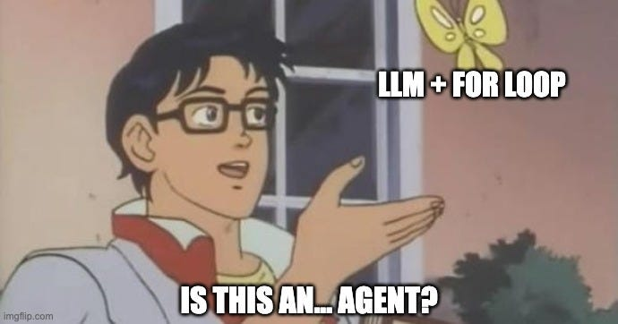
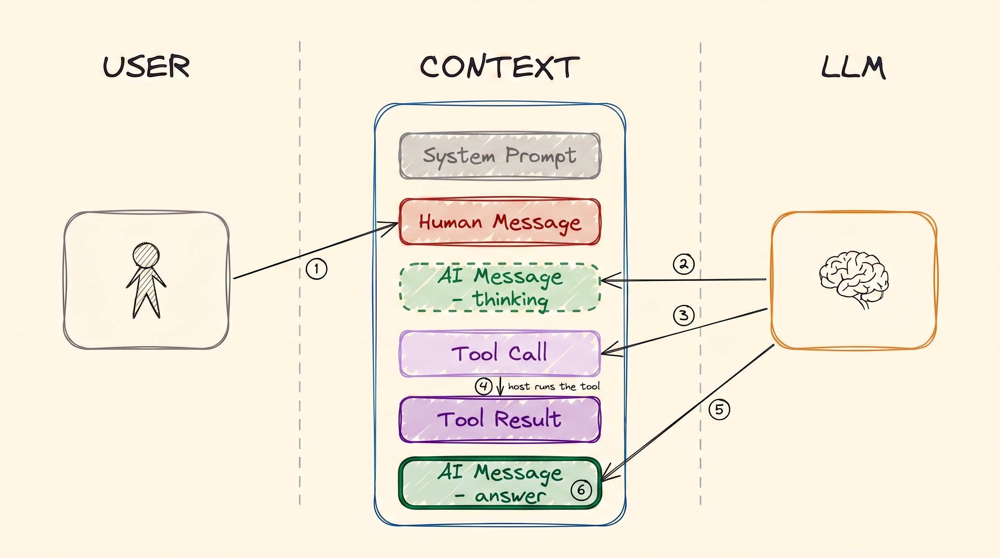
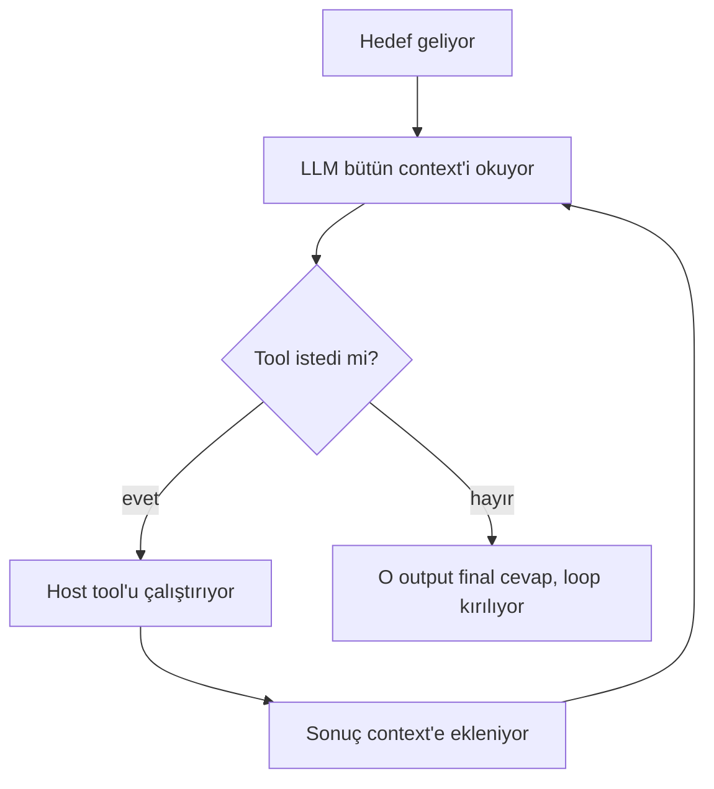
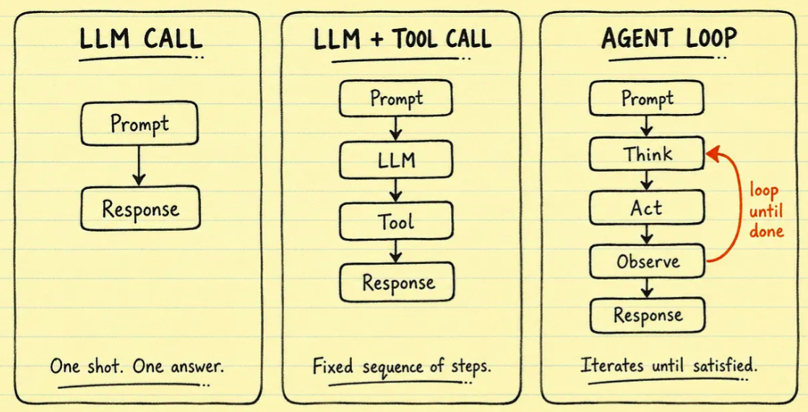
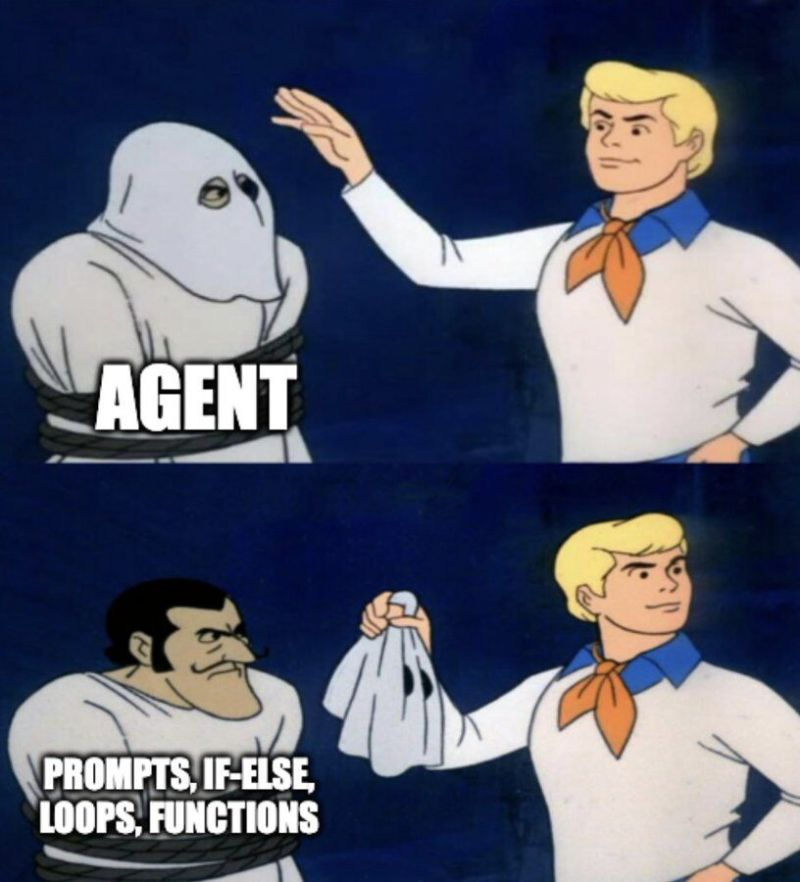
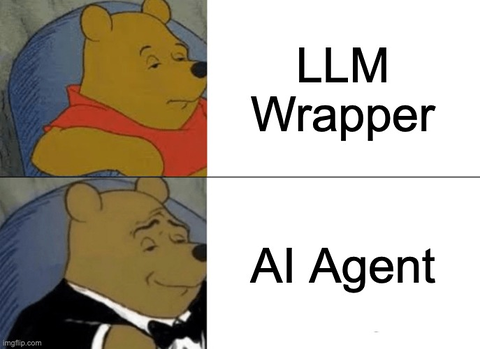
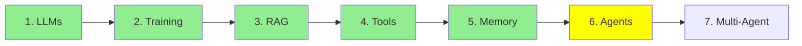

# Module 6: AI Agents

Buraya kadar her şey bunun için kuruluyordu, ve tanım beklediğinden küçük.

> **Bir AI agent, bir LLM'in hedefine ulaşana kadar tool çağırdığı bir loop'tan başka bir şey
> değil. LLM hiç tool çağırmadığında, bir final cevap üretiyor ve loop kırılıyor.**

Bütün olay bu. İki kez oku, çünkü agent'lar etrafındaki kafa karışıklığının çoğu daha büyük bir şey
beklemekten geliyor.

  
*Eğrinin iki ucu da aynı cevaba varıyor. Orta kısım ise bunun yerine bir mimari aramaya gidenlerin olduğu yer.*

## Single turn ve multi turn

Önemli olan fark şu.

**Düz bir LLM single-turn.** Ona input veriyorsun, o sana output veriyor. Bitti. Modül 1 buydu, ve
bir modelin yaptığı şey bundan fazlası değil.

**Bir agent multi-turn.** Aynı model tekrar tekrar çağrılıyor, ve her seferinde bir tool
isteyebiliyor. İhtiyacı olanı elde edene kadar devam ediyor, ve ancak ondan sonra bir final cevap
yazıyor.

İki durumda da aynı model. Ona hiçbir şey eklenmedi. Fark tamamen onu kaç kez çağırdığında ve her
seferinde önüne ne koyduğunda.

  
*Evet. Tanım gerçekten bu, ve şaka da insanların bundan fazlasını beklemesi.*

## Loop'un bir turu

Modül 4 tek bir tool call göstermişti. Bir agent turu tam olarak o, tekrarlanmış hâli:

  
*Bir tur: sen soruyorsun, model düşünüyor, model bir tool istiyor, host onu çalıştırıp sonucu geri yazıyor, ve model cevaplıyor. Sonraki turda yığının tamamı yine modele gidiyor, artık iki mesaj daha uzun.*



**Loop'u neyin bitirdiğine bak.** Bir sayaç yok, agent'ın bittiğine karar veren bir denetleyici yok.
Loop, model tool istemeyi bıraktığı için kırılıyor. Bir tool call'ın yokluğu, sonlanma koşulunun
*kendisi*, ve onun yerine ürettiği metin de cevap.

### Karar vermenin ne kadarını devrediyorsun

"Agent" bir evet ya da hayır değil. Modele karar vermenin ne kadarını devrettiğinle ilgili bir
soru.

Bir uçta düz bir LLM çağrısı var: her şeye sen karar veriyorsun, o sadece metin yazıyor. Ortada
**sabit workflow'lar**, bazen state machine de deniyor: adımları ve sıralarını *sen* yazdın, model
sadece her adımı dolduruyor. Diğer uçta gerçek bir agent var: adımları, tool'ları ve ne zaman
duracağını model seçiyor.

  
*Üç panelde de aynı model var. Değişen şey modelin kaç kez çağrıldığı ve sonraki adımı kimin seçtiği: ilk ikisinde sen, üçüncüsünde modelin kendisi.*

Production sistemlerinin çoğu en uçta değil, ve bu genelde doğru karar. Daha az autonomy, ters
gidebilecek daha az yol demek. LangChain'in
[what is an agent](https://www.langchain.com/blog/what-is-an-agent) yazısı bu spektrumu düzgün
anlatıyor, ve ne kadar ip vereceğine karar vermeden önce okumaya değer.

## Loop gerçekte nerede çalışıyor

Bu kısımda net olmaya değer, çünkü insanların modele yapamayacağı şeyleri yaptırdığını hayal ettiği
yer burası.

Loop'un hiçbir parçası LLM'in içinde olmuyor. **Hepsi host makinede oluyor**, yani laptop'unda ya da
sunucunda:

- loop'u çalıştırmak, ve bittiğine karar vermek
- agent'ın memory'si olan mesaj yığınını tutmak (Modül 5)
- her çağrıdan önce system prompt'u kurmak
- tool'ları çalıştırmak, çünkü onlar senin Python fonksiyonların (Modül 4)
- büyümüş context'in tamamını sonraki tur için geri beslemek

  
*Kostümün altında: prompt'lar, if-else'ler, loop'lar ve fonksiyonlar. İçinde başka bir şey yok.*

Bu liste, agent'ların neden bir **framework** kullandığının cevabı. Kavram zor olduğu için değil,
bunların hepsini elle yapmak bir yığın boilerplate olduğu için: bir cevabın içinden tool call'ları
parse etmek, sonuçları çağrı id'leriyle eşleştirmek, mesaj yığınını büyütüp budamak, prompt'u
yeniden kurmak, ne zaman duracağına karar vermek.
[smolagents](https://github.com/huggingface/smolagents) ve
[LangChain](https://github.com/langchain-ai/langchain) bunu bir kez yazmak için var.

**Şimdi Modül 1'i hatırla**, bir LLM'i hiç framework olmadan doğrudan terminalden çalıştırdığımız
yer. Orada neden hiçbir şeye ihtiyaç yoktu? Çünkü o tek bir çağrıydı. Input, output, bitti. Loop
yok, tool parse etme yok, sürdürülecek bir mesaj yığını yok. Single-turn bir LLM hiçbir iskeleye
ihtiyaç duymuyor, ve bir agent neredeyse tamamen iskele.

Ve bu da seriyi asıl noktasına getiriyor. **LLM gerçekten sadece bir beyin: metin girer, metin
çıkar, hiçbir şey saklamaz, başka hiçbir şey yapmaz.** Buraya kadar anlattığımız her yetenek, o
beynin etrafına kurulmuş bir çevre; böylece beyin turlar boyunca çalışabiliyor (bu modül), kendi
dışına uzanabiliyor (Modül 4), hatırlayabiliyor (Modül 5) ve hiç eğitilmediği veriyi okuyabiliyor
(Modül 3). Modül 1'de fazla basitleştirmiyorduk. Model gerçekten o kadar basit, ve geri kalan her
şey onun etrafındaki mühendislik.

Aynı loop'u anlatmanın daha eski bir yolu **observe, decide, act**: model context'i gözlemliyor, bir
aksiyona karar veriyor, host aksiyonu alıyor, ve sonuç sonraki gözlemin parçası oluyor. Aynı
mekanizma, daha eski kelimeler.

## LLM hangi tool'lara sahip olduğunu nasıl biliyor

Kapağın altında bir agent hâlâ tekrar tekrar çağrılan bir LLM'den başka bir şey değil, o zaman neyi
çağırmasına izin verildiğini nasıl biliyor?

**System prompt**, loop'taki her çağrıdan önce yeniden kurulup gönderiliyor. Agent'ın rolünü, adları
ve açıklamalarıyla birlikte kullanılabilir tool listesini, ve host'un parse edebilmesi için bir tool
call'ın nasıl formatlanacağını taşıyor.

O listeyi elle yazmıyorsun. Modül 4'te anlattığımız gibi, bunu yapan şey `@tool` decorator'ı:
framework fonksiyonunun adını, docstring'ini ve type hint'lerini okuyup schema'yı modelin gördüğü
şeye enjekte ediyor. Modül 4'teki kodun bu kadar kısa olmasının sebebi bu. Decorator sadece kayıt
değil, modele o fonksiyonun var olduğunun söylenme şekli.

## Daha uzun bir örnek: bir bug'ı düzeltmek

"Kodumdaki bug'ı düzelt" tek bir soru değil, o yüzden loop birkaç kez çalışıyor:

| Tur | Agent ne yapıyor | LLM neden çağrılıyor |
|---|---|---|
| 0 | Hedef geliyor | henüz değil |
| 1 | İlgili dosyaları oku (`read_file`) | hangi dosyaların açılacağına karar vermek için |
| 2 | Başarısız olan bir test yaz | kod üretmek için |
| 3 | Düzeltmeyi yaz | kod üretmek için |
| 4 | Testleri çalıştır (`run_shell`) | komuta karar vermek için |
| 5 | Testlerin geçtiğini bildir | cevabı yazmak için, ve hiç tool çağrılmadığı için loop bitiyor |

Altı tur, altı model çağrısı, bir hedef. Düz bir LLM'in bunların hepsini yapmak için tek bir çağrısı
olurdu, ki bu yüzden tahmin ederdi.

## Bir tane kurmak

```python
from smolagents import CodeAgent, tool, HfApiModel

@tool
def read_file(filename: str) -> str:
    """Read a file and return its contents."""
    with open(filename, 'r') as f:
        return f.read()

agent = CodeAgent(tools=[read_file], model=HfApiModel())
result = agent.run("Read main.py and summarise it")
```

Bu tam bir agent. Orada *olmayan* şeye dikkat et: loop yok, tool call parse etme yok, mesaj yığını
yok, system prompt yok. Hepsini `CodeAgent` yapıyor, ve `agent.run` de loop'un kendisi.

Başka framework'ler aynı problemi farklı şekillerde çözüyor, ve Modül 25 onları karşılaştırıyor:
[LangChain](https://github.com/langchain-ai/langchain),
[crewAI](https://github.com/crewAIInc/crewAI),
[AutoGen](https://github.com/microsoft/autogen).

  
*LLM beyin, agent etrafındaki beden, ve tool'lar da onun elleri.*

## Bu serinin neresindeyiz



## Özet

Bir agent, bir LLM'in hedefine ulaşana kadar tool çağırdığı bir loop, ve loop model tool çağırmayı
bırakıp onun yerine bir cevap yazdığında bitiyor.

Model değişmiyor. Loop, memory, system prompt ve tool çalıştırma, hepsi senin makinende çalışıyor;
bir framework'ün var olma sebebi bu, ve Modül 1'de single-turn bir LLM'in neden framework'e ihtiyaç
duymadığının da cevabı bu.

Sırada bir agent'ın birden fazlaya dönüşmesi var.

**Hızlı Kontrol**: agent loop'unu ne bitiriyor, ve bir agent'ın hangi parçaları modelin dışında
çalışıyor?

## Kaynaklar

- [LLM agents](https://www.promptingguide.ai/research/llm-agents): aynı fikrin daha geniş bir incelemesi
- [Agent components](https://www.promptingguide.ai/agents/components): parçalar, tek tek ayrılmış hâlde
- [What is an agent?](https://www.langchain.com/blog/what-is-an-agent): agent'lar, workflow'lar ve state machine'ler tek bir autonomy spektrumunda
- [smolagents](https://github.com/huggingface/smolagents): yukarıda kullanılan framework
- [Modül 4: Tool Calling](4_tools_tr.md): tool schema'sının nereden geldiği
- [Modül 5: Memory](5_memory_tr.md): loop'un büyütmeye devam ettiği mesaj yığını

**Önceki Modül:** [Modül 5: Memory](5_memory_tr.md)
**Sonraki Modül:** [Modül 7: Multi-Agent Mimarileri](7_multi_agent_tr.md)
