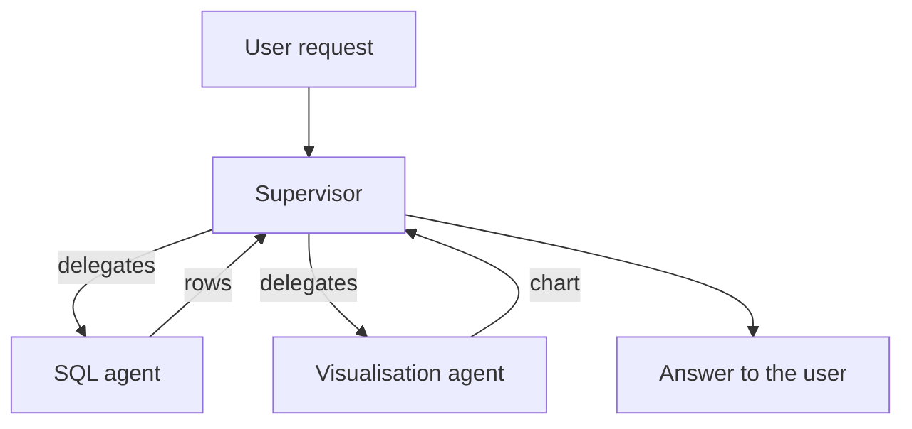
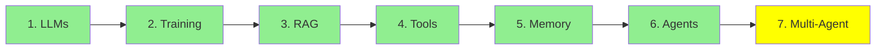

# Module 7: Multi-Agent Systems

Module 6 ended with one agent: one loop, one system prompt, one set of tools. This module is what
happens when you use several, and what that costs you.

## Why one agent stops being enough

Take a real request: *"How many rows are in my database tables? Show them in a bar chart."*

That is two different jobs. Write and run SQL, then draw a chart. One agent can do both, but you
pay for it: the system prompt now has to explain SQL *and* charting, the tool list is longer, and
every call carries instructions that are irrelevant to the step being taken. The model has more
ways to pick the wrong tool and more room to confuse the two jobs.

Splitting it gives each agent a short prompt, a small tool list and one job:

- a **SQL agent** that writes and runs queries
- a **visualisation agent** that turns results into charts

Each one is just an agent from Module 6. Nothing new has been invented. You have simply gone from
one loop to several.

## Two architectures to start with

  
*Left, one agent with its tools, which is Module 6. Middle, a network where every agent can talk to every other. Right, a supervisor that receives the request and delegates to workers who only talk to it.*

**Supervisor.** One agent receives the request, decides which worker should handle it, passes the
work along, collects what comes back, and answers the user. Workers talk to the supervisor and
nowhere else. Our SQL and chart example fits this exactly: the supervisor sends the question to the
SQL agent, takes the rows, hands them to the visualisation agent, and returns the chart.

You will also see this called manager-worker or orchestrator-worker. Same shape.

**Network, sometimes called a swarm.** No boss. Every agent can hand work to any other, and they
decide among themselves who does what next. More flexible, and much harder to predict, because
there is no single place where you can see what the system decided.



**Start with a supervisor.** It is easier to debug, because every decision passes through one
place, and most problems that look like they need a swarm do not.

## The two hard problems

This is the part worth taking seriously, because both problems are created *by* splitting the work.
A single agent has neither.

**Coordination.** Who does what, in what order, and how does anyone know a step is finished? With
one agent, the loop answered that. With several, something has to decide, and that decision can be
wrong: two agents doing the same work, an agent waiting on something that never arrives, a
supervisor that keeps delegating and never stops. More agents means more ways to deadlock or spin.

**Context transfer.** Each agent has its own context, its own message stack. So when the SQL agent
finishes, what exactly does the visualisation agent get? The rows only? The original question too?
The SQL that produced them? Hand over too little and the second agent works blind. Hand over
everything and you have paid for a huge context and reintroduced the confusion you split the agents
up to avoid.

Getting this wrong is the usual reason a multi-agent system performs *worse* than the single agent
it replaced.

### Shared context, or isolated context

That leads to the choice underneath every multi-agent design: do the agents **share** one context,
or does each work in its own **isolated** one?

- **Shared:** everyone sees everything. Nothing gets lost in handover, and the context grows fast.
- **Isolated:** each agent sees only what it was handed. Cheap and focused, and whatever you forgot
  to pass along is simply gone.

Both are used in production, and the choice drives almost everything else about the design. It has
enough depth to deserve its own treatment, so we come back to it in
[Module 20: Advanced Multi-Agent](../3_expert/20_advanced_multiagent.md).

## Other architectures you will hear about

Named here so the words are familiar, all covered later:

- **Hierarchical:** supervisors of supervisors, for when one layer is not enough.
- **Agent-as-a-tool:** one agent exposed to another as if it were a plain tool, which slots neatly
  into Module 4's mechanism.
- **Subagents:** an agent that spawns short-lived helpers with their own isolated context, then
  keeps only their results.

## Building one

```python
from smolagents import CodeAgent, tool, HfApiModel

@tool
def sql_query(query: str) -> list:
    """Run a SQL query against the application database and return the rows."""
    return db.execute(query).fetchall()

@tool
def visualise(data: list) -> str:
    """Draw a bar chart from rows and return the path to the image."""
    return chart_from(data)

sql_agent = CodeAgent(tools=[sql_query], model=HfApiModel(), name="sql")
viz_agent = CodeAgent(tools=[visualise], model=HfApiModel(), name="viz")

supervisor = CodeAgent(
    tools=[],
    model=HfApiModel(),
    managed_agents=[sql_agent, viz_agent],   # the workers it can delegate to
)

supervisor.run("How many rows are in my tables? Show them in a bar chart.")
```

Look at `managed_agents`. The supervisor's workers are handed to it the same way tools were in
Module 6, because from the supervisor's point of view that is what they are: things it can call and
get a result from.

## When one agent is still the right answer

Multi-agent is not an upgrade. It is a trade: you buy shorter prompts and clearer separation, and
you pay in coordination and context transfer.

Stay with one agent while one prompt still fits comfortably and the tool list is manageable. Split
when a single system prompt is trying to teach two unrelated jobs, and split along the seam where
the least information has to cross.

## Where this fits in the series



## Summary

Several agents let each one keep a short prompt and a single job, and the supervisor architecture,
where one agent delegates and collects, is the one to start with.

What you inherit is **coordination**, deciding who does what and when it is done, and **context
transfer**, deciding what each agent is handed. Those two are the whole difficulty, and how you
answer the second one, shared context or isolated, shapes everything else.

That is the end of Fundamentals. You now have the full picture: a model that only predicts text, a
context window that is its desk, retrieval to fill that desk, tools to let it act, memory across
turns, a loop that makes it an agent, and several agents when one is not enough. Everything in
Intermediate is built on these seven ideas.

**Quick Check**: what are the two hard problems a multi-agent system creates, and what is the
difference between shared and isolated context?

## References

- [Multi-agent systems](https://docs.langchain.com/oss/python/langchain/multi-agent): the patterns, in more depth
- [LangGraph multi-agent concepts](https://langchain-ai.github.io/langgraph/concepts/multi_agent/): supervisor, network and the rest, with code
- [What is an agent?](https://www.langchain.com/blog/what-is-an-agent): worth rereading here, since a supervisor is a decision about autonomy
- [Module 6: AI Agents](6_agents.md): the single loop all of this is built from
- [Module 20: Advanced Multi-Agent](../3_expert/20_advanced_multiagent.md): shared and isolated context, and agent-to-agent protocols

**Previous Module:** [Module 6: AI Agents](6_agents.md)

**Next Category:** [Intermediate](../2_intermediate/8_prompt_engineering.md)
