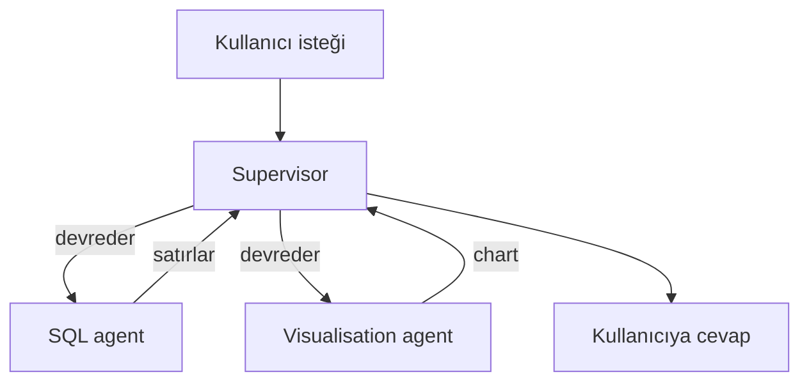
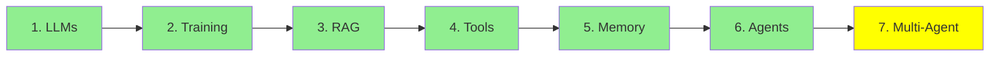

# Module 7: Multi-Agent Systems

Modül 6 tek bir agent ile bitti: bir loop, bir system prompt, bir tool seti. Bu modül birkaç tane
kullandığında ne olduğu, ve bunun sana neye mal olduğu.

## Tek agent neden yetmemeye başlıyor

Gerçek bir istek düşün: *"Veritabanı tablolarımda kaç satır var? Bunları bir bar chart'ta göster."*

Bu iki farklı iş. SQL yaz ve çalıştır, sonra chart çiz. Tek bir agent ikisini de yapabilir, ama
bunun bedeli var: system prompt artık hem SQL'i hem chart çizmeyi anlatmak zorunda, tool listesi
uzuyor, ve her çağrı o anda atılan adımla ilgisiz talimatlar taşıyor. Modelin yanlış tool'u seçmesi
için daha çok yol, iki işi karıştırması için daha çok alan var.

Bölmek her agent'a kısa bir prompt, küçük bir tool listesi ve tek bir iş veriyor:

- query yazıp çalıştıran bir **SQL agent**
- sonuçları chart'a çeviren bir **visualisation agent**

Her biri Modül 6'daki agent'ın kendisi. Yeni bir şey icat edilmedi. Sadece bir loop'tan birkaç
loop'a geçtin.

## Başlamak için iki mimari

  
*Solda, tool'larıyla tek bir agent, ki bu Modül 6. Ortada, her agent'ın her agent'la konuşabildiği bir network. Sağda, isteği alıp sadece kendisiyle konuşan worker'lara dağıtan bir supervisor.*

**Supervisor.** Bir agent isteği alıyor, hangi worker'ın ilgilenmesi gerektiğine karar veriyor, işi
ona geçiriyor, geri geleni topluyor ve kullanıcıya cevap veriyor. Worker'lar sadece supervisor'la
konuşuyor, başka kimseyle değil. SQL ve chart örneğimiz tam olarak buna oturuyor: supervisor soruyu
SQL agent'a gönderiyor, satırları alıyor, visualisation agent'a veriyor, ve chart'ı döndürüyor.

Buna manager-worker ya da orchestrator-worker da deniyor. Aynı şekil.

**Network, bazen swarm.** Patron yok. Her agent işi herhangi bir başkasına devredebiliyor, ve sırada
kimin ne yapacağına kendi aralarında karar veriyorlar. Daha esnek, ve tahmin etmesi çok daha zor,
çünkü sistemin neye karar verdiğini görebileceğin tek bir yer yok.



**Supervisor ile başla.** Debug etmesi daha kolay, çünkü her karar tek bir yerden geçiyor, ve swarm
gerektiriyor gibi görünen problemlerin çoğu gerektirmiyor.

## İki zor problem

Bu kısmı ciddiye almaya değer, çünkü iki problem de işi bölmenin *kendisinden* doğuyor. Tek bir
agent'ta ikisi de yok.

**Coordination.** Kim ne yapıyor, hangi sırayla, ve bir adımın bittiğini kim nasıl biliyor? Tek
agent'ta bunu loop cevaplıyordu. Birkaç agent'ta bir şeyin karar vermesi gerekiyor, ve o karar
yanlış olabiliyor: iki agent'ın aynı işi yapması, bir agent'ın hiç gelmeyecek bir şeyi beklemesi,
bir supervisor'ın devretmeye devam edip hiç durmaması. Daha çok agent, deadlock'a düşmek ya da
boşa dönmek için daha çok yol demek.

**Context transfer.** Her agent'ın kendi context'i, kendi mesaj yığını var. Yani SQL agent işini
bitirdiğinde, visualisation agent tam olarak neyi alıyor? Sadece satırları mı? Orijinal soruyu da
mı? Onları üreten SQL'i de mi? Çok az şey devredersen ikinci agent kör çalışıyor. Her şeyi
devredersen kocaman bir context'in bedelini ödüyorsun ve agent'ları bölerek kaçmaya çalıştığın
karışıklığı geri getiriyorsun.

Bunu yanlış yapmak, bir multi-agent sistemin yerini aldığı tek agent'tan *daha kötü* çalışmasının
alışılmış sebebi.

### Shared context mı, isolated context mı

Bu da her multi-agent tasarımının altındaki seçime götürüyor: agent'lar tek bir context'i
**paylaşıyor** mu, yoksa her biri kendi **izole** context'inde mi çalışıyor?

- **Shared:** herkes her şeyi görüyor. Devirde hiçbir şey kaybolmuyor, ve context hızla büyüyor.
- **Isolated:** her agent sadece kendisine verileni görüyor. Ucuz ve odaklı, ve geçirmeyi
  unuttuğun şey de öylece yok.

İkisi de production'da kullanılıyor, ve bu seçim tasarımın geri kalan neredeyse her şeyini
belirliyor. Kendi başına ele alınmayı hak edecek kadar derin, o yüzden
[Modül 19: İleri Seviye Multi-Agent](../3_expert/19_advanced_multiagent_tr.md) modülünde geri
döneceğiz.

## Duyacağın diğer mimariler

Kelimeler tanıdık gelsin diye burada anılıyor, hepsi daha sonra ele alınıyor:

- **Hierarchical:** supervisor'ların supervisor'ları, tek katman yetmediğinde.
- **Agent-as-a-tool:** bir agent'ın başka bir agent'a sanki düz bir tool'muş gibi verilmesi, ki
  Modül 4'ün mekanizmasına tam oturuyor.
- **Subagent'lar:** kendi izole context'i olan kısa ömürlü yardımcılar doğuran, sonra sadece
  onların sonuçlarını tutan bir agent.

## Bir tane kurmak

```python
from smolagents import CodeAgent, tool, HfApiModel

@tool
def sql_query(query: str) -> list:
    """Run a SQL query against the application database and return the rows."""
    return db.execute(query).fetchall()

@tool
def visualise(data: list) -> str:
    """Draw a bar chart from rows and return the path to the image."""
    return chart_from(data)

sql_agent = CodeAgent(tools=[sql_query], model=HfApiModel(), name="sql")
viz_agent = CodeAgent(tools=[visualise], model=HfApiModel(), name="viz")

supervisor = CodeAgent(
    tools=[],
    model=HfApiModel(),
    managed_agents=[sql_agent, viz_agent],   # devredebileceği worker'lar
)

supervisor.run("How many rows are in my tables? Show them in a bar chart.")
```

`managed_agents`'a bak. Supervisor'ın worker'ları ona, Modül 6'da tool'ların verildiği şekilde
veriliyor; çünkü supervisor'ın bakış açısından onlar tam olarak bu: çağırıp sonuç alabileceği
şeyler.

## Tek agent'ın hâlâ doğru cevap olduğu durumlar

Multi-agent bir yükseltme değil. Bir alışveriş: kısa prompt'lar ve net ayrım satın alıyorsun,
bedelini de coordination ve context transfer ile ödüyorsun.

Tek bir prompt hâlâ rahatça sığıyorsa ve tool listesi yönetilebilirse tek agent'ta kal. Tek bir
system prompt iki alakasız işi öğretmeye çalışıyorsa böl, ve en az bilginin karşıya geçmesi gereken
dikişten böl.

## Bu serinin neresindeyiz



## Özet

Birkaç agent, her birinin kısa bir prompt ve tek bir işi olmasını sağlıyor, ve bir agent'ın
devredip topladığı supervisor mimarisi de başlamak için doğru olan.

Devraldığın şey ise **coordination**, yani kimin ne yapacağına ve ne zaman bittiğine karar vermek,
ve **context transfer**, yani her agent'a neyin verileceğine karar vermek. Bütün zorluk bu ikisi, ve
ikincisine verdiğin cevap (shared context mı isolated mı) geri kalan her şeyi şekillendiriyor.

Fundamentals burada bitiyor. Artık bütün resim elinde: sadece metin tahmin eden bir model, onun
masası olan bir context window, o masayı doldurmak için retrieval, iş yapabilmesi için tool'lar,
turlar boyunca memory, onu bir agent yapan bir loop, ve biri yetmediğinde birkaç agent. Intermediate'teki
her şey bu yedi fikrin üstüne kuruluyor.

**Hızlı Kontrol**: bir multi-agent sistemin yarattığı iki zor problem nedir, ve shared ile isolated
context arasındaki fark ne?

## Kaynaklar

- [Multi-agent systems](https://docs.langchain.com/oss/python/langchain/multi-agent): pattern'ler, daha derinlemesine
- [LangGraph multi-agent concepts](https://langchain-ai.github.io/langgraph/concepts/multi_agent/): supervisor, network ve diğerleri, kodla birlikte
- [What is an agent?](https://www.langchain.com/blog/what-is-an-agent): burada yeniden okumaya değer, çünkü bir supervisor da autonomy hakkında bir karar
- [Modül 6: AI Agents](6_agents_tr.md): bütün bunların kurulduğu tek loop
- [Modül 19: İleri Seviye Multi-Agent](../3_expert/19_advanced_multiagent_tr.md): shared ve isolated context, ve agent-to-agent protokolleri

**Önceki Modül:** [Modül 6: AI Agents](6_agents_tr.md)

**Sonraki Kategori:** [Intermediate](../2_intermediate/8_prompt_engineering_tr.md)
