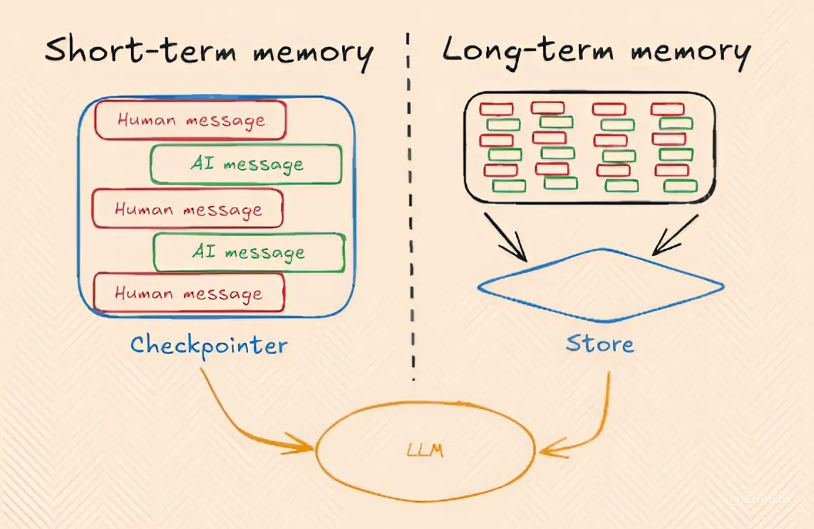
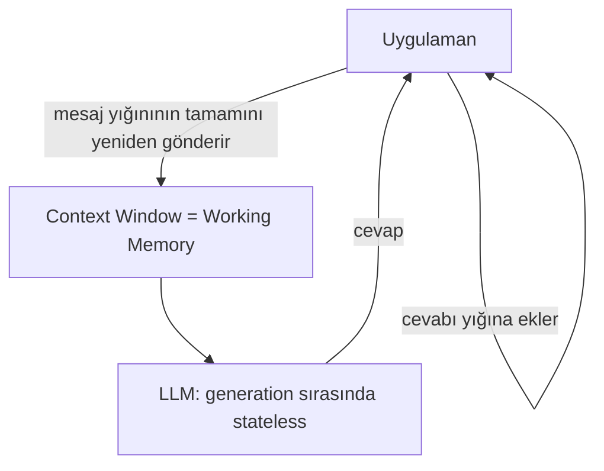
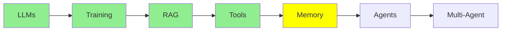

# Memory

Agent'lara geçmeden önce, buraya kadar anlattığımız her şeyin sessizce altında duran bir fikir: bir
LLM kendi başına hiçbir şey hatırlamıyor. Ve "memory" tek bir şey değil. Üç türü var, farklı
yerlerde yaşıyorlar, ve birbirlerine hiç benzemiyorlar.

## Üç tür memory

- **Parametric memory** (offline, kalıcı): training ya da fine-tuning sırasında modelin
  weight'lerine gömülmüş bilgi.
- **Short-term memory**, diğer adıyla **working memory** (online, geçici): şu anda LLM'in context
  window'unun içinde duran her şey.
- **Long-term memory** (online, geçici): geçmiş konuşmaların ve dokümanların bir özeti ya da
  index'i; modelin dışında saklanıyor ve gerektiğinde working memory'ye geri getiriliyor.

Sırayla bakalım.

## Parametric memory: weight'lere gömülü olan

[Training LLMs](training_tr.md) modülünü hatırla, modelleri eğittiğimiz ve fine-tune ettiğimiz yer.
Bir modeli diyelim bir yığın hukuki dokümanla fine-tune ettiğinde, o bilgi modelin weight'lerinin
(parameter'larının) içinde kalıcı olarak saklanıyor.

- **Kalıcı**: session bittiğinde kaybolmuyor, ve her çağrıda yeniden göndermen gerekmiyor. Zaten
  modelin *içinde*.
- **Ölçekte belirsiz**: sorun şu ki bir modelin weight'leri devasa miktarda bilgi tutuyor,
  milyarlarca doküman değerinde. Senin belirli dokümanını bunların arasına tıkıştırmak, modelin onu
  *tam olarak* ezberleyip geri getirmesini zorlaştırıyor.

Bunu 1.000 kitap okumuş bir insan gibi düşün. O kitapların genel olarak neyle ilgili olduğunu bilir,
ama ondan 537 numaralı kitabın 214. sayfasını kelime kelime alıntılamasını istersen zorlanır. Bilgi
bir yerlerde içinde, ama tam olarak geri getirilebilir değil.

## Working memory: şu anda context'te olan

Bu memory'yi gerçekte ne olduğuyla adlandırmaya değer: **working memory**. LLM'in tam bu anda
aktif olarak "üzerinde çalıştığı" memory, yani şu anda context window'unun içinde duran metin.

1.000 kitap analojisiyle karşılaştır: working memory, aynı insanın *tam gözlerinin önünde açık
duran belirli bir kitabı* olması gibi. Okuduğu her şeyin puslu hafızasından bir şey hatırlaması
gerekmiyor, doğrudan okuyabiliyor. LLM'lerin working memory ile parametric memory'ye göre çok daha
iyi iş çıkarmasının sebebi bu: bilgi milyarlarca başka dokümanın arasına gömülü değil, tam
önlerinde.

**Ama bir sorun var**: working memory'nin boyutu sınırlı (mesela 200K ya da 1M token) ve dolabiliyor.
Ve yeni bir session başlattığın anda, yeni bir Claude Code ya da ChatGPT konuşması açtığında, gitti.
Her yeni session tamamen boş bir context window ile başlıyor, çünkü LLM session'lar arasında kendine
ait hiçbir state tutmuyor.

### Bir LLM generation sırasında stateless

Önemli bir ayrım: LLM'ler **generation sırasında** stateless (bu, parametric memory'yi üreten tek
seferlik bir süreç olan training'den farklı bir şey). Generation sırasında, yani sana her cevap
verişinde, model kendi başına hiçbir şey kaydetmiyor. Gönderdiğin her mesaj, teknik olarak yepyeni
ve bağımsız bir LLM çağrısı; sanki yeni bir session gibi, çünkü LLM konuşmanın state'ini kendisi
tutmuyor.

O zaman nasıl kesintisiz bir konuşma gibi geliyor? Çünkü *biz* öyle gösteriyoruz. O ana kadar
alışverişi yapılmış her mesajın büyüyen bir yığınını tutuyoruz, ve yeni bir şey olduğunda (senin bir
mesaj göndermen ya da LLM'in bir cevap üretmesi) onu bu yığına ekliyoruz, ve sonraki çağrıda
**yığının tamamını** LLM'e geri gönderiyoruz.

  
*Bu yığın working memory'nin kendisi. Sen bir mesaj yazıyorsun, model bir tane geri yazıyor, ve hiçbir şey silinmiyor. İkinci turda model birinci turdaki her şeyi yeniden okuyor, çünkü her çağrıda gönderilen şey bu container'ın tamamı.*

Dikkat et: her çağrı yığının *tamamını* gönderiyor, sadece en yeni mesajı değil, çünkü LLM önceki
çağrıdan kendi başına hiçbir şey hatırlamıyor. Buradaki "memory" gerçekte, ona her seferinde her
şeyi yeniden göstermemizden başka bir şey değil.

  
*Short-term (working) memory, Human ve AI mesajlarının bu büyüyen yığını. Long-term memory ise bu yığının session'lar arasında içine kaydedildiği ve içinden geri getirildiği ayrı bir store. "Checkpointer" ve "Store" etiketleri LangGraph framework'ünden geliyor; başka framework'ler aynı fikir için başka isimler kullanıyor.*

## Long-term memory: session'lar arasında hatırlamak

Buna daha sonra, Expert track'teki [İleri Seviye Memory](../3_expert/advanced_memory_tr.md)
modülünde çok daha derin ineceğiz. Şimdilik temel fikir şu.

Bazen, working memory'nin session bittiğinde yok olmasına izin vermek yerine, onun bir özetini ya da
index'ini modelin dışında bir yere kaydediyoruz. Daha sonra, tamamen farklı bir session'da, o
kaydedilmiş bilgi gerçekten ihtiyaç duyulduğunda working memory'ye geri çekilebiliyor, genelde
[RAG](rag_tr.md) kullanılarak.

**Örnek**: diyelim bir session'da ChatGPT'ye 5 PDF yükledin, sonra daha sonra yepyeni bir session
başlatıp o PDF'ler hakkında bir soru sordun. ChatGPT yine cevaplayabilir. Modelin onları
weight'lerinde "hatırlaması"ndan (parametric memory) değil, ve yeni session'ın boş context
window'unda duruyor olmalarından (working memory) da değil, o PDF'leri önceki session sırasında
index'lediği ve şimdi onlar hakkında sorduğunda ilgili parçaları context'e geri getirebildiği için.

## Hepsini bir araya koyalım

| | Parametric | Working (short-term) | Long-term |
|---|---|---|---|
| Nerede saklanıyor | Model weight'leri | Context window | Dış depolama (DB, vector store, dosyalar) |
| Kalıcılık | Kalıcı | Geçici, session bitince ya da context dolunca gidiyor | Session'lar arasında kalıyor |
| Kesinlik | Puslu, milyarlarca doküman arasından tam hatırlamak zor | Çok kesin, LLM doğrudan okuyor | Context'e geri getirildiğinde kesin |
| Nasıl oluşuyor | [Training / fine-tuning](training_tr.md) | Büyüyen bir mesaj yığını | Açık kaydetme + geri getirme, genelde [RAG](rag_tr.md) ile |
| Analoji | 1.000 kitap okumuş biri | Tam önünde açık bir kitap okuyan biri | Birinin kendi notları, sonra bakılan |

Özet olarak: **LLM'in kendine ait bir memory'si yok. Parametric memory, training'in weight'lere
gömdüğü şey; working memory, uygulamanın ona şu anda gösterdiği şey; long-term memory ise
uygulamanın kaydedip sonra geri getirdiği şey.**

## Working memory gerçekte nerede yaşıyor

## Bu serinin neresindeyiz

## Özet

Üç tür memory var ve birbirlerinin yerine geçmiyorlar: **parametric memory** (kalıcı, ama ölçekte
puslu, training tarafından gömülmüş), **working memory** (kesin ama geçici, her çağrıda yeniden
gönderilen büyüyen bir mesaj yığını), ve **long-term memory** (modelin dışında kaydedilip
gerektiğinde working memory'ye geri getirilen, genelde RAG ile). Sırada agent'lar var; çok adımlı
plan yapmak ve iş yapmak için tam bu working memory'ye yaslanıyorlar.

**Hızlı Kontrol**: üç memory türü nedir? Parametric memory kalıcı olduğu hâlde neden belirsiz?
Short-term memory'ye neden "working memory" diyoruz? Long-term memory'deki bilgi LLM'in context'ine
nasıl geri dönüyor?

## Kaynaklar

- [The three memory types every LLM developer must know](https://medium.com/@sahilnanga4/the-three-memory-types-every-llm-developer-must-know-3358c26fdff3): aynı ayrım, başka bir açıdan
- [RAG](rag_tr.md): long-term memory'nin working memory'ye nasıl geri getirildiği
- [İleri Seviye Memory](../3_expert/advanced_memory_tr.md): bunun devamı
