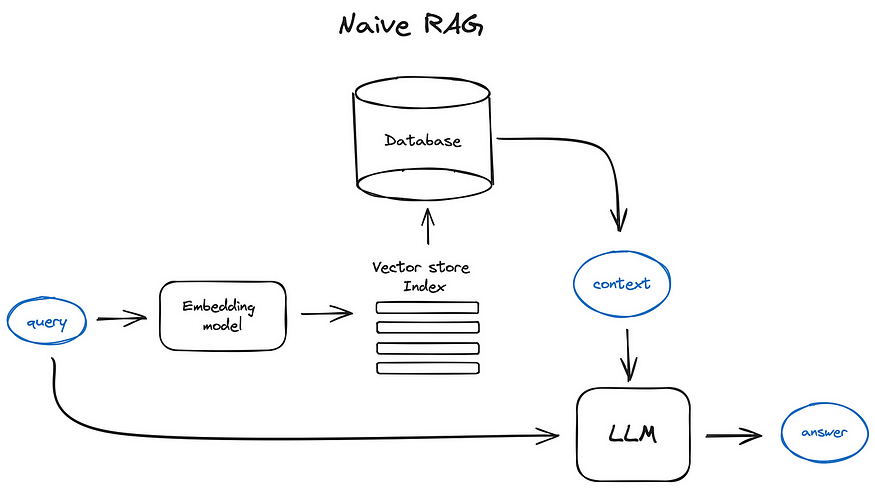
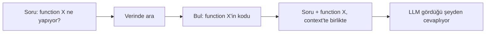
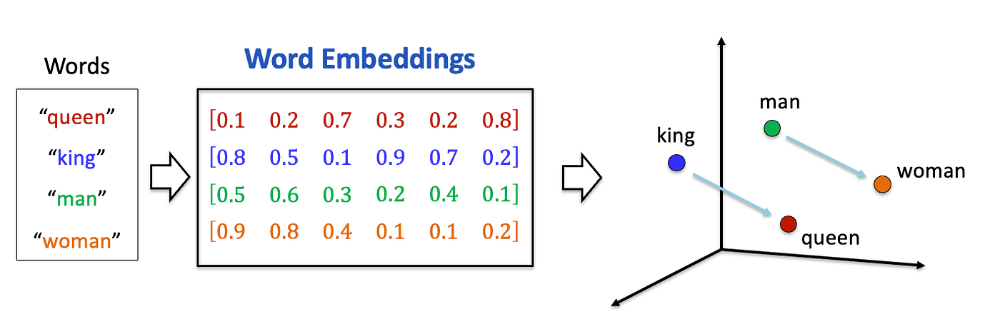
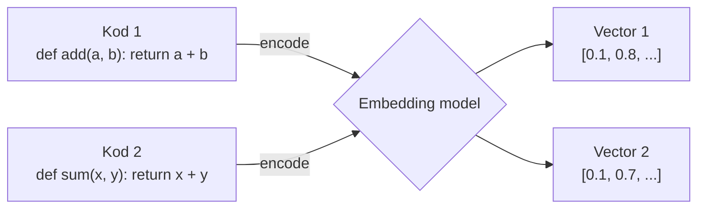
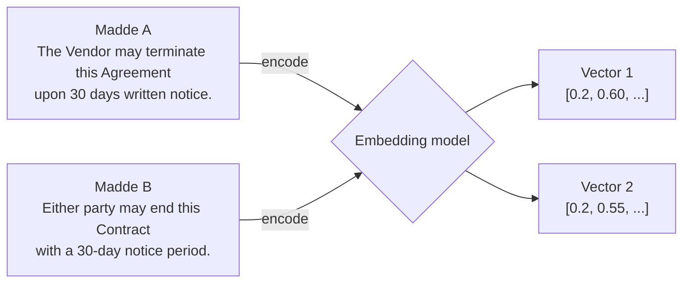
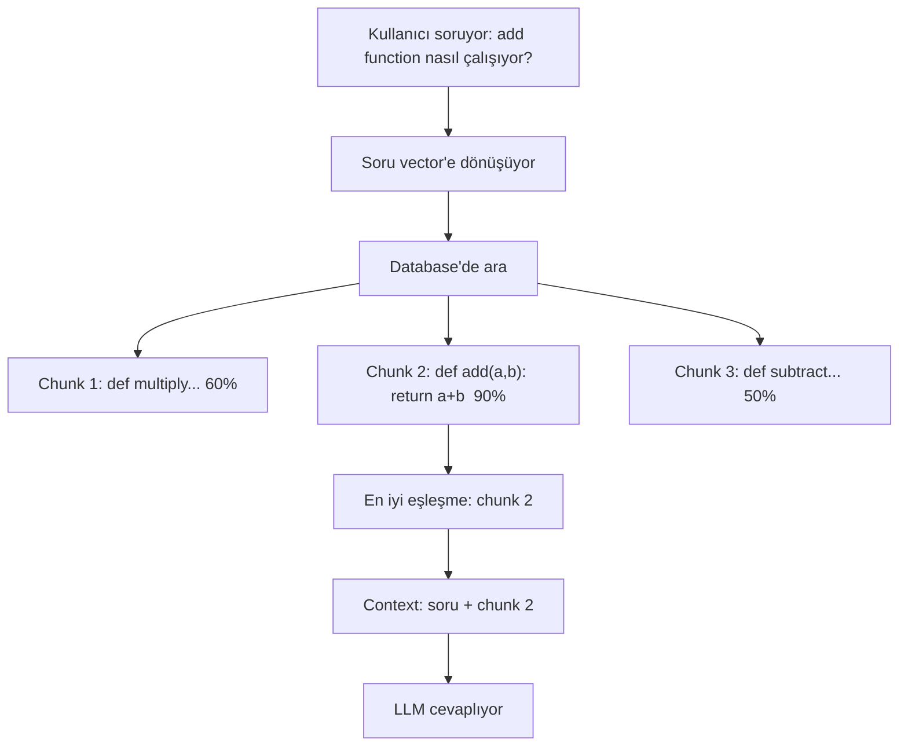
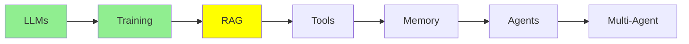

# Retrieval-Augmented Generation (RAG)

[LLM Fundamentals](llms_tr.md) sana context window'u verdi: modelin çalışma masası, ve üstündeki her
şeyin oraya sığması gerekiyor. [Training LLMs](training_tr.md) fine-tuning'i verdi: modelin
kendisini değiştirmek. Bu modül üçüncü seçenekle ilgili, ve en sık uzanacağın seçenek bu.

## RAG neden var

Faydalı verin var. Kendi codebase'in, şirketinin dokümanları, bir klasör dolusu sözleşme, yıllarca
birikmiş support ticket'ları. Bir context window'a sığandan çok daha fazlası, ve window katı bir
sınır.

Ama işin özü şu: **tek bir soru için hepsine ihtiyacın yok.** Bir vendor sözleşmesindeki fesih
maddesini soran kişiye diğer iki yüz sözleşme gerekmiyor. Ona tek bir madde gerekiyor.

Bütün fikir bu. Veriyi modelin dışında tut, ve bir soru geldiğinde sadece onu cevaplayan parçaları
getirip context'e koy. **Retrieval-Augmented Generation** bunun adı: önce getir (retrieve), sonra
üret (generate).

### Masaüstü ve kütüphane

Bunu kafanda şöyle tut.

**Modelin weight'leri bir kütüphane.** Kocaman, ve pre-training'de öğrendiği her şey bir yerlerde
içinde. **Context window ise senin masaüstün.** Küçük, ve üstüne ne koyarsan tam önünde duruyor.

Kocaman bir kütüphaneden bir şey hatırlamak zor ve güvenilmez. Masanın üstünde açık duran bir
sayfayı okumak kolay ve kesin.

RAG, masaya hangi sayfaların konacağını seçmek demek.

  
*Temel, "naive" RAG akışı. Query aynı anda iki yere gidiyor: vector store index'inde arama yapmak için bir embedding model'e, ve o aramanın context olarak döndürdüğü şeyle birlikte doğrudan LLM'e.*

## RAG'in yaptığı şey, dört adımda



Aynı numara metinden oluşan her şey için geçerli, sadece kod için değil. Diyelim bir klasör dolusu
sözleşmen var ve biri "Acme vendor sözleşmesindeki fesih ihbar süresi nedir?" diye soruyor. Model
hafızasından tahmin etmek yerine, RAG elindeki bütün sözleşmelerde arama yapıyor, soruyu
cevaplayan maddeyi buluyor, ve modele sadece o maddeyi veriyor.

Altındaki mekanizma: bir encoder model kullanarak metni vector embedding'lere çevir, onları bir
vector database'de tut, sonra soruyu da vector'e çevirip en yakın eşleşmeleri bul.

## Embedding'ler: anlam taşıyan sayılar

Embedding, bir metin parçasını tarif eden bir sayı listesi. Onu bir parmak izi gibi düşün. Özel bir
model, bir encoder, onu üretiyor.

Faydalı özellik şu: **benzer anlam benzer sayılar veriyor.** Bir şehirdeki adresler gibi: yakın
adresler yakın yerler demek. İki parmak izinin ne kadar yakın olduğunu **cosine similarity** ile
ölçüyoruz, ve yüksek skor çok benzer demek.

Bunun klasik resmi dört kelime kullanıyor:

  
*Dört kelime dört vector'e dönüşüyor, ve o vector'ler uzayda birer konuma dönüşüyor. "king", "queen"in yanına, "man" da "woman"ın yanına düşüyor. Şimdi iki oka bak: paralel duruyorlar, yani king'den queen'e giden adım, man'den woman'a giden adımın aynısı. Anlam geometriye dönüşmüş.*

O paralellik bir saniyelik dikkatini hak ediyor, çünkü sayıları bir arama tablosundan fazlası yapan
şey o. Embedding sadece benzer şeyleri yan yana koymadı, aralarındaki *ilişkiyi* de tutarlı bir yöne
yerleştirdi.

Dürüst bir basitleştirme: resim sayfaya sığsın diye üç boyut çiziyor. Gerçek embedding'lerin
yüzlerce ya da binlerce boyutu var, ki cosine similarity ile ölçüyor olmamızın sebebi tam olarak bu,
gözle bakmıyoruz.



İki farklı function, ve sayılar birbirine yakın çıkıyor. Bütün olay o yakınlık: birini sorarak
diğerini bulmanı sağlayan şey bu.

Önemli olan kısım, bunun eşleşen kelimeleri değil *anlamı* yakalaması:



Aynı anlam, neredeyse hiç ortak kelime yok, ve vector'ler yine yan yana düşüyor.

Keyword arama Madde B'yi bu yüzden kaçırırdı, retrieval ise buluyor.

## Embedding'ler nerede yaşar: vector database'ler

Bir vector database milyonlarca parmak izini saklıyor, her birini orijinal metne bağlı tutuyor, ve
onları hızlıca arıyor. Ona bir query vector'ü veriyorsun, en yakın N tanesini döndürüyor, sen de
onları LLM'e geçiriyorsun.

**Ücretsiz ve local:**

- **ChromaDB**: başlamak için en kolayı.
- **Milvus**: daha büyük projeler için.
- **FAISS**: bellek içinde çok hızlı arama.

**Yönetilen servisler:**

- **Pinecone**: basit ve hosted.
- **Weaviate**: verinin korunmaya değer bir yapısı olduğunda iyi.

## RAG süreci, adım adım

**Kurulum, bir kez ve sonra veri değiştikçe:**

1. Kaynak verini yükle: kod dosyaları, sözleşmeler, politikalar, PDF'ler, her türlü metin.
2. Küçük chunk'lara böl; bir function, bir paragraf ya da bir sözleşme maddesi gibi.
3. Her chunk'ı bir embedding'e çevir.
4. Onları bir vector database'de sakla.

**Cevaplama, her soru için:**

1. Kullanıcının sorusunu al.
2. Onu bir embedding'e çevir.
3. Database'de en yakın chunk'ları ara.
4. O chunk'ların gerçek metnini çek.
5. O metni soruyla birlikte context'e koy.
6. LLM artık görebildiği şeyden cevaplıyor.



"Kod chunk'ları" yerine "sözleşme maddeleri" koy, akış birebir aynı.

## Araçlar

Retrieval loop'unu neredeyse hiç kendin yazmayacaksın. Bir seviye seç, gerisini başka bir şey
yapsın:

- **[LlamaIndex](https://www.llamaindex.ai/)**: en üst seviye. Bir klasöre yönlendir, soruyu sor,
  cevabı al. Chunk'lama, embedding, saklama ve getirmeyi o hallediyor.
- **[Haystack](https://haystack.deepset.ai/)**: her adımı görmek ve değiştirmek istediğinde
  pipeline'ı hazır parçalardan kur.
- **[ChromaDB](https://github.com/chroma-core/chroma)**: metnini embedding'inin yanında saklayan bir
  vector database, böylece arama sana orijinal chunk'ı geri veriyor.
- **[FAISS](https://github.com/facebookresearch/faiss)**: sadece arama katmanı, başka bir şey değil.
  Çok hızlı, ve sadece sayılardan haberi var.

Aşağıda FAISS var; gösterilmeye değer en küçük şey bu, çünkü yukarıdaki bütün seçeneklerin
sardığı ham mekanizma tam olarak bu:

```python
import faiss
import numpy as np

index = faiss.IndexFlatL2(128)                              # 128 boyutlu vector'ler
index.add(np.random.random((100, 128)).astype('float32'))   # senin 100 chunk embedding'in

query = np.random.random((1, 128)).astype('float32')        # soru, embed edilmiş hali
distances, indices = index.search(query, 5)                 # en yakın beş chunk
```

Bu arama adımı, ve sadece arama adımı. FAISS sana pozisyonları döndürüyor, dolayısıyla orijinal
metni bir yerde tutup index'e göre bakmak sana kalıyor. Yukarıdaki araçlar tam olarak bu kayıt
tutma işinden seni kurtarmak için var: metni vector ile birlikte saklıyorlar ve sana chunk'ın
kendisini veriyorlar.

## Peki neden modeli kendi dokümanlarınla fine-tune etmiyoruz?

Fine-tuning'i [Training LLMs](training_tr.md) modülünde öğrendin, dolayısıyla akla gelen soru bu.
Embedding'ler ve bir database'le neden uğraşalım?

**Çünkü şirketinin bilgisi canlı, fine-tuning ise bir enstantane.** Codebase'ine her gün commit
geliyor. Sözleşmeler tadil ediliyor, yenileri imzalanıyor, politikalar değişiyor. Fine-tuning
saatler ya da günler sürüyor ve gerçek para tutuyor, ve her dosya değiştiğinde bunu yeniden
çalıştıramazsın. Şirketinin dokümanlarını tutması için bir modeli fine-tune etmek, canlı bir
problemi bir fotoğrafla çözmeye çalışmak demek.

**Çünkü fine-tuning veri için değil, görev için.** Bir modele bir *davranış* öğretmekte iyi:
şöyle özetle, hep bu formatta cevapla, şu kategorilere ayır. Ama *bilgi* öğretmekte kötü, çünkü
senin yüz sayfan, modelin okuduğu her şeyi barındıran milyarlarca parameter'ın arasına düşüyor, ve
fine-tune edilmiş bir modelin senin detaylarını pre-training'den yarım hatırladığı bir şeyle
bulandırması çok kolay.

**Çünkü hareketli bir hedefle yarışıyorsun.** Diyelim bir ay boyunca kendi görevin için bir modeli
fine-tune ettin. İşin bittiğinde sıradaki frontier model çıkmış oluyor; sende olmayan kaynaklara
sahip bir lab tarafından eğitilmiş, ve muhtemelen senin bir önceki jenerasyondan fine-tune
ettiğinden, kutudan çıktığı gibi senin görevinde daha iyi. O yarış kazanılabilir değil, ve RAG o
yarışa hiç girmiyor.

**Çünkü retrieval cevabı modelin önüne koyuyor.** Masaüstü ve kütüphaneye dön. Fine-tuning,
dokümanlarını milyarlarca kitaplık bir kütüphanenin bir yerine yerleştirip modelin doğru rafı
hatırlamasını ummak. RAG ise ihtiyacın olan tek sayfayı, soru sorulduğu anda, masanın üstüne açık
olarak koyuyor.

Tek satırla: **fine-tuning modelin *bildiğini* değiştiriyor; RAG modelin *gördüğünü*.**

Şunu da söylemek lazım: bu bir ya-ya-da değil. Modeli nasıl davranması gerektiği için fine-tune
edip, ne bilmesi gerektiği için RAG kullanabilirsin, ve bu kombinasyon production'da yaygın.

## Bu serinin neresindeyiz



## Özet

RAG verini modelin dışında tutuyor ve her soru için sadece ilgili parçayı getiriyor. Metin
embedding'lere dönüşüyor, embedding'ler bir vector database'de yaşıyor, ve bir soru eşleşmelerini
benzerlik üzerinden buluyor.

Ayrımı hatırla. Weight'ler kütüphane, context ise masa. Fine-tuning kütüphaneyi yeniden diziyor;
RAG masaya ne konacağını seçiyor.

Sırada tools var, yani modelin okumayı bırakıp yapmaya başlaması.

**Hızlı Kontrol**: RAG ile bir soruyu cevaplamanın dört adımı nedir, embedding'ler soruyla hiç
ortak kelimesi olmayan bir maddeyi neden buluyor, ve bir RAG index'ini güncellemek neden yeniden
fine-tune etmekten daha ucuz?

## Kaynaklar

- [RAG vs fine-tuning](https://www.redhat.com/en/topics/ai/rag-vs-fine-tuning): Red Hat'in karşılaştırması, yukarıdaki bölümün uzun hali
- [What is RAG?](https://youtube.com/shorts/KBRvB_NDY-o?si=DIUHt8lihi0EzgxT): bütün fikir, kısa bir videoda
- [Fine-Tuning vs RAG: Why Not Both?](https://youtube.com/shorts/24jqSMs10zE?si=zuhAbSZcFGkTKVfI): ikisini birlikte kullanmak üzerine
- [Haystack](https://haystack.deepset.ai/): hazır parçalardan RAG pipeline'ları
- [LlamaIndex](https://www.llamaindex.ai/): bir LLM'i kendi verine bağlamak
- [ChromaDB](https://github.com/chroma-core/chroma): başlamak için en kolay vector database
- [FAISS](https://github.com/facebookresearch/faiss): arama katmanı, tek başına
