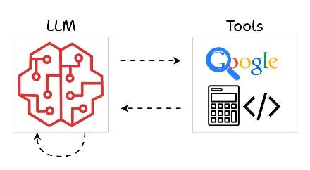
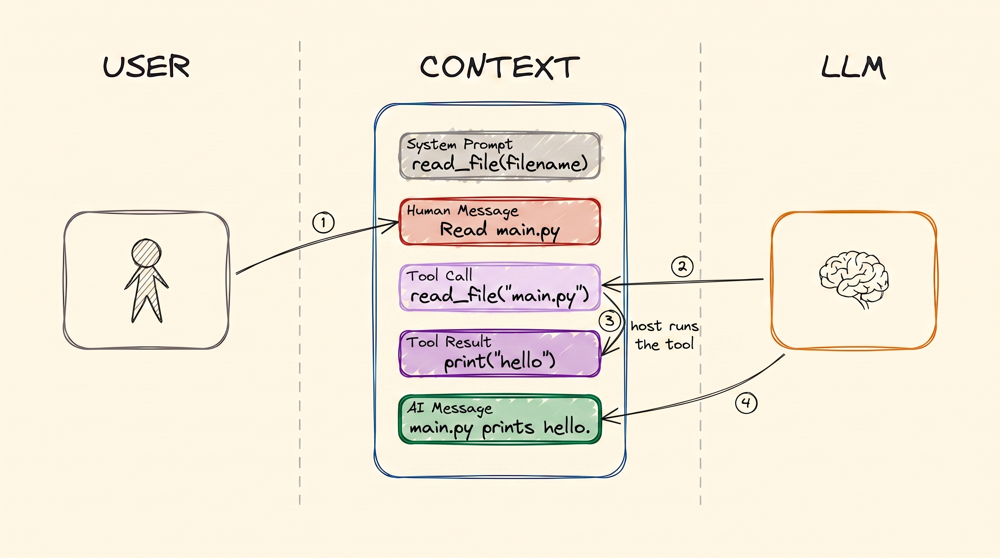
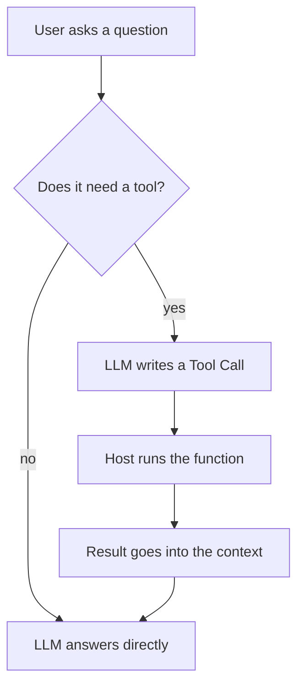
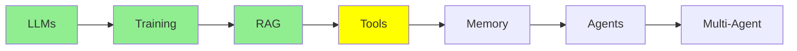

# Tool Calling

Modules 1 to 3 covered what a model is, how it was trained, and how to put your own data in front
of it. All of that is still reading. This module is where a model starts *doing*: reading a file,
running a command, calling an API.

This is the mechanism underneath every agent, so it is worth getting exactly right.

## What a tool is

  
*Tools are how a model reaches outside its own head, searching the web, doing maths, running code, and comes back with an answer.*

A **tool** is just a function you write. An ordinary Python function with a name, some inputs and
a return value. Nothing special about it.

The part people get wrong: **the model never runs your function.** It cannot. It has no computer.
All it can do is emit a message that says "I would like to call `read_file` with
`filename="main.py"`". Something on your side reads that message, runs the function, and hands the
return value back.

## How the context grows around a tool call

[LLM Fundamentals](llms.md) introduced the context as a stack of messages. A tool call adds two new kinds to that
stack, and this is the whole flow in one picture:

  
*One tool call, in order. The tool is declared in the system prompt before anyone speaks. Then you ask, the LLM writes a Tool Call, the host machine runs it and writes the Tool Result, and the LLM reads that and writes the answer.*

Follow the four arrows, because the authorship matters:

1. **You** write the Human Message.
2. **The LLM** writes the Tool Call. It is asking, not doing.
3. **The host machine** writes the Tool Result. Your laptop or your server is what actually has
   Python installed and a filesystem to read.
4. **The LLM** reads the whole context, now including that result, and writes the answer.

Both new messages stay in the context. That is why an agent's context grows so much faster than a
chat's: one turn can add several messages instead of two.

## Why tools exist

A model is trained on fixed data, so on its own it cannot know anything new or change anything.
Tools remove both limits.

**It cannot search the web.** So you write a function that takes a query, calls a search engine and
returns the results. Now it can.

**It cannot read your files.** So you write a function that takes a filename and returns the
contents. Now it can see your code.

Without tools a model is a chatbot. With tools it is an agent.

## You do not write the schema, the framework does

Here is the part that surprises people.

For the model to choose a tool, it has to be told the tool exists, what it does and what arguments
it takes. That description is the **tool schema**, and it is JSON.

You almost never write that JSON. You write a normal function and let your framework generate the
schema from it:

```python
@tool
def get_weather(city: str) -> str:
    """Get the current temperature for a city."""
    return requests.get(f"https://api.example.com/weather?city={city}").text
```

From that one decorator, the framework reads:

- the **name** from the function name, `get_weather`
- the **description** from the docstring
- the **parameters** from the type hints, so `city: str` becomes a required string

It then sends that schema along with your request, and the model receives it up front, next to the
system prompt. You register the function; the plumbing is not yours to write.

**Which means the name and the description are not documentation. They are the interface.** They
are the only thing the model has to go on when it decides which tool to reach for. A function
called `get_data` with the docstring "gets data" will be picked at the wrong moments and skipped at
the right ones, and no amount of prompting fixes that. Name the tool for what it does, and write
the docstring for the model that has to choose.

## One real tool call, end to end

Enough description. Here is an actual exchange with a weather tool.

### What the model receives

The instructions and the tool schema arrive together. In the API they are separate fields, but from
the model's point of view it is one block at the top of the context:

```text
SYSTEM
You are a helpful assistant with access to tools.
Answer the user's question. If you need information you do not have, call a
tool instead of guessing. Never invent a weather reading.

TOOLS
get_weather
  Get the current temperature for a city.
  city (string, required) - The city name, for example "Istanbul"
```

That readable block is the schema the framework generated. On the wire it looks like this:

```json
{
  "type": "function",
  "function": {
    "name": "get_weather",
    "description": "Get the current temperature for a city.",
    "parameters": {
      "type": "object",
      "properties": {
        "city": {
          "type": "string",
          "description": "The city name, for example \"Istanbul\""
        }
      },
      "required": ["city"]
    }
  }
}
```

Notice that the description and the parameter description both came from things you wrote in
Python.

### What you ask

```text
USER
What's the weather in Istanbul right now?
```

### What the model generates

Not prose. This:

```json
{
  "role": "assistant",
  "content": null,
  "tool_calls": [
    {
      "id": "call_9k2m4Xq7",
      "type": "function",
      "function": {
        "name": "get_weather",
        "arguments": "{\"city\":\"Istanbul\"}"
      }
    }
  ]
}
```

Three things worth noticing. `content` is empty, because the model has not answered yet, it has
asked. There is an `id`, which is how the result gets matched back to this specific call. And
`arguments` is a **string** containing JSON, not a JSON object, which catches almost everyone once.

### What the host machine does

This message is where the framework takes over. It parses the arguments, finds the Python function
registered under `get_weather`, and calls it:

```python
get_weather(city="Istanbul")   # -> '{"city":"Istanbul","temp_c":34,"conditions":"clear"}'
```

The return value goes back into the conversation as a new message, tagged with the `id` from the
call:

```json
{
  "role": "tool",
  "tool_call_id": "call_9k2m4Xq7",
  "content": "{\"city\":\"Istanbul\",\"temp_c\":34,\"conditions\":\"clear\"}"
}
```

### What the model answers

Now the whole context goes back to the model: system prompt, your question, its own tool call, and
the result. It reads all of it and writes:

```text
ASSISTANT
It's currently 34°C and clear in Istanbul.
```

That is the entire mechanism. Every agent you will ever build is this loop, repeated.

The exact field names differ a little between providers, but the shape does not: a schema you did
not write, a call the model emits, an execution you perform, a result you hand back.

## Tools people actually write

Anything you can write as a function can be a tool. A few real ones:

```python
@tool
def run_command(command: str) -> str:
    """Run a shell command and return its output."""
    return subprocess.run(command, shell=True, capture_output=True, text=True).stdout

@tool
def get_current_time() -> str:
    """Get the current date and time."""
    return datetime.datetime.now().strftime('%Y-%m-%d %H:%M:%S')

@tool
def query_db(sql: str) -> list:
    """Run a read-only SQL query against the application database."""
    with sqlite3.connect('database.db') as conn:
        return conn.execute(sql).fetchall()

@tool
def search_docs(query: str) -> list:
    """Find the most relevant documentation passages for a question."""
    return vector_db.search(encode(query), top_k=5)

@tool
def send_email(to: str, subject: str, body: str) -> str:
    """Send an email from the user's account."""
    return gmail.users().messages().send(userId='me', body=compose(to, subject, body)).execute()
```

**Most useful tools are a wrapper around an API.** That last one is nine tenths Gmail's own API and one tenth
tool: a function signature, a docstring, and a call. The same shape gives an agent your Jira (create an
issue, search, comment), your calendar, your payment provider, your internal service. Anything with an API
can become something the model is able to reach, and that is usually the fastest way to make an agent
useful at work, because the API you need almost always already exists.

Two things follow from it. The tool is exactly as powerful as the credentials you hand it, so a tool that
can send mail from your account can send anything to anyone. And you rarely have to write these yourself
any more: [Coding Agents: Extending Them](../2_intermediate/coding_agents.md) covers MCP, where somebody has
already wrapped the API you were about to wrap.

The docs one is worth a second look too: it is the RAG pipeline from [RAG & Embeddings](rag.md), turned into a tool. The
model now decides *when* to retrieve instead of you retrieving on every question. That small shift
is most of what separates a RAG app from an agent.



## Where this fits in the series



## Summary

A tool is a function you write. The model cannot run it, so it emits a Tool Call and your machine
runs the function and hands back a Tool Result. Both land in the context, which is why agent
contexts grow fast.

You do not write the schema, your framework generates it from the function, its docstring and its
type hints. Which makes the name and the docstring the real interface: they are all the model has
when it decides what to reach for.

Next: memory, and what happens to all these messages as the context fills up.

**Quick Check**: who executes a tool, the model or the host, and why does a tool's docstring
matter more than its implementation?

## References

- [Mastering LLM tool calling](https://machinelearningmastery.com/mastering-llm-tool-calling-the-complete-framework-for-connecting-models-to-the-real-world/): the full framework, with more of the wire format than we needed here
