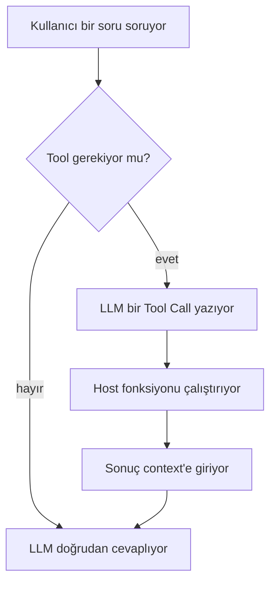
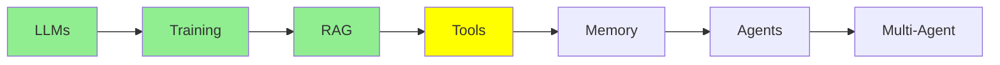

# LLM Tool Calling

[LLM Fundamentals](llms_tr.md) , [Training LLMs](training_tr.md) ve [RAG & Embeddings](rag_tr.md)
bir modelin ne olduğunu, nasıl eğitildiğini ve kendi verini onun önüne nasıl koyacağını anlattı.
Bunların hepsi hâlâ okumak. Bu modül, bir modelin *yapmaya* başladığı yer: bir dosya okumak, bir
komut çalıştırmak, bir API çağırmak.

Her agent'ın altındaki mekanizma bu, dolayısıyla tam olarak doğru anlamaya değer.

## Tool nedir

  
*Tool'lar, bir modelin kendi kafasının dışına uzanma yolu: web'de arama, matematik, kod çalıştırma, ve sonra bir cevapla geri dönme.*

**Tool**, senin yazdığın bir fonksiyondan başka bir şey değil. Adı, birkaç input'u ve bir dönüş
değeri olan sıradan bir Python fonksiyonu. Özel hiçbir yanı yok.

İnsanların yanlış anladığı kısım şu: **model senin fonksiyonunu asla çalıştırmıyor.**
Çalıştıramaz, bilgisayarı yok. Yapabildiği tek şey, "`read_file`'ı `filename="main.py"` ile
çağırmak istiyorum" diyen bir mesaj üretmek. Senin tarafındaki bir şey o mesajı okuyor, fonksiyonu
çalıştırıyor ve dönüş değerini geri veriyor.

## Bir tool call etrafında context nasıl büyür
[LLM Fundamentals](llms_tr.md) context'i bir mesaj yığını olarak tanıtmıştı. Bir tool call o yığına
iki yeni tür ekliyor, ve bütün akış tek bir resimde:
ve bütün akış tek bir resimde:

  
*Tek bir tool call, sırayla. Tool, kimse konuşmadan önce system prompt'ta tanımlanıyor. Sonra sen soruyorsun, LLM bir Tool Call yazıyor, host makine onu çalıştırıp Tool Result'ı yazıyor, ve LLM bunu okuyup cevabı yazıyor.*

Dört oku takip et, çünkü kimin ne yazdığı önemli:

1. **Sen** Human Message'ı yazıyorsun.
2. **LLM** Tool Call'ı yazıyor. İstiyor, yapmıyor.
3. **Host makine** Tool Result'ı yazıyor. Python'un kurulu olduğu ve okunacak bir dosya sisteminin
   bulunduğu yer senin laptop'un ya da senin sunucun.
4. **LLM** artık o sonucu da içeren bütün context'i okuyup cevabı yazıyor.

İki yeni mesaj da context'te kalıyor. Bir agent'ın context'inin bir chat'ten çok daha hızlı
büyümesinin sebebi bu: tek bir tur, iki mesaj yerine birkaç mesaj ekleyebiliyor.

## Tool'lar neden var

Bir model sabit veri üzerinde eğitiliyor, dolayısıyla kendi başına ne yeni bir şey bilebiliyor ne
de bir şeyi değiştirebiliyor. Tool'lar iki sınırı da kaldırıyor.

**Web'de arama yapamaz.** O yüzden bir query alıp arama motoruna soran ve sonuçları döndüren bir
fonksiyon yazıyorsun. Artık yapabiliyor.

**Dosyalarını okuyamaz.** O yüzden bir dosya adı alıp içeriğini döndüren bir fonksiyon yazıyorsun.
Artık kodunu görebiliyor.

Tool'lar olmadan bir model bir chatbot. Tool'larla birlikte bir agent.

## Schema'yı sen yazmıyorsun, framework yazıyor

İnsanları şaşırtan kısım burası.

Modelin bir tool seçebilmesi için, o tool'un var olduğunun, ne yaptığının ve hangi argümanları
aldığının ona söylenmesi gerekiyor. Bu tarife **tool schema** deniyor, ve JSON.

O JSON'ı neredeyse hiç sen yazmıyorsun. Sıradan bir fonksiyon yazıyorsun ve schema'yı ondan
framework'ün üretmesine bırakıyorsun:

```python
@tool
def get_weather(city: str) -> str:
    """Get the current temperature for a city."""
    return requests.get(f"https://api.example.com/weather?city={city}").text
```

O tek decorator'dan framework şunları okuyor:

- **name**, fonksiyonun adından: `get_weather`
- **description**, docstring'den
- **parameters**, type hint'lerden; yani `city: str` zorunlu bir string oluyor

Sonra bu schema'yı isteğinle birlikte gönderiyor, ve model onu en başta, system prompt'un yanında
alıyor. Sen fonksiyonu kaydediyorsun; tesisat senin yazacağın şey değil.

**Yani name ve description dokümantasyon değil. Arayüzün kendisi.** Model hangi tool'a uzanacağına
karar verirken elindeki tek şey onlar. `get_data` adında ve "gets data" docstring'i olan bir
fonksiyon yanlış anlarda seçilir, doğru anlarda atlanır, ve bunu hiçbir prompt düzeltmez. Tool'a ne
yaptığını anlatan bir isim ver, ve docstring'i seçim yapmak zorunda olan model için yaz.

## Gerçek bir tool call, baştan sona

Tarif yeter. Aşağıda bir weather tool ile gerçek bir alışveriş var.

### Modelin aldığı şey

Talimatlar ve tool schema birlikte geliyor. API'da ayrı field'lar, ama modelin bakış açısından
context'in tepesindeki tek bir blok:

```text
SYSTEM
You are a helpful assistant with access to tools.
Answer the user's question. If you need information you do not have, call a
tool instead of guessing. Never invent a weather reading.

TOOLS
get_weather
  Get the current temperature for a city.
  city (string, required) - The city name, for example "Istanbul"
```

O okunabilir blok, framework'ün ürettiği schema. Hat üzerinde şöyle görünüyor:

```json
{
  "type": "function",
  "function": {
    "name": "get_weather",
    "description": "Get the current temperature for a city.",
    "parameters": {
      "type": "object",
      "properties": {
        "city": {
          "type": "string",
          "description": "The city name, for example \"Istanbul\""
        }
      },
      "required": ["city"]
    }
  }
}
```

Dikkat et: hem description hem parameter description'ı, senin Python'da yazdığın şeylerden geldi.

### Senin sorduğun şey

```text
USER
What's the weather in Istanbul right now?
```

### Modelin ürettiği şey

Düz metin değil. Bu:

```json
{
  "role": "assistant",
  "content": null,
  "tool_calls": [
    {
      "id": "call_9k2m4Xq7",
      "type": "function",
      "function": {
        "name": "get_weather",
        "arguments": "{\"city\":\"Istanbul\"}"
      }
    }
  ]
}
```

Fark edilmeye değer üç şey. `content` boş, çünkü model henüz cevaplamadı, sordu. Bir `id` var, ki
sonucun tam olarak bu çağrıyla eşleştirilmesini sağlayan şey o. Ve `arguments` bir JSON *string*'i,
JSON object'i değil, ki bu neredeyse herkesi bir kez yakalıyor.

### Host makinenin yaptığı şey

Bu mesaj, framework'ün devraldığı yer. Argümanları parse ediyor, `get_weather` adıyla kayıtlı
Python fonksiyonunu buluyor ve onu çağırıyor:

```python
get_weather(city="Istanbul")   # -> '{"city":"Istanbul","temp_c":34,"conditions":"clear"}'
```

Dönüş değeri, çağrıdaki `id` ile etiketlenmiş yeni bir mesaj olarak konuşmaya geri giriyor:

```json
{
  "role": "tool",
  "tool_call_id": "call_9k2m4Xq7",
  "content": "{\"city\":\"Istanbul\",\"temp_c\":34,\"conditions\":\"clear\"}"
}
```

### Modelin cevapladığı şey

Şimdi bütün context modele geri gidiyor: system prompt, senin sorun, kendi tool call'ı, ve sonuç.
Hepsini okuyup şunu yazıyor:

```text
ASSISTANT
It's currently 34°C and clear in Istanbul.
```

Bütün mekanizma bu. Kuracağın her agent, bu döngünün tekrarı.

Field isimleri sağlayıcılar arasında biraz farklılık gösteriyor, ama şekil değişmiyor: senin
yazmadığın bir schema, modelin ürettiği bir çağrı, senin yaptığın bir çalıştırma, ve geri verdiğin
bir sonuç.

## İnsanların gerçekten yazdığı tool'lar

Fonksiyon olarak yazabildiğin her şey bir tool olabilir. Birkaç gerçek örnek:

```python
@tool
def run_command(command: str) -> str:
    """Run a shell command and return its output."""
    return subprocess.run(command, shell=True, capture_output=True, text=True).stdout

@tool
def get_current_time() -> str:
    """Get the current date and time."""
    return datetime.datetime.now().strftime('%Y-%m-%d %H:%M:%S')

@tool
def query_db(sql: str) -> list:
    """Run a read-only SQL query against the application database."""
    with sqlite3.connect('database.db') as conn:
        return conn.execute(sql).fetchall()

@tool
def search_docs(query: str) -> list:
    """Find the most relevant documentation passages for a question."""
    return vector_db.search(encode(query), top_k=5)
```

Sondakine bir kez daha bakmaya değer: bu, [RAG & Embeddings](rag_tr.md) modülündeki RAG
pipeline'ının tool'a dönüşmüş hali. Artık *ne zaman* retrieval yapılacağına sen her soruda karar
vermiyorsun, model karar veriyor. Bir RAG uygulamasını bir agent'tan ayıran şeyin büyük kısmı bu
küçük kayma.



## Bu serinin neresindeyiz



## Özet

Tool, senin yazdığın bir fonksiyon. Model onu çalıştıramaz, o yüzden bir Tool Call üretiyor ve
fonksiyonu senin makinen çalıştırıp bir Tool Result geri veriyor. İkisi de context'e düşüyor, ki
agent context'lerinin hızlı büyümesinin sebebi bu.

Schema'yı sen yazmıyorsun; framework'ün onu fonksiyondan, docstring'inden ve type hint'lerinden
üretiyor. Bu da name ve docstring'i asıl arayüz yapıyor: model neye uzanacağına karar verirken
elinde olan tek şey onlar.

Sırada memory var, ve context dolarken bütün bu mesajlara ne olduğu.

**Hızlı Kontrol**: bir tool'u kim çalıştırıyor, model mi host mu, ve bir tool'un docstring'i neden
implementasyonundan daha çok önemli?

## Kaynaklar

- [Mastering LLM tool calling](https://machinelearningmastery.com/mastering-llm-tool-calling-the-complete-framework-for-connecting-models-to-the-real-world/): bütün çerçeve, hat formatının burada ihtiyaç duyduğumuzdan fazlasıyla
