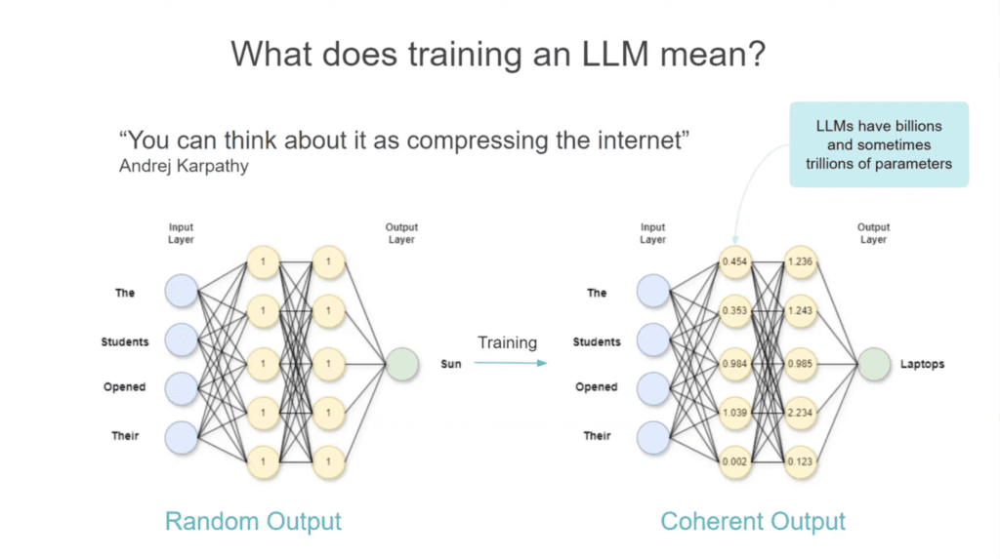
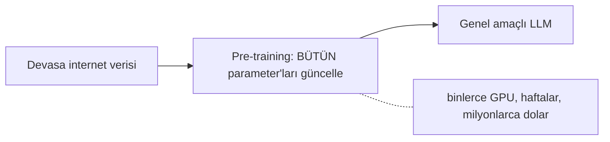
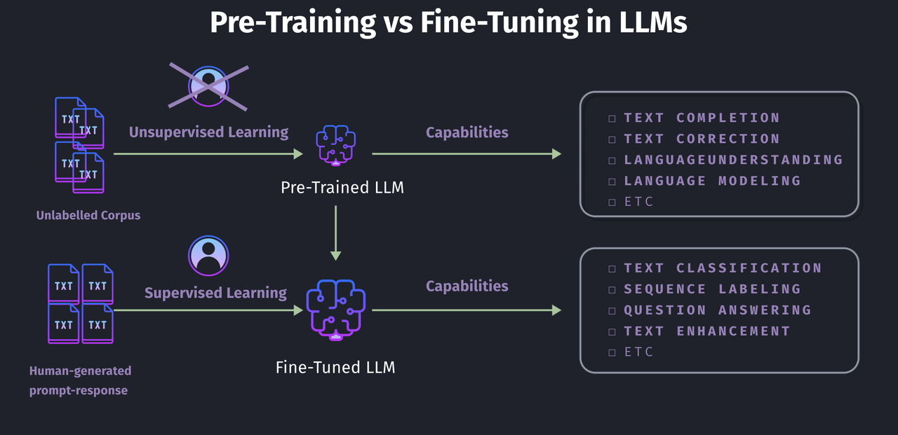
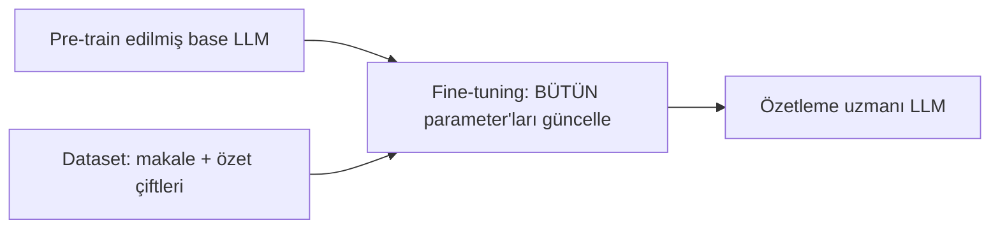
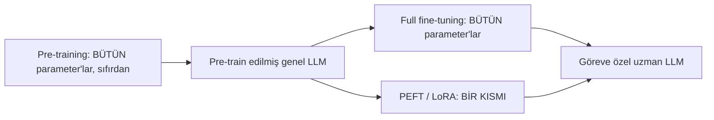
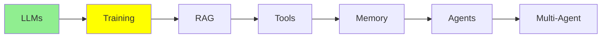

# Training LLMs

[LLM Fundamentals](llms_tr.md) , bir LLM'in çok sayıda parameter'a sahip bir network olduğunu ve
sonraki kelimeyi tahmin ettiğini söyledi. Bu modül, o parameter'ların nereden geldiğiyle ilgili.

İki adım var, ve birbirlerine neredeyse hiç benzemiyorlar. Biri milyonlarca dolara mal oluyor ve
bunu sadece birkaç lab yapabiliyor. Diğerini bu akşam kendi GPU'nda çalıştırabilirsin.

## Training aslında ne demek

Bir model hiçbir şey bilmeden başlar. Her parameter rastgele bir sayıdır, dolayısıyla output'u da
rastgeledir.

Training, ona metin vermek ve bu sayıları tekrar tekrar oynatmak demek; ta ki tahminleri rastgele
olmayı bırakıp doğru olmaya başlayana kadar.

  
*Aynı network, training'den önce ve sonra. "The students opened their" verildiğinde, soldaki rastgele weight'ler "Sun" üretiyor, sağdaki öğrenilmiş weight'ler ise "Laptops" üretiyor. Şeklinde hiçbir şey değişmedi, sadece içindeki sayılar değişti.*

Bütün numara bu. Training modele okuyabileceğin türden kural ya da bilgi eklemez. Sadece sayıları
ayarlar, ve bilgi milyarlarca sayının arasına yayılmış olarak ortaya çıkar. Andrej Karpathy'nin
tarifi bu yüzden akılda kalıyor: bunu **internet'i sıkıştırmak** olarak düşünebilirsin.

## Pre-training: bir model nasıl doğar

İlk ve açık ara en büyük adım **pre-training**.

- Model rastgele, eğitilmemiş parameter'larla ("weight"leriyle) başlar.
- İnternetin devasa bir dilimini okur; kitaplar, web siteleri, kod ve makaleler. Ve sonraki
  kelimeyi tahmin etmeyi, milyarlarca kez tekrar tekrar öğrenir.
- Modelin **bütün** parameter'ları güncellenir. Büyük bir model için bu, milyarlarca sayının
  değişmesi demek.
- Binlerce GPU'nun haftalar ya da aylar boyunca çalışmasını gerektirir; bu yüzden büyük bir modeli
  sıfırdan pre-train etmek **milyonlarca dolara** mal olur. Bunu sadece birkaç büyük lab (OpenAI,
  Google, Anthropic, Meta ve birkaçı daha) karşılayabilir.



Sonuç **genel amaçlı** bir model: birçok şeyde iyi, hiçbir şeyde uzman değil.

> **NOT, ve bu bir advanced konu.** Dikkat et, o internet metnini kimse label'lamadı. Bir cevap
> anahtarı yok. Model kendi training signal'ini, sonraki kelimeyi saklayıp tahminini gerçekten
> orada olan kelimeyle karşılaştırarak elde ediyor; yani veri kendi kendini label'lıyor. Buna
> **self-supervised learning** deniyor, ve diyagramlar bunu genelde "unsupervised" olarak
> etiketliyor. Konuya doğru düzgün olarak
> [İleri Seviye Training](../3_expert/advanced_training_tr.md) modülünde dönüyoruz.

## Pre-training ve fine-tuning, yan yana

Kendi modelini pre-train etmen gerekmiyor. Başkası milyonları çoktan harcadı, ve sen onun bitmiş
modelinden başlayıp **fine-tune** edebilirsin.

**Fine-tuning**, hazır pre-train edilmiş bir modeli alıp, bu kez küçük ve göreve özel bir dataset
üzerinde training'e devam etmek demek; böylece model tek bir belirli işte iyi hale gelir.

Farkı görmenin en net yolu, her adımın yediği veriye bakmak:

  
*Pre-training, label'lanmamış bir metin yığınını ve döngüde hiç insan olmadan alıyor, ve metni tamamlamak ya da anlamak gibi genel yetenekler üretiyor. Fine-tuning ise bir insanın yazdığı çiftleri, bir prompt ve alması gereken response'u alıyor, ve classification ya da question answering gibi belirli yetenekler satın alıyor.*

Yani, tek satırla:

- **Pre-training**, internet ölçeğinde toplanmış **label'lanmamış** metin yer. Cevapları kimse
  yazmıyor, çünkü sonraki kelimenin kendisi *zaten* cevap.
- **Fine-tuning**, bir **çift koleksiyonu** yer: input ve output, ya da prompt ve response.
  Genelde insanlar tarafından yazılmış veya kontrol edilmiş. Milyarlarca sayfa değil, binlerce
  çift.

Bu fark, birinin neden milyonlara mal olduğunu ve diğerinin neden tek bir GPU'ya sığdığını
açıklıyor.

## Fine-tuning: tek bir işi gerçekten iyi öğretmek

Diyelim makaleleri özetlemekte gerçekten iyi bir model istiyorsun.

1. Pre-train edilmiş bir base model ile başla.
2. Örneklerden bir dataset topla: `(uzun makale, insan tarafından yazılmış kısa özet)` çiftleri.
   Birkaç bin tanesi genelde yeter.
3. Modeli bu çiftler üzerinde eğitmeye devam et, böylece "uzun metin girer, kısa ve doğru özet
   çıkar" kalıbını öğrenir.
4. Sonuç, genel base modele göre özetlemede belirgin biçimde daha tutarlı bir model. Pre-training
   faturası da yok.

Birkaç training satırı gerçekte şöyle görünür. Model 3. adımda tekrar tekrar tam olarak bunu
görüyor:

| Makale (input) | İnsan özeti (output) |
|---|---|
| "The city opened three new public parks this year, adding over 50 acres of green space. Officials say the parks will host weekend markets and free yoga classes starting next spring." | "The city added 50 acres of new parks, which will host markets and yoga classes." |
| "Scientists discovered a new species of frog in the Amazon rainforest. The frog has bright blue skin and is only 2 cm long, making it one of the smallest amphibians ever recorded." | "A tiny, 2cm blue frog was discovered in the Amazon, one of the smallest amphibians on record." |
| "The company's quarterly earnings report showed a 15% increase in revenue, driven mainly by strong sales in its cloud computing division." | "The company's revenue grew 15% this quarter, led by cloud computing sales." |
| "A new study found that drinking coffee in moderation may reduce the risk of heart disease. Researchers tracked 10,000 participants over five years." | "A 5-year study of 10,000 people found moderate coffee drinking may lower heart disease risk." |
| "The local football team won their championship game 3-1, securing their first title in a decade." | "The team won the championship 3-1, their first title in ten years." |

Bunun gibi binlerce çift görerek model cevapları ezberlemiyor. *Kalıbı* öğreniyor: uzun bir
metinden ana bilgileri çıkar ve tek bir kısa, sade cümleye sıkıştır.

### Gerçekten işe yarıyor mu?

Modelin hiç görmediği yepyeni bir makale üzerinde deneyelim, yukarıdaki tablodan biri değil.

**Test makalesi:**
> "The tech startup announced today that it raised $50 million in Series B funding, led by two
> major venture capital firms. The company plans to use the funds to expand its engineering team
> and launch operations in three new countries by next year."

**Base model, fine-tuning'den önce:**
> "This is an interesting piece of news about a technology startup. The article talks about how
> the company managed to secure a significant amount of funding, specifically $50 million, in
> what is known as a Series B funding round, which was led by two prominent venture capital
> firms. According to the article, the startup intends to allocate this capital towards growing
> its engineering department and expanding its business operations into three additional
> countries within the coming year."

**Fine-tune edilmiş model, sonra:**
> "The startup raised $50 million in Series B funding to grow its engineering team and expand
> into three new countries next year."

Farka dikkat et. Base model gevezelik ediyor, makaleyi neredeyse cümle cümle tekrarlıyor ve "This
is an interesting piece of news" gibi bir dolgu ile açılıyor. Fine-tune edilmiş model tablodaki
kalıbı kaptı ve hiç görmediği bir makaleye uyguladı.

Hugging Face `transformers` ile küçük ve basitleştirilmiş bir örnek:

```python
from transformers import AutoModelForSeq2SeqLM, AutoTokenizer, Trainer, TrainingArguments

model = AutoModelForSeq2SeqLM.from_pretrained("t5-small")  # zaten pre-train edilmiş
tokenizer = AutoTokenizer.from_pretrained("t5-small")

# dataset = {"article": "...", "summary": "..."} çiftlerinden bir liste
trainer = Trainer(
    model=model,
    args=TrainingArguments(output_dir="./summarizer", num_train_epochs=3),
    train_dataset=dataset,  # senin (makale, özet) çiftlerin
)
trainer.train()  # modelin BÜTÜN parameter'larını güncelliyor
```

Buna **full fine-tuning** deniyor, çünkü her parameter güncelleniyor. Pre-training ile aynı
mekanizma, sadece çok daha küçük bir dataset üzerinde. Pre-training'den ucuz, ama büyük bir model
için hâlâ ciddi GPU belleği istiyor.



## PEFT: ucuz yol, ve yaygın olan

Full fine-tuning her parameter'ı güncelliyor, ki büyük bir model için bu hâlâ büyük GPU'lar demek.
Çoğumuzda onlar yok.

**PEFT (Parameter-Efficient Fine-Tuning)** bunu, **modelin neredeyse tamamını dondurup** sadece az
sayıda yeni, ek parameter eğiterek çözüyor.

- Donmuş kısım, pre-training onu nasıl bıraktıysa aynen öyle kalıyor.
- Sadece küçük bir parameter dilimi, genelde toplamın %1'inden azı, gerçekten değişiyor.
- En yaygın PEFT tekniği **LoRA** (Low-Rank Adaptation). Matematiğine ihtiyacın yok, sadece bunun
  neredeyse herkesin kullandığı ucuz fine-tuning numarası olduğunu bil.

Kazancı: tek bir consumer GPU'da çalışıyor, çok daha hızlı eğitiliyor, ve modelin yepyeni bir
kopyası yerine sadece ek parameter'ları tutan küçük bir dosya üretiyor. Gerçek projelerin çoğu
zaman kullandığı şey bu.

Hugging Face `peft` ile küçük ve basitleştirilmiş bir LoRA örneği:

```python
from peft import LoraConfig, get_peft_model
from transformers import AutoModelForSeq2SeqLM

model = AutoModelForSeq2SeqLM.from_pretrained("t5-small")  # donmuş base model

lora_config = LoraConfig(r=8, task_type="SEQ_2_SEQ_LM")
model = get_peft_model(model, lora_config)  # base'i dondurur, küçük eğitilebilir katmanlar ekler

model.print_trainable_parameters()
# şuna benzer bir şey: "trainable params: 0.3M || all params: 60M || trainable%: 0.5%"
```

PEFT'i, [LLM Fundamentals](llms_tr.md) modülünde anlattığımız quantization ile karıştırma. **PEFT
ucuza eğitmekle ilgili; quantization ucuza çalıştırmakla.** Sık sık birlikte kullanılıyorlar.

## Unsloth: insanların gerçekten kullandığı şey

Training loop'unu kendin yazmak epey uğraş, ve bir modeli eldeki belleğe sığdırmak başlı başına bir
beceri. [Unsloth](https://unsloth.ai/docs) ikisini de halleden açık kaynak bir kütüphane.

Sana verdikleri:

- **Sığan fine-tuning.** Training'in pahalı kısımlarını yeniden yazıyor, böylece LoRA ve
  quantize edilmiş LoRA çalıştırmaları çok daha az GPU belleği isteyip daha hızlı bitiyor. Bu
  genelde ücretsiz bir Colab GPU'sunda çalışan bir iş ile çalışmayan bir iş arasındaki fark.
- **Hazır notebook'lar.** [Notebook koleksiyonu](https://unsloth.ai/docs/get-started/unsloth-notebooks)
  popüler açık modelleri kapsıyor. Birini açıyorsun, kendi dataset'ine yönlendiriyorsun ve
  çalıştırıyorsun. "Elimde birkaç çift var"dan "fine-tune edilmiş bir modelim var"a giden en hızlı
  dürüst yol bu.
- **Sadece training için değil, çalıştırmak için de hazır quantize edilmiş modeller.**
  [LLM Fundamentals](llms_tr.md) modülü neredeyse hiçbir şeyi kendin quantize etmediğinden
  bahsetmişti. Kastettiği release'ler bunlar, yani aynı proje hem bir modeli sıkıştırmayı hem de
  eğitmeyi kapsıyor.
- **Bir rehber, ve bir gerçeklik kontrolü.**
  [Fine-tuning rehberi](https://unsloth.ai/docs/get-started/fine-tuning-llms-guide) bütün süreci
  anlatıyor. Ama başlamadan **önce**
  [fine-tuning bana uygun mu](https://unsloth.ai/docs/get-started/fine-tuning-for-beginners/faq-+-is-fine-tuning-right-for-me)
  FAQ'ini oku, çünkü dürüst cevap genelde hayır. Fine-tuning problemi gibi görünen birçok problemi
  daha iyi bir prompt ya da [RAG & Embeddings](rag_tr.md) modülündeki retrieval çözüyor.

## Üçü yan yana

| | Pre-training | Full fine-tuning | PEFT (örn. LoRA) |
|---|---|---|---|
| Başlangıç noktası | Rastgele weight'ler | Pre-train edilmiş model | Pre-train edilmiş model |
| Gereken veri | Bütün internet, label'lanmamış | Göreve özel çiftler | Göreve özel çiftler |
| Güncellenen parameter | HEPSİ, sıfırdan | HEPSİ | BİR KISMI, genelde %1'in altı |
| Tipik maliyet | Milyonlarca dolar | Pahalı, ama pre-training'in çok altında | Ucuz, tek GPU'ya sığar |
| Kimler yapıyor | Birkaç büyük AI lab'i | Gerçek bütçesi olan şirketler | Çoğumuz, çoğu zaman |



## Hugging Face nedir?

Yukarıdaki iki kod örneği de ondan import etti, dolayısıyla bir paragrafı hak ediyor.

[Hugging Face](https://huggingface.co/), açık kaynak machine learning dünyasının işini tuttuğu
yer. **Models** sayfası, sadece LLM'ler değil her türden açık model için fiilen merkezi registry:
computer vision, speech ve audio, ve daha epey şey. Bir araştırma grubu açık bir model
yayınlıyorsa, genelde burada çıkıyor.

Ayrıca bu modellerle çalışmak için herkesin kullandığı kütüphaneleri de yayınlıyor. Ana olanı
**`transformers`**, ki bir modeli ismiyle yükleyip birkaç satırda çalıştırıyor. Etrafındaki
parçalar için de kardeşleri var, mesela yukarıdaki LoRA training'i için `peft` ve ona vereceğin
veri için `datasets`.

## Bu serinin neresindeyiz



## Özet

Training, bir modelin parameter'larının ayarlanmasından başka bir şey değil. Pre-training bunu
rastgeleden başlayarak, label'lanmamış internet metniyle, milyonlarca dolara yapıyor. Fine-tuning
başkasının bitmiş modelinden başlayarak, bir insanın yazdığı çiftlerle, çok az maliyetle yapıyor.
PEFT aynı işi parameter'ların %1'inden azına dokunarak yapıyor, ki çoğu projenin kullandığı şey bu.

Ama fine-tune edilmiş bir model bile senin private codebase'in ya da bugünün verisi hakkında
hiçbir şey bilmiyor. O boşluğu tam olarak RAG dolduruyor, ve sırada o var.

**Hızlı Kontrol**: full fine-tuning ile PEFT arasındaki fark ne, ve pre-training neden bu kadar
pahalı?

## Kaynaklar

- [Unsloth dokümantasyonu](https://unsloth.ai/docs): kütüphanenin tamamı
- [Unsloth: fine-tuning bana uygun mu?](https://unsloth.ai/docs/get-started/fine-tuning-for-beginners/faq-+-is-fine-tuning-right-for-me): bir şeyi fine-tune etmeden önce bunu oku
- [Unsloth notebook'ları](https://unsloth.ai/docs/get-started/unsloth-notebooks): training için ve quantize edilmiş modelleri çalıştırmak için hazır notebook'lar
- [Unsloth fine-tuning rehberi](https://unsloth.ai/docs/get-started/fine-tuning-llms-guide): baştan sona bütün süreç
- [Hugging Face](https://huggingface.co/): model registry'si, ve `transformers` kütüphanesi
- [Fine-tuning AI models](https://cloud.google.com/use-cases/fine-tuning-ai-models?hl=en#fine-tuning-llms-and-ai-models): Google Cloud'un genel bakışı, terminoloji için faydalı
- [What is LLM Fine-Tuning? (Explained Simply)](https://youtube.com/shorts/Ei4E2lWStqw?si=q0PttlRmBsARGHZU): bütün fikri bir dakikanın altında istiyorsan kısa bir video
