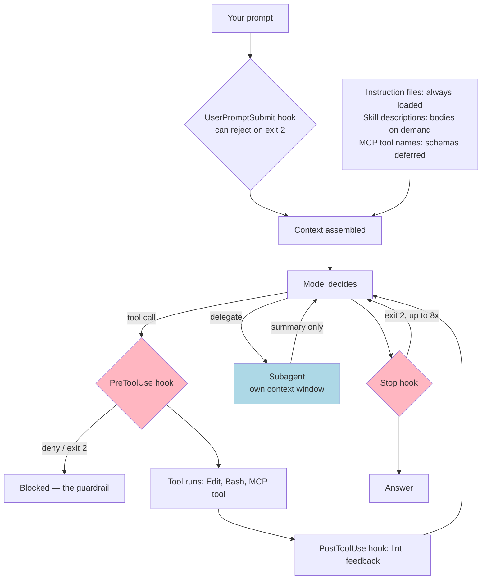

# Module 10: Coding Agents

*Category: Intermediate — Module 10 (3 of 7 in this category)*

Out of the box, a coding agent knows a lot about programming and nothing about *your* repo. Six extension points fix that — instruction files, skills, subagents, hooks, MCP servers and plugins — and the whole skill of using them is knowing **which one to reach for**. Pick wrong and you get an instruction the model quietly ignores; pick right and you get a guarantee. Every path, field name and event name below comes from vendor docs fetched **2026-08-25** (Claude Code ~v2.1.2xx); this area moves fast enough that the Claude Code docs changed host recently, from `docs.claude.com/en/docs/claude-code/*` to `code.claude.com/docs/en/*`, so check the links rather than your memory.

## I. Six mechanisms, one mnemonic

They differ mostly in **when they cost you context**:

| Mechanism | What it is | Context cost |
|---|---|---|
| **Instruction file** (`CLAUDE.md` / `AGENTS.md`) | Always-on facts about the repo | Every token, every request |
| **Skill** (`SKILL.md`) | A procedure or playbook, loaded on demand | Description only, until invoked |
| **Subagent** | A separate agent loop with its own context window | Zero until spawned; a summary comes back |
| **Hook** | A script the harness runs at a lifecycle event | Zero unless it prints |
| **MCP server** | A connection to an external system | Tool *names* only; schemas are deferred |
| **Plugin** | An installable bundle of all of the above | Whatever it contains |

> **Facts → instruction file. Procedures → Skills. Isolation → Subagents. Guarantees → Hooks. Connections → MCP. Distribution → Plugins.**

## II. Instruction files: CLAUDE.md, AGENTS.md, and friends

**AGENTS.md** is the vendor-neutral format — *"a simple, open format for guiding coding agents"*, now *"stewarded by the Agentic AI Foundation under the Linux Foundation"* and *"used by over 60k open-source projects"* ([AGENTS.md, 2026-08-25](https://agents.md/)). Plain Markdown, no required fields, and it nests: agents read *the nearest file in the directory tree*, so a monorepo gets one per package.

One trap worth stating plainly: **Claude Code reads `CLAUDE.md`, not `AGENTS.md`.** The sanctioned bridges are a one-line `@AGENTS.md` import inside `CLAUDE.md`, or `ln -s AGENTS.md CLAUDE.md` ([How Claude remembers your project, 2026-08-25](https://code.claude.com/docs/en/memory)). Claude Code then loads from broadest to most specific — managed policy, `~/.claude/CLAUDE.md`, `./CLAUDE.md`, gitignored `./CLAUDE.local.md` — and **concatenates** them rather than overriding.

**What does *not* belong in one** is where most teams go wrong ([Best practices, 2026-08-25](https://code.claude.com/docs/en/best-practices)):

| ✅ Include | ❌ Exclude |
|---|---|
| Bash commands the agent can't guess | Anything it can learn by reading the code |
| Style rules that differ from language defaults | Conventions it already knows |
| Test instructions and the preferred runner | Detailed API docs (link instead) |
| Repo etiquette: branch naming, PR conventions | Information that changes frequently |
| Environment quirks and non-obvious gotchas | File-by-file descriptions, "write clean code" |

The test for every line: *"Would removing this cause Claude to make mistakes?"* If not, cut it. Target **under 200 lines**, because *"Bloated CLAUDE.md files cause Claude to ignore your actual instructions!"* When a rule only applies to part of the repo, move it out to a path-scoped rule — the documented cure for a bloated instruction file:

```markdown
<!-- .claude/rules/api.md -->
---
paths: ["src/api/**/*.ts"]
---
- All API endpoints must include input validation
- Use the standard error response format
```

Rules without `paths` load unconditionally; path-scoped ones fire only when the agent touches a matching file. And note the caveat that motivates the rest of this module: *"CLAUDE.md content is delivered as a user message after the system prompt… Claude reads it and tries to follow it, but there's no guarantee of strict compliance."*

## III. Skills — and the slash commands they absorbed

Two features became one. **Custom slash commands have been merged into Skills**: *"A file at `.claude/commands/deploy.md` and a skill at `.claude/skills/deploy/SKILL.md` both create `/deploy` and work the same way"*, and legacy `commands/` files keep working ([Extend Claude with skills, 2026-08-25](https://code.claude.com/docs/en/skills)). A **Skill** is a `SKILL.md` at `.claude/skills/<name>/` (project) or `~/.claude/skills/<name>/` (personal), plus optional `scripts/`, `references/` and `assets/` folders. It uses three-stage **progressive disclosure**: metadata (~100 tokens, always loaded), instructions (<5000 tokens, loaded on activation), resources (loaded only if reached) ([Agent Skills Specification, 2026-08-25](https://agentskills.io/specification)). Frontmatter decides who can fire it: the default is *both* you and the model, `disable-model-invocation: true` makes it a pure slash command, and `user-invocable: false` makes it model-only.

**Worked example — `/spec`, the requirements-phase command.** Note `` !`cmd` `` shell injection, which runs *before* the content reaches the model, and `@path`, which attaches a file:

````markdown
<!-- .claude/skills/spec/SKILL.md -->
---
name: spec
description: Turn a rough feature request into a written spec with acceptance criteria
argument-hint: <feature description>
disable-model-invocation: true
allowed-tools: Read, Grep, Glob, Write, Bash(git *)
---
Current branch: !`git branch --show-current`
Conventions: @docs/CONTRIBUTING.md

Write `docs/specs/<slug>.md` for this request: $ARGUMENTS
It must contain problem statement, non-goals, API/schema changes, acceptance
criteria as a checklist, test plan, rollout & rollback. Ask at most three
clarifying questions first if anything is ambiguous.
````

⚠️ **Argument indexing is 0-based** in current docs — `$0` is the first argument, `$1` the second; most 2025 tutorials say otherwise. Two more things to internalise. First, **an invoked skill stays in context**: *"the rendered `SKILL.md` content enters the conversation as a single message and stays there for the rest of the session… every line is a recurring token cost."* Keep `SKILL.md` under 500 lines and push detail into `references/`. Second, **the `description` is the entire discovery mechanism**. The spec's own contrast: good is *"Extracts text and tables from PDF files, fills PDF forms, and merges multiple PDFs. Use when working with PDF documents or when the user mentions PDFs, forms, or document extraction."* Poor is *"Helps with PDFs."*

**And this is the one portable artifact you own.** Agent Skills is an open standard — *"originally developed by Anthropic, released as an open standard"* — with exactly six portable frontmatter fields: `name`, `description`, `license`, `compatibility`, `metadata`, `allowed-tools` ([agentskills.io, 2026-08-25](https://agentskills.io)). Claude Code accepts ~20 more, but stick to the six and the same folder runs almost anywhere. The vendor-neutral directory is **`.agents/skills/`**, and Codex, Gemini CLI, Cursor and Copilot all read it. **A `SKILL.md` folder is the one thing you write once and use in every coding agent in 2026.**

## IV. Subagents — buying back your context window

A **subagent** is a separate agent loop with its own context window, system prompt, tool allowlist and model, defined in `.claude/agents/<name>.md` ([Subagents, 2026-08-25](https://code.claude.com/docs/en/sub-agents)). It gets the task message and your instruction files, but **not** your conversation history, and it returns a summary rather than a transcript. (A *fork* is the variant that does inherit the parent conversation.)

```markdown
<!-- .claude/agents/code-reviewer.md -->
---
name: code-reviewer
description: Reviews a diff for correctness and convention violations. Use after a feature branch is implemented and before opening a PR.
tools: Read, Grep, Glob, Bash
model: sonnet
---
Read `git diff main...HEAD`. Report only findings you are confident about, as
`file:line — blocker|should-fix|nit — what's wrong — the fix`.
Never edit files. Never comment on formatting the linter already enforces.
End with one line: SHIP / FIX-FIRST.
```

Two payoffs. The obvious one is context — a review that reads 40 files returns ten lines to your session. The subtler one is **enforcement**: that `tools:` list is a real allowlist, so this reviewer *cannot* edit your code no matter what the diff tells it to do. A fresh reviewer is also a better reviewer, because it *"sees only the diff and the criteria you give it, not the reasoning that produced the change."*

**When not to delegate:** every spawn is a cold start — no history, a re-read of instruction files, a round trip, a lossy summary back. Don't delegate single-file lookups, and be sceptical of adversarial review — *"A reviewer prompted to find gaps will usually report some, even when the work is sound, because that is what it was asked to do. Chasing every finding leads to over-engineering."*

## V. Hooks — the only deterministic control point

Everything so far is *advice* the model weighs against its other goals. Hooks are not: *"Unlike CLAUDE.md instructions which are advisory, hooks are deterministic and guarantee the action happens"* ([Best practices](https://code.claude.com/docs/en/best-practices)). Put more bluntly: *"An instruction like 'never edit `.env`' in CLAUDE.md or a skill is a request, not a guarantee. A `PreToolUse` hook that blocks the edit is enforcement"* ([Extend Claude Code, 2026-08-25](https://code.claude.com/docs/en/features-overview)).

The 2026 surface is about **31 lifecycle events**; seven earn their keep ([Hooks reference, 2026-08-25](https://code.claude.com/docs/en/hooks)):

| Event | Fires | Can block? | Typical use |
|---|---|---|---|
| `SessionStart` | Session begins | No | stdout becomes context: inject sprint issues, git state |
| `UserPromptSubmit` | Before the model sees your prompt | **Yes** | Reject or annotate prompts; stdout is added as context |
| `PreToolUse` | Before a tool runs | **Yes** | The guardrail: deny writes to protected paths |
| `PostToolUse` | After a tool runs | **No** | Feedback: run the linter, results return as text |
| `Stop` / `SubagentStop` | The agent (or a subagent) wants to finish | **Yes** | Gate on green tests |
| `PreCompact` | Before compaction | **Yes** | Preserve state ([Module 9](9_context_engineering.md)) |

⚠️ **`PostToolUse` ignores exit 2** — it cannot block, only inform, and so do `SessionStart`, `Notification`, `PermissionRequest` and `SubagentStart`. Check the can-block list before designing a guardrail around one. **Worked example — make committed migrations immutable.** Register the hook in `.claude/settings.json`, which is the shareable layer you commit:

```json
{ "hooks": { "PreToolUse": [ { "matcher": "Edit|Write|NotebookEdit", "hooks": [ { "type": "command",
    "command": "${CLAUDE_PROJECT_DIR}/.claude/hooks/protect-migrations.sh" } ] } ] } }
```

```bash
#!/usr/bin/env bash
# .claude/hooks/protect-migrations.sh — chmod +x. Hook input arrives as JSON on stdin.
path=$(jq -r '.tool_input.file_path // ""')
case "$path" in */migrations/*)
  git ls-files --error-unmatch "$path" >/dev/null 2>&1 && cat <<'JSON'
{"hookSpecificOutput":{"hookEventName":"PreToolUse","permissionDecision":"deny",
 "permissionDecisionReason":"This migration is committed and may already be applied. Create a NEW migration instead of editing this one."}}
JSON
  ;;
esac
exit 0
```

There are two ways to block. `permissionDecision: "deny"` on exit 0 is the *polite* block — it hands the model a reason it can act on. **Exit 2** is the blunt, override-proof one: *"JSON `permissionDecision: 'allow'` cannot override it."* Matchers are worth knowing too: plain names and `|`-separated lists match exactly, but any other character (`^`, `*`, `.`) turns the matcher into an unanchored JavaScript regex.

A `Stop` hook is the cure for "it works now!" — it blocks the turn from ending until your check script passes, with a built-in escape hatch so you can't build an infinite gate: *"Claude Code overrides the hook and ends the turn after 8 consecutive blocks."* **Watch for hook loops.** A `PostToolUse` hook on `Edit|Write` that itself writes files — a formatter, a codegen step — re-triggers its own event. Guard on file path, use `async: true`, cap `timeout`, and remember `disableAllHooks` while debugging. *(That failure mode follows from the event semantics; it isn't spelled out in the docs.)* Hooks as a design surface get the full treatment in [Module 11: Harness Engineering](11_harness_engineering.md).

## VI. MCP — and when it's the wrong answer

**MCP** (Model Context Protocol) is an open client/server protocol whose servers expose **Resources** (data), **Prompts** (user-invoked templates) and **Tools** (model-invoked functions); the current spec revision is **2026-07-28** ([MCP Specification, 2026-08-25](https://modelcontextprotocol.io/specification/latest)). Like AGENTS.md, it now lives under the Linux Foundation's Agentic AI Foundation.

```bash
claude mcp add --transport http sentry https://mcp.sentry.dev/mcp
claude mcp add --env AIRTABLE_API_KEY=$KEY --transport stdio airtable -- npx -y airtable-mcp-server
claude mcp list     # ✔ Connected / ! Needs authentication / ✘ Failed to connect
```

Three scopes exist and **the default is `local`** — this project, not shared. To share with the team you want *project* scope: a `.mcp.json` at the repo root, checked into version control.

```json
{ "mcpServers": {
    "sentry": { "type": "http", "url": "https://mcp.sentry.dev/mcp" },
    "postgres": { "command": "npx", "args": ["-y", "@modelcontextprotocol/server-postgres"],
                  "env": { "DATABASE_URL": "${DATABASE_URL}" } } } }
```

Because `.mcp.json` is *meant* to be committed, credentials go in env vars, never inline. A freshly cloned repo can't approve its own servers — they stay pending until you trust the workspace, which is the right default ([MCP, 2026-08-25](https://code.claude.com/docs/en/mcp)). Server tools appear as `mcp__<server>__<tool>`, server prompts as `/mcp__<server>__<prompt>`. **Now the honest part.** MCP is not the universal answer, and Anthropic says so in its own docs: *"CLI tools are the most context-efficient way to interact with external services. If you use GitHub, install the `gh` CLI."* The cost argument has a number — eagerly loading every tool definition and pushing every intermediate result through the model took one workflow from **150,000 tokens to 2,000** once the agent wrote code against the tools instead: *"a time and cost saving of 98.7%"* ([Code execution with MCP, 2025-11-04](https://www.anthropic.com/engineering/code-execution-with-mcp)). The nuance: the villain isn't MCP, it's **naive eager tool loading** — which is why Claude Code now defers MCP tool schemas by default and loads only tool names at startup.

| Reach for MCP when | Reach for something else when |
|---|---|
| No safe CLI exists (Figma, a browser, a BI warehouse) | A CLI exists → Bash plus a skill documenting it |
| The server handles OAuth you'd otherwise script | You only need *knowledge* → a skill |
| Several different tools need the same integration | The action must be unconditional → a hook |

The best combination is both: **MCP for the connection, a skill for the judgment** about how to use it well.

## VII. Plugins — packaging the team's workflow

A **plugin** bundles everything above into one installable unit: a `.claude-plugin/plugin.json` manifest (only `name` is required) alongside `skills/`, `agents/`, `commands/`, `hooks/hooks.json` and `.mcp.json` ([Plugin reference, 2026-08-25](https://code.claude.com/docs/en/plugins-reference)). The documented trigger is literally *"A second repository needs the same setup."*

Publish by adding `.claude-plugin/marketplace.json` to a git repo, then `claude plugin marketplace add acme-corp/claude-plugins`. Better still, let each repo provision itself by committing to `.claude/settings.json`:

```json
{ "extraKnownMarketplaces": {
    "acme-plugins": { "source": { "source": "github", "repo": "acme-corp/claude-plugins" } } },
  "enabledPlugins": { "team-workflow@acme-plugins": true } }
```

A plugin can ship `SessionStart` hooks that run arbitrary shell and MCP servers that phone home, so read its `hooks.json` and `.mcp.json` first, run `claude plugin validate`, and pin marketplace sources with `ref`/`sha`. Supply chain gets its own treatment in [Module 12: Security](12_security.md). And don't build one for one repo, one person, three files.

## VIII. The decision table

| I want… | Use | Why not the neighbour |
|---|---|---|
| The agent to always know our build/test commands | **Instruction file** | A skill isn't loaded unprompted |
| …but only when touching `src/api/**` | **`.claude/rules/*.md` with `paths:`** | Keeps the instruction file under 200 lines |
| A repeatable prompt I trigger by name (`/spec`) | **Skill** + `disable-model-invocation: true` | Hooks can't be triggered by intent |
| A task that reads 40 files but returns 10 lines | **Subagent** | A skill runs in *your* context window |
| A reviewer that literally *cannot* edit | **Subagent**, `tools: Read, Grep, Glob` | "Don't edit" is not enforcement |
| Something that must **never** happen | **`PreToolUse` hook**, `deny` or exit 2 | The one true guardrail |
| No "done" while the tests are red | **`Stop` hook**, exit 2 (overridden after 8) | Nothing else can hold the turn |
| To reach Jira / Sentry / Figma / a browser | **MCP server** | No safe CLI; auth is the hard part |
| To reach GitHub, AWS, k8s, Postgres | **Bash + a skill documenting the CLI** | CLIs are the most context-efficient path |
| To give a second repo the same setup | **Plugin** (+ marketplace) | Copy-paste rots |

## IX. Cross-tool: everyone has these, under different names

You may not be on Claude Code. The mechanisms are converging; the spellings are not. (Each vendor's docs verified 2026-08-25.) Cursor and Copilot read `.claude/skills/`, Cursor also reads `.claude/agents/`, Gemini CLI ships `CLAUDE_PROJECT_DIR` as a hook env alias, and everyone reads `.agents/skills/` — write to the six-field spec and you are portable by default.

| | Claude Code | Codex CLI | Gemini CLI | Cursor | GitHub Copilot |
|---|---|---|---|---|---|
| Instructions | `CLAUDE.md` + `.claude/rules/` | `AGENTS.md` (+`AGENTS.override.md`) | `GEMINI.md`; can alias `AGENTS.md` | `.cursor/rules/*.mdc` + `AGENTS.md` | `.github/copilot-instructions.md`, `AGENTS.md` |
| Skills | `.claude/skills/` | `.agents/skills/` | `.gemini/skills/`, `.agents/skills/` | `.cursor/skills/`, `.agents/skills/`, `.claude/skills/` | `.github/skills`, `.claude/skills`, `.agents/skills` |
| Subagents | `.claude/agents/*.md` | `.codex/agents/*.toml` | built-ins + `agents.overrides` | `.cursor/agents/*.md` | `.github/agents/*.agent.md` |
| Hooks | `settings.json`, ~31 events | `hooks.json` / TOML, 11 events | `settings.json`, 11 events | `.cursor/hooks.json`, 21 **camelCase** events | `.github/hooks/*.json`, 8 events |
| MCP | `.mcp.json` | `[mcp_servers.x]` in TOML | `mcpServers` in `settings.json` | `.cursor/mcp.json` | `~/.copilot/mcp-config.json` |

## X. Composing an AI-powered SDLC

None of this is impressive alone. Together it's a pipeline:

| Phase | Mechanism | Concrete |
|---|---|---|
| Requirements / design | Skill + MCP + subagent | `/spec <request>` writes the spec; a Jira/Linear server means "implement ENG-4521" works without pasting; a read-only architect subagent returns an options memo |
| Implement | Instruction file + `PreToolUse` hook | Conventions in `CLAUDE.md`; edits to committed migrations, `.env*` and `**/generated/**` denied |
| Test | Skill + `Stop` hook | `/run-tests` encodes the one correct invocation; the turn cannot end while the suite is red |
| Review | Subagent | `code-reviewer` with read-only tools, on a fresh context |
| Deploy / operate | Skill + MCP | `/release` with `disable-model-invocation: true`, so the model can never decide to ship; a Sentry server drops live stack traces in |
| All of it | Plugin | `team-workflow@acme-plugins`, self-provisioned per repo |

## Mermaid Diagram: where each mechanism plugs into the loop



## XI. Pitfalls

1. **The bloated instruction file.** Prune ruthlessly, convert hard rules to hooks — and note that `@path` imports help organisation but **don't reduce context**, since imports load at launch. Related: *"If you emphasize many lines, none of them stands out."*
2. **Instruction-as-guardrail.** If it must hold every time, it is a hook. Full stop — and check the can-block list, because `PostToolUse` ignores exit 2.
3. **Hook loops.** A formatter hook on `Edit|Write` that writes files re-triggers itself. **MCP sprawl** is the same class of problem: audit with `/context` and `/mcp`, scope a server to the one subagent that needs it via its `mcpServers:` field, and prefer a CLI where a safe one exists.
4. **Over-delegation.** Cold start every time, and an adversarial reviewer will always find *something*.
5. **Weak skill descriptions.** Name the trigger and the artifact. The opposite failure — a skill firing constantly — is also a description bug: narrow it, or add `paths:`.

## Tutorial Progress


## Summary

A coding agent is a generic agent loop plus six extension points, and choosing between them comes down to *when you pay for context* and *whether you need a guarantee*. Facts go in instruction files, procedures in skills, expensive research in subagents, connections in MCP servers, and the whole thing ships as a plugin. The one idea to carry out: **everything except a hook is advice.** If a rule must hold every single time, write a `PreToolUse` hook and stop arguing with the model about it. [Module 11: Harness Engineering](11_harness_engineering.md) takes these apart at the harness level; [Module 22: Advanced Harness Engineering](../3_expert/22_advanced_harness_engineering.md) scales them.

**Quick Check**: Your team keeps letting the agent edit a migration that's already applied in staging. You add "never edit applied migrations" to `CLAUDE.md`, and it happens again a week later. What should you have used instead — and why was the instruction file never going to work?

Keep going! 🚀

## References & Further Reading

### The primary sources

- [Extend Claude with skills](https://code.claude.com/docs/en/skills) — Anthropic, fetched 2026-08-25. SKILL.md locations and precedence, the frontmatter table, the commands→skills merger, argument substitution.
- [Extend Claude Code](https://code.claude.com/docs/en/features-overview) — Anthropic, fetched 2026-08-25. Anthropic's own mechanism-chooser and context-cost-per-feature tables; read it before choosing anything.
- [Hooks reference](https://code.claude.com/docs/en/hooks) — Anthropic, fetched 2026-08-25. Every lifecycle event, the settings.json shape, exit codes, matcher semantics and the JSON deny contract.
- [Best practices for Claude Code](https://code.claude.com/docs/en/best-practices) — Anthropic, fetched 2026-08-25. The include/exclude table, the pruning test, the CLI-first rule and the named failure patterns.
- [How Claude remembers your project](https://code.claude.com/docs/en/memory) — Anthropic, fetched 2026-08-25. Instruction-file locations and load order, `.claude/rules/` with `paths:`, and the definitive AGENTS.md answer.
- [Subagents](https://code.claude.com/docs/en/sub-agents) — Anthropic, fetched 2026-08-25. Every frontmatter field and exactly what does and doesn't load into an isolated context.
- [Connect Claude Code to tools via MCP](https://code.claude.com/docs/en/mcp) — Anthropic, fetched 2026-08-25. `claude mcp add`, `.mcp.json`, the three scopes, tool naming and tool search.
- [Plugin reference](https://code.claude.com/docs/en/plugins-reference) — Anthropic, fetched 2026-08-25. The `plugin.json` schema, directory layout, `${CLAUDE_PLUGIN_ROOT}` and `userConfig`.

- [Agent Skills — Specification](https://agentskills.io/specification) — Agent Skills project, fetched 2026-08-25. The six portable frontmatter fields and their exact constraints.
- [Agent Skills — Overview](https://agentskills.io) — Agent Skills project, fetched 2026-08-25. Three-stage progressive disclosure plus the ~40-tool adopter showcase.
- [AGENTS.md](https://agents.md/) — Agentic AI Foundation / Linux Foundation, fetched 2026-08-25. The neutral instructions format: contents, nearest-file-wins nesting, and who honours it.
- [MCP Specification (revision 2026-07-28)](https://modelcontextprotocol.io/specification/latest) — Model Context Protocol, fetched 2026-08-25. Resources / Prompts / Tools, trust-and-safety principles, and the Tasks / MCP Apps / "Skills over MCP" extensions.

- [Steering Claude Code: when to use CLAUDE.md, skills, hooks, rules, subagents and more](https://claude.com/blog/steering-claude-code-skills-hooks-rules-subagents-and-more) — Anthropic, 2026-06-18. The best prose version of the decision framework.
- [Code execution with MCP: building more efficient agents](https://www.anthropic.com/engineering/code-execution-with-mcp) — Anthropic Engineering, 2025-11-04. The token-cost case against eager tool loading: 150,000 tokens → 2,000, plus an honest account of what code execution costs you in sandboxing.

**Previous Module:** [Module 9: Context Engineering](9_context_engineering.md)
**Next Module:** [Module 11: Harness Engineering](11_harness_engineering.md)
