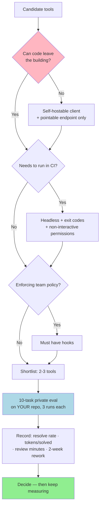

# Module 10: Coding Agents: The Landscape

*Category: Intermediate — Module 10 (3 of 8 in this category)*

Eleven credible coding agents now ship the same seven features, so the feature list is not the decision. What actually separates them is the *defaults* — who sandboxes, who bills you per token, whose config you can take with you when you leave. Everything below was verified against vendor docs and primary papers on **2026-08-25**; this landscape renamed two products and retired one benchmark in the six months before that date, so check the links rather than your memory.

## I. What actually varies

### A. The harness is not the model — and the split is quantified

An agent is a **model** (the weights) inside a **harness** (the loop, tools, prompts, permission checks). You buy the harness; you rent the model. How much does the harness matter?

Two numbers, and you need both:

- **It matters enormously.** OpenAI, publishing SWE-bench Verified: *"GPT‑4's performance on SWE-bench Lite varies between 2.7% using an early RAG-based scaffold and 28.3% using CodeR"* ([Introducing SWE-bench Verified, 2024-08-13](https://openai.com/index/introducing-swe-bench-verified/)). A 10× spread from scaffolding alone.
- **It matters, but not the way you think.** A 2026 controlled ablation — 300 trials, 3 harnesses, 2 models, 50 Terminal-Bench Pro tasks — found within-model pass-rate differences of only **0–8 percentage points**, with *"95% confidence intervals often including zero"*. Meanwhile **tokens per solved task differed by 40×** (28,142 vs 1,147,740), and each harness had its own **failure fingerprint**: one stops reasoning, one hits MAX_TURNS, one hangs ([The Scaffold Effect in Coding Agents, arXiv:2607.22585, 2026-06-08](https://arxiv.org/html/2607.22585)).

So: the harness buys you **cost and failure-mode control**, not raw capability. That paper's recommendation is the sentence to keep — *"the unit of comparison … should be the harness–model pair, not the model alone."* Building one yourself is [Module 12](12_harness_engineering.md); this module is about buying one.

### B. The six axes worth comparing

| Axis | The question it answers |
|---|---|
| **Harness–model pair** | Can I change the model without changing the tool? |
| **Permission & sandbox model** | What runs without asking, and is it contained by the OS? |
| **Extension surface** | Instruction file, skills, subagents, hooks, MCP, plugins — [Module 11](11_coding_agents.md) |
| **Repo comprehension** | Agentic search (grep/read per turn, always current, costs tokens) vs. a pre-built index (fast, stale-able, often uploaded) |
| **Cost model** | Subscription seat, metered tokens, or a credit pool |
| **Openness** | Read the source? Point it elsewhere? Self-host? **Leave later?** |

Those are four separate questions inside "openness", and readers conflate them constantly. An MIT-licensed client tied to one vendor's API is open in sense (1) and closed in sense (2).

## II. The landscape

### A. Open source

**opencode** — *"The open source coding agent"*, MIT, maintained by Anomaly. TUI-first with a real client/server split (`opencode serve` runs headless; the UI attaches over HTTP), **75+ providers** including Ollama, LM Studio and llama.cpp, and it reads your existing `AGENTS.md`, `CLAUDE.md` and `.claude/skills/` ([opencode docs, 2026-08-25](https://opencode.ai/docs/)). Post-1.0 and releasing near-daily. For a Claude-Code-shaped tool that is not tied to one vendor, this is the default answer.

> ⚠️ **The name trap — and it is load-bearing.** Two unrelated projects shipped as "opencode". `opencode-ai/opencode` is **archived**: *"The project has continued under the name Crush."* The live one is **`anomalyco/opencode`** — `sst/opencode` redirects there after a company rename, which means `brew install sst/tap/opencode` and any `sst/opencode` GitHub Action in a tutorial are **stale**. Current: `brew install anomalyco/tap/opencode`, action `anomalyco/opencode/github@latest`. Verify the repo before you trust the tutorial.

**pi** (`pi.dev`) — *"a minimal terminal coding harness"* from Earendil Inc., MIT, v0.84.3 (2026-08-24). Four tools by default (`read`, `write`, `edit`, `bash`), a small system prompt, and deliberate refusals: **no MCP, no subagents, no plan mode, no permission popups** — verbatim, *"Run in a container, or build your own confirmation flow with extensions."* Widest provider list of the four and an RPC mode plus SDK, which makes it the best of the group to *embed* in your own product. Pre-1.0.

**DeepSeek Harness (`dsh`)** — first-party from DeepSeek AI, MIT, *"everything is a plugin"*. Its permission model is the most rigorous here: `read-only` / `workspace-write` / `danger-full-access` sandbox modes on **bwrap/Landlock, Seatbelt and a Windows ACL restricted token**, paired with an `ask`/`never` approval policy that **fails closed** and writes an audit record per decision. It can also run **Claude Code and Codex as subagents**, and run your existing Claude Code `hooks.json` unmodified. **Caveat, in its own words:** *"DeepSeek Harness is currently in developer preview and is iterating rapidly. THERE WILL BE COMPATIBILITY-BREAKING CHANGES."* The repo went public 2026-08-13 and the latest release is `dsh-v0.1.1-rc.2`. Study it; do not standardise a team on it yet.

> **Sidebar — Hermes Agent is not a coding agent.** `NousResearch/hermes-agent` (MIT) is a *personal* agent with a competent coding subsystem: `hermes chat --worktree --checkpoints` gives you a git worktree per task, and `hermes kanban` is a shipped multi-agent work queue. Its home is nightly, cross-repo, scheduled work — not "refactor this file". Full treatment in [Module 15: Personal Agents](15_personal_agents.md).

### B. Commercial CLI

| Tool | What it is | Who it's for |
|---|---|---|
| **Claude Code** (Anthropic) | Terminal-first `claude`, plus VS Code / JetBrains / Desktop / web / SDK. Richest extension surface (~31 hook events) and the deepest fleet-management story: managed settings users cannot override, spend limits, an Enterprise Analytics API, OpenTelemetry export. | Teams standardising on one config that lives in the repo, and anyone who needs hooks as a hard guardrail. |
| **Codex** (OpenAI) | `codex` CLI plus IDE, web, iOS, cloud, SDK, GitHub Action. Two orthogonal layers — `sandbox_mode` × `approval_policy` — sandboxed by default, network off by default inside `workspace-write`. | Windows-native work, and the tightest CI story of the three. |
| **Antigravity CLI** (`agy`, Google) | Go TUI sharing a harness and settings with the Antigravity desktop editor. Resource-based permissions (`read_file`, `command`, `read_url`…) with **Deny > Ask > Allow**. Subagents are **asynchronous by design**. | Zero budget, or you want a competitor's frontier models from one tool. |

> ⚠️ **Gemini CLI is retired.** Google's own post *"An important update: Transitioning Gemini CLI to Antigravity CLI"* is dated **2026-05-19** and states that on **2026-06-18** Gemini CLI *"stopped serving requests"* for Google AI Pro/Ultra and free-tier users ([Google Developers Blog, 2026-05-19](https://developers.googleblog.com/an-important-update-transitioning-gemini-cli-to-antigravity-cli/)). The binary is **`agy`**, not `antigravity`. Any 2025 material teaching `GEMINI.md` and `.gemini/commands/*.toml` is teaching a retired product.

### C. IDE and editor

| Tool | What it is | Who it's for |
|---|---|---|
| **Kiro** (an Amazon company) | Spec-first. A feature becomes `requirements.md` → `design.md` → `tasks.md`, version-controlled **in the repo**, then executed task by task ([Kiro Specs, 2026-08-25](https://kiro.dev/docs/specs/)). Permissions are declarative deny-overrides stored **outside** the repository, so a cloned repo cannot grant itself trust. | Multi-file features with real ambiguity, and teams that want the plan reviewed before the diff. |
| **Cursor** | VS Code-derived editor; agent chat plus **Plan Mode** as an editable artifact — though plans *"save to your home directory by default"* unless you explicitly save to the workspace. Richest hook surface of any tool here (~20 camelCase events). | Developers who want the agent inside the editor they already live in. |
| **GitHub Copilot** | Two surfaces: in-editor custom agents, and the **Copilot cloud agent** you assign an issue to. Its guardrails are enforced by the **forge**, not the agent: it cannot `git push`, cannot mark its own PR ready, cannot approve or merge, and workflows do not run until a human with write access approves them. | Issue-to-PR automation where the review gate must be structural. |
| **Devin Desktop** (Cognition) | **This is Windsurf.** Renamed **2026-06-02**: *"Devin Desktop is the new name for Windsurf. It's the same IDE, same editor, and has the same features"* ([Devin Desktop FAQ, 2026-08-25](https://docs.devin.ai/desktop/devin-desktop-faq)). Cascade is retired in favour of Devin Local. Ships **ACP** (Agent Client Protocol), so any compatible agent runs inside it. | Existing Windsurf users, and anyone interested in decoupling agent from editor. |

**The convergence, in one line:** every tool above honours `AGENTS.md`; opencode, `dsh`, Codex, `agy`, Cursor, Kiro and Copilot all read `SKILL.md` folders, and Copilot reads `CLAUDE.md` and `GEMINI.md` outright. Your instruction files and skills are portable in 2026. Your hooks and plugins are not.

## III. The comparisons that earn their space

### A. Permission and sandbox defaults — read this row before you `--yolo`

| | Claude Code | Codex | Antigravity CLI |
|---|---|---|---|
| **Sandbox on by default?** | **No** (`sandbox.enabled` is opt-in) | **Yes** — `workspace-write` | **No** — *"The sandbox is disabled by default"* |
| Linux / macOS / Windows | `bubblewrap`+`socat` / Seatbelt / **not supported, use WSL2** | `bubblewrap` / Seatbelt / **native** | `nsjail` / `sandbox-exec` / `AppContainer` |
| Network egress default | Prompts per new domain | **Off** unless `network_access = true` | `read_url` defaults to Ask |
| The escape hatch | `--dangerously-skip-permissions` | `--dangerously-bypass-approvals-and-sandbox` (`--yolo`) | `--dangerously-skip-permissions` |

Three things to take away. **Codex is the only one sandboxed out of the box** — students who assume "the agent is contained" are wrong two times out of three. **Only Codex sandboxes on native Windows.** And every vendor put the word *dangerous* in the name of its escape hatch; they wrote your warning label for you. On the open-source side the same spread exists: `dsh` defaults to `workspace-write` + `ask` + fail-closed, opencode's docs say *"Most permissions default to 'allow'"*, and pi ships no permission prompts at all by design. **The sandbox is the container's job; the agent's permission model is a usability layer on top of it.** ([Module 13: Security](13_security.md) goes deeper.)

### B. Cost model — the shape matters more than the number

| Shape | Who | How it bites you |
|---|---|---|
| **Subscription seat** | Claude Code (Pro/Max/Team), Cursor, Copilot | Rate limits mid-session, on a long agentic run |
| **Metered tokens** | Any BYO-API-key path (Claude Console, `CODEX_API_KEY`, opencode, pi) | An unbounded loop on a Friday night |
| **Credit pool** | Codex (credits per 1M tokens), Kiro, Copilot AI credits | Opaque per task — you cannot price a change before making it |

Both failure modes are the same failure: **no turn budget**. Anthropic's own planning figure is the one to give a manager: *"the average cost is around \$13 per developer per active day and \$150-250 per developer per month, with costs remaining below \$30 per active day for 90% of users"* ([Manage costs effectively, 2026-08-25](https://code.claude.com/docs/en/costs)).

⚠️ **Prices below were read from vendor pages on 2026-08-25 and will age in weeks, not months.** Entry paid tiers: Copilot Pro **$10/mo**, Claude Code via Pro **$17/mo annual** ($20 monthly), Codex Plus **$20/mo**, Cursor Pro **$20/mo**, Kiro Pro **$20/user/mo**. Free paths to a real agentic loop: **Antigravity CLI Individual $0** (which serves Claude Opus and Sonnet 4.6 on its free tier), **Codex Free**, and every open-source agent with your own key. Copilot Free excludes the cloud agent. Devin Desktop's tiers could not be verified — the vendor states only *"Pricing is unchanged"* after the rename.

### C. Openness and exit cost

| | Client source | Point at another model? | Self-host / air-gap | What you rewrite if you leave |
|---|---|---|---|---|
| opencode / pi / `dsh` | MIT | Yes — 75+ providers, local llama.cpp/Ollama | Client yes; model if you run it locally | Little — all read `AGENTS.md` + `SKILL.md` |
| Claude Code | Closed | Your cloud account (Bedrock, Google Cloud, Microsoft Foundry, LLM gateway) — not another vendor's model | No | Hooks, plugins, `.claude/` layout |
| Codex | Closed | Your own OpenAI key only | No | Hooks, `.rules` (Starlark execpolicy), `requirements.toml` |
| Antigravity CLI | Closed | Gemini API key only — but the *product* serves Claude and GPT-OSS models | No | Workflows, plugin layout |
| Kiro / Cursor / Copilot / Devin | Closed | Multi-provider pools, BYOK partly documented | No | Rules dialects, hooks, IDE-specific config |

### D. Headless and CI — what separates "a nicer editor" from "a build step"

```bash
# Claude Code — deny-by-default CI, verbatim from the permission-modes docs
claude -p "run the test suite" --permission-mode dontAsk --allowedTools "Bash(npm test)" "Read"

# Codex — pipe failures in, get JSON out, persist nothing
npm test 2>&1 | codex exec --json --ephemeral --sandbox workspace-write "summarize failures and suggest fixes"

# Antigravity CLI / opencode / pi
agy -p "audit this diff" --output-format json
opencode run --format json --auto "fix the failing test"
pi -t read,grep,find -p "audit this code"     # tool-level least privilege
```

Three details decide this axis in practice. **Reproducibility:** Claude Code's `--bare` skips auto-discovery of hooks, skills, subagents, plugins, MCP servers and `CLAUDE.md` (Codex: `--ignore-user-config`, `--ignore-rules`, `--ephemeral`) — without it, *"a `-p` session runs the hooks in a project's `.claude/settings.json` and connects the servers in its `.mcp.json`, even in a folder you've never trusted"* ([Run Claude Code programmatically, 2026-08-25](https://code.claude.com/docs/en/headless)). **Auth:** use an API key in CI, never browser auth. **A published Action:** `anthropics/claude-code-action@v1` and `openai/codex-action@v1` exist; no first-party Action for `agy` was found, and Kiro's headless mode is paywalled to paid tiers. Those are real selection criteria.

## IV. Benchmarks — and why you should not choose on them

**The strongest single finding in this research: OpenAI retired SWE-bench Verified on 2026-02-23.** Verbatim from its own page: *"This is why we have stopped reporting SWE-bench Verified scores, and we recommend that other model developers do so too."* ([Why SWE-bench Verified no longer measures frontier coding capabilities, 2026-02-23](https://openai.com/index/why-we-no-longer-evaluate-swe-bench-verified/))

Two findings put it there. OpenAI audited **138 problems** that o3 could not consistently solve across **64 runs**, each reviewed by **at least six experienced engineers**, and found **59.4%** had *"material issues in test design and/or problem description"* — 35.5% narrow tests enforcing unspecified implementation details, 18.8% wide tests checking unspecified functionality. Then it *demonstrated* contamination rather than asserting it: GPT‑5.2, Claude Opus 4.5 and Gemini 3 Flash Preview each reproduced the human-written gold patch or verbatim problem text **from a task ID alone**. The conclusion: improvements *"increasingly reflect how much the model was exposed to the benchmark at training time."* OpenAI now recommends **SWE-bench Pro** ([arXiv:2509.16941](https://arxiv.org/abs/2509.16941)) — 1,865 instances across 41 repos, with a held-out set and copyleft-licensed public repos as a structural contamination defence.

This did not come out of nowhere. **SWE-Bench+** found *"32.67% of the successful patches involve cheating"* and dropped one measured resolve rate from **12.47% to 3.97%** after filtering ([arXiv:2410.06992](https://arxiv.org/abs/2410.06992)). **The SWE-Bench Illusion** showed models identifying buggy file paths from the issue text alone at **76%** on SWE-bench repos versus **53%** elsewhere ([arXiv:2506.12286](https://arxiv.org/abs/2506.12286)) — on *your* private repo, you get the 53% behaviour. Leakage (2024), memorisation (2025), vendor retirement (2026): three independent lines, one direction.

| A benchmark score DOES tell you | It does NOT tell you |
|---|---|
| A capability floor **for that task distribution** | Anything about your language or domain — SWE-agent scores 12% on SWE-bench Multimodal's JS tasks |
| How a **harness–model pair** did **under a stated turn/cost budget** | What the same model does in *your* harness. Terminal-Bench 2.1 fixed 28 of 89 tasks and one pair moved **+12.1%** |
| Relative ordering, which is fairly robust | Absolute resolve rate, or cost — which varies **40×** across harnesses |

**One line to remember:** *a benchmark score measures a harness+model pair, on a task distribution someone else chose, under a budget someone else set, on data the model may have seen.* Use it to shortlist. Never use it to decide.

## V. Does any of this make developers faster?

Honest answer: **it depends on who you are and what code you are touching**, and the spread is wide enough to change sign.

**The case that it can make you slower.** METR ran an RCT with **16 experienced developers** across **246 tasks** on repos they maintain — averaging **>1,100,000 lines**, ~10 years old, with ~**5 years** and ~**1,500 commits** of personal history each. They forecast **24% faster**. Afterwards they estimated they had been **20% faster**. They were measured **19% slower** ([METR, 2025-07-10](https://metr.org/blog/2025-07-10-early-2025-ai-experienced-os-dev-study/); [arXiv:2507.09089](https://arxiv.org/abs/2507.09089)). Time moved from coding and reading into *"reviewing AI outputs, prompting AI systems, and waiting for AI generations"*. The top contributing factors were **high developer familiarity with the repository** and **large and complex repositories**. METR's own caveat matters as much as the headline: the result *"does not imply that current AI tools do not often improve developer's productivity"*, and results are *"consistent with small greenfield projects or development in unfamiliar codebases seeing substantial speedup."* Tooling was Cursor Pro with Claude 3.5/3.7 Sonnet, Feb–Jun 2025 — pre-agentic-CLI.

**The case that it makes you faster.** Three enterprise RCTs across **4,867 developers** at Microsoft, Accenture and a Fortune 100 manufacturer measured **+26.08%** weekly completed tasks (SE 10.3%) — with the gain concentrated in *"more recent hires and those in more junior positions but not for developers with longer tenure"* ([Cui et al., 2025-02](https://economics.mit.edu/sites/default/files/inline-files/draft_copilot_experiments.pdf)). **Flag the conflict:** two authors are at Microsoft, the vendor. Microsoft's own 2026 telemetry across tens of thousands of engineers using CLI agents found adopters merged *"roughly 24% more pull requests"* — with the authors' caveat *"a merged PR is not the same as the value it delivers"* ([arXiv:2607.01418](https://arxiv.org/abs/2607.01418)). Google's 96-engineer RCT found *"about 21%"*, while stating *"our confidence interval is large"* ([arXiv:2410.12944](https://arxiv.org/abs/2410.12944)).

**The reconciliation is the lesson — not either number.** Every study above is consistent with one gradient:

| Where you are | Expected effect |
|---|---|
| Greenfield, self-contained, domain new to you | Large gain |
| Junior or new hire on an established codebase | Solid gain |
| Average enterprise developer, mixed work | Modest gain (~20–26%) |
| **Expert on a 1M-line repo you have maintained for five years** | **Possible loss (−19%)** |
| Any org without strong tests, version control and fast feedback | Faster **and** less stable (DORA 2025) |

Locate *yourself* on it. Then note the finding that survives all of them: **self-assessment is unreliable in a consistent direction.** METR's developers felt +20% while measuring −19%; DORA's 2025 respondents were >80% confident of gains while 30% reported *"little or no trust"* in AI-generated code. Whatever you pick, you cannot feel the difference. Measure it.

## VI. Choosing — a framework keyed on constraints

Constraints eliminate options; preferences don't. The first row that is a *hard* constraint for you decides most of the answer.

| If this is true of you | Then | Practical rule |
|---|---|---|
| **Code cannot leave the building** | Openness (1)+(3) | Eliminate anything without a self-hostable client *and* a pointable endpoint → opencode, pi or `dsh` with a local model |
| **You must standardise a team** | Extension surface | Choose for the *instruction-file and skills format*, not the chat UX. Config in the repo means review, versioning and onboarding are free |
| **Hard cost ceiling** | Cost model | Subscription for interactive work; metered only with turn caps. Measure **tokens per solved task**, not tokens per session |
| **You want it in CI** | Headless | Requires prompt-and-exit, exit codes, machine-readable output, and a non-interactive permission mode that isn't "allow all". Most IDE-first tools fail this row |
| **You must enforce policy, not request it** | Hooks | No hooks means no guarantees — only advice ([Module 11](11_coding_agents.md)) |
| **You want to be able to leave** | Portability | `AGENTS.md` + `.agents/skills/` travel. Ask: "if I switch, how many files do I rewrite?" |
| **Large old repo you know well** | Comprehension + the gradient | Expect the METR regime. Use the agent on unfamiliar corners, tests and mechanical refactors — not the code you hold in your head |

**Worked example.** Ayşe maintains a 400k-line Django monolith. Six years' tenure. Customer data cannot leave the building, and the budget is €500/month. Row 1 fires first and eliminates every closed CLI and IDE agent — she is choosing between opencode, pi and `dsh` against a self-hosted endpoint. Row 3 says metered, with a turn cap. Row 7 says she is squarely in the METR regime for the payments module she wrote, so she points the agent at the unfamiliar reporting service, the test backfill and a mechanical Django upgrade instead. She picks opencode (post-1.0, reads the `AGENTS.md` she already has) and runs it inside a container, because opencode does not sandbox itself.

**And then the escape hatch that beats every table in this module:** build a **10-task private eval on your own repository**, run each candidate three times, and record four numbers — resolve rate, tokens per solved task, human minutes reviewing, and rework within two weeks. That is about a day of work, and it is the only measurement taken on *your* distribution, *your* repo and *your* budget.

## Mermaid Diagram: choosing by elimination, not by leaderboard



## Tutorial Progress


## Summary

Eleven tools, one shape: instruction file, skills, subagents, hooks, MCP, plugins, a sandbox and a headless flag. What genuinely differs is the defaults — Codex sandboxes out of the box and the others don't, the harness moves cost by 40× while moving pass rate by 0–8 points, and your `AGENTS.md` and `SKILL.md` are portable while your hooks are not. Don't choose on a leaderboard: the field's own flagship benchmark was retired by its co-creator for defective tests and demonstrated contamination. Choose by eliminating on constraints, then run a ten-task eval on your own repository — because the evidence says AI helps most exactly where you know least, and that self-assessment is wrong in a consistent direction. You have now chosen a tool; [Module 11](11_coding_agents.md) makes it yours.

**Quick Check**: Two tools score within one point of each other on the same benchmark, using the same model. Name two things that comparison still hasn't told you about what will happen when you deploy either one on your team's repo — and say which of them you could measure in a single afternoon.

Keep going! 🚀

## References & Further Reading

### Benchmarks and the evidence base

- [Why SWE-bench Verified no longer measures frontier coding capabilities](https://openai.com/index/why-we-no-longer-evaluate-swe-bench-verified/) — OpenAI, 2026-02-23. The retirement, the 59.4% defect audit, and demonstrated contamination in three vendors' models. The single most important link here.
- [Introducing SWE-bench Verified](https://openai.com/index/introducing-swe-bench-verified/) — OpenAI, 2024-08-13. How the set was built, and the 2.7%→28.3% scaffold spread.
- [SWE-Bench+: Enhanced Coding Benchmark for LLMs](https://arxiv.org/abs/2410.06992) — arXiv:2410.06992, 2024-10-09. 32.67% solution leakage; 12.47%→3.97% after filtering.
- [The SWE-Bench Illusion](https://arxiv.org/abs/2506.12286) — arXiv:2506.12286, 2025-06-14. 76% vs 53% file-path recall: memorisation, not reasoning.
- [SWE-bench Pro](https://arxiv.org/abs/2509.16941) — arXiv:2509.16941, 2025-09-21. OpenAI's recommended replacement: 1,865 instances, 41 repos, held-out set.
- [The Scaffold Effect in Coding Agents](https://arxiv.org/html/2607.22585) — arXiv:2607.22585, 2026-06-08. 300 trials, 3 harnesses: 0–8pp pass-rate spread, 40× token-cost spread, per-harness failure fingerprints.
- [Measuring the Impact of Early-2025 AI on Experienced Open-Source Developer Productivity](https://arxiv.org/abs/2507.09089) — METR, 2025-07-10 ([blog](https://metr.org/blog/2025-07-10-early-2025-ai-experienced-os-dev-study/)). The 19% slowdown RCT, with the authors' own caveats.
- [The Effects of Generative AI on High-Skilled Work: Evidence from Three Field Experiments](https://economics.mit.edu/sites/default/files/inline-files/draft_copilot_experiments.pdf) — Cui, Demirer, Jaffe, Musolff, Peng, Salz, 2025-02. 4,867 developers, +26.08%; note the Microsoft co-authors.
- [Adoption and Impact of Command-Line AI Coding Agents](https://arxiv.org/abs/2607.01418) — arXiv:2607.01418, 2026-07-01. Microsoft telemetry: ~24% more merged PRs, and why that isn't the same as value.
- [Announcing the 2025 DORA Report](https://cloud.google.com/blog/products/ai-machine-learning/announcing-the-2025-dora-report) — Google Cloud, 2025-09-24. ~5,000 respondents: throughput up, stability down, 30% distrust.

### Tool documentation

- [opencode docs](https://opencode.ai/docs/) — Anomaly, fetched 2026-08-25. The live project (`anomalyco/opencode`), install matrix, providers, [permissions](https://opencode.ai/docs/permissions/) and [CLI reference](https://opencode.ai/docs/cli/).
- [DeepSeek Harness](https://github.com/deepseek-ai/deepseek-harness) — DeepSeek AI, fetched 2026-08-25. "Everything is a plugin", the developer-preview warning, and the [sandbox subsystem](https://github.com/deepseek-ai/deepseek-harness/blob/master/docs/subsystems/sandbox.md).
- [Run Claude Code programmatically](https://code.claude.com/docs/en/headless) — Anthropic, fetched 2026-08-25. `-p`, `--bare`, output formats, exit codes; see also [sandboxing](https://code.claude.com/docs/en/sandboxing) and [costs](https://code.claude.com/docs/en/costs).
- [Sandbox — Codex](https://learn.chatgpt.com/docs/sandboxing) and [Non-interactive mode](https://learn.chatgpt.com/docs/non-interactive-mode) — OpenAI, fetched 2026-08-25. `sandbox_mode` × `approval_policy`, and every `codex exec` flag.
- [An important update: Transitioning Gemini CLI to Antigravity CLI](https://developers.googleblog.com/an-important-update-transitioning-gemini-cli-to-antigravity-cli/) — Google, 2026-05-19. The retirement, in Google's own words; see also the [Antigravity CLI sandbox](https://antigravity.google/docs/cli/sandbox/).
- [Kiro Specs](https://kiro.dev/docs/specs/) and [Kiro Permissions](https://kiro.dev/docs/permissions/) — fetched 2026-08-25. Spec-driven development, and deny-overrides permissions stored outside the repo.
- [Cursor Run modes](https://cursor.com/docs/agent/security/run-modes) — fetched 2026-08-25. Including the vendor's own disclaimer: *"Auto-review is not a security boundary."*
- [Copilot cloud agent: risks and mitigations](https://docs.github.com/en/copilot/concepts/agents/cloud-agent/risks-and-mitigations) — GitHub, fetched 2026-08-25. Guardrails enforced by the forge rather than the agent.
- [Devin Desktop FAQ](https://docs.devin.ai/desktop/devin-desktop-faq) — Cognition, fetched 2026-08-25. The Windsurf rename, in the vendor's own words.

**Previous Module:** [Module 9: Context Engineering](9_context_engineering.md)
**Next Module:** [Module 11: Coding Agents: Extending Them](11_coding_agents.md)
