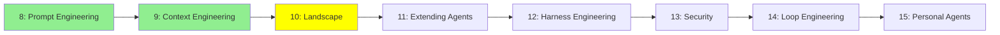

# Module 10: Coding Agents: The Landscape

*Category: Intermediate — Module 10 (3 of 8 in this category)*

*(Placeholder module — a short overview for now; full lesson content is coming soon.)*

The tools themselves: which coding agents exist, what actually separates them, and how to pick one you won't regret.

**Topics this module will cover**:
- Open source: opencode, Hermes Agent, deepseek-harness, pi.dev
- Commercial: Claude Code, Codex, antigravity-cli, Kiro, Cursor
- How to compare them: harness vs model, permissions, extension surface, cost, openness
- What the benchmarks measure — and what they don't
- Does any of this actually make developers faster?

## Tutorial Progress

**Previous Module:** [Module 9: Context Engineering](9_context_engineering.md)
**Next Module:** [Module 11: Coding Agents: Extending Them](11_coding_agents.md)
