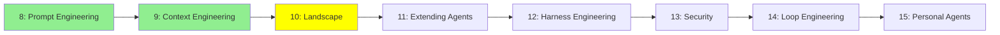

# Module 10: Coding Agent'lar: Ekosistem

*Kategori: Intermediate — Modül 10 (bu kategoride 3/8)*

*(Bu bir placeholder modül — şimdilik kısa bir özet; tam ders içeriği yakında geliyor.)*

Araçların kendisi: hangi coding agent'lar var, aralarındaki gerçek fark ne, ve pişman olmayacağın biri nasıl seçilir.

**Bu modülde işlenecek konular**:
- Açık kaynak: opencode, Hermes Agent, deepseek-harness, pi.dev
- Ticari: Claude Code, Codex, antigravity-cli, Kiro, Cursor
- Nasıl karşılaştırılır: harness vs model, izinler, genişletme yüzeyi, maliyet, açıklık
- Benchmark'lar neyi ölçer — ve neyi ölçmez
- Bunlar geliştiriciyi gerçekten hızlandırıyor mu?

## Eğitim İlerlemesi

**Önceki Modül:** [Modül 9: Context Engineering](9_context_engineering_tr.md)
**Sonraki Modül:** [Modül 11: Coding Agent'lar: Genişletme](11_coding_agents_tr.md)
