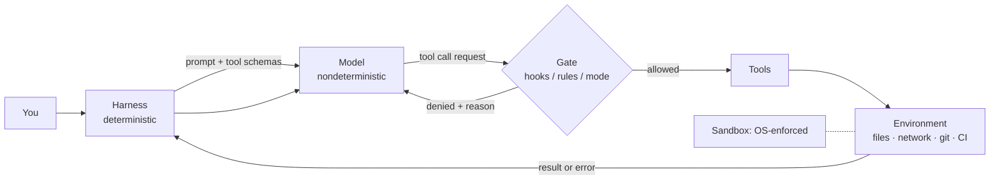
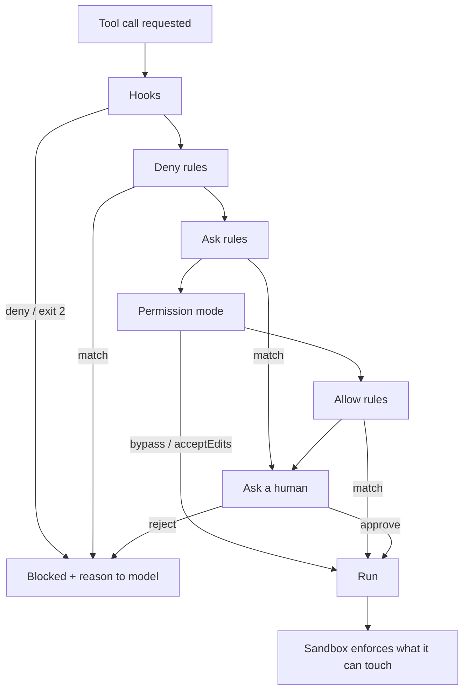

# Module 12: Harness Engineering

*Category: Intermediate — Module 12 (5 of 8 in this category)*

You have an agent that works brilliantly four times out of five, and you cannot ship it. The usual instinct is to go rewrite the prompt. This module argues the opposite: the reliability you are missing lives in the deterministic program *around* the model — the permission gate, the hook, the sandbox, the test suite it must pass — and that program is something you can engineer the way you engineer anything else.

## I. What a Harness Is

A **harness** is the deterministic code that wraps a nondeterministic model. Microsoft ships this as a product definition, which is handy because it means you can cite it in a design review: an agent harness is *"the runtime scaffolding that turns a language model into an agent that can perform work. It drives model and tool calls, manages conversation state and context, applies approval policies, and can keep the agent progressing through a multi-step task"* ([Agent harness, 2026-07-29](https://learn.microsoft.com/en-us/agent-framework/concepts/harness)).

### A. Drawing the boundary

Four things get confused constantly. Keep them apart:

| Layer | What it is | Determinism |
|---|---|---|
| **Model** | The neural network. Text in, text plus tool-call *requests* out. | None. |
| **Harness** | Your loop: builds the prompt, exposes tool schemas, gates each call, runs it, feeds the result back, decides when to stop. | Total — you wrote it. |
| **Tools** | The functions the model may ask for. Anthropic calls them *"contracts between deterministic systems and non-deterministic agents"* ([Writing effective tools for agents, 2025-09-11](https://www.anthropic.com/engineering/writing-tools-for-agents)). | Yours. |
| **Environment** | Filesystem, network, git, CI — what the tools actually touch. Bounded by the **sandbox**. | Enforced by the OS, not by anybody's good intentions. |

Note where the model sits: it never touches the environment. It *asks*. Everything between the ask and the effect is yours.



### B. Why harness beats prompt

When Anthropic worked on SWE-bench, the honest summary was: *"we actually spent more time optimizing our tools than the overall prompt"* ([Building effective agents, 2024-12-19](https://www.anthropic.com/engineering/building-effective-agents)). The research community made the same argument under a different name — SWE-agent's thesis is that a custom **agent-computer interface (ACI)** *"significantly enhances an agent's ability to create and edit code files, navigate entire repositories, and execute tests"* ([arXiv:2405.15793, 2024-05-06](https://arxiv.org/abs/2405.15793)).

Concretely, harness work means things like paginating and truncating tool responses (Claude Code caps them at 25,000 tokens by default), or removing a tool outright — a bare deny rule *"removes the tool from Claude's context entirely, so Claude never sees it"* ([Permissions](https://code.claude.com/docs/en/permissions)). A caveat, because the claim is often oversold: there is no clean published "same model, harness A vs harness B, N points of SWE-bench" ablation to point at. Treat it as a strong qualitative claim from people who build these things, not a measured constant.

## II. Guardrails as Engineering

A **guardrail** is a check at a named seam in the loop that returns a *verdict* — allow, deny, transform, escalate. If it only writes a log line, it is telemetry, not a guardrail. Microsoft puts it sharply: Agent Hooks *"is a control plane, not a telemetry plane. Every interceptor returns a verdict."* ([Agent Hooks, 2026-08-07](https://learn.microsoft.com/en-us/agent-framework/agents/agent-hooks)).

Three vendors converged on roughly the same seam list: input, pre-model, pre-tool, post-tool, output. The OpenAI Agents SDK exposes exactly four decorators — `@input_guardrail`, `@output_guardrail`, `@tool_input_guardrail`, `@tool_output_guardrail` — with the scoping rule that *"Input guardrails run only for the first agent in the chain"* and output guardrails only for the agent producing the final output ([Guardrails, openai-agents-python](https://openai.github.io/openai-agents-python/guardrails/)). Microsoft's Agent Hooks names eight: `agent_startup`, `input`, `pre_model_call`, `post_model_call`, `pre_tool_call`, `post_tool_call`, `output`, `agent_shutdown`. The seam you pick decides what you can *see* — an input rail cannot know which file the model will edit; a pre-tool rail can, and that is where most coding-agent policy belongs.

### A. Deterministic vs model-based

| | Deterministic | Model-based |
|---|---|---|
| Examples | compiler, type checker, linter, test suite, AST parse, JSON-schema validation | classifiers (Prompt Guard, Llama Guard), LLM judges, Claude Code's auto-mode classifier |
| Verdict stability | same input → same verdict | probabilistic; no guarantee |
| Cost | milliseconds, free | an extra model call per check |
| Good for | correctness, syntax, contracts, structural policy | intent, tone, "does this look risky" |

**You already own the best guardrails you will ever have.** For a coding agent, the compiler, the type checker, the linter and the test suite are cheap, deterministic, already in the repo, and — crucially — they close the loop without you in it: *"Give Claude something that produces a pass or fail, and the loop closes on its own. Claude does the work, runs the check, reads the result, and iterates until the check passes."* ([Best practices](https://code.claude.com/docs/en/best-practices)). Before you buy a guardrail product, make `npm test` runnable by the agent.

Model-based rails have a real cost too. Prompt Guard 2 has a **512-token context window** — *"For longer inputs, split prompts into segments and scan them in parallel to ensure violations are detected"* ([Llama Prompt Guard 2 model card, Meta](https://huggingface.co/meta-llama/Llama-Prompt-Guard-2-86M)). And Microsoft's output enforcement buffers streaming — *"No response update reaches the caller until the complete model response and final output pass their interception points"* — an explicit trade of token-by-token latency for fail-closed enforcement ([Agent Hooks](https://learn.microsoft.com/en-us/agent-framework/agents/agent-hooks)).

### B. Fail-open vs fail-closed

This is the sharpest decision in the topic, and real products differ. Gemini CLI hooks: if `stdout` contains non-JSON text, *"parsing will fail. The CLI will default to 'Allow'"* ([Gemini CLI hooks](https://github.com/google-gemini/gemini-cli/blob/main/docs/hooks/index.md)). Microsoft: *"Fail closed: A deny blocks the guarded action. Invalid contexts, invalid verdicts, interceptor failures, and enforcement failures don't silently bypass controls."* ([Agent Hooks](https://learn.microsoft.com/en-us/agent-framework/agents/agent-hooks)).

Same architectural slot, opposite defaults. Find out which one you are running before your hook script gets a typo.

## III. Hooks: the Deterministic Control Plane

A **hook** is a callback slot at a named lifecycle event whose return value the harness obeys. Hooks are the mechanism; guardrails are the policy you put in them. The line worth memorising: **the model can ignore an instruction; it cannot ignore a hook.** In Anthropic's words, CLAUDE.md rules *"are advisory"* while *"hooks are deterministic and guarantee the action happens"* ([Best practices](https://code.claude.com/docs/en/best-practices)).

### A. The contract

Claude Code's blockable events include `UserPromptSubmit`, `PreToolUse`, `PostToolBatch`, `Stop`, `SubagentStop`, `PreCompact` and `ConfigChange`; non-blocking ones include `SessionStart`, `PostToolUse`, `PermissionDenied` and `Notification` ([Hooks](https://code.claude.com/docs/en/hooks)).

| Exit code | Meaning |
|---|---|
| `0` | Success. stdout parsed as JSON, or plain text added as context. |
| `2` | **Blocking.** stderr is the reason. Cannot be overridden by a JSON `"allow"`. |
| `1` or `>2` | Non-blocking error. **The action proceeds.** |
| timeout | No decision. The action proceeds. |

Read that table twice. Exit `1` is un-Unix-like here: a crashed hook is not a deny. Design for the crash.

### B. A minimal working example

The worked example for this module: your repo has a `migrations/` directory that humans own, and you want that to be true regardless of what the model decides today.

```json
{
  "hooks": {
    "PreToolUse": [{
      "matcher": "Edit|Write",
      "hooks": [{
        "type": "command",
        "command": "${CLAUDE_PROJECT_DIR}/.claude/hooks/protect-migrations.sh",
        "timeout": 30
      }]
    }]
  }
}
```

```bash
#!/usr/bin/env bash
# stdin: {"tool_name":"Edit","tool_input":{"file_path":"..."}, ...}
path=$(jq -r '.tool_input.file_path // ""')
case "$path" in
  */migrations/*)
    jq -n '{hookSpecificOutput:{hookEventName:"PreToolUse",
            permissionDecision:"deny",
            permissionDecisionReason:"migrations/ is human-only; open a PR instead."}}'
    exit 0 ;;
esac
exit 0
```

Two exits worth knowing. **Exit 0 with a JSON `deny`** gives the model a *reason*, so it stops retrying and routes around the wall. **Exit 2 with stderr** is the unconditional hard block. Matchers containing only letters, digits, `_`, `-`, spaces, `,` or `|` are exact names or lists (`Bash`, `Edit|Write`); anything else is an unanchored JavaScript regex, and MCP tools need the `.*` (`mcp__memory__.*`).

Add belt and braces, because a hook is one layer and the rules are another — hook decisions *"don't bypass permission rules... a matching deny rule blocks the call, and a matching ask rule still prompts even when the hook returned `"allow"`"* ([Permissions](https://code.claude.com/docs/en/permissions)):

```json
{
  "permissions": {
    "defaultMode": "default",
    "allow": ["Bash(npm run *)", "Bash(git commit *)"],
    "ask":   ["Bash(git push *)"],
    "deny":  ["Edit(/migrations/**)", "Read(./.env)", "Read(~/.ssh/**)"]
  }
}
```

Order is **deny → ask → allow**, first match wins, and *"rule specificity doesn't change the order"*. `Bash(ls *)` with a space enforces a word boundary — it matches `ls -la` but not `lsof`.

### C. The same gate, programmatically

In the Agent SDK (`@anthropic-ai/claude-agent-sdk`) the identical policy is a `HookCallback` you pass as `options.hooks.PreToolUse`, returning the same `hookSpecificOutput` object; `permissionDecision` accepts `"allow" | "deny" | "ask" | "defer"` ([Agent SDK hooks](https://code.claude.com/docs/en/agent-sdk/hooks)). One documented footgun: *"Auto-approved tools never reach `canUseTool`"* — so a check that must **always** run belongs in a `PreToolUse` hook, not in the `canUseTool` callback ([Agent SDK permissions](https://code.claude.com/docs/en/agent-sdk/permissions)).

Other harnesses fill the same slot differently: LangGraph pauses with `interrupt()` and resumes with `Command(resume=...)` over a checkpointer — with the gotcha that *"The node restarts from the beginning"* on resume, which is exactly why your tool calls need to be idempotent ([Interrupts](https://docs.langchain.com/oss/python/langgraph/interrupts)).

## IV. Sandboxes

### A. The failure model

Be specific about what you are defending against, or you will build the wrong wall.

1. **Destructive commands.** `rm -rf` in the wrong directory.
2. **Secret exfiltration.** *"Without network isolation, a compromised agent could exfiltrate sensitive files like SSH keys"* — and note that the default read policy *"still allows reading credential files such as `~/.aws/credentials` and `~/.ssh/`"* unless you configure it ([Sandboxing](https://code.claude.com/docs/en/sandboxing)).
3. **Injected tool calls.** *"if a repository's README contains unusual instructions, Claude Code might incorporate those into its actions in ways the operator didn't anticipate"* ([Secure deployment](https://code.claude.com/docs/en/agent-sdk/secure-deployment)). The adversary's view of this — who attacks it, how, and how you prove your defence works — is [Module 13: Security](13_security.md).
4. **Self-escalation.** The non-obvious one. A sandbox that lets a command write `.claude/settings.json`, `.claude/hooks`, `.mcp.json`, `.git/hooks` or your shell rc has granted that command *next session's* permissions too: *"A command that could edit those files could grant itself permissions, or add a hook or MCP server that Claude Code runs outside the sandbox."* ([Sandboxing](https://code.claude.com/docs/en/sandboxing)).
5. **Runaway cost.** Not a sandbox problem — a budget problem. See §VI.

Permissions and sandboxes are different layers and you need both: permission rules are *"evaluated before a command runs"* from the command string, while *"the operating system enforces the sandbox boundary on the running process, so it holds regardless of what the model chose to run and even if an allowed command does more than its name suggests"* ([Sandboxing](https://code.claude.com/docs/en/sandboxing)). Rules shape intent; the sandbox holds the line.

### B. The isolation ladder

| Mechanism | Isolation strength | Setup cost | Perf overhead | Good for |
|---|---|---|---|---|
| Allow/deny rules (same process) | None at OS level — *"a permission gate, not a sandbox"* ([Secure deployment](https://code.claude.com/docs/en/agent-sdk/secure-deployment)) | Minutes | ~0 | Shaping intent, hiding tools. Not subprocesses: rules *"don't apply to arbitrary subprocesses... like a Python or Node script"* |
| **git worktree** | Zero security isolation — blast radius only | Seconds | ~0 | Parallel agents, easy discard |
| Landlock (Linux LSM) | Real but partial; since Linux 5.13; cannot restrict `chdir`, `stat`, `chmod`, mounts, or pre-existing fds ([kernel docs](https://docs.kernel.org/userspace-api/landlock.html)) | Medium | Very low | Self-restricting a process without root |
| bubblewrap / Seatbelt | *"Good (secure defaults)"*; shared kernel, so *"a kernel vulnerability could theoretically enable escape"* | Low | *"minimal"* | Dev laptops — this is what the major CLIs actually use |
| Docker / OCI container | *"Setup dependent"*; Docker warns default capabilities *"may provide incomplete isolation"* ([Docker security](https://docs.docker.com/engine/security/)) | Medium | Low | Team standard, CI |
| gVisor (`runsc`) | *"Excellent (with correct setup)"* | Medium | CPU-bound ~0%, syscalls ~2×, **file I/O up to 10–200× slower** | Untrusted code — but that 10–200× is your `npm install` |
| Firecracker microVM | Excellent; boots in *"as little as 125 ms"* with *"less than 5 MiB"* overhead ([Firecracker](https://firecracker-microvm.github.io/)) | Medium/high | High | Per-task strong separation |
| Full VM / managed cloud sandbox | Strongest practical — but *"VMs aren't automatically 'more secure' than alternatives like gVisor"* | High | High | Untrusted repos, compliance, fan-out |

The two numbers to memorise are in there: gVisor's file-I/O penalty is why "just use gVisor" fails a build-heavy repo, and Firecracker's 125 ms is why microVMs are viable *per task*. (Building your own sandbox, and running fleets of them, is Module 22.) **Start with the worktree**, though — it buys nothing against an adversary and almost everything against an accident:

```bash
git worktree add -b agent/oauth ../wt-oauth main
# point the agent at ../wt-oauth ; review the diff, then:
git worktree remove ../wt-oauth
```

Claude Code's sandbox special-cases them: in a linked worktree it *"also allows writes to the main repository's shared `.git` directory so commands such as `git commit` can update refs and the index. Writes to `hooks/` and `config` inside that directory remain denied."* ([Sandboxing](https://code.claude.com/docs/en/sandboxing)).

### C. The central trade-off

Here is the choice, stated plainly: **sandbox plus fewer approvals**, or **no sandbox and approve everything**. There is a number on one side — Anthropic reports that *"in our internal usage, we've found that sandboxing safely reduces permission prompts by 84%"* ([Claude Code sandboxing, 2025-10-20](https://www.anthropic.com/engineering/claude-code-sandboxing)) — and a failure mode on the other: *"approval fatigue, where users might not pay close attention to what they're approving."* OpenAI says the same in its own docs: *"The sandbox reduces approval fatigue"* ([Sandbox](https://learn.chatgpt.com/docs/sandboxing)).

The combination that is never acceptable is *no approvals and no sandbox*. Both vendors enforce this: Gemini CLI wires it in — *"Sandbox is enabled when using `--yolo` or `--approval-mode=yolo` by default"* ([configuration reference](https://github.com/google-gemini/gemini-cli/blob/main/docs/reference/configuration.md)) — and Anthropic requires it in docs: *"Always run `--dangerously-skip-permissions` sessions inside a container, a VM, or the sandbox runtime"* ([Sandbox environments](https://code.claude.com/docs/en/sandbox-environments)).

And be honest about what the boundary does *not* buy you. An egress allowlist is not exfiltration-proof. *"Allowing broad domains such as `github.com` can create paths for data exfiltration. Because the proxy makes its allow decision from the client-supplied hostname without inspecting TLS, code running inside the sandbox can potentially use domain fronting or similar techniques to reach hosts outside the allowlist."* ([Sandboxing](https://code.claude.com/docs/en/sandboxing)). A devcontainer is the same story one level up: it *"does not prevent a malicious project from exfiltrating anything accessible inside the container, including the Claude Code credentials stored in `~/.claude`"* ([Devcontainer](https://code.claude.com/docs/en/devcontainer)).

## V. The Autonomy Ladder

This is the artifact you will come back to. Before turning on anything above rung 1, four things must be true: the work is in **git** on a branch or worktree with a clean tree; a **check the agent can run** exists and passes on `main`; **secrets are unreachable** (`.env`, `~/.aws`, `~/.ssh`, `.npmrc` denied or absent); and someone can **see what happened** afterwards.

| Rung | What the agent may do | Claude Code | Codex CLI | Isolation required |
|---|---|---|---|---|
| **1 — Read-only** | Read, grep, plan; no writes | `claude --permission-mode plan`, or `--permission-mode dontAsk --allowedTools "Read" "Glob" "Grep"` | `--sandbox read-only --ask-for-approval on-request` | None |
| **2 — Edit with approval** | Propose edits and commands; you approve each | `claude --permission-mode default` | `--sandbox workspace-write --ask-for-approval untrusted` | None |
| **3 — Sandboxed auto-edit** | Edit and run project commands freely *inside a boundary*; asks only to leave it | `"sandbox": {"enabled": true}` with `filesystem.allowWrite` and `network.allowedDomains` | `--sandbox workspace-write --ask-for-approval on-request` | OS sandbox (Seatbelt / bubblewrap) |
| **4 — Classifier-reviewed** | Everything, with a model reviewing each action | `claude --permission-mode auto -p "fix all lint errors"` | `--ask-for-approval on-request -c approvals_reviewer=auto_review` | Recommended anyway — the classifier is *"a per-action control, not an isolation boundary"* |
| **5 — CI-gated auto-PR** | Unattended batch work; output gated by CI | `claude -p "Migrate $file..." --allowedTools "Edit,Bash(git commit *)"` in a loop | `codex exec --sandbox workspace-write` | CI runner + branch-scoped push |
| **6 — No approvals** | Everything, no gate | `claude -p "..." --dangerously-skip-permissions` | `--dangerously-bypass-approvals-and-sandbox` | **Mandatory**: container/VM/sandbox runtime, non-root |

(Every flag above is from [Permission modes](https://code.claude.com/docs/en/permission-modes), [Sandbox environments](https://code.claude.com/docs/en/sandbox-environments) and [Agent approvals & security](https://learn.chatgpt.com/docs/agent-approvals-security).) **The teaching point:** rungs 3 and 6 differ hardly at all in what the agent may *attempt*. They differ in **who is holding the boundary** — at rung 3 the OS is; at rung 6 the hypervisor is, or nothing is.

Rung 3 is the sweet spot for most day-jobs, and this is the whole of it:

```json
{
  "sandbox": {
    "enabled": true,
    "filesystem": { "denyRead": ["~/"], "allowRead": ["."], "allowWrite": ["/tmp/build"] },
    "network": { "allowedDomains": ["github.com", "*.npmjs.org"], "strictAllowlist": true }
  }
}
```

Sandbox paths use standard conventions (`/tmp/build` is absolute) — *"This syntax differs from Read and Edit permission rules, which use `//path` for absolute"* — and `.` resolves to the project root **only in project settings** ([Sandboxing](https://code.claude.com/docs/en/sandboxing)). To pin a rung for a whole team, ship `{"sandbox": {"enabled": true, "failIfUnavailable": true, "allowUnsandboxedCommands": false}}` via managed settings and ban rung 6 with `permissions.disableBypassPermissionsMode`.

## VI. Making Failure Cheap

### A. Error messages are prompts

This is the most underrated lever in the module. When a tool fails, the string you hand back is the next thing the model reads — so it is a prompt, and it determines whether the agent recovers or thrashes. Anthropic's guidance is that tool errors should *"clearly communicate specific and actionable improvements"* ([Writing effective tools for agents, 2025-09-11](https://www.anthropic.com/engineering/writing-tools-for-agents)). Their sandbox does it concretely: *"Claude Code appends the violation details to the failed command's output, so Claude sees which file path or network host the sandbox blocked"* ([Sandboxing](https://code.claude.com/docs/en/sandboxing)). Same for a denial — `permissionDecisionReason` *"tells the model why, so it avoids retrying"*.

Compare `Error: EACCES` with `Blocked: write to /migrations/ is denied — this directory is human-owned; propose a patch instead`. The first produces four retries; the second produces a plan.

### B. Verification the agent cannot skip, budgets it cannot exceed

Let the environment tell the truth. A `Stop` hook *"runs your check as a script and blocks the turn from ending until it passes"* — and note the harness protecting itself from your hook: *"Claude Code overrides the hook and ends the turn after 8 consecutive blocks"* ([Best practices](https://code.claude.com/docs/en/best-practices)). Ask for evidence, not assertions: *"Have Claude show evidence rather than asserting success: the test output, the command it ran and what it returned, or a screenshot."*

Bound the loop with steps (`max_turns`, `recursion_limit`), tokens (`MaxOutputTokens`), wall-clock (hook `timeout`), and money. Keep the off switch reachable: `disableAllHooks`, `permissions.disableBypassPermissionsMode`, Gemini's `security.disableYoloMode`. And make undo cheap — worktrees, checkpoints, ephemeral `tmpfs` workspaces. When failure costs nothing, you can afford ambition: *"Instead of carefully planning every move, you can tell Claude to try something risky. If it doesn't work, rewind and try a different approach."* ([Best practices](https://code.claude.com/docs/en/best-practices)). One honest limit: checkpoints *"only track changes made through Claude's file editing tools. Changes made through Bash commands or external processes are not captured."* Git remains your real undo.

## VII. Anti-Patterns

- **Guardrail theatre.** A filter that catches 95% reads as good; in a security context, 95% is a failing grade, and Simon Willison is *"deeply suspicious"* of vendor guardrail products ([The lethal trifecta, 2025-06-16](https://simonwillison.net/2025/Jun/16/the-lethal-trifecta/)).
- **Fail-open defaults.** A hook that crashes, times out, or prints non-JSON must not become an allow. Assume your script will break and back it with a deny *rule*.
- **Prompt-based "please don't" as a control.** Instruction files are advisory. If it must happen every time, it is a hook. (An over-long instruction file makes it worse: *"If your CLAUDE.md is too long, Claude ignores half of it."*)
- **Hooks that fight the model.** A `Stop` hook that never lets the turn end is a livelock. A `PostToolUse` formatter that silently rewrites the file the model just wrote makes its next read disagree with its own edit — prefer `additionalContext` or `updatedInput` over silent mutation.
- **A sandbox that breaks the toolchain.** Breakages are documented and real: *"`docker` is incompatible with the sandbox"*; `git merge` failing with "unable to unlink old" against a protected path. A sandbox developers switch off is worth zero — as is a rule that lets one run widen the next, via write access to `$PATH` dirs, shell rc files or `.claude/settings.json`.

## Mermaid Diagram: How a Tool Call Is Gated

This is Anthropic's documented six-step evaluation order ([Agent SDK permissions](https://code.claude.com/docs/en/agent-sdk/permissions)) — worth internalising, because every "why did it do that?" traces through it.



## Tutorial Progress

```mermaid
graph LR
    A[8: Prompt Engineering] --> B[9: Context Engineering]
    B --> C[10: Landscape]
    C --> D[11: Extending Agents]
    D --> E[12: Harness Engineering]
    E --> F[13: Security]
    F --> G[14: Loop Engineering]
    G --> H[15: Personal Agents]
    style A fill:#90EE90
    style B fill:#90EE90
    style C fill:#90EE90
    style D fill:#90EE90
    style E fill:#FFFF00
```



## Summary

The harness is the deterministic program around a nondeterministic model, and it is where most of your reliability wins live. Guardrails are verdicts at named seams — prefer the deterministic ones you already own, and know whether yours fail open or fail closed. Hooks make a policy unignorable in a way an instruction never can. Sandboxes buy you autonomy by holding a boundary the model cannot argue with, which is why "sandbox plus fewer approvals" beats "approve everything" on both safety and attention. If you remember one thing: **climb the autonomy ladder deliberately, and never let the rung outrun the boundary that holds it.**

**Quick Check**: Your `PreToolUse` hook script has a typo and exits with code 1. Does the tool call run — and what two changes would make sure a broken guardrail can never become an allow?

## References & Further Reading

- [Claude Code hooks](https://code.claude.com/docs/en/hooks) — Anthropic, accessed 2026-08-25. Every hook event, the exit-code semantics, and the JSON decision schema.
- [Configure permissions](https://code.claude.com/docs/en/permissions) — Anthropic, accessed 2026-08-25. `Tool(specifier)` syntax, deny→ask→allow precedence, and the "rules don't apply to subprocesses" warning.
- [Choose a permission mode](https://code.claude.com/docs/en/permission-modes) — Anthropic, accessed 2026-08-25. The six modes plus a "common setups" table — the autonomy ladder in vendor form.
- [Agent SDK — Configure permissions](https://code.claude.com/docs/en/agent-sdk/permissions) — Anthropic, accessed 2026-08-25. The six-step evaluation order and the "auto-approved tools never reach `canUseTool`" footgun.
- [Configure the sandboxed Bash tool](https://code.claude.com/docs/en/sandboxing) — Anthropic, accessed 2026-08-25. Every config key, plus an unusually honest section on what the sandbox cannot do.
- [Choose a sandbox environment](https://code.claude.com/docs/en/sandbox-environments) — Anthropic, accessed 2026-08-25. Pick your isolation level by threat model: Bash sandbox, whole-process runtime, devcontainer, container, VM.
- [Securely deploying AI agents](https://code.claude.com/docs/en/agent-sdk/secure-deployment) — Anthropic, accessed 2026-08-25. Isolation-strength comparison, real gVisor overhead numbers, and a hardened `docker run`.
- [Claude Code sandboxing: security through isolation](https://www.anthropic.com/engineering/claude-code-sandboxing) — Anthropic Engineering, 2025-10-20. The 84% figure and the approval-fatigue argument.
- [Agent approvals & security](https://learn.chatgpt.com/docs/agent-approvals-security) — OpenAI, accessed 2026-08-25. How a second major CLI draws the same two lines, plus a good egress-allowlist design.
- [Best practices for Claude Code](https://code.claude.com/docs/en/best-practices) — Anthropic, accessed 2026-08-25. Read it for one idea: give the agent a check it can run, and the loop closes without you.
- [Writing effective tools for agents](https://www.anthropic.com/engineering/writing-tools-for-agents) — Anthropic Engineering, 2025-09-11. Tool design *is* harness design: token budgets, namespacing, errors written as prompts.
- [Agent harness](https://learn.microsoft.com/en-us/agent-framework/concepts/harness) — Microsoft Learn, 2026-07-29. A vendor-neutral definition of "agent harness" and a five-layer breakdown of what it owns.
- [Agent Hooks](https://learn.microsoft.com/en-us/agent-framework/agents/agent-hooks) — Microsoft Learn, 2026-08-07. The clearest published statement of fail-closed guardrail semantics: "a control plane, not a telemetry plane."
- [SWE-agent: Agent-Computer Interfaces Enable Automated Software Engineering](https://arxiv.org/abs/2405.15793) — arXiv:2405.15793, 2024-05-06. The academic case that interface design, not prompting, moves agent performance.

**Previous Module:** [Module 11: Coding Agents: Extending Them](11_coding_agents.md)
**Next Module:** [Module 13: Security](13_security.md)
