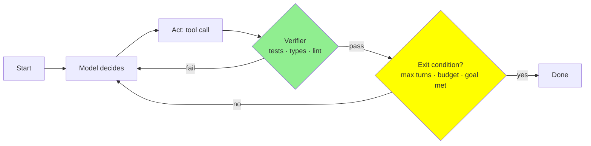
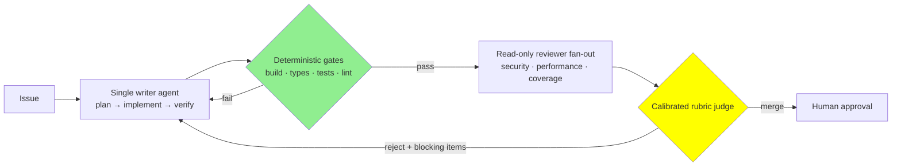

# Module 14: Loop Engineering

*Category: Intermediate — Module 14 (7 of 8 in this category)*

[Module 6](../1_fundamentals/6_agents.md) gave you one agent's loop. [Module 12](12_harness_engineering.md) gave you the deterministic harness around it. Now the uncomfortable questions: when do you run five loops instead of one, who decides how many, and how do you know any of it worked? That last question is the one most teams skip, and it's the one that decides whether you ship.

## I. The Loop Is the Unit of Engineering

Stop thinking of "an agent" as the thing you build. The thing you build is a **loop**: a run that repeats until something stops it. OpenAI states the shape plainly — *"Every orchestration approach needs the concept of a 'run', typically implemented as a loop that lets agents operate until an exit condition is reached"* ([A practical guide to building agents](https://cdn.openai.com/business-guides-and-resources/a-practical-guide-to-building-agents.pdf)).

Every loop you will ever design is four choices. Nail these and the rest of this module is detail.

| Knob | The question | Where it lives in code |
|---|---|---|
| **What ends it** | Termination criteria | `max_turns` → `MaxTurnsExceeded` ([OpenAI Agents SDK](https://openai.github.io/openai-agents-python/running_agents/)); `recursion_limit` → `GraphRecursionError` ([LangGraph](https://docs.langchain.com/oss/python/langgraph/graph-api)); `max_iterations` ([ADK LoopAgent](https://adk.dev/agents/workflow-agents/loop-agents/)); `maxTurns` on a Claude Code subagent |
| **What it can do per step** | Tool surface and permissions | [Module 12](12_harness_engineering.md)'s territory. The loop-level consequence: parallel tool calls cut wall-clock hard — Anthropic reports *"up to 90%"* off research time ([Anthropic, 2025-06-13](https://www.anthropic.com/engineering/multi-agent-research-system)) |
| **What it remembers** | Context carried across iterations | [Module 9](9_context_engineering.md)'s territory. The loop-level lever is subagent isolation: delegate, and only a distilled report comes back |
| **Who checks it** | The verifier | Defined rules and linters, then visual feedback, then an LLM judge — *in that order* ([Claude Agent SDK, 2025-09-29](https://claude.com/blog/building-agents-with-the-claude-agent-sdk)) |



Loops fail in three named ways. **No exit condition:** The framework default is not a safety net, it's an invoice: LangGraph's `recursion_limit` defaults to **1000** supersteps as of version 1.0.6 ([Graph API](https://docs.langchain.com/oss/python/langgraph/graph-api)). Set your own.
**No verifier:** with no ground truth the agent cannot tell progress from motion. Anthropic's requirement is that agents *"gain ground truth from the environment at each step (such as tool call results or code execution)"* ([Building effective agents, 2024-12-19](https://www.anthropic.com/engineering/building-effective-agents)).
**A judge where a verifier belongs:** Section VII is entirely about this one.

Budget four things explicitly, not just steps: **step budget, token budget, wall-clock budget, dollar budget** — for calibration, Claude Code's cost docs report *"around \$13 per developer per active day and \$150-250 per developer per month"* ([Manage costs](https://code.claude.com/docs/en/costs)). And watch for *thrashing* rather than convergence: repeated identical tool calls, and a verifier score that oscillates instead of improving.

## II. Workflow or Agent?

Anthropic's distinction is a definition, not a vibe, and it is the cleanest design question you can ask yourself before writing anything ([Building effective agents, 2024-12-19](https://www.anthropic.com/engineering/building-effective-agents)):

- A **workflow** is a system where LLMs and tools are *"orchestrated through predefined code paths."* You wrote the control flow.
- An **agent** is a system where LLMs *"dynamically direct their own processes and tool usage, maintaining control over how they accomplish tasks."* The model wrote the control flow.

Neither is superior — the question is who should hold the steering wheel for this decision. And there's a third answer people forget: when the rule is expressible, *"a deterministic solution may suffice"* ([A practical guide](https://cdn.openai.com/business-guides-and-resources/a-practical-guide-to-building-agents.pdf)). Plain code is free and correct.

The default starting point is also OpenAI's: *"Our general recommendation is to maximize a single agent's capabilities first. More agents can provide intuitive separation of concepts, but can introduce additional complexity and overhead, so often a single agent with tools is sufficient."* Split only on branchy logic or tool overload — and note their nuance: *"The issue isn't solely the number of tools, but their similarity or overlap. Some implementations successfully manage more than 15 well-defined, distinct tools while others struggle with fewer than 10 overlapping tools."*

## III. The Composition Pattern Catalog

Below the single-agent default sit Anthropic's five composition patterns, plus the one you'll actually reach for most on code. The "when to use" column is theirs, verbatim; the failure column is what you'll hit in practice.

| Pattern | Shape | When to use | When it backfires | Cost |
|---|---|---|---|---|
| **Prompt chaining** | fixed A→B→C | *"task can be easily decomposed into fixed subtasks, trading latency for higher accuracy"* | Subtasks aren't really fixed; error compounds per hop | Latency = sum of steps |
| **Routing** | classify → specialist | *"complex tasks with distinct categories… where classification can be handled accurately"* | Misclassification is silent and unrecoverable | Cheap |
| **Parallelization — sectioning** | split → N workers → join | *"divided subtasks can be parallelized for speed"* | Sections share hidden state; the join becomes the bottleneck | N× tokens, wall-clock of the slowest branch |
| **Parallelization — voting** | same task ×N → aggregate | *"multiple perspectives increase confidence"* | You pay N× for confidence you can't cash in | N× tokens, latency of one call |
| **Orchestrator–workers** | lead plans → workers → synthesize | *"subtasks cannot be predicted in advance and must be determined dynamically"* | Dense dependencies; shared writes | Highest — ~15× a chat |
| **Evaluator–optimizer** | generate ⇄ critique | *"clear evaluation criteria exist and iterative refinement provides measurable value"* | No external signal → degradation | 2× per iteration; unbounded without a cap |
| **Generate-and-test** | write → run tests → fix | **Any code task.** The verifier already exists | Flaky tests teach the agent nothing | Best quality-per-dollar in this table |

Read the evaluator–optimizer "when to use" line twice. *Clear evaluation criteria exist* is a precondition, not decoration.

## IV. Dynamic Workflows: Letting the Model Pick the Shape

A static graph fixes its node set when you write it. A **dynamic workflow** lets the model decide the shape at runtime — how many branches, over what. LangGraph's `Send` is the mechanism worth knowing by name, because it makes fan-out width a *model output*:

```python
# LangGraph (docs.langchain.com OSS Python docs, 2026-08-25)
from langgraph.types import Send

def assign_workers(state: State):
    """Assign a worker to each section in the plan"""
    return [Send("llm_call", {"section": s}) for s in state["sections"]]
```

Source: [Workflows and agents](https://docs.langchain.com/oss/python/langgraph/workflows-agents). Three things to notice. The width is `len(state["sections"])`, which the *model* produced — **cap it in code**, or you've handed the model a signing authority. The join is a reducer, `Annotated[list, operator.add]`. And all those workers run inside one **superstep** — *"Nodes that run in parallel are part of the same super-step"* ([Graph API](https://docs.langchain.com/oss/python/langgraph/graph-api)) — whose end is a **barrier**.

That barrier is the lesson. A stage finishes at the speed of its slowest branch. Anthropic hit this in production and wrote it down as a limitation rather than a feature: lead agents *"execute subagents synchronously, waiting for each set of subagents to complete before proceeding,"* which *"creates bottlenecks in the information flow between agents"* ([2025-06-13](https://www.anthropic.com/engineering/multi-agent-research-system)). So treat a barrier as a purchase: you buy reproducible stage boundaries and easy debugging, and you pay in wall-clock. Buy it when you need deterministic stage semantics; skip it when a worker's result can be consumed the moment it lands. (The wider taxonomy of planner-generated graphs and code-as-orchestration is [Module 17: Advanced Architectures](../3_expert/17_advanced_architectures.md).)

And bound it, always: `graph.invoke(inputs, config={"recursion_limit": 5})` — the default is 1000, and exceeding it raises `GraphRecursionError`.

## V. Agent Teams

"Team" hides the variable that actually matters: *how do they communicate?* Four topologies, four answers.

| Topology | Who decides next | Shared state |
|---|---|---|
| **Manager / agents-as-tools** | A central manager, via tool calls | The manager's context only |
| **Orchestrator–workers** | A lead spawns 3–5 subagents in parallel | Distilled worker reports |
| **Handoff / swarm** | Whichever agent currently holds control | Conversation state travels with the handoff — *"a one way transfer that allow[s] an agent to delegate to another agent"* ([Agents SDK](https://openai.github.io/openai-agents-python/handoffs/)) |
| **Shared task list + mailbox** | Teammates claim work themselves | A shared task list plus a per-agent inbox |

Claude Code's **agent teams** is the most concrete implementation you can actually run, so it's worth knowing its architecture: a **team lead**, **teammates**, a **task list** whose claiming *"uses file locking to prevent race conditions,"* and a **mailbox** — one JSON file per agent. Quality gates are hooks, not models: `TeammateIdle`, `TaskCreated`, `TaskCompleted`, where you *"exit with code 2 to send feedback and keep the teammate working."* Sizing advice from the same docs: *"Start with 3-5 teammates for most workflows… Three focused teammates often outperform five scattered ones,"* and *"Avoid file conflicts: Two teammates editing the same file leads to overwrites"* ([Agent teams](https://code.claude.com/docs/en/agent-teams)). One caveat, stated so you don't build on sand: the feature is **experimental, off by default** (`CLAUDE_CODE_EXPERIMENTAL_AGENT_TEAMS=1`) and changes between versions — learn the architecture, not the keystrokes.

The distinction from a subagent is cost, not capability. A subagent has its own context window and *"results [are] summarized back to main context"* — cheap. A teammate is *"a separate Claude instance"* with fully independent context — expensive; teams *"use approximately 7x more tokens than standard sessions when teammates run in plan mode"* ([Manage costs](https://code.claude.com/docs/en/costs)). [Module 9](9_context_engineering.md) taught you subagents as a context-isolation device; here they are a coordination device with a bill attached.

One warning that explains why teams are hard to debug: *"Multi-agent systems have emergent behaviors, which arise without specific programming. For instance, small changes to the lead agent can unpredictably change how subagents behave"* ([Anthropic, 2025-06-13](https://www.anthropic.com/engineering/multi-agent-research-system)). Regress the whole team, never just the prompt. (Cross-agent *protocols* — A2A, agent cards, discovery — are [Module 20](../3_expert/20_advanced_multiagent.md); teammate messages count as untrusted input, which is [Module 13](13_security.md).)

## VI. The Argument You Should Know Both Sides Of

**The case for.** Anthropic's research system — an Opus 4 lead delegating to Sonnet 4 subagents — *"outperformed single-agent Claude Opus 4 by 90.2% on our internal research eval."* Why: *"token usage by itself explains 80% of the variance"* in performance, and parallel agents spend more tokens on the problem without any one context window filling up. The bill is stated just as plainly: *"multi-agent systems use about 15× more tokens than chats,"* so the economics only work *"for tasks where the value of the task is high enough"* ([2025-06-13](https://www.anthropic.com/engineering/multi-agent-research-system)).

**The case against.** Cognition's two principles: *"Share context, and share full agent traces, not just individual messages"* and *"Actions carry implicit decisions, and conflicting decisions carry bad results."* Parallel subagents can't see each other's reasoning, so *"their work ends up being inconsistent with each other."* Their prescription is a single-threaded linear agent, with a dedicated compression model when history overflows ([Don't Build Multi-Agents, 2025-06-12](https://cognition.com/blog/dont-build-multi-agents)).

**They do not actually contradict each other**, and spotting that is the whole point. Anthropic's own post excludes Cognition's domain: coding tasks *"involve fewer truly parallelizable tasks than research, and LLM agents are not yet great at coordinating and delegating to other agents in real time,"* and shared-context, dependency-heavy domains *"are not a good fit."* Cognition's critique lands hardest where dependencies are dense — implementation. Anthropic's win lands where work is read-only, independent and context-hungry — research and review.

**The decision rule.** Go multi-agent only if all four are yes: (1) is the work decomposable into parts that don't need to see each other's reasoning? (2) is it mostly read/analyze rather than write to shared files? (3) does context genuinely exceed one window, or does parallelism buy real wall-clock? (4) is the task worth 7–15× the tokens?

**The corollary — memorize this one: for implementation, use one agent that writes and a fan-out of reviewers that only read.** You get Anthropic's parallelism win on the review side and Cognition's coherence win on the write side. In Claude Code that's literally a sentence:

```text
Spawn three teammates to review PR #142:
- One focused on security implications
- One checking performance impact
- One validating test coverage
Have them each review and report findings.
```

The same shape works against anchoring during debugging: run competing hypotheses in parallel and have them try to disprove each other, because *"sequential investigation suffers from anchoring: once one theory is explored, subsequent investigation is biased toward it"* ([Agent teams](https://code.claude.com/docs/en/agent-teams)).

## VII. Who Checks the Work? (The Verifier Ladder)

Here is the module's central lesson, and it is one of the few things in this field with three independent sources behind it.

> **LLMs cannot reliably grade themselves.** *"LLMs struggle to self-correct their responses without external feedback, and at times, their performance even degrades after self-correction"* ([Huang et al., ICLR 2024, arXiv:2310.01798](https://arxiv.org/abs/2310.01798)).

Reasoning models did not fix it. On RefineBench's self-refinement setting, Gemini 2.5 Pro gained **+1.8%** across iterations and DeepSeek-R1 **−0.1%**, while *guided* refinement — external feedback — reached near-perfect within five turns ([arXiv:2511.22173, 2025-11-27](https://arxiv.org/abs/2511.22173)). The survey conclusion is the actionable form: *"self-correction works well in tasks that can use reliable external feedback"* ([Kamoi et al., TACL 2024, arXiv:2406.01297](https://arxiv.org/abs/2406.01297)).

Anthropic ranks the verifiers in exactly that order: (1) **defined rules and linters** — *"The best form of feedback is providing clearly defined rules for an output, then explaining which rules failed and why"*; (2) **visual feedback** such as screenshots; (3) **LLM as judge**, which they call *"less robust"* with *"latency tradeoffs"* ([Claude Agent SDK, 2025-09-29](https://claude.com/blog/building-agents-with-the-claude-agent-sdk)). Their loop is **gather context → take action → verify work → repeat**.

So, plainly: **if a test suite can judge it, do not hire an LLM to.** Your verifier already exists — compiler, type checker, linter, test suite, CI. It's what the serious benchmarks use: SWE-bench validates patches by running the repo's own unit tests ([arXiv:2310.06770](https://arxiv.org/abs/2310.06770)). And Reflexion's 91% pass@1 on HumanEval against GPT-4's 80% works precisely because it reflects on *test results* rather than on its own opinion ([arXiv:2303.11366](https://arxiv.org/abs/2303.11366)).

The cheapest verifier in this whole module isn't a model at all — it's a shell script wired to a `TeammateIdle`, `TaskCreated` or `TaskCompleted` hook, where exit code 2 sends your feedback back and keeps the agent working ([Agent teams](https://code.claude.com/docs/en/agent-teams)). No latency, no bias, no bill.

## VIII. Rubric Evals — a Worked Cookbook

You cannot tune what you cannot measure, and the alternative to measuring is vibes. Here is the whole pipeline on one real question: **is this agent-authored PR mergeable?**

### A. The golden set

Start with ~20 *real* cases — Anthropic's research team *"started with a set of about 20 queries representing real usage patterns"* ([2025-06-13](https://www.anthropic.com/engineering/multi-agent-research-system)). One JSONL row per historical agent PR — `{"pr": 4412, "diff_path": "fixtures/4412.diff", "issue": "flaky retry on 429", "label": "merge", "critique": "Adds a bounded backoff and a regression test that fails without the fix."}`. `label` is binary and `critique` is mandatory — the critique is the human's reasoning now, and a few-shot example for the judge later. **Every production failure becomes a new row.** Anthropic's three design principles apply directly: be task-specific (*"Design evals that mirror your real-world task distribution"*), automate when possible, and prioritize volume over quality — *"More questions with slightly lower signal automated grading is better than fewer questions with high-quality human hand-graded evals"* ([Define success criteria and build evaluations](https://platform.claude.com/docs/en/test-and-evaluate/develop-tests)). Include their edge-case classes: empty diff, enormous diff, and genuinely ambiguous cases.

### B. Deterministic gates *before* the judge

These are not rubric items. They're free preconditions, and a PR that fails one never costs you a judge call.

| Gate | Check |
|---|---|
| Builds | `npm run build` / `cargo build` |
| Types | `tsc --noEmit` / `mypy` |
| Tests | full suite green |
| New test exists | diff touches `**/*.test.*` or `tests/` |
| Scope & style | files changed ≤ N, no unrelated directories, `eslint`/`ruff` clean |

This is the ladder from Section VII applied literally — and it is also insurance, because on hard objectively-checkable pairs *"many strong models (e.g., GPT-4o) perform[ed] just slightly better than random guessing"* ([JudgeBench, ICLR 2025, arXiv:2410.12784](https://arxiv.org/abs/2410.12784)).

### C. The rubric: a binary checklist for what tests cannot see

Seven items, each independently pass/fail. The PR is `merge` only if **all** pass.

| # | Item | Pass means |
|---|---|---|
| R1 | Addresses the stated issue | Every acceptance criterion is visibly satisfied by the diff |
| R2 | No unrequested scope | No renames, reformats, dep bumps or refactors the issue didn't ask for |
| R3 | Test proves the fix | A new/changed test would fail on the pre-change code |
| R4 | Failure paths handled | Errors surface with actionable messages; no silent `catch {}` |
| R5 | Follows local convention | Matches surrounding patterns and CLAUDE.md / CONTRIBUTING |
| R6 | No new security surface | No new secret handling, shell interpolation, deserialization, permissive CORS |
| R7 | Reviewable | A human can review it in ≤15 minutes |

**On binary vs 1–5 scales — this is an opinionated stance, so here are the reasons and the caveat.** The practitioner argument is actionability: *"A binary decision forces everyone to consider what truly matters,"* and a 1–5 aggregate is something nobody can act on ([Hamel Husain, 2024-10-29](https://hamel.dev/blog/posts/llm-judge/)). Checklist *decomposition* has research support as a signal ([RLCF, arXiv:2507.18624](https://arxiv.org/abs/2507.18624); [RefineBench](https://arxiv.org/abs/2511.22173)). But be honest with yourself: **there is no head-to-head study of binary-vs-Likert judge reliability**, and Anthropic's own docs still ship a Likert example alongside binary ones ([develop-tests](https://platform.claude.com/docs/en/test-and-evaluate/develop-tests)). Their production compromise was *"a single LLM call with a single prompt outputting scores from 0.0-1.0 and a pass-fail grade"* — score *and* grade together. Take the binary-first stance because it is actionable, not because it is proven.

### D. The judge prompt

```text
You are reviewing a pull request written by an AI agent. All build, type,
lint and test gates have already PASSED — do not re-check them.

<issue>{{issue}}</issue>  <diff>{{diff}}</diff>  <conventions>{{claude_md}}</conventions>

Evaluate exactly the seven criteria R1-R7 above. For each: write one sentence
of evidence citing a file and line from the diff, THEN output pass or fail.
Judge only what the diff shows. Absence of evidence is a fail, not a pass.

Then output JSON only:
{"items":{"R1":{"evidence":"...","verdict":"pass|fail"}, ...},
 "score": <fraction of items passed, 0.0-1.0>,
 "grade": "merge|reject", "blocking": ["R3", ...]}

grade is "merge" only if every item is pass.
```

Every design choice there has a citation. Critique *before* verdict, because that chain-of-thought-plus-form-filling structure is what earned G-Eval *"a Spearman correlation of 0.514 with human on summarization"* ([arXiv:2303.16634](https://arxiv.org/abs/2303.16634)). Score plus grade in one call, per Anthropic above. And use a **different model family than the one that wrote the code** — *"Generally best practice to use a different model to evaluate than the model used to generate the evaluated output"* ([develop-tests](https://platform.claude.com/docs/en/test-and-evaluate/develop-tests)).

Judges are biased instruments, and you should name the biases: GPT-4-class judges hit *"over 80% agreement"* with humans, but carry **position, verbosity and self-enhancement** bias ([MT-Bench, NeurIPS 2023, arXiv:2306.05685](https://arxiv.org/abs/2306.05685)). Position bias is bad enough that rankings *"can be easily hacked by simply altering their order of appearance in the context"* — so if you ever compare two candidate patches, score both orderings and aggregate ([arXiv:2305.17926](https://arxiv.org/abs/2305.17926)).

### E. Calibrate before you trust

1. Run the judge over the ~20 labelled rows.
2. Build the 2×2 against the human `label` and report **precision and recall separately** — *"using raw agreement is generally not recommended and can be misleading when classes are imbalanced"* ([hamel.dev](https://hamel.dev/blog/posts/llm-judge/)).
3. Read every disagreement. Either the rubric wording is ambiguous (fix the rubric) or the judge missed evidence (add a human critique as a few-shot example). Iterate to convergence — Hamel reports >90% agreement within three iterations.
4. Ship only when it is measurably calibrated, and re-calibrate whenever you change the judge model — judge upgrades are silent metric changes. An uncalibrated judge is a random number generator with a nice API.

### F. Wire it into CI, then watch it in production

**The per-PR gate (blocking):** deterministic gates → judge → post per-item verdicts as a review comment → require `grade == "merge"` **plus** a human approval. Never let the judge be the only approver.

**The nightly regression run:** re-run the golden set against your current prompts, tools and model, and fail on a *drop* rather than an absolute threshold. Track four numbers, because Anthropic recommends collecting *"the total runtime of individual tool calls and tasks, the total number of tool calls, the total token consumption, and tool errors"* ([Writing effective tools, 2025-09-11](https://www.anthropic.com/engineering/writing-tools-for-agents)): pass rate, mean tool calls, mean tokens, mean wall-clock. Run each example **k times and report pass^k** — τ-bench's headline is why: *"even state-of-the-art function calling agents (like gpt-4o) succeed on <50% of the tasks, and are quite inconsistent (pass^8 <25% in retail)"* ([arXiv:2406.12045](https://arxiv.org/abs/2406.12045)). A single-sample score of a nondeterministic system is a coin flip you wrote down.

Agents give you more to grade than a final answer ([LangSmith](https://docs.langchain.com/langsmith/evaluate-complex-agent)): the **final response**, the **trajectory** — *"whether the agent took the expected path (e.g., of tool calls)"* — and a **single step**, testing one routing decision in isolation. Don't hand-roll these; `create_llm_as_judge`, `create_trajectory_match_evaluator` (modes `"strict"`, `"unordered"`, `"subset"`, `"superset"`) and `create_trajectory_llm_as_judge` exist in [openevals](https://raw.githubusercontent.com/langchain-ai/openevals/main/README.md).

Offline evals use datasets with reference outputs and gate the merge; online evals run **reference-free** scorers on live traces and catch drift — which is *why* only some rubrics can run in production ([LangSmith concepts](https://docs.langchain.com/langsmith/evaluation-concepts)). None of it works on runs you didn't record: one trace per run, one span per step, tokens and cost attributed per agent. And human review never goes away — *"Human testers noticed that our early agents consistently chose SEO-optimized content farms over authoritative but less highly-ranked sources"* ([Anthropic, 2025-06-13](https://www.anthropic.com/engineering/multi-agent-research-system)).

## IX. Your Playbook

| SDLC phase | Loop pattern | Verifier |
|---|---|---|
| Implement | **Single-threaded agent**, plan → implement → verify; bound any delegate | Build + types + tests |
| Test | Generate-and-test: failing test first, then the fix, loop until green | The suite *is* the judge |
| Review | **Parallel fan-out, isolated contexts** — security / performance / coverage | Deterministic gates, then the Section VIII rubric |
| Merge gate | Gates → calibrated judge → human | Never the judge alone |
| Operate | Online reference-free scorers on live traces | Drift alarms, not thresholds |

And the pitfalls, all of which you now have the evidence to argue against:

1. **No termination condition** — a framework default is a bill, not a bound.
2. **A self-critique loop with no external signal** — accuracy can *degrade*.
3. **An LLM judge where a test suite would do** — judges hover near chance on hard objective calls; linters don't.
4. **An unvalidated judge** — never ship one you haven't scored against human labels.
5. **Barrier-heavy pipelines and unbounded fan-out** — every stage boundary costs you the slowest branch, and `Send` over a model-generated list with no cap is a model-authored invoice.
6. **Multi-agent for its own sake** — often a single agent with tools is sufficient, 15× tokens is the price, and *"two teammates editing the same file leads to overwrites."*
7. **Eval on vibes** — no dataset, no baseline, no regression run, no idea.

## Mermaid Diagram: One writer, many read-only reviewers



## Tutorial Progress

```mermaid
graph LR
    A[8: Prompt Engineering] --> B[9: Context Engineering]
    B --> C[10: Landscape]
    C --> D[11: Extending Agents]
    D --> E[12: Harness Engineering]
    E --> F[13: Security]
    F --> G[14: Loop Engineering]
    G --> H[15: Personal Agents]
    style A fill:#90EE90
    style B fill:#90EE90
    style C fill:#90EE90
    style D fill:#90EE90
    style E fill:#90EE90
    style F fill:#90EE90
    style G fill:#FFFF00
```



## Summary

A loop is defined by four choices — what ends it, what it can do per step, what it remembers, and who checks it — and most agent failures are one of those four left unset. Workflows put you in charge of the control flow and agents hand it to the model; start with one agent and more tools, and only go multi-agent when the work is decomposable, read-mostly, context-hungry and worth 7–15× the tokens. When it isn't, the shape that wins is one writer and a fan-out of read-only reviewers. Measure with a golden set of real failures, deterministic gates before any judge, binary checklist items, and a judge you have calibrated against human labels with precision and recall. If you remember one sentence: **if a test suite can judge it, do not hire an LLM to.**

**Quick Check**: You wire an agent to critique and rewrite its own patch, looping five times, with no tests in the loop. Based on the evidence in this module, what should you expect to happen to quality — and what single change fixes it?

## References & Further Reading

- [Building effective agents](https://www.anthropic.com/engineering/building-effective-agents) — Anthropic, 2024-12-19. The workflow-vs-agent definition and the five composition patterns, each with a "when to use". Read it first.
- [A practical guide to building agents](https://cdn.openai.com/business-guides-and-resources/a-practical-guide-to-building-agents.pdf) (PDF) — OpenAI, accessed 2026-08-25. Run and exit conditions, when to split one agent into many, manager vs handoff patterns.
- [Building agents with the Claude Agent SDK](https://claude.com/blog/building-agents-with-the-claude-agent-sdk) — Anthropic, 2025-09-29. The gather→act→verify→repeat loop and the verifier ladder: rules/linters, then visual, then LLM-as-judge ("less robust").

- [How we built our multi-agent research system](https://www.anthropic.com/engineering/multi-agent-research-system) — Anthropic, 2025-06-13. The pro case with real numbers (90.2% lift, ~15× tokens) and the honest limits: synchronous bottlenecks, emergent behaviour, why coding parallelizes worse than research.
- [Don't Build Multi-Agents](https://cognition.com/blog/dont-build-multi-agents) — Cognition, 2025-06-12. The counter-case: share full traces, not messages; conflicting implicit decisions ruin parallel work.
- [Orchestrate teams of Claude Code sessions](https://code.claude.com/docs/en/agent-teams) — Anthropic, accessed 2026-08-25. The most concrete team implementation you can run: lead, teammates, task list, mailbox, hook-based gates. Experimental and off by default.

- [Large Language Models Cannot Self-Correct Reasoning Yet](https://arxiv.org/abs/2310.01798) — Huang et al., ICLR 2024. Intrinsic self-correction doesn't work and can degrade performance. The module's central lesson.
- [When Can LLMs Actually Correct Their Own Mistakes?](https://arxiv.org/abs/2406.01297) — Kamoi et al., TACL 2024. The condition under which self-correction *does* work: reliable external feedback.
- [RefineBench](https://arxiv.org/abs/2511.22173) — 2025-11-27. The reasoning-model reproduction: +1.8% (Gemini 2.5 Pro) and −0.1% (DeepSeek-R1) self-refining, while guided refinement nearly saturates.

- [Using LLM-as-a-Judge for evaluation](https://hamel.dev/blog/posts/llm-judge/) — Hamel Husain, 2024-10-29. The practitioner playbook: binary over 1-5, critiques as few-shot examples, calibrate against a domain expert with precision and recall.
- [Define success criteria and build evaluations](https://platform.claude.com/docs/en/test-and-evaluate/develop-tests) — Anthropic, accessed 2026-08-25. Eval design principles, grading methods, worked graders — including the Likert example this module argues with.
- [Judging LLM-as-a-Judge with MT-Bench and Chatbot Arena](https://arxiv.org/abs/2306.05685) — Zheng et al., NeurIPS 2023. >80% human agreement, plus position, verbosity and self-enhancement bias. Pair with [Large Language Models are not Fair Evaluators](https://arxiv.org/abs/2305.17926) for the mitigations.
- [JudgeBench](https://arxiv.org/abs/2410.12784) — ICLR 2025. The ceiling: strong judges near chance on hard, objectively-checkable pairs. The reason deterministic gates come first.
- [τ-bench](https://arxiv.org/abs/2406.12045) — 2024. `pass^k`, and why a single-sample score of a nondeterministic agent tells you almost nothing.

- [Workflows and agents](https://docs.langchain.com/oss/python/langgraph/workflows-agents) and [Graph API](https://docs.langchain.com/oss/python/langgraph/graph-api) — LangGraph, accessed 2026-08-25. Runnable code for every pattern, the `Send` fan-out, supersteps and barriers, `recursion_limit`.

**Previous Module:** [Module 13: Security](13_security.md)
**Next Module:** [Module 15: Personal Agents](15_personal_agents.md)
