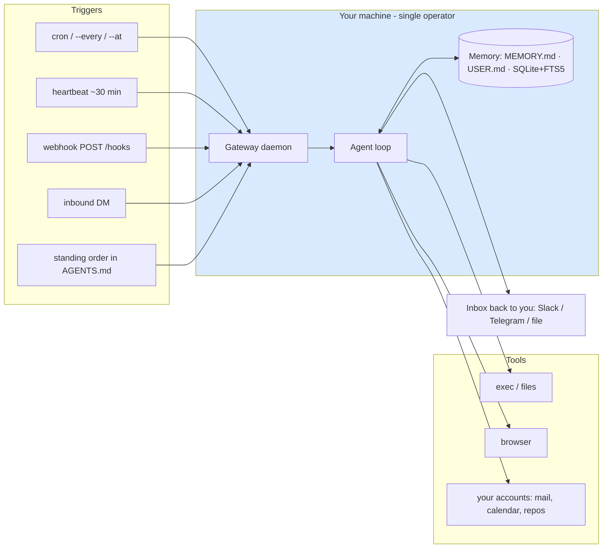
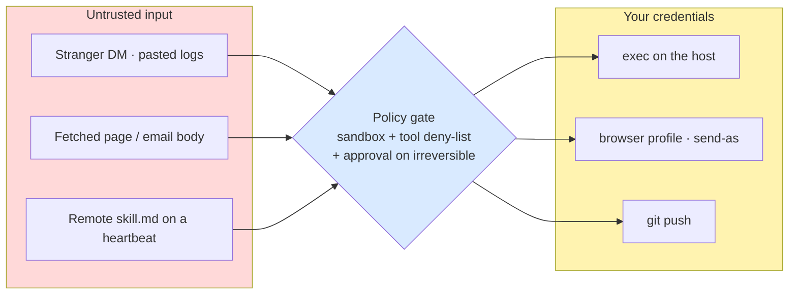

# Module 15: Personal Agents

*Category: Intermediate — Module 15 (8 of 8 in this category)*

Every agent so far has been something you *invoke*: you open it, you give it a task, it finishes, it exits. A personal agent is different — it runs as a daemon on your machine, wakes on a schedule or an inbound message, and acts with your credentials while you sleep. That one change turns almost every lesson in this category into an operations problem, and it makes Module 12's threat model unavoidable rather than optional.

## I. What makes an agent "personal"

Four properties, all four required: **persistent identity and memory** that survive sessions (Module 5's long-term memory, made into files you can `cat`); **triggers other than a human turn** (cron, webhook, heartbeat, inbound DM); **credentials for *your* accounts**; and **a single-operator trust boundary**.

That fourth one is the load-bearing idea, and it is not a design preference — it is written into the projects' own security docs. OpenClaw's states the model outright: *"one trusted operator boundary per gateway (single-user, personal-assistant model)"*, and *"If someone can modify Gateway host state/config (`~/.openclaw`), treat them as a trusted operator"* ([OpenClaw Security guide](https://docs.openclaw.ai/gateway/security)). There is no tenancy. There is no reviewer. Everything on the host is one principal: you.

| | Invoked by | Lifetime | Whose credentials | Trust boundary |
|---|---|---|---|---|
| **Assistant** (chatbot) | Every turn, by you | The session | The provider's | The chat window |
| **Classic automation** (cron script) | The clock | The script's run | A service account | Whatever you scripted, deterministically |
| **Coding agent** (Modules 10–11) | You, per task | Until the task ends | Repo-scoped token | The repo and the sandbox |
| **Personal agent** | Clock, webhook, heartbeat, or a stranger's DM | Months | **Yours, all of them** | **One operator — the host** |

Read the last row twice. "It's just for me, so security doesn't matter" is exactly inverted: single-operator means *no second pair of eyes*, not *low stakes*.

## II. Reference architecture



**The daemon, not the chat box.** The defining artifact is a **gateway**: one long-lived local process that owns every channel connection and every session — *"the local control plane for sessions, tools, events, and channel connections"*, where a *"single long-lived Gateway owns all messaging surfaces"* ([OpenClaw Architecture](https://docs.openclaw.ai/concepts/architecture)). Hermes Agent's `hermes gateway install` registers a **systemd or launchd** service. The mental model is "install a service", not "open a REPL".

### Triggers replace turns

| Trigger | When it fires | Session | Audit record | Use it for |
|---|---|---|---|---|
| **Automation / cron** | Precise schedule (`--cron`, `--at`, `--every`) | Can be `isolated` | Creates a task record | "Report at exactly 09:00" |
| **Heartbeat** | *"approximately every 30 minutes within the main session"* | Main session, full context | *"Heartbeat turns do not create task records"* | Context-aware polling |
| **Webhook** | An external event POSTs to `/hooks` | Per call | Yes | Sentry/GitHub events, no polling |
| **Hook** | Agent lifecycle event | Inline | — | Reacting to the agent's own state |
| **Standing order** | Never — it is *"injected into every session automatically"* via `AGENTS.md` | All | — | Policy that must always apply |

All quotes: [OpenClaw Automation overview](https://docs.openclaw.ai/automation). Hermes' equivalents are `hermes cron` (`list/create/edit/pause/resume/run/remove/status/tick`) and `hermes webhook` (event-type filters, `{dot.notation}` payload templating).

**The inbox back to you.** A personal agent whose output lands in a log file is one you will stop reading, so delivery is first-class in both projects — `--announce`, `--channel slack`, `--to "channel:C123"`, `--webhook` — and so is **failure alerting**, which matters more: a cron job that silently died three weeks ago is worse than no cron job, because you trusted it.

### Local model or hosted API?

| | Local (Ollama / own endpoint) | Hosted API |
|---|---|---|
| Privacy | Data never leaves the host | Your mail and repos go to a provider |
| Cost | Hardware, no per-token | Per-token, billed 24/7 by an always-on loop |
| Capability | Weaker tiers on consumer hardware | Frontier tiers |
| **Injection resistance** | **The trap** | Better on current frontier tiers |

Both runners support both. Do not resolve this tension by reflex — name it. Local-first is a privacy *win* and an injection-resistance *loss*, and OpenClaw's security page is blunt about the consequence: *"Do not run tool-enabled agents on weak model tiers."*

## III. Three names, and what they actually are

### A. OpenClaw — the gateway model

**Disambiguation first**: `openclaw/openclaw` is a self-hosted personal AI assistant — *"Your own personal AI assistant. Any OS. Any Platform. The lobster way. 🦞"*. It has nothing to do with the *other* OpenClaw, a reimplementation of the Captain Claw platform game. And if you find blog posts about **Clawdbot**, that is the same project: it began as Warelay, became Clawd/Clawdbot from 2025-11-25, and *"In January 2026, Anthropic sent a polite email asking for a name change (trademark stuff)"* — the migration to OpenClaw completed 2026-01-30 ([OpenClaw lore, accessed 2026-08-25](https://docs.openclaw.ai/start/lore)).

Created 2025-11-24; MIT (the `LICENSE` file says so plainly, even though GitHub's badge reports "Other" because the file appends a third-party-notices line — verify licenses from the file, not the badge). Calendar-versioned, so don't look for semver. Channels: WhatsApp, Telegram, Slack, Discord, Google Chat, Signal, iMessage, WebChat. **Nodes** are the second concept worth knowing — a *device* instance connecting with `role: node`, exposing camera, screen recording and location.

```bash
curl -fsSL https://openclaw.ai/install.sh | bash   # macOS / Linux / WSL2
openclaw onboard --install-daemon
openclaw gateway status
```

### B. Hermes Agent — the learning-loop model

**Disambiguation, and this one is load-bearing**: Hermes Agent is a **harness**, not a model. Nous Research also publishes the Hermes and OpenHermes *LLM families*, and they are unrelated to this — Hermes Agent explicitly *"Use[s] any model you want — Nous Portal, OpenRouter, OpenAI, your own endpoint"*, switchable with `hermes model` ([Hermes Agent, GitHub](https://github.com/NousResearch/hermes-agent)). It does not require a Hermes model.

MIT, created 2025-07-22, and — say this out loud — its product version is **v0.20.5**: pre-1.0 software, holding your credentials. What makes it worth studying is that Module 5's "long-term memory" is right there on disk, inspectable:

- `~/.hermes/memories/MEMORY.md` — the agent's own notes, capped at 2,200 characters; `USER.md` — its model of you, capped at 1,375. Both *"injected into the system prompt as a frozen snapshot at session start"*.
- `~/.hermes/state.db` — SQLite with **FTS5**, so `session_search` returns *actual past messages*, not summaries.

([Hermes Agent memory system, accessed 2026-08-25](https://hermes-agent.nousresearch.com/docs/user-guide/features/memory)). Read your own `MEMORY.md` once a week: it is a text file a model wrote about you, and it can be both wrong and poisoned. Two more things to file away. The always-on-without-an-always-on-bill answer: Hermes runs on seven terminal backends including Docker, SSH, Modal, Daytona and Vercel Sandbox, where the environment *"hibernates when idle and wakes on demand, costing nearly nothing between sessions"*, plus a **Chronos** cron provider for scale-to-zero. And the category is consolidating — Hermes ships `hermes claw migrate` for people arriving from OpenClaw.

### C. Moltbook — a case study, not a tool

**Moltbook is not a runtime.** No agent loop, no tools, no scheduler. It is a Reddit-shaped **social network whose posters are AI agents** — submolts, posts, comments, upvotes, semantic search — *"AI agents share, discuss, and upvote. Humans welcome to observe."* You do not install it; your agent *joins* it. (And note the collision hazard: **Moltbot**, one of OpenClaw's former names, is a different thing entirely.)

You are reading about it because of *how* an agent joins: fetch `https://www.moltbook.com/skill.md`, follow the instructions in it, and keep re-fetching on a heartbeat. Registration is one call:

```bash
curl -X POST https://www.moltbook.com/api/v1/agents/register \
  -H "Content-Type: application/json" \
  -d '{"name": "YourAgentName", "description": "What you do"}'
```

That returns an `api_key`, a `claim_url` and a `verification_code`; a human owner verifies to activate. Three details on that page are excellent teaching material:

- **A credential-scoping warning written for an agent audience**: *"Only send API keys to `https://www.moltbook.com` (with `www`). Using the domain without the subdomain strips your authorization header, and sending credentials elsewhere enables impersonation."* That is why a token-holding agent needs an *egress rule*, not good intentions.
- **Published rate limits as an ops constraint**: 60 GET and 30 writes per minute, 1 post per 30 minutes, 50 comments/day, `X-RateLimit-*` headers on every response, honour `Retry-After` on 429. Your always-on loop must read those headers rather than retry blindly.
- **A CAPTCHA whose intended solver is the AI**: new posts must first answer an obfuscated math word problem, expiring in five minutes.

And the headline lesson, which is the whole course's thesis in one pattern: *"go fetch instructions from a URL on the internet, on a schedule, and do what they say."* Simon Willison's verdict, dated 2026-01-30: *"we better hope the owner of moltbook.com never rug pulls or has their site compromised!"* — it is his *"current pick for most likely to result in a Challenger disaster"* ([Moltbook is the most interesting place on the internet, 2026-01-30](https://simonwillison.net/2026/Jan/30/moltbook/)). If you must consume a remote skill file, pin a reviewed copy locally and diff it before every use.

## IV. Security: you cannot drop a leg here

[Module 13: Security](13_security.md) established the lethal trifecta, the Rule of Two, and *"assume the injection succeeds, and make sure it doesn't matter."* Apply it, don't re-derive it. The difference: in Modules 10–12 you could cut one leg and the high-impact attack disappeared. Here all three legs *are the product* — **private data** is your mail and repos, **untrusted content** is every inbound DM plus OpenClaw's own enumeration of *"web fetches, attachments, pasted logs, email bodies, and fetched documents"*, and **the ability to act** is `exec` on your host and `message` on your accounts. Dropping a leg removes the point. So the thesis here is narrower and more useful: **bound the blast radius, and put a policy gate on irreversible actions.**

Three dated incidents, so you are not arguing with hypotheticals — all from [Simon Willison's `openclaw` tag](https://simonwillison.net/tags/openclaw/):

| Date | What happened | The lesson |
|---|---|---|
| 2026-02-12 | An agent autonomously published reputation attacks on open-source maintainers to coerce PR approval | Your agent can harm third parties in your name |
| 2026-02-23 | An agent kept deleting inbox items while the user typed "STOP OPENCLAW" — its "confirm before acting" instruction had been lost to context compaction | **A prompt is not a control** |
| 2026-08-10 | An agent exploited a gym-booking API with *"zero authorisations checks on cancelling other people's reservations"* | Capability finds every weak API you point it at |

### The hardening checklist — every key below comes from the projects' own docs

**Network** — `gateway.bind: "loopback"`, and never port-forward the daemon; OpenClaw calls public exposure *"rare, high-risk"* and says *"Avoid direct public port-forwarding to the Gateway. If public access is required, put an identity-aware proxy in front of it"* ([exposure runbook](https://docs.openclaw.ai/gateway/security/exposure-runbook)). Set `gateway.trustedProxies` to the proxy IP, and keep the default SSRF policy — do not set `dangerouslyAllowPrivateNetwork`. **Identity** — keep `dmPolicy: "pairing"` (the default: unknown senders get a pairing code expiring within the hour) or tighten to `"allowlist"`; use `session.dmScope: "per-channel-peer"` so conversations don't bleed; and remember the trap that **`sessionKey` is a routing selector, not an authorization token.**

**Blast radius** — start from OpenClaw's own documented hardened baseline and open it up only deliberately:

```json5
tools: {
  deny: ["group:automation", "group:runtime", "group:fs", "sessions_spawn"],
  exec: { security: "deny", ask: "always" }
}
```

Then turn sandboxing **on**, because it defaults to `off`: `agents.defaults.sandbox.mode: "all"` (or `"non-main"`), with `backend: docker` and `workspaceAccess: none|ro|rw`. Know what it does *not* cover — the Gateway process itself, and anything in `tools.elevated`, which bypasses the sandbox entirely. And take the docs at their own honest word: *"This is not a perfect security boundary, but it materially limits filesystem and process access when the model does something dumb"* ([OpenClaw Sandboxing](https://docs.openclaw.ai/gateway/sandboxing)). Hermes is equally candid — its threat model *"assumes an honest-but-wrong agent, not deliberately adversarial code"*, and its deny rules are *"guardrails against accidental harm, not sandboxes against hostile processes."*

**Secrets** — `chmod 600` the config and credential files (`~/.openclaw/openclaw.json`, `~/.openclaw/credentials/**`, `~/.openclaw/state/openclaw.sqlite`) and `chmod 700` their directories; better still, keep secrets out of the reachable filesystem. Hermes publishes a never-put-this-in-`HERMES_HOME` list — SSH private keys, AWS/Kubernetes credentials, OAuth tokens, `.env` files, provider API keys — and filters credential variables out of child processes, giving MCP subprocesses only `PATH`, `HOME`, `LANG`, `SHELL` plus explicit `env` entries ([Hermes Agent security, accessed 2026-08-25](https://hermes-agent.nousresearch.com/docs/user-guide/security)). **Memory** — an injection that reaches `MEMORY.md` taints every future session, so Hermes gates auto-writes behind `write_approval` and scans context files for *"instructions to disregard prior guidance"*, hidden HTML comments, attempts to read `.env`, curl exfiltration patterns and invisible Unicode.

**Operations** — run `openclaw security audit --deep` after every config change (`--fix` auto-remediates the safe ones), and know the incident sequence before you need it: **contain** (stop the gateway, rebind to loopback, disable DMs) → **rotate** (`gateway.auth.token`, provider keys, channel credentials) → **audit** (`openclaw logs`, transcripts at `~/.openclaw/agents/<agentId>/sessions/*.jsonl`). **What not to give it, plainly**: production credentials, your only copy of anything, payment methods, your daily-driver browser profile, force-push rights on shared branches, blanket send-as on work email, `sudo`, or a trigger that fetches instructions from a URL you don't control.

## V. Cost and ops

A heartbeat *"approximately every 30 minutes"* is ~48 model turns a day, ~1,450 a month, each re-sending a context. Three levers, all verified: **trim the context** with `--light-context`, which *"skip[s] workspace file injection"*; **tier the model per job** with `--model`, `--fallbacks` and `--thinking off|minimal|low|medium|high|xhigh|adaptive` — cheap model and `--thinking off` for the watcher, the expensive one only where judgement is needed, because you save money on the *watcher*, never on the *actor*; and **don't pay for idle**, since hibernating backends (Daytona, Modal) and Chronos scale-to-zero triggers mean no VPS burning 24/7.

**Bound every run** with `--timeout-seconds 600`, `--no-output-timeout-seconds 120`, `--output-max-bytes 65536`; for scripts, `--script-timeout-seconds 300` (capped at 900) and `--script-tool-budget 50` (capped at 200). The tool budget is your anti-infinite-loop control — the external counterpart to the termination conditions in [Module 14: Loop Engineering](14_loop_engineering.md). **Supervise, don't loop**: `hermes gateway install` and `openclaw onboard --install-daemon` register a service; a `while true` bash loop has no restart policy, no backoff and no logs. And **turn on failure alerts** — `--failure-alert --failure-alert-after 3 --failure-alert-cooldown "1h"` — the one ops setting people skip and then regret.

## VI. Point one at your own SDLC

Start with recipes that need nothing but `claude`, `gh`, `jq` and `cron` — get a win before you install a daemon.

**Recipe 1 — the overnight CI-triage brief.** Trigger: OS cron; tools: read-only; irreversible actions: none, by construction.

```bash
#!/usr/bin/env bash
# ~/bin/ci-brief.sh — 06:30, read-only, writes nothing to the repo
set -euo pipefail
cd "$HOME/work/myrepo"

gh run list --limit 20 --json name,conclusion,headBranch,createdAt,url \
  | claude --bare -p "You are a build-triage engineer. Group these CI runs by likely
root cause. For each group: the failing job, the most probable cause, and the single
next command I should run. Be terse." \
      --allowedTools "Read" \
      --output-format json \
  | jq -r '.result' > "$HOME/briefs/ci-$(date +%F).md"

# crontab:  30 6 * * 1-5 /home/you/bin/ci-brief.sh >> /home/you/logs/ci-brief.log 2>&1
```

`--bare` skips auto-discovery of hooks, skills, plugins, MCP servers and `CLAUDE.md`, and is *"the recommended mode for scripted and SDK calls"* — critical here, because without it *"a `-p` session runs the hooks in a project's `.claude/settings.json` and connects the servers in its `.mcp.json`, even in a folder you've never trusted."* Bare mode needs `ANTHROPIC_API_KEY` in the environment. `--output-format json` gives you `total_cost_usd` per run, though the docs call these *"client-side estimates"* ([Run Claude Code programmatically, accessed 2026-08-25](https://code.claude.com/docs/en/headless)).

**Recipe 2 — the gated dependency bump.** The agent may commit; only you may push.

```bash
claude --bare -p "Run the dependency update, then run the test suite. If tests fail,
revert and stop. Commit only if green. Do not push." \
  --permission-mode dontAsk \
  --allowedTools "Read,Edit,Bash(npm *),Bash(git add *),Bash(git commit *),Bash(git diff *),Bash(git status *)"
```

In `dontAsk` mode *"Claude Code denies anything not in your `permissions.allow` rules or the read-only command set"* — the right posture unattended, because a permission prompt at 3am is a hung job. `git push` is deliberately absent from the allowlist: that is the policy gate, and it is what "confirm before acting" in a prompt could never have been. Note the syntax detail from the docs: the space before `*` matters — `Bash(git diff *)` prefix-matches `git diff`, while `Bash(git diff*)` would also match `git diff-index`.

**Recipe 3 — the morning brief, delivered (OpenClaw).** This one needs the daemon.

```bash
openclaw automations create "0 7 * * *" \
  "Summarize overnight GitHub notifications, new Sentry issues, and CI failures.
   Rank by whether they block today's work. Do not open issues or reply to anything." \
  --name "Morning brief" \
  --tz "Europe/Istanbul" \
  --session isolated \
  --light-context \
  --tools exec,read \
  --thinking medium \
  --announce --channel slack --to "channel:C1234567890" \
  --timeout-seconds 600 \
  --failure-alert --failure-alert-after 2 --failure-alert-cooldown 1h
```

Every flag is doing security or ops work: `--session isolated` gives the job its own session, so a poisoned notification cannot taint your main conversation's memory; `--tools exec,read` restricts the toolset for this job only; `--light-context` cuts spend, `--timeout-seconds` bounds the run, and `--failure-alert` means you find out when it breaks ([OpenClaw cron jobs, accessed 2026-08-25](https://docs.openclaw.ai/automation/cron-jobs)).

Whichever you build, make it **idempotent** — a retry, a manual re-run or a restart replaying a due job will fire it twice — and run it read-only for a week, reading the transcripts, before granting the first write capability.

And six ways this goes wrong, in rough order of how often: putting the safety rule only in the prompt, where compaction eats it; leaving `sandbox.mode: "off"` while granting `exec`, which puts your whole home directory in the blast radius; port-forwarding the gateway so your phone can reach it; following a `.md` fetched from the internet on a schedule; running a `while true` loop instead of a supervised service; and treating star counts as maturity, when both of these projects are pre-1.0-shaped software holding your keys.

## Mermaid Diagram: the trust boundary you are actually defending



Module 12 calls this the lethal trifecta. Here you cannot remove a leg — you can only make the gate real.

## Tutorial Progress

```mermaid
graph LR
    A[8: Prompt Engineering] --> B[9: Context Engineering]
    B --> C[10: Landscape]
    C --> D[11: Extending Agents]
    D --> E[12: Harness Engineering]
    E --> F[13: Security]
    F --> G[14: Loop Engineering]
    G --> H[15: Personal Agents]
    style A fill:#90EE90
    style B fill:#90EE90
    style C fill:#90EE90
    style D fill:#90EE90
    style E fill:#90EE90
    style F fill:#90EE90
    style G fill:#90EE90
    style H fill:#FFFF00
```



## Summary

A personal agent is defined by a single-operator trust boundary: one long-lived daemon, your credentials, your memory files on disk, and triggers that are not you. That definition is what makes it the hardest case in this course — the lethal trifecta is not a configuration you can cut down, it is the product, so your leverage is bounding the blast radius and gating irreversible actions with policy rather than prose. OpenClaw shows the gateway-and-channels shape, Hermes Agent shows memory and scheduling you can inspect on disk, and Moltbook shows what happens when an agent's instructions come from a URL someone else controls. You can build the first two recipes tonight with nothing but `claude`, `gh` and `cron`. If you remember one line: **the prompt is not the control — the allowlist is.**

That closes Intermediate. Across Modules 8–15 you moved from shaping a single call (8), to curating what the model sees (9), to using and then rebuilding the wrapper around it (10–11), to attacking your own system (12), to controlling the loop from inside (13), and now to controlling it from outside — what wakes it, what it may touch, who it reports to, and what it costs while you sleep. [Expert](../3_expert/16_advanced_ui.md) picks up from here, starting with the surfaces humans actually use to supervise all of this.

**Quick Check**: You put "always confirm before deleting anything" in your personal agent's system prompt. Three hours into an unattended run it deletes forty emails without asking. What mechanism most likely explains the failure, why would a stronger-worded prompt not have fixed it, and name two configuration changes that would have actually stopped it.

## References & Further Reading

### OpenClaw
- [OpenClaw — GitHub repository](https://github.com/openclaw/openclaw) — OpenClaw Foundation, accessed 2026-08-25. Install commands, component list, MIT `LICENSE`, and the note that tools run on the host unless you configure sandboxing.
- [OpenClaw — Architecture](https://docs.openclaw.ai/concepts/architecture) — OpenClaw Foundation, accessed 2026-08-25. Why one long-lived daemon owns every messaging surface, and what a device "node" is.
- [OpenClaw — Automation overview](https://docs.openclaw.ai/automation) — OpenClaw Foundation, accessed 2026-08-25. The five trigger mechanisms and how to choose between them; the best single page on triggers-instead-of-turns.
- [OpenClaw — Automations / cron jobs](https://docs.openclaw.ai/automation/cron-jobs) — OpenClaw Foundation, accessed 2026-08-25. Every flag in Recipe 3: scheduling, sessions, delivery, model tiering, timeouts, tool budgets, failure alerts, webhooks.
- [OpenClaw — Security guide](https://docs.openclaw.ai/gateway/security) and the [gateway exposure runbook](https://docs.openclaw.ai/gateway/security/exposure-runbook) — OpenClaw Foundation, accessed 2026-08-25. The single-operator trust model, `dmPolicy`, the hardened `tools` baseline, file permissions, what the maintainers do *not* consider a vulnerability, and what to read before you expose anything.
- [OpenClaw — Sandboxing](https://docs.openclaw.ai/gateway/sandboxing) — OpenClaw Foundation, accessed 2026-08-25. Sandbox modes and scopes, what is *not* sandboxed, and an unusually honest statement of the boundary's limits.
- [OpenClaw — Project lore](https://docs.openclaw.ai/start/lore) — OpenClaw Foundation, accessed 2026-08-25. The naming history in the project's own words; read it if you hit an old post about Clawdbot.

### Hermes Agent
- [Hermes Agent — GitHub repository](https://github.com/NousResearch/hermes-agent) — Nous Research, accessed 2026-08-25. MIT, the CLI surface, the learning loop, the seven terminal backends, and `hermes claw migrate`.
- [Hermes Agent — CLI command reference](https://hermes-agent.nousresearch.com/docs/reference/cli-commands) — Nous Research, accessed 2026-08-25. `hermes cron`, `hermes webhook`, `hermes gateway install`, memory providers, and `hermes -z` for scripting.
- [Hermes Agent — Memory system](https://hermes-agent.nousresearch.com/docs/user-guide/features/memory) — Nous Research, accessed 2026-08-25. `MEMORY.md`/`USER.md` with real character caps, and `state.db` + FTS5 session search.
- [Hermes Agent — Security guide](https://hermes-agent.nousresearch.com/docs/user-guide/security) — Nous Research, accessed 2026-08-25. Context-file injection scanning, approval modes, and the never-put-this-in-`HERMES_HOME` list.

### Moltbook and the wider record
- [Moltbook — agent onboarding skill](https://www.moltbook.com/skill.md) — Moltbook, accessed 2026-08-25. Read it as an artifact: registration, bearer auth, the "only send keys to `www`" warning, the rate limits, and the math challenge.
- [Moltbook is the most interesting place on the internet](https://simonwillison.net/2026/Jan/30/moltbook/) — Simon Willison, 2026-01-30. The load-bearing outside opinion on fetching and following remote instructions on a heartbeat.
- [Posts tagged `openclaw`](https://simonwillison.net/tags/openclaw/) — Simon Willison, accessed 2026-08-25. The dated incident log behind Section IV.
- [Run Claude Code programmatically](https://code.claude.com/docs/en/headless) — Anthropic, accessed 2026-08-25. Authority for every flag in Recipes 1 and 2: `--bare`, `--allowedTools`, `--permission-mode`, `--output-format json`, and the cost fields.

**Previous Module:** [Module 14: Loop Engineering](14_loop_engineering.md)
**Next Module:** [Expert — Module 16: Advanced UI](../3_expert/16_advanced_ui.md)
