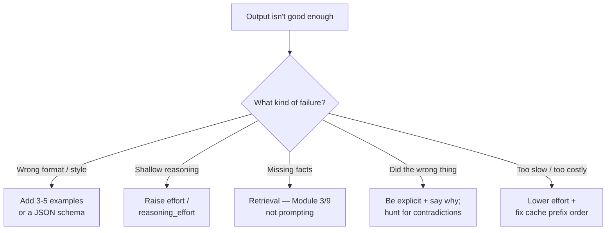

# Module 8: Prompt Engineering

*Category: Intermediate — Module 8 (1 of 8 in this category)*

Most of the prompt advice you'll find on the internet was written for models that no longer exist, and a surprising amount of it was never true. "Let's think step by step" is not recommended by Anthropic, OpenAI or Google any more; the famous tipping trick measures as a null; assistant prefill returns HTTP 400 on recent Claude models. This module separates the tricks that died from the handful of things that reliably move the number — and, more usefully, shows you how to tell the difference yourself on your own tasks.

## I. What Actually Changed

### A. Reasoning moved inside the model — and became a parameter

In 2022 you got a model to reason by *typing* the reasoning scaffold into the prompt. In 2026 reasoning is a trained capability with an API knob. All three major vendors converged on the same shape: Anthropic's `output_config.effort` (`low|medium|high|xhigh|max`, [Effort](https://platform.claude.com/docs/en/build-with-claude/effort)), OpenAI's `reasoning.effort`, and Google's `thinking_level`.

That single fact retires about half the classic playbook. If you teach yourself to type "think harder" instead of setting the parameter, you are paying for tokens and getting nothing.

### B. Prompt engineering vs context engineering

**Prompt engineering** is designing the *instruction text* — what you ask, how you show it, what contract the output must satisfy. **Context engineering** is *"the set of strategies for curating and maintaining the optimal set of tokens (information) during LLM inference"* ([Effective context engineering for AI agents, 2025-09-29](https://www.anthropic.com/engineering/effective-context-engineering-for-ai-agents)) — retrieval, compaction, memory, tool results.

Module 8 owns the instruction. [Module 9: Context Engineering](9_context_engineering.md) owns what gets into the window.

## II. The Obsolete-Advice Table

Print this and keep it next to any prompting tutorial published before 2025.

| Advice you'll still find in blog posts | Status in 2026 |
|---|---|
| "Add *let's think step by step*" | Obsolete. OpenAI: *"Avoid chain-of-thought prompts… unnecessary"* and *"can sometimes hinder"* performance ([Reasoning best practices](https://developers.openai.com/api/docs/guides/reasoning-best-practices)). |
| "Prefill the assistant turn to force a format" | **Returns 400** on Claude 4.6 and later. Use structured outputs. |
| "Set `budget_tokens` for extended thinking" | Deprecated; 400 on Claude 4.7+. Use `thinking: {type: "adaptive"}` plus `effort`. |
| "Raise temperature for creative variety" | **400 error** on the newest Claude models. Ask for N labelled alternatives instead. |
| "Wrap everything in XML tags" | Demoted — *"less necessary with models like Claude"* ([Prompt engineering best practices for 2026, 2025-11-10](https://claude.com/blog/best-practices-for-prompt-engineering)). Use them for *mixed content*, not decoration. |
| "Say CRITICAL / YOU MUST / ALWAYS for reliability" | Now causes overtriggering. *"you can use more normal prompting like 'Use this tool when…'"* |
| "Longer prompts are safer" | Contested. OpenAI measured *"leaner system prompts improved evaluation scores by roughly 10–15% while reducing total tokens by 41–66%"* ([GPT-5.6 Sol guidance](https://developers.openai.com/api/docs/guides/prompt-guidance-gpt-5p6)). |
| "Add 'verify your answer' to every prompt" | Model-dependent. On Claude Opus 5 you should **remove** it — it causes over-verification. |
| "Just ask nicely for JSON" | Superseded by constrained decoding. *"We recommend always using Structured Outputs instead of JSON mode when possible"* ([Structured Outputs](https://developers.openai.com/api/docs/guides/structured-outputs)). |
| "Reply with only the answer, nothing else" | Reversed for non-reasoning models: this *"is likely to harm the performance"* ([Prompting Science Report 2, 2025-06-08](https://arxiv.org/abs/2506.07142)). |

Unattributed rows are from Anthropic's consolidated [Prompting best practices](https://platform.claude.com/docs/en/build-with-claude/prompt-engineering/claude-prompting-best-practices) page. Note *where* that page is: Anthropic deleted its per-technique docs (`chain-of-thought`, `multishot-prompting`, `use-xml-tags`, `prefill-claudes-response`, …) and redirected them all into one page. A tutorial linking to those old URLs is describing a page that no longer exists.

## III. The Folklore Table

Engineers ask about this constantly. Here are the measured verdicts, not the vibes.

| Folk technique | What the evidence says | Verdict |
|---|---|---|
| **Extreme rudeness hurts** | Up to **−26.7 pp** on MMLU for Llama-2-70B going from the politest to the rudest of 8 levels; near-zero on GPT-4-class models ([Should We Respect LLMs?](https://arxiv.org/abs/2402.14531)). | **Real**, but model- and language-dependent. |
| **"Be maximally polite"** | The politest level is frequently *not* the peak: GPT-4 scores 75.82 at level 8 but peaks at **79.09 at level 4**; GPT-3.5 peaks at level 2 on JMMLU. | Folklore. |
| **"Be rude, it works better"** | See below — one 50-question study, which the same authors then failed to replicate. | Folklore. |
| **Tipping ($1,000, $1 trillion)** | Directly tested: 5 models × 9 conditions, **~4,950 runs per prompt per model** on GPQA Diamond. **No significant effect** ([Prompting Science Report 3, 2025-08-01](https://arxiv.org/abs/2508.00614)). | Measured null. |
| **Threats ("I'll kill you")** | Same study, same answer: no significant effect. The origin is a podcast remark with zero published measurement. | Measured null. |
| **"This is very important to my career"** | Claimed +8% / +115% relative in 2023 ([EmotionPrompt](https://arxiv.org/abs/2307.11760)). Re-measured at scale: **RD = −0.040 (p = 0.002)** on Gemini 2.0 Flash — it *hurt*. | Fails replication. |

### The replication story, which is the actual lesson

In October 2025 a short paper went viral for finding that rude prompts beat polite ones: 50 questions × 5 tones × 10 runs on a single model, accuracy rising **80.8% (Very Polite) → 84.8% (Very Rude)** ([Mind Your Tone, 2025-10-06](https://arxiv.org/abs/2510.04950)). Look at the size of that: 4 pp on 50 items is **two questions**. The reruns test run-to-run noise, not question sampling.

The same authors then ran it properly — **570 MMLU questions × 7 tones × 4 models** — and it did not replicate ([Mind Your Tone: Does Tone Alter LLM Performance?, 2026-05-27](https://arxiv.org/abs/2605.29027)). Total spread across all seven tones was **2.05 pp** on ChatGPT-4o, whose best tone was **Neutral**; ChatGPT-5-nano spread 11.12 pp, also peaking at Neutral; Gemini 2.5 Flash Lite peaked at Polite. Their conclusion: tone effects are *"systematic but highly model-dependent"* — **no single tone wins across models.**

That is the whole discipline in one anecdote. A real-looking effect on a handful of questions evaporated on a bigger sample, and the authors were honest enough to publish the evaporation.

### Why five examples can never tell you anything

The best-supported finding in this whole literature is that **wording matters enormously and unpredictably, per question**. FormatSpread found up to **76 accuracy points** of difference on LLaMA-2-13B from formatting changes that preserve meaning — separators, casing, spacing — with sensitivity persisting across model size, more few-shot examples, and instruction tuning ([Quantifying Language Models' Sensitivity to Spurious Features in Prompt Design, ICLR 2024](https://arxiv.org/abs/2310.11324)). Format performance correlates only weakly across models, so ranking two models on one fixed prompt is not a valid measurement. Related work at 6.5M instances across 20 LLMs found single-prompt evaluation **reshuffles model rankings** outright ([State of What Art?, TACL](https://arxiv.org/abs/2401.00595)).

The honest counterweight, which you should carry too: a good chunk of measured "prompt sensitivity" is an **artifact of the evaluation method** — log-likelihood scoring and rigid answer matching mark correct-but-differently-phrased answers wrong, and judge-based scoring substantially reduces the variance. Modern models are more robust than the 2023-era literature implies ([Flaw or Artifact?, EMNLP 2025](https://arxiv.org/abs/2509.01790)).

Both readings point the same way for you: **report performance over a range of prompt variants on an eval set. Never A/B a prompt on five examples.** That is precisely the failure mode of the viral rude-prompt result.

## IV. Chain-of-Thought: What Happened

### A. The idea, and the meta-analysis that bounded it

**Chain-of-Thought (CoT)** means eliciting intermediate reasoning in the visible output before the answer ([arXiv 2201.11903](https://arxiv.org/abs/2201.11903)). **Zero-shot CoT** is the literal trick "Let's think step by step" ([arXiv 2205.11916](https://arxiv.org/abs/2205.11916)).

It was never a general-purpose booster, and we have known that precisely since 2024. Screening 4,642 venue papers down to **110 papers and 1,218 experimental comparisons**, plus 20 datasets × 14 models of their own experiments, Sprague et al. report verbatim: *"The three categories which benefited the most from CoT are symbolic reasoning, math, and logical reasoning, with average improvements of **14.2, 12.3, 6.9**, respectively. Average performance on these top three tasks with CoT was 56.9, whereas performance without CoT was 45.5. For other categories, the average performance with CoT was **56.8**, compared to **56.1** without CoT. We do not consider this small improvement a victory for CoT."* ([To CoT or not to CoT?, arXiv 2409.12183, ICLR 2025](https://arxiv.org/abs/2409.12183))

Read that again: **+0.7 points on everything that isn't math, symbolic manipulation or logic.** And on MMLU specifically, *"As much as **95%** of the total performance gain from CoT on MMLU is attributed to questions containing '=' in the question or generated output. For non-math questions, we find no features to indicate when CoT will help."* The gain was arithmetic all along.

Two caveats to carry. Their own zero-shot numbers on math are genuinely huge (MATH +41.6%, GSM8K +66.9%) — CoT is not useless, it is *narrow*. And all 14 models tested are **pre-reasoning-model**; the paper says nothing directly about o-series or thinking-enabled Claude. For those, see below.

### B. At reasoning models, explicit CoT buys roughly nothing

This has also been measured. Using GPQA Diamond — 198 PhD-level questions × 25 trials × 3 prompt conditions = **4,950 runs per prompt per model** at temperature 0 — the Wharton group compared "Direct", "Step by step", and no suffix at all:

| Model | Effect of explicitly prompting CoT | Latency cost |
|---|---|---|
| o3-mini | +0.029 (p = .024) | 20–80% longer |
| o4-mini | +0.031 (p = .003) | 20–80% longer |
| **Gemini 2.5 Flash** | **−0.033 (p = .005)** — significantly *worse* | 20–80% longer |

Non-reasoning models did show real average gains (Gemini 2.0 Flash +0.135, Sonnet 3.5 +0.117) — but on the strict "correct in all 25 trials" metric, **three of five got significantly worse**, and CoT ran 35–600% slower. The line that reframes the whole topic: *"the model would often perform CoT by default even without explicitly prompting it. Thus, the value of explicitly prompting for CoT greatly diminished."* ([Prompting Science Report 2, 2025-06-08](https://arxiv.org/abs/2506.07142)) You are not adding reasoning by asking for it — at best you are paying 20–80% more latency to request something the model already does.

### C. What to do instead

```python
import anthropic
client = anthropic.Anthropic()

resp = client.messages.create(
    model="claude-opus-5",
    max_tokens=16000,
    thinking={"type": "adaptive"},        # the model decides when and how much to think
    output_config={"effort": "high"},     # low | medium | high | xhigh | max
    messages=[{"role": "user", "content": "Why does this test flake?"}],
)

# BEFORE — deprecated; returns 400 on Claude 4.7+
# thinking={"type": "enabled", "budget_tokens": 10000}
```

Two non-obvious things from the [Effort](https://platform.claude.com/docs/en/build-with-claude/effort) docs: effort *"affects **all** tokens in the response, including … tool calls"*, so low effort means **fewer tool calls**, not just shorter prose — a quiet way to make an agent worse while thinking you only made it cheaper. And hold effort constant within a conversation, because changing it invalidates your prompt cache.

Manual CoT still earns its keep in one place: **thinking off** — cheap high-volume calls, non-reasoning or local models; use `<thinking>` and `<answer>` tags to separate reasoning from output. And never ask the model *"is this correct?"* when you can ask the test runner: *"LLMs struggle to self-correct their responses without external feedback, and at times, their performance even degrades after self-correction"* ([arXiv 2310.01798, ICLR 2024](https://arxiv.org/abs/2310.01798)). Beware the mirror image too — *"A reviewer prompted to find gaps will usually report some, even when the work is sound"* ([Claude Code best practices](https://code.claude.com/docs/en/best-practices)).

Tree of Thoughts, self-consistency machinery and automatic prompt optimisation are [Module 21: Advanced Prompting](../3_expert/21_advanced_prompting.md).

## V. Few-Shot / In-Context Learning

**Few-shot** (multishot, in-context learning) means putting worked input→output examples in the prompt. Nothing persists — this is not training.

Anthropic's current guidance: examples are *"one of the most reliable ways to steer Claude's output format, tone, and structure,"* and should be **relevant** (*"Mirror your actual use case closely"*), **diverse** (*"Cover edge cases and vary enough that Claude doesn't pick up unintended patterns"*) and **structured** (wrapped in `<example>` tags). *"Include 3–5 examples for best results."*

**Helps** when the failure is format or style that's hard to describe but easy to show: a commit-message convention, a review-comment shape, a test-naming scheme. The software-engineering superpower is that **your repo is your few-shot corpus** — three real merged diffs from `git log` beat anything you'd invent.

**Hurts** when your examples silently contradict your instructions — one of the three defects OpenAI's prompt optimizer specifically targets, alongside internal contradictions and missing format specs ([Prompt optimization cookbook](https://developers.openai.com/cookbook/examples/gpt-5/prompt-optimization-cookbook)). It also does less than you think: randomly corrupting the *labels* in your demonstrations barely hurts, because what they supply is the label space, input distribution and format — not the mapping ([Rethinking the Role of Demonstrations, EMNLP 2022](https://arxiv.org/abs/2202.12837)).

**The decision rule, in one line:** start zero-shot with a precise instruction. Add examples when the failure is **format or style**. Raise `effort` when the failure is **reasoning**. Add retrieval when the failure is **knowledge** — that's [Module 3](../1_fundamentals/3_rag.md), not prompting.

## VI. The One Layout Rule

**Stable and long content first, the question always last.** It buys two different things at once.

**Quality.** Anthropic: put longform data at the top, *"above your query, instructions, and examples,"* because *"Queries at the end can improve response quality by up to 30 percent in tests."* Google agrees: *"Supply all the context first. Place your specific instructions or questions at the very end of the prompt"* ([Prompt design strategies](https://ai.google.dev/gemini-api/docs/prompting-strategies)).

**Cost.** **Prompt caching** reuses the KV-cache for an identical prompt *prefix*. Ordering is strictly `tools → system → messages`; reads cost **0.1x** and 5-minute writes **1.25x**; put the breakpoint on the last block that stays identical across requests, not on the varying one ([Prompt caching](https://platform.claude.com/docs/en/build-with-claude/prompt-caching)). Below the per-model token minimum caching is silently skipped with **no error**, and changing the `thinking` config, `effort`, or `output_config.format` invalidates it.

```python
resp = client.messages.create(
    model="claude-opus-5",
    max_tokens=4096,
    system=[
        {"type": "text",
         "text": TEAM_CODING_STANDARDS + REVIEW_RUBRIC,    # identical on every request
         "cache_control": {"type": "ephemeral"}},           # breakpoint on the STABLE block
    ],
    messages=[{"role": "user", "content": f"<diff>\n{diff}\n</diff>\n\nReview this diff."}],
)
print(resp.usage.cache_read_input_tokens, resp.usage.cache_creation_input_tokens)

# ANTI-PATTERN: a timestamp before the stable content. The prefix hash never matches,
# so you pay full uncached price on every request — and see 0 cache reads.
# system=[{"type": "text", "text": f"Current time: {now}\n" + TEAM_CODING_STANDARDS, ...}]
```

## VII. Making Output Machine-Readable

| Generation | How | Status 2026 |
|---|---|---|
| Prompt-and-pray | "Reply with JSON only." | Works, no guarantee. Fallback only. |
| Prefill / tool-call-as-output | Seed the assistant turn with `{`; or force a tool whose schema *is* your output. | Prefill **removed on Claude 4.6+** (400). Tool-call-as-output still valid. |
| **Constrained decoding** | Anthropic `output_config.format`; OpenAI `strict: true`. | **Current best practice.** |

```python
from pydantic import BaseModel

class ReviewFinding(BaseModel):
    file: str
    line: int
    severity: str          # use an Enum in real code
    issue: str
    suggested_fix: str

resp = client.messages.parse(
    model="claude-opus-5", max_tokens=2048,
    messages=[{"role": "user", "content": "<diff>...</diff>\nReport every issue you find."}],
    output_format=ReviewFinding,
)
print(resp.parsed_output)   # guaranteed schema-valid
```

Guarantees are narrower than they look. Anthropic's structured outputs do **not** enforce `minimum`/`maxLength` and don't support recursive schemas; OpenAI's strict mode requires *every* field to be `required`, forbids a root `anyOf`, and surfaces refusals in a distinct `refusal` field. Validate after parsing anyway. Rule of thumb: **if the output feeds a program, use a schema; if it feeds a human, use prose and prompt for length.**

**Where instructions live.** Anthropic exposes a top-level `system` **parameter** plus `user`/`assistant`, and has **no `developer` role**; OpenAI has one, and *"Developer messages are the new system messages."* Put the durable contract — role, constraints, output rules, coding standards — in `system`, and the task in the user turn. Reusable content then caches, and the user turn is by design lower-privilege. OpenAI's Model Spec gives quoted or untrusted content **"no authority"** ([Model Spec, 2025-10-27](https://model-spec.openai.com/2025-10-27.html)) — both the whole defence against prompt injection and the whole problem, since instructions and data still share one channel. That's [Module 13: Security](13_security.md). In practice you rarely write that system prompt by hand — you write `CLAUDE.md` / `AGENTS.md` and the harness assembles it, so keep it small: *"Bloated CLAUDE.md files cause Claude to ignore your actual instructions!"* ([Module 11](11_coding_agents.md), [Module 12](12_harness_engineering.md)).

## VIII. Worked Example: A PR Reviewer You'd Actually Ship

You review 30 PRs a week against the same team standards. Build it as a prompt *architecture*, not a paragraph.

**1. Cache the rubric.** `TEAM_CODING_STANDARDS + REVIEW_RUBRIC` go in `system` with the breakpoint (§VI). Thirty PRs means paying 1.25x once and 0.1x thirty times.

**2. Ask for coverage, filter later.** The commonest bug in review prompts is filtering at the wrong stage — "only report high-severity issues" gets obeyed literally and you lose recall.

```
<diff>
{{DIFF}}
</diff>

Review the diff above against the standards.
Report every issue you find, including ones you are uncertain about or consider
low-severity. Do not filter for importance or confidence at this stage; your goal
here is coverage.
For each issue output: file, line, severity, the problem, and a concrete fix.
```

**3. Make it parseable.** The `ReviewFinding` schema from §VII, so a bot can post inline comments. Severity filtering happens in a *second* pass — in Python, or a second cheap call at `effort: "low"`.

**4. Say why, not just what.** Motivation generalises where a bare rule doesn't:

```
✗  Never use `print` for logging.
✓  Never use `print` for logging — our log shipper only ingests structured JSON from
   the `logging` module, so `print` output is silently dropped in production.
```

**5. Now measure it.** This is the part people skip, and §III is why it isn't optional.

- Build a golden set from **real failures** — *"20-50 simple tasks drawn from real failures is a great start"* ([Demystifying evals for AI agents, 2026-01-09](https://www.anthropic.com/engineering/demystifying-evals-for-ai-agents)) — then automate the grader and grow it.
- Write criteria you can fail. Bad: *"the model should classify sentiments well."* Good: a specific F1 target on a named held-out set.
- **Grade the result, not the path**, and prefer deterministic checks over LLM judges wherever one exists: schema validates, tests pass, linter clean. Judge only genuinely fuzzy dimensions, with a *different* model than the one generating.
- Change **one** thing at a time: *"Add only the smallest targeted instruction that fixes a measured regression"*, and *"Do not rewrite a working prompt stack all at once"* ([GPT-5.6 Sol guidance](https://developers.openai.com/api/docs/guides/prompt-guidance-gpt-5p6)).
- Version prompts in git next to the code and run the eval in CI. promptfoo's GitHub Action *"On every pull request that modifies a prompt … will automatically run a full comparison"* and posts the result as a PR comment ([promptfoo GitHub Action](https://www.promptfoo.dev/docs/integrations/github-action/)).

More blocks worth stealing verbatim from Anthropic's [Prompting best practices](https://platform.claude.com/docs/en/build-with-claude/prompt-engineering/claude-prompting-best-practices): anti-test-gaming (*"Tests are there to verify correctness, not to define the solution"*), anti-over-engineering (*"A bug fix doesn't need surrounding code cleaned up"*), no-speculation (*"Never speculate about code you have not opened"*), and a reversibility rail requiring confirmation before `rm -rf`, `git push --force` or `git reset --hard`. And one framing trick that changes your workflow today: *"If you say 'can you suggest some changes,' Claude will sometimes provide suggestions rather than implementing them."* Two phrasings, two different workflows — pick deliberately.

## IX. Checking Sources Is Part of the Skill

Two traps you will hit within a week of reading around this topic.

- **arXiv Comments fields often carry no venue.** The original Chain-of-Thought paper (2201.11903), Reflexion, Self-Refine and the GPT-3 paper all state **no venue** in their arXiv metadata. Citing "NeurIPS 2022" for the CoT paper *from arXiv* is unsupported — check the proceedings, not the preprint.
- **Numbers move between versions.** *The Prompt Report* survey (2406.06608) went to v6 and its counts changed across revisions; as of v6 it lists **33 vocabulary terms, 58 text-based prompting techniques, 40 for other modalities**. Always quote a survey with its version. Likewise the politeness paper circulating in blog posts under the title "A Cross-Lingual Study of Politeness in LLM Prompting" is titled no such thing — see the references.

The vendors disagree with each other too, which is the strongest argument against any generic tip list:

| Question | Anthropic | OpenAI | Google |
|---|---|---|---|
| "Think step by step"? | Fallback only, when thinking is off. | **No.** *"Avoid chain-of-thought prompts."* | No published position found. |
| Few-shot examples? | Yes — 3–5, relevant/diverse/structured. | **Zero-shot first.** *"try to write prompts without examples first."* | **Always.** *"We recommend to always include few-shot examples in your prompts."* |
| Prompt length | Be explicit; give context and motivation. | **Lean.** *"State each instruction once."* | Not framed either way. |
| Long-context placement | Long data at top, query at end. | GPT-4.1 said top *and* bottom; current guidance lists repetition on the trim list. | Context first, question last. |

Rows 2 and 3 are direct disagreements on headline advice, so read *your* vendor's current page. The prefill and repetition rows are vendors disagreeing with their own past selves — so version-tag your prompting advice and re-run your evals on every model upgrade.

## Mermaid Diagram: Which Knob Do You Turn?



## Tutorial Progress


## Summary

The memorable half of prompt folklore — tipping, threats, tone, incantations — measures as roughly nothing once someone runs it at 4,950 trials instead of 50. CoT was always narrow (+14.2 symbolic, +12.3 math, +6.9 logic, **+0.7 on everything else**), and at reasoning models explicitly asking for it buys you ±0.03 accuracy and 20–80% more latency. What survives is unglamorous: reasoning depth is a parameter, output shape is a schema, layout is stable-first-question-last, and examples fix format problems rather than knowledge problems. The one thing to remember: **prompt wording swings results by dozens of points per question and unpredictably per model, so a prompt without an eval set is a regression waiting for a model upgrade.**

**Quick Check**: A colleague shows you a prompt tweak that lifted accuracy from 80.8% to 84.8% on their 50-question test set, and wants to roll it out. Name two reasons that result may not survive contact with production, and say what you'd ask them to run before shipping.

## References & Further Reading

Anthropic's and OpenAI's docs pages carry no publication dates; those were fetched and verified on 2026-08-25.

### Official docs

- [Prompting best practices](https://platform.claude.com/docs/en/build-with-claude/prompt-engineering/claude-prompting-best-practices) — Anthropic, accessed 2026-08-25. The single most important page here: clarity, examples, thinking, tool use, prefill migration, and verbatim system-prompt blocks worth stealing.
- [Effort](https://platform.claude.com/docs/en/build-with-claude/effort) — Anthropic, accessed 2026-08-25. The parameter that replaced half of CoT prompting, plus why it also changes how many tool calls you get.
- [Prompt caching](https://platform.claude.com/docs/en/build-with-claude/prompt-caching) — Anthropic, accessed 2026-08-25. Ordering, token minimums, TTLs, price multipliers and the timestamp anti-pattern.
- [Structured outputs](https://platform.claude.com/docs/en/build-with-claude/structured-outputs) — Anthropic, accessed 2026-08-25. Constrained decoding in ten lines, plus the schema features that are *not* supported.
- [Claude Code best practices](https://code.claude.com/docs/en/best-practices) — Anthropic, accessed 2026-08-25. The most SDLC-shaped page of the lot: evidence over assertion, and CLAUDE.md hygiene.
- [Prompting guidance for GPT-5.6 Sol](https://developers.openai.com/api/docs/guides/prompt-guidance-gpt-5p6) — OpenAI, accessed 2026-08-25. "Favor leaner prompts" with measured numbers, and the evals-first migration workflow.
- [Reasoning best practices](https://developers.openai.com/api/docs/guides/reasoning-best-practices) — OpenAI, accessed 2026-08-25. Where "avoid chain-of-thought prompts" and "try zero shot first" are stated outright.

### Papers

- [To CoT or not to CoT? Chain-of-thought helps mainly on math and symbolic reasoning](https://arxiv.org/abs/2409.12183) — Sprague et al., arXiv 2409.12183, v3 2025-05-07 (ICLR 2025). 110 papers, 1,218 comparisons; the per-category numbers and the MMLU equals-sign finding.
- [Prompting Science Report 2: The Decreasing Value of Chain of Thought in Prompting](https://arxiv.org/abs/2506.07142) — Meincke et al., arXiv 2506.07142, 2025-06-08. Per-model effects of explicitly prompting CoT at reasoning models, with latency costs.
- [Prompting Science Report 3: I'll pay you or I'll kill you — but will you care?](https://arxiv.org/abs/2508.00614) — Meincke et al., arXiv 2508.00614, 2025-08-01. The direct, large-N test of tipping and threats. Both null.
- [Mind Your Tone](https://arxiv.org/abs/2510.04950) — Dobariya & Kumar, arXiv 2510.04950, 2025-10-06. The viral 50-question "rude is better" result, worth reading for its own stated limits.
- [Mind Your Tone: Does Tone Alter LLM Performance?](https://arxiv.org/abs/2605.29027) — Dobariya & Kumar, arXiv 2605.29027, 2026-05-27. The same authors' 570-question × 4-model follow-up, in which it did not replicate.
- [Should We Respect LLMs? A Cross-Lingual Study on the Influence of Prompt Politeness on LLM Performance](https://arxiv.org/abs/2402.14531) — Yin et al., arXiv 2402.14531, v2 2024-10-14 (SICon 2024). Eight politeness levels, three languages; note the real title.
- [Quantifying Language Models' Sensitivity to Spurious Features in Prompt Design](https://arxiv.org/abs/2310.11324) — Sclar et al., arXiv 2310.11324, v2 2024-07-01 (ICLR 2024). Up to 76 accuracy points from meaning-preserving formatting changes.
- [Flaw or Artifact? Rethinking Prompt Sensitivity in Evaluating LLMs](https://arxiv.org/abs/2509.01790) — arXiv 2509.01790, EMNLP 2025 Main. The counterweight: much measured sensitivity is an evaluation artifact.

**Previous Module:** [Fundamentals — Module 7: Multi-Agent](../1_fundamentals/7_multi_agent.md)
**Next Module:** [Module 9: Context Engineering](9_context_engineering.md)
