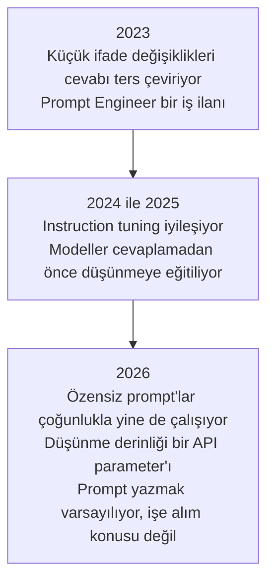
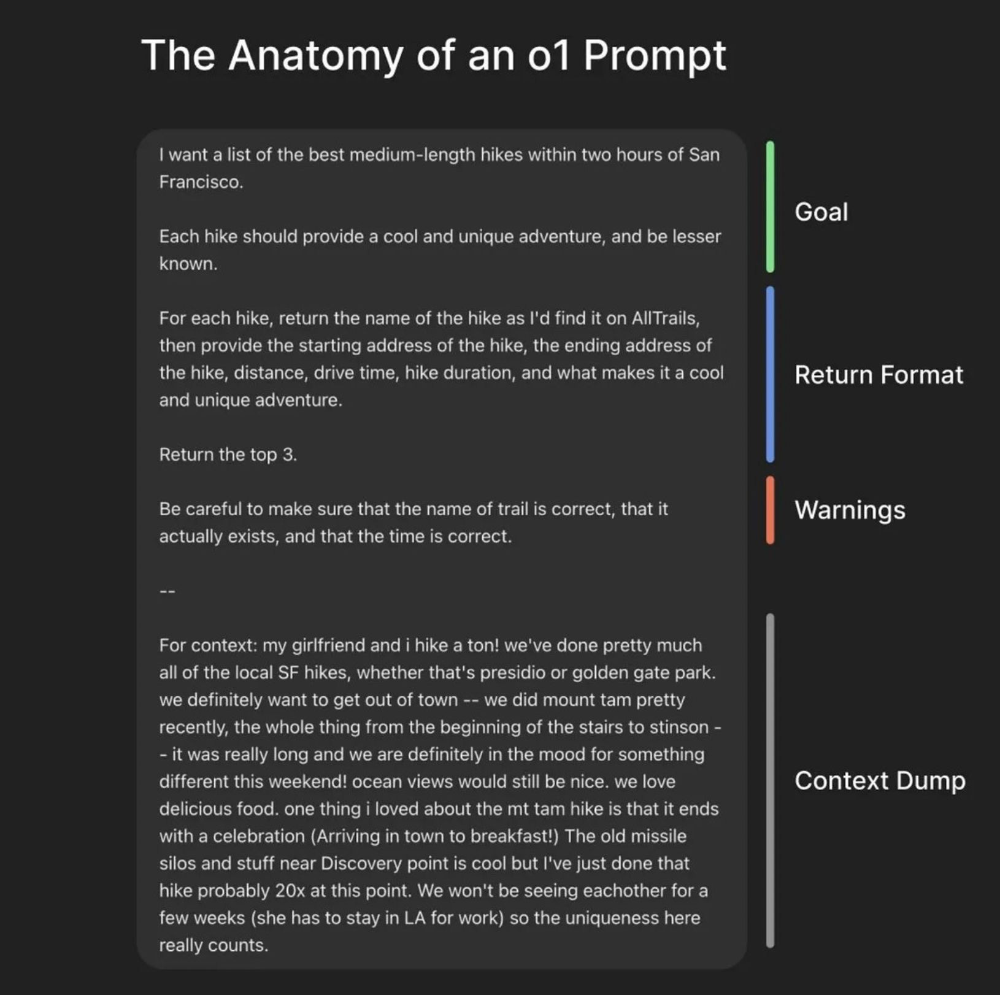
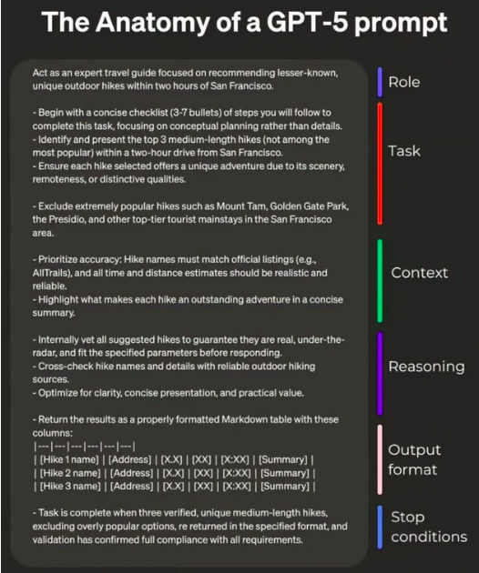
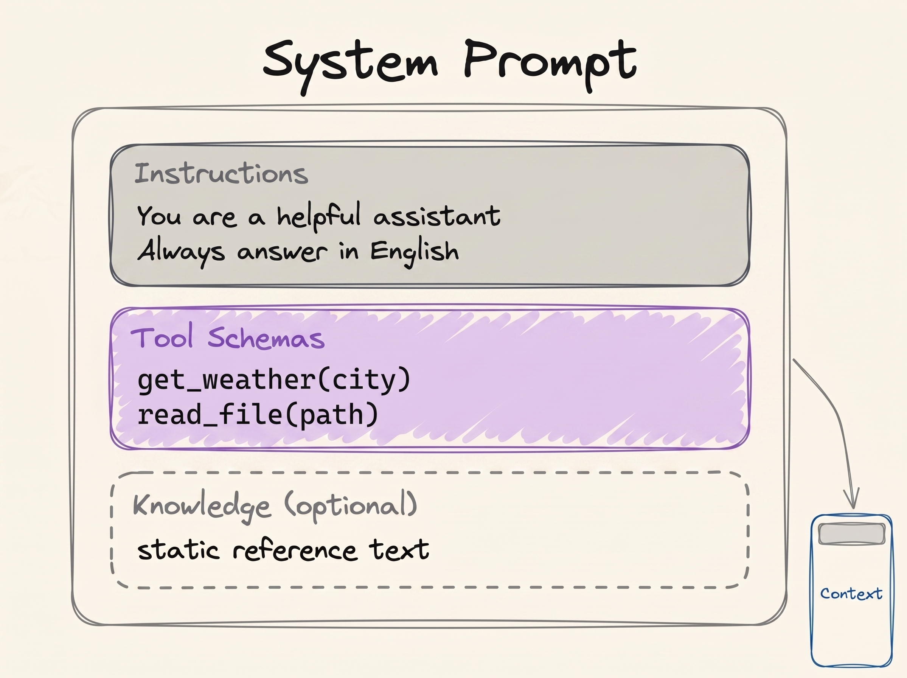
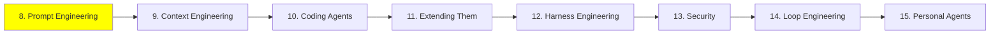

# Module 8: Prompt Engineering

Modül 1, prompt engineering hakkında tek bir paragrafla bitiyordu. Bu modül o paragrafın açılmış
hâli.

> **Prompt engineering, modeli beklediğin output'a götüren bir input yazmak.**

Bir modelin gerçekte ne olduğundan başla. Pre-trained bir neural network, weight'leri donmuş,
state'i ve memory'si yok. Input girer, output çıkar, her seferinde, hiçbir şey bir sonrakine
taşınmadan. Yani model sabit ve senin kontrol ettiğin tek şey input; bu da geri gelen şeyin
kalitesine karar verebilecek tek şeyin input olduğu anlamına geliyor.

Modül 1 modelin ne hesapladığını yazmıştı:

```
P(next token | context)
```

Senin prompt'un *o* context. Yani bütün disiplin tek bir arama problemi:

```
best prompt = the prompt that maximises P(the output you want | prompt)
```

Aşağıdaki her şey tek bir soruyu cevaplamak için bir teknik: prompt'umu nasıl yazarsam beklediğim
output'u alırım?

## Aynı soru, iki kez sorulduğunda

Şimdiye kadar seni rahatsız etmiş olması gereken itiraz şu. Weight'ler donmuşsa ve model hiçbir şey
hatırlamıyorsa, aynı soruyu iki farklı şekilde sormak neden iki farklı cevap veriyor?

Çünkü iki farklı ifade aynı input değil, ve model soruları cevaplamıyor. Bir network çalıştırıyor.

O network'ün içinde neuron'lar var, ve hangilerinin ateşleneceğine prompt karar veriyor. Bazıları
güçlü aktive oluyor, bazıları zayıf, bazıları hiç. Kelimeleri değiştirdiğinde o deseni
değiştiriyorsun, o da output'u değiştiriyor.

Bir DJ mixer'ı düşün. Volume, bass, echo, her birine bir düğme. DJ donanımı hiç değiştirmiyor,
düğmeleri çeviriyor, dinliyor, ve oda doğru duyulana kadar tekrar çeviriyor. Senin prompt'un o
düğmelerin bir ayarı, ve prompt engineering de network'ün bu iş için ihtiyacın olan kısımlarını
yükselten metni yazmak.

Ama o düğmelerin etiketi yok ve elin onlara yetişmiyor; onlara olan tek tutamacın metin. Bu işin
teorik değil deneysel olmasının sebebi bu, ve senin görevin için doğru prompt'u kimsenin eline
tutuşturamamasının da sebebi bu.

## Kötü bir prompt'un sana maliyeti

İki sürücü aynı arabayla aynı pistte tur atıyor ve farklı süreler çıkarıyor. Aynı motor, aynı
beygir, aynı yol tutuş, aynı virajlar. İyi olan sürücü aynı makineden basitçe daha fazlasını
çıkarıyor.

Modeller de böyle çalışıyor, ve bu muhtemelen zaten duyduğun bir şikâyeti açıklıyor. Prompt yazma
becerisi fazla olmayan biri istediğini alamıyor, ve modelin zayıf olduğu, o kadar da zeki olmadığı
ya da işin ancak yüzde yetmişini yapabildiği sonucuna varıyor. Bir başkası aynı modeli alıyor, daha
iyi bir prompt yazıyor, ve işi bitiriyor.

Yani bir model seni hayal kırıklığına uğrattığında, ilk soru hangi modele geçeceğin değil.

## 2026'da prompt engineering öldü

Evet, gerçekten.

İlk LLM API'leri 2023 civarında açıldığında modeller kırılgandı. İfadedeki küçük bir değişiklik iyi
bir cevabı yanlış bir cevaba çevirebiliyordu, ve bu hassasiyet hayal ürünü değil, ölçülmüş bir
şeydi: o dönemin open model'lerinde, anlamı hiç bozmayan format değişiklikleri doğruluğu
[76 puana](https://arxiv.org/abs/2310.11324) kadar oynatıyordu. **Prompt Engineer** bir iş unvanıydı.
Şirketler, bütün günü model beklenen output'u üretene kadar deneme yanılma yapmak olan insanlar
işe alıyordu.

O günler geçti. Modeller çok daha yetenekli, ve artık bu sayfanın altında göreceğin chain of
thought gibi yeteneklerle geliyorlar; bu da özensiz bir prompt'tan bile ne demek istediğini
çıkarmalarını sağlıyor. 2026'da prompt engineering bir kariyer değil. Bu sistemlerle çalışan
herkesten beklenen temel bir beceri.



Bu modülün sadece günlük AI engineering işinde gerçekten faydalı olanı kapsamasının sebebi bu.
Konunun sofistike ucu
[Modül 21: Advanced Prompting](../3_expert/21_advanced_prompting_tr.md) içinde yaşıyor.

Faydalı alt kümesi değil de bütün katalog istiyorsan, [Prompt Engineering
Guide](https://www.promptingguide.ai/) onu veriyor. Ve aşağıdakileri bir müfredat değil, başlangıç
noktaları olarak gör: prompt yazmak deneysel bir iş, ve bunda bir prompt yazıp output'u okuyup
prompt'u değiştirerek iyileşiyorsun.

## İki template

Kural basitçe şu: daha açık ve daha detaylı bir prompt daha iyi bir cevap alıyor. Yine de iki
template bilmeye değer, çünkü "açık ve detaylı"nın pratikte ne demek olduğunu gösteriyorlar:
sınırları tanımlanmış bir prompt.

Basit olanı:

```text
{Goal}
{Output Format}
{Warnings}
{Context}
```

- **Goal**: ne istediğin, bir iki cümleyle.
- **Output Format**: cevabın hangi şekilde gelmesi gerektiği.
- **Warnings**: yapacağından zaten şüphelendiğin hatalar.
- **Context**: sana yardım edebilmesi için bir yabancının senin durumun hakkında ihtiyaç duyacağı
  her şey.

  
*Context dump en uzun ve en özensiz kısım, ve bunda sorun yok. Hiçbir template'in senin yerine yazamayacağı kısım o.*

Daha detaylı olanı:

```text
{Role}
{Task}
{Context}
{Reasoning}
{Output Format}
{Stop Conditions}
```

- **Role**: model çalışırken kim olmalı, aşağıdaki role prompting başlığında anlatılıyor.
- **Task**: işin kendisi, sıra önemliyse numaralı adımlar hâlinde.
- **Context**: arka plan, kısıtlar, ve nelerden uzak duracağı.
- **Reasoning**: bir cevaba bağlanmadan önce nasıl düşünmesini istediğin.
- **Output Format**: tam olarak hangi şekilde, ihtiyacın varsa tablo kolonlarına kadar.
- **Stop Conditions**: modelin işinin bittiğini nasıl anlayacağı.

  
*Stop condition'lar insanların atladığı slot. Biri olmadığında "bitti", senin tanımın değil modelin tahmini oluyor.*

Bugünün modelleri iki template'e de sıkı sıkıya uymanı gerektirmiyor, ve zamanın çoğunda
uymayacaksın. Buradaki varlık sebepleri, "açık bir prompt yaz"ın belirsiz bir tavsiye olmaktan
çıkması.

## In-context learning ve few-shot prompting

Modeller weight'lerinde olmayan şeyleri öğrenebiliyor. Pre-training'le değil, fine-tuning'le değil,
context'te duran şeyden, yani Modül 5'teki working memory'den. Buna **in-context learning**, kısaca
ICL deniyor.

RAG'in çalışmasının sebebi de bu. [Modül 3](../1_fundamentals/3_rag_tr.md)'te weight'ler hiç
değişmiyor; getirilen dokümanlar context'e iniyor ve model onları anında kullanıyor. Kütüphane
kapalı kalıyor, sen ihtiyacın olanı masaya koyuyorsun.

İki template'e tekrar bak: her ikisinde de context için bir slot var. O slot, modele bir saniye
öncesine kadar sahip olmadığı bilgiyi verdiğin tek yer.

ICL sana bir teknik de kazandırıyor. **Few-shot prompting**, gerçek görevi vermeden önce modele
görevin doğru yapılmış birkaç örneğini göstermek demek:

```text
Classify the sentiment of each message as positive, negative or neutral.

Message: "the package arrived two days early"
Sentiment: positive

Message: "the box was crushed and the mug inside was broken"
Sentiment: negative

Message: "delivery is scheduled for Thursday"
Sentiment: neutral

Message: "it works, but the app crashed twice"
Sentiment:
```

O üç örnek aynı anda iki iş yapıyor. Label kümesini sabitliyorlar, böylece cevap nüanslı bir
paragraf değil üç kelimeden biri oluyor; ve format'ı sabitliyorlar, böylece cevap
`Sentiment: <label>` olarak geliyor ve kodun onu okuyabiliyor. Örneklerin, tek başına bir talimatın
başaramadığı yerde başarmasının sebebi genelde bu kombinasyon.

Bir tutam örnek **few-shot**. Hiç örnek olmaması ise **zero-shot**, ki bir chat penceresine her soru
yazdığında yaptığın şey de bu.

## İşe yaradığı kesin olan birkaç şey

### Açık ve doğrudan ol

Daha az etkili:

```text
Create an analytics dashboard
```

Daha etkili:

```text
Create an analytics dashboard. Include as many relevant features and interactions as possible. Go beyond the basics to create a fully-featured implementation.
```

İkinci prompt daha kibar ya da daha iyi yazılmış değil. Sadece bitmiş hâlin neye benzediği hakkında
belirgin şekilde daha fazla şey söylüyor. İki örnek de Anthropic'in [prompting best
practices](https://platform.claude.com/docs/en/build-with-claude/prompt-engineering/claude-prompting-best-practices)
sayfasından.

### Context ekle, sebeplerini de

Model context'te olan şeyden öğrendiğine göre, ona bir kuralın sadece ne olduğunu değil *neden* var
olduğunu da söyle.

Daha az etkili:

```text
NEVER use ellipses
```

Daha etkili:

```text
Your response will be read aloud by a text-to-speech engine, so never use ellipses since the text-to-speech engine will not know how to pronounce them.
```

İlki körü körüne uyulacak bir kural. İkincisi modelin genelleme yapmasını sağlıyor: bir konuşma
motorunun bozduğu, senin listelemeyi hiç akıl etmediğin diğer noktalama işaretlerinden de
kaçınacak.

### Prompt'a bir yapı ver

Sık sık prompt'u bölümlere ayırmak istersin, böylece model hangi kısmın talimat, hangi kısmın data,
hangi kısmın hedef ve hangi kısmın output'u tarif ettiğini ayırt edebilir. Bu bir okunabilirlik ve
ayrıştırma kazancı, ve sonuçları ölçülebilir şekilde oynatıyor.

XML tag'leri, ki Anthropic'in modelleri buna göre ayarlanmış:

```xml
<identity>
You are a support engineer for a company that hosts Postgres databases.
</identity>

<goal>
Read the customer ticket below and decide whether it is a billing question, a
technical question, or both.
</goal>

<output_format>
One line: BILLING, TECHNICAL or BOTH, followed by a one-sentence reason.
</output_format>
```

Aynı şeyin markdown hâli:

```markdown
## Identity
You are a support engineer for a company that hosts Postgres databases.

## Goal
Decide whether the ticket below is a billing question, a technical question, or both.

### How to do it
Read the whole ticket first. Ignore the customer's own guess about the cause.

## Output format
One line: BILLING, TECHNICAL or BOTH, followed by a one-sentence reason.
```

İkisinde de nesting çalışıyor, ve model hiyerarşiyi hiyerarşi olarak okuyor: bir `##` altındaki
`###` ona ait bir detay, ve üst seviye daha fazla ağırlık taşıyor.

Format'ın standart bir format olması da gerekmiyor. Uyduğu yerde kendinkini icat et:

```text
Please read the emails below from my boss and my friend:

=== Boss Email ===
Write down the report of what you have done.

=== Friend Email ===
Write a poem for me.

=== Your Task ===
Please write a polite reply to both emails.
```

Bu ayraçlar neden? Çünkü onlar olmadan "Write a poem for me" tam olarak senden gelen bir talimat
gibi görünüyor, ve model kimseye cevap yazmak yerine keyifle bir şiir yazabiliyor. Uzun ve kalabalık
bir prompt'ta yapının sana kazandırdığı şeyin çoğu bu: model senin talimatlarını yapıştırdığın
metinden ayırt edebiliyor. Yapıştırılan metin sadece kafa karıştırıcı değil de düşmancaysa, aynı
problemin bir adı var, prompt injection, ve
[Modül 13: Security](13_security_tr.md) içinde kendi modülünü alıyor.

## Chain of Thought

Araştırmalar, duyduğun anda bariz gelen bir şey buldu: bir model zor bir görevi daha küçüklerine
bölüp ara adımları final cevaptan *önce* yazarsa, final cevap iyileşiyor. Aritmetiği kafanda değil
kâğıt üzerinde yapmanla aynı şey.

Bir modele şunu sor:

```text
The cafeteria had 23 apples. They used 20 for lunch and bought 6 more. How many now?
```

Düz bir prompt'la doğrudan cevap veriyor:

```text
Final Answer: 32 apples
```

Ki bu yanlış. Şimdi onu önce düşünmeye zorla, ve bir şeye bağlanmadan önce ara sonuçlarını
üretmesini isteyelim:

```text
<thinking>
The user wants the final number of apples in the cafeteria. Steps:
start with the initial number, subtract the apples used for lunch, add the apples bought later.

Initial apples: 23. Apples used for lunch: 20. Apples bought: 6.

Step 1: apples remaining after lunch. 23 - 20 = 3 apples.
Step 2: final number after buying more. 3 + 6 = 9 apples.
</thinking>

Final Answer: 9 apples
```

Sihir gibi geliyor. Aslında ev işine daha yakın. Bir model **autoregressive**: yazdığı her token bir
sonraki token için okuduğu input'un parçası oluyor. `23 - 20 = 3`'ü yazdığında o sonuç artık
context'inde duruyor, ve geri kalanı çözerken onu kafasında tutmak zorunda kalmıyor. Bir model için
yazmak, düşünmek.

İkisini bir dizi bulmaca üzerinde yan yana izlemek için, bu kursun yazarı bir
[Chain of Thought Visualizer](https://cot-visualizer.online/) yaptı. Bir benchmark değil, bir
gösterim: düz taraf kasıtlı olarak kötü cevap vermeye yönlendiriliyor. Bütün bunun neden çalıştığı
için [Why Can Large Language Models Generate Correct
Chain-of-Thoughts?](https://arxiv.org/abs/2310.13571) ek okuma.

### O iş unvanının kaybolma sebebi de chain of thought

2026'da neredeyse hiçbir zaman elle chain of thought prompt'u yazmıyorsun.

ChatGPT ya da bir agent sana "düşünüyor" diye gösterdiğinde, o chain of thought. Ve bu, biri
*hadi adım adım düşünelim* yazdığı için değil, model cevaplamadan önce düşünmeye eğitildiği için
oluyor; her zaman, sen istesen de istemesen de.

Miktarı artık bir prompt değil bir kadran. İnsanların bir modeli high thinking'de, ya da low
effort'ta, ya da max effort'ta çalıştırmaktan bahsederken kastettiği şey bu. Anthropic'in [effort
parameter](https://platform.claude.com/docs/en/build-with-claude/effort)'ı `low`, `medium`, `high`,
`xhigh` ve `max` alıyor, ve diğer sağlayıcıların da aynı düğmenin kendi versiyonu var. Daha fazla
düşünme, zor problemlerde daha iyi cevap demek. Aynı zamanda daha fazla maliyet, daha yavaş cevap ve
daha hızlı dolan bir context window demek.

> **NOT: daha fazla düşünmek her zaman daha iyi değil.** İnsanlar gibi modeller de aşırı
> düşünebiliyor, ve düşündüklerinde performansları bozuluyor. Bu iyi belgelenmiş: [Stop
> Overthinking](https://arxiv.org/abs/2503.16419) bütün alanı tarıyor, [The Danger of
> Overthinking](https://arxiv.org/abs/2502.08235) software engineering görevlerinde en az aşırı
> düşünen çözümleri seçerek neredeyse %30 daha iyi sonuç buldu, [When More Thinking
> Hurts](https://aclanthology.org/2026.findings-acl.1199/) modellerin zaten doğru olan cevapları
> terk ettiğini gösteriyor, ve [OptimalThinkingBench](https://proceedings.iclr.cc/paper_files/paper/2026/hash/0f63515b14f33c008158213c7b6191c6-Abstract-Conference.html)
> hiçbir modelin önündeki soru için doğru miktarda düşünmediği sonucuna varıyor.

Yani gerçek beceri, düşünme bütçesini görevin zorluğuyla eşleştirmek. Ki bu yazdığın bir cümle
değil, ayarladığın bir parameter.

## Role prompting

Role prompting, göreve girmeden önce modele bir iş, bir persona ya da bir karakter vermek.

> **NOT: system prompt ne?** System prompt context'in en tepesinde bir kez duruyor ve modelin
> bütün konuşma boyunca nasıl davrandığını tanımlıyor. Onu kullanıcı değil, modelin ya da agent'ın
> geliştiricisi yazıyor, ve genelde uzun oluyor. Tool'ların schema ve açıklamalarıyla birlikte
> kaydedildiği yer de burası ([Modül 4](../1_fundamentals/4_tools_tr.md)). Gerçeklerini görmek
> istersen, [system prompt leaks](https://github.com/asgeirtj/system_prompts_leaks) bunları
> ChatGPT, Claude, Gemini, Grok ve diğerlerinden birebir toplamış.

  
*Modül 1'deki figürün aynısı. Identity ve instruction'lar bir role'ün gireceği yer, ve bu kutudaki her şey kullanıcı bir şey söylemeden önce yazılıyor.*

Role prompting'in buraya ait olmasının sebebi bu: bir role en iyi işini system prompt'ta yapıyor.
Tekniğin kendisinin örnekleri göründükleri kadar basit:

```text
Act as a senior software engineer. Review this code and find security bugs.
```

```text
You are William Shakespeare. Write a short poem about summer.
```

Bir role iki şeyi iyi yapıyor. Bakış açısını kuruyor, modele kim olduğunu söylüyor: bir İK
müdürü, bir aşçı ya da bir data science mülakatçısı. Ve ton ile stili şekillendiriyor; kelime
dağarcığını, varsayılan uzmanlık seviyesini ve format'ı buna göre hizaya sokuyor.

Güvenilir şekilde yapmadığı şey ise modeli daha zeki yapmak. İlk zamanların umudu buydu ve tutmadı:
system prompt'taki persona'lar geniş bir soru yelpazesinde
[performansı iyileştirmiyor](https://arxiv.org/abs/2311.10054), ve 2026'daki bir devam çalışması
persona prompting'in [uzmanlık derinliğini artırırken netliği
düşürdüğünü](https://arxiv.org/abs/2605.29420) buldu; etkisi de soruya ve alana bağlı. Bir role'ü
bir cevabın *nasıl* okunduğunu şekillendirmek için kullan. Tavanı yükseltmesini bekleme.

Role'lerin yerini gerçekten hak ettiği yer agent kurmak. Bir agent tasarlamaktan bahsederken
çoğunlukla kastettiğimiz şey, tek bir iş için bir system prompt ve bir tool kümesi seçmek. Diyelim
bir code review ekibi istiyorsun:

1. **Code Review Agent.** System prompt: kodu yapısal, mantıksal ve mimari kusurlar için incele;
   bug'ların ve performans darboğazlarının maddeli bir listesini döndür; stil ya da security
   hakkında hiç yorum yapma. Tool'lar: `fetch_repository_files`, `run_ast_parser`.
2. **Security Auditor Agent.** System prompt: sadece vulnerability, veri sızıntısı ve dependency
   riskleri için tara; her birini High, Medium ya da Low olarak derecelendir; feature ya da
   refactoring önerme. Tool'lar: `run_sast_scanner`, `check_cve_database`.
3. **Clean Code Formatter Agent.** System prompt: çalışan kodu okunabilirlik ve bakım kolaylığı için
   refactor et, DRY ve standart isimlendirmeyi uygula; mantığı değiştirme ya da bug arama. Tool'lar:
   `execute_linter_auto_fix`, `generate_docstrings`.

Üç agent, tek model. Tek farkları role, talimatlar ve tool'lar; ki
[Modül 7](../1_fundamentals/7_multi_agent_tr.md) bir supervisor'ün işi uzmanlara dağıttığını
çizerken sessizce varsaydığı şey de buydu.

Ama dikkatli ol, çünkü bir role sadece hedeflediğin kısmı değil bütün davranışı değiştiriyor. Bir
security uzmanı ata ve sonra ona sanat tarihini sor: cevap hiç role verilmemiş hâlinden daha kötü
gelebilir.

Bu da bizi mixer'a geri getiriyor. "Act as a security expert" network'ün security bilgisini tutan
kısımlarını yükseltiyor, sanat tarihini tutanları ise kısık bırakıyor. Bu açıdan bakınca role
prompting bir retrieval problemi: modele bilgi eklemiyorsun, zaten sahip olduğu bilginin
hangisinin kullanılacağını seçiyorsun. Ve işin cılkı da bu, çünkü kıstığın düğmeler soru
değiştiğinde kısık kalıyor.

## Bu serinin neresindeyiz



## Özet

Prompt engineering, istediğin output'u en olası hâle getiren input'u yazmak. Weight'ler donmuş
durumda, yani elindeki tek düğme prompt, ve farklı ifadeler aynı network'ün farklı kısımlarını
aktive ediyor.

İşe yaradığı kesin olan şeyler gösterişsiz: ne istediğini tam olarak söyle, sebebini açıkla,
context'i devret, bir iki örnek göster, ve uzun bir prompt'u talimatların data'nla karışamayacağı
şekilde yapılandır. Chain of thought bir zamanlar bu tekniklerden biriydi ve artık modellerin
içine gömülü; iş unvanının kaybolup prompt yazmanın onun yerine temel bir beceri hâline gelmesinin
sebebi de büyük ölçüde bu.

Sırada context window'a giren her şey ve o yeri neyin hak ettiğine nasıl karar vereceğin var.

**Hızlı Kontrol**: donmuş bir model, soruyu yeniden ifade ettiğinde neden farklı cevap veriyor, ve
bir role prompt'u gerçekte neyi değiştiriyor?

## Kaynaklar

- [Prompt Engineering Guide](https://www.promptingguide.ai/): tekniklerin tam kataloğu, kapsadığımızın çok ötesinde
- [Prompting best practices](https://platform.claude.com/docs/en/build-with-claude/prompt-engineering/claude-prompting-best-practices): Anthropic'in güncel rehberi, ve iki öncesi-sonrası örneğinin kaynağı
- [Quantifying Language Models' Sensitivity to Spurious Features in Prompt Design](https://arxiv.org/abs/2310.11324): 2023 nesli gerçekte ne kadar kırılgandı, ölçülmüş hâliyle
- [Why Can Large Language Models Generate Correct Chain-of-Thoughts?](https://arxiv.org/abs/2310.13571): yazmanın düşünmek olmasının teorisi
- [Chain of Thought Visualizer](https://cot-visualizer.online/): düşünmenin ve doğrudan cevaplamanın yan yana gösterimi
- [Effort](https://platform.claude.com/docs/en/build-with-claude/effort): düşünme kadranı, ve her seviyenin ne için olduğu
- [Stop Overthinking: A Survey on Efficient Reasoning for Large Language Models](https://arxiv.org/abs/2503.16419): aşırı düşünme literatürü tek yerde
- [When "A Helpful Assistant" Is Not Really Helpful](https://arxiv.org/abs/2311.10054): persona prompt'larının cazibesini alan çalışma
- [System prompt leaks](https://github.com/asgeirtj/system_prompts_leaks): production system prompt'ları, birebir toplanmış
- [Modül 21: Advanced Prompting](../3_expert/21_advanced_prompting_tr.md): bu modülün kasten atladığı teknikler

**Önceki Modül:** [Fundamentals - Modül 7: Multi-Agent](../1_fundamentals/7_multi_agent_tr.md)
**Sonraki Modül:** [Modül 9: Context Engineering](9_context_engineering_tr.md)
