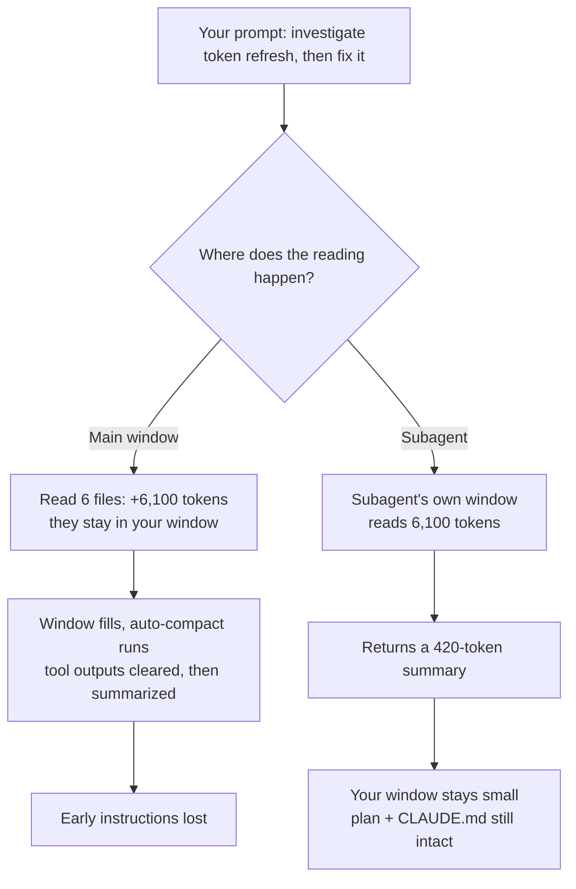

# Module 9: Context Engineering

*Category: Intermediate — Module 9 (2 of 8 in this category)*

[Module 5](../1_fundamentals/5_memory.md) showed you that "memory" is really just a growing stack of messages you re-send on every call. [Module 8](8_prompt_engineering.md) showed you how to write one good instruction. This module is about what happens when that stack gets long: the window is finite, it degrades *before* it is full, and something has to decide — every single turn — what still deserves a seat in it. That decision is your job now.

## I. From Prompt Engineering to Context Engineering

Anthropic's definition is the one the field settled on: context engineering is "the set of strategies for curating and maintaining the optimal set of tokens (information) during LLM inference" ([Effective context engineering for AI agents, 2025-09-29](https://www.anthropic.com/engineering/effective-context-engineering-for-ai-agents)).

The difference from prompt engineering is not scale, it's *shape*:

| | Prompt engineering | Context engineering |
|---|---|---|
| The unit of work | One string, mostly the system prompt | Everything in the window: system prompt, tools, MCP schemas, files, tool results, history |
| When you do it | Once, up front | Every turn, for the life of the task |
| What "good" looks like | A clear, well-structured instruction | The **smallest set of high-signal tokens** that still gets the job done |
| Failure you feel | The model misunderstands you | The model forgets, repeats itself, or confidently uses stale facts |

**Context engineering** is iterative. **Prompt engineering** is a discrete authoring act. You still need both — a beautifully curated window full of a vague instruction gets you nowhere.

The framing that makes the rest of this module click: the window is a finite **attention budget**, and "every new token introduced depletes this budget" ([Anthropic, 2025-09-29](https://www.anthropic.com/engineering/effective-context-engineering-for-ai-agents)). Transformers form n² pairwise relationships across n tokens, so attention spreads thinner as the input grows — and models saw far fewer long sequences during training than short ones. It's not a bucket you fill. It's a resource that degrades as you spend it.

## II. The Window Is a Budget, Not a Bucket

Every engineer's first instinct is "buy a bigger window." Here is why that doesn't work, with receipts.

| Evidence | Finding |
|---|---|
| [Lost in the Middle, arXiv:2307.03172](https://arxiv.org/abs/2307.03172) (TACL 2023) | A U-shaped position curve: performance is highest when the relevant information sits at the **beginning or end** of the input, and "significantly degrades when models must access relevant information in the middle." |
| [NoLiMa, arXiv:2502.05167](https://arxiv.org/abs/2502.05167) (ICML 2025) | With needles that share little literal wording with the question, **11 of 13** models claiming 128K+ support drop below 50% of their own short-context baseline at just **32K**. GPT-4o falls from **99.3% to 69.7%**. |
| [Context Rot, Chroma, 2025-07-14](https://www.trychroma.com/research/context-rot) | Across **18 models**, recall falls as input grows. A **single distractor** already hurts; four compound it. Models did *better* on shuffled haystacks than logically structured ones. On LongMemEval, a **~300-token focused prompt beat the ~113k-token full prompt**. |
| [arXiv:2510.05381](https://arxiv.org/abs/2510.05381), 2025-10-06 | **13.9%–85% degradation** as input length grows *even with perfect retrieval* — and removing, masking, or neutralizing the irrelevant text does not rescue it. |

That last row is the one to keep. "Just retrieve better" is not an escape hatch; length itself is the tax. These are different tasks and setups, so read the conclusion as directional rather than as one curve: **longer input means less reliable output, well before the window is full.**

**Context rot** is the name for this — as token count rises, accurate recall from context falls. 1M-token windows are routine now, and Claude Code still compacts at 1M, because the mechanism didn't change ([Explore the context window, Claude Code Docs](https://code.claude.com/docs/en/context-window)).

## III. Anatomy of Your Agent's Context

You can't manage what you can't see. Run `/context` in Claude Code and you get a breakdown of what's occupying the window right now, including which memory files actually loaded ([How Claude Code works](https://code.claude.com/docs/en/how-claude-code-works)).

Anthropic's own walkthrough gives an illustrative startup budget before you type anything: system prompt ~4,200 tokens; project CLAUDE.md ~1,800; auto memory ~680; skill descriptions ~450; user CLAUDE.md ~320; environment info ~280; MCP tool *names* ~120, with schemas deferred by default. Then the reads begin — 2,400, 1,100, 1,800, 1,600 tokens — and the docs' own conclusion is blunt: **"File reads dominate context usage"** ([Explore the context window](https://code.claude.com/docs/en/context-window)).

Two consequences you can act on today:

- Your startup overhead is a few thousand tokens. Your *reading* is tens of thousands. Optimize the reading first.
- Tool definitions are not free. Exposing MCP servers as a code API instead of raw tool definitions took one Google-Drive-to-Salesforce example from **150,000 tokens to 2,000 — a 98.7% saving** ([Code execution with MCP, Anthropic, 2025-11-04](https://www.anthropic.com/engineering/code-execution-with-mcp)). And tool *count* degrades behaviour independently of budget: a quantized Llama 3.1 8b failed with **46** tools but succeeded with **19**, with room to spare ([How Long Contexts Fail, Drew Breunig, 2025-06-22](https://www.dbreunig.com/2025/06/22/how-contexts-fail-and-how-to-fix-them.html)).

## IV. Get the Vocabulary Right

These four words get used interchangeably and they are not the same operation. Half of this module is knowing which one you're asking for.

| Technique | What it removes | What it keeps | Cost | Main risk |
|---|---|---|---|---|
| **Truncation / trimming** | Oldest turns, wholesale (last-N) | Recent N turns verbatim | Free, deterministic | Silently forgets early decisions |
| **Tool-result clearing** | Old tool *results* only, replaced by a placeholder | All reasoning, plus recent results | Cheap; invalidates the prompt cache | The agent can't re-read the raw output |
| **Summarization** | Older messages, replaced by a model-written gist | Long-range memory, compactly | An extra model call + latency | Lossy; "risks context poisoning if summaries contain errors" |
| **Compaction** | The conversation, which is then **restarted from the summary** | The gist, plus whatever reloads from disk | A whole large request | Same as above, and it happens automatically |

(Trimming and summarization trade-offs from the [OpenAI Cookbook — Session Memory](https://developers.openai.com/cookbook/examples/agents_sdk/session_memory); compaction from [Anthropic, 2025-09-29](https://www.anthropic.com/engineering/effective-context-engineering-for-ai-agents).)

Two more distinctions worth pinning down:

- **Memory vs context.** Context is what's in the window *now*. **Memory** is a durable store outside it that must be *retrieved into* context to matter at all ([Memory tool, Claude Platform Docs](https://platform.claude.com/docs/en/agents-and-tools/tool-use/memory-tool)). Writing something to memory does nothing on its own.
- **RAG vs agentic retrieval.** Classic RAG ([Module 3](../1_fundamentals/3_rag.md)) pre-computes an index and retrieves chunks before the model runs. **Just-in-time retrieval** holds lightweight identifiers — file paths, URLs, stored queries — and loads the data with tools at runtime, discovering context through exploration ([Anthropic, 2025-09-29](https://www.anthropic.com/engineering/effective-context-engineering-for-ai-agents)).

### What Claude Code's auto-compaction actually does

It "clears older tool outputs first, then summarizes the conversation if needed. Your requests and key code snippets are preserved; detailed instructions from early in the conversation may be lost" ([How Claude Code works](https://code.claude.com/docs/en/how-claude-code-works)). Note the order — the cheap, targeted operation runs before the lossy one.

Afterwards, some things come back **from disk**: the system prompt, project-root CLAUDE.md, auto memory, and the plan Claude wrote in plan mode. Up to **five** recently modified files are re-read (a file over 5,000 tokens returns as a path reference without content), and invoked skill bodies re-inject capped at **5,000 tokens per skill and 25,000 total** ([Explore the context window](https://code.claude.com/docs/en/context-window)).

What you lose is anything that existed *only* in the conversation. That is the single most useful sentence in this module: **if it matters, it belongs on disk.**

The threshold is configurable via `/autocompact`, the `--autocompact` flag, or `CLAUDE_CODE_AUTO_COMPACT_WINDOW`, accepting **100K to 1M** and capped at the model's real window; Sonnet 5 auto-compacts at about 967K by default ([Model configuration](https://code.claude.com/docs/en/model-config)). And if a single file is so large that context refills right after every summary, Claude Code stops auto-compacting after a few attempts and errors rather than thrashing forever ([How Claude Code works](https://code.claude.com/docs/en/how-claude-code-works)).

## V. The Four Levers

Everything practical reduces to four moves. LangChain frames them as **write / select / compress / isolate** ([Context Engineering for Agents, 2025-07-02](https://www.langchain.com/blog/context-engineering-for-agents)); here they are as things you actually type.

### 1. Compress — compact or summarize

**Use it when:** you're deep in one task, the history matters, and the window is filling.

**Steer it.** `/compact focus on the auth bug fix` beats a bare `/compact`. `/rewind` lets you summarize only part of the conversation. A `# Compact instructions` section in CLAUDE.md makes the steering permanent ([Manage costs effectively](https://code.claude.com/docs/en/costs)).

**What it costs:** compaction is itself a large request, because the model has to read the conversation it's summarizing. `/clear` costs nothing ([Manage costs effectively](https://code.claude.com/docs/en/costs)).

**When it backfires:** over-summarizing. A wrong premise inside a summary is never challenged again — it just becomes background truth for the rest of the session ([Breunig, 2025-06-22](https://www.dbreunig.com/2025/06/22/how-contexts-fail-and-how-to-fix-them.html)). If you're switching to unrelated work, `/clear` is strictly better *and* free.

### 2. Offload — move it to the filesystem

**Don't compress in place; move it out and keep a reference.** Manus drops fetched web page content from context and keeps only the URL, because the URL is restorable and the content isn't ([Context Engineering for AI Agents: Lessons from Building Manus, 2025-07-18](https://manus.im/blog/Context-Engineering-for-AI-Agents-Lessons-from-Building-Manus)). Agents "regularly write notes persisted to memory outside of the context window" and pull them back later — the Claude-plays-Pokémon run kept precise tallies, maps, and strategy notes across thousands of game steps ([Anthropic, 2025-09-29](https://www.anthropic.com/engineering/effective-context-engineering-for-ai-agents)).

The API's memory tool encodes the mindset in its own injected instruction: *"ASSUME INTERRUPTION: Your context window might be reset at any moment, so you risk losing any progress that is not recorded in your memory directory"* ([Memory tool](https://platform.claude.com/docs/en/agents-and-tools/tool-use/memory-tool)).

**When it backfires:** stale and bloated notes. A wrong fact written once is re-read every session. Timestamp your notes and expire the ones nothing has touched — and mind the index limits: Claude Code's auto-memory `MEMORY.md` loads only the first **200 lines or 25KB, whichever comes first**, and anything past that is silently dropped on the next load ([How Claude remembers your project](https://code.claude.com/docs/en/memory)). Deeper memory architectures are Module 19's job.

### 3. Isolate — spawn a subagent

This is the lever readers most often get wrong, so let's be concrete about the exchange rate.

A subagent gets **its own window**, does the token-heavy work there, and returns only its final text. In Anthropic's illustrated session the subagent read **6,100 tokens** of files and the parent received **420 tokens** plus a small metadata trailer — "That's the context savings" ([Explore the context window](https://code.claude.com/docs/en/context-window)). Distilled sub-agent reports typically run **1,000–2,000 tokens** ([Anthropic, 2025-09-29](https://www.anthropic.com/engineering/effective-context-engineering-for-ai-agents)).

What surprises people: **a subagent does not inherit what you know.** It gets its own shorter system prompt, the task message, the CLAUDE.md hierarchy, a git-status snapshot, preloaded skills, and a roster of its siblings. It does *not* get your conversation history, the files you already read, the skills you already invoked, your output style, or the main conversation's auto memory. A **fork** (`/subtask …`) is the exception — it inherits the whole conversation and shares the prompt cache with the main session ([Subagents](https://code.claude.com/docs/en/sub-agents)).

**When it backfires:**

- **Shared context work.** Cognition's argument is the essential counterweight: "Actions carry implicit decisions, and conflicting decisions carry bad results." Parallel agents can't see each other's traces, so they produce incompatible work; a single-threaded linear agent plus deliberate compression is the safer default ([Don't Build Multi-Agents, 2025-06-12](https://cognition.com/blog/dont-build-multi-agents)). Claude Code's docs agree — use the main conversation when phases share significant context, when the task needs frequent back-and-forth, for quick targeted edits, or when latency matters ([Subagents](https://code.claude.com/docs/en/sub-agents)).
- **Cost.** Agent teams use "approximately 7x more tokens than standard sessions when teammates run in plan mode" ([Manage costs effectively](https://code.claude.com/docs/en/costs)); LangChain cites Cognition reporting up to **15×** more tokens for multi-agent versus chat ([LangChain, 2025-07-02](https://www.langchain.com/blog/context-engineering-for-agents)).

The honest rule: delegate **read-heavy, self-contained questions** ("investigate how token refresh works"). Keep **decisions** in the main thread. Orchestration topologies are [Module 14](14_loop_engineering.md)'s territory.

### 4. Anchor — an explicit plan or TODO file

Manus calls this **recitation**, and the section is literally titled "Manipulate Attention Through Recitation." They deliberately create and rewrite a `todo.md` step by step so the objective is re-stated at the *end* of context on every turn — a direct counter to lost-in-the-middle across tasks that average around 50 tool calls ([Manus, 2025-07-18](https://manus.im/blog/Context-Engineering-for-AI-Agents-Lessons-from-Building-Manus)).

In Claude Code, plan mode writes the plan to disk, and that plan is **re-injected from disk after compaction** — making the plan file the one artifact that survives everything ([Explore the context window](https://code.claude.com/docs/en/context-window)). `Ctrl+G` opens it in your editor before Claude proceeds ([Best practices for Claude Code](https://code.claude.com/docs/en/best-practices)).

**When it backfires:** a plan that never gets updated is just another stale note. Anthropic's long-running-agent study names the failure modes precisely — attempting too much simultaneously, declaring victory prematurely, leaving buggy undocumented code, and skipping verification. Their harness had every session read the progress notes and git history, work on **a single feature at a time**, verify, commit, then update the progress file before ending ([Effective harnesses for long-running agents, 2025-11-26](https://www.anthropic.com/engineering/effective-harnesses-for-long-running-agents)). Mark a feature complete only after end-to-end verification, never when the code is merely written.

## VI. The Cost Lever: Prompt Caching Meets Context Editing

This is where context engineering becomes something you can defend to a manager.

Prompt caching hashes a **prefix**, ordered `tools → system → messages`, and "changes at any level invalidate that level and all subsequent levels." Cache reads cost **0.1×**; 5-minute writes cost **1.25×**; 1-hour writes cost **2×**. A `cache_control` breakpoint must sit on the **last block that is identical across requests** — put one after a per-request timestamp and you get zero cache hits, forever ([Prompt caching, Claude Platform Docs](https://platform.claude.com/docs/en/build-with-claude/prompt-caching)).

Three consequences you will feel in the bill:

- **Editing early in the context is expensive.** Mutating tool definitions per step invalidates the entire cache and orphans references to now-missing tools. Manus's advice: **mask tool logits instead of adding or removing definitions**, and treat contexts as append-only. They call KV-cache hit rate "the single most important metric for a production-stage AI agent" ([Manus, 2025-07-18](https://manus.im/blog/Context-Engineering-for-AI-Agents-Lessons-from-Building-Manus)).
- **Batch your context edits.** Tool-result clearing invalidates the cache, which is exactly why `clear_at_least` exists — don't pay for a re-cache to reclaim 800 tokens ([Context editing, Claude Platform Docs](https://platform.claude.com/docs/en/build-with-claude/context-editing)).
- **Watch it.** `/usage` attributes tokens to skills, subagents, plugins, and individual MCP servers, and flags a behaviour — long context, cache misses — once it accounts for 10% or more of recent usage ([Manage costs effectively](https://code.claude.com/docs/en/costs)).

Here is the one API snippet in this module, so you can see these are real platform features rather than folklore (Python SDK, beta header `context-management-2025-06-27`):

```python
resp = client.beta.messages.create(
    betas=["context-management-2025-06-27"],
    model="claude-opus-5",
    max_tokens=4096,
    messages=messages,
    tools=[{"type": "memory_20250818", "name": "memory"}],
    context_management={"edits": [{
        "type": "clear_tool_uses_20250919",
        "trigger": {"type": "input_tokens", "value": 30000},
        "keep": {"type": "tool_uses", "value": 3},
        "clear_at_least": {"type": "input_tokens", "value": 5000},  # cache economics
        "exclude_tools": ["memory"],   # never clear memory results
        "clear_tool_inputs": False,    # keep the call, drop the result
    }]},
)
print(resp.context_management.applied_edits)  # cleared_tool_uses, cleared_input_tokens
```

Anthropic's own docs note that for most cases you should prefer **server-side compaction** over hand-rolled tool clearing ([Context editing](https://platform.claude.com/docs/en/build-with-claude/context-editing)). Tuning these knobs belongs to [Module 12](12_harness_engineering.md) and Module 22.

## VII. When Context Goes Bad

Four named failure modes, so you can diagnose instead of guess ([Breunig, 2025-06-22](https://www.dbreunig.com/2025/06/22/how-contexts-fail-and-how-to-fix-them.html)):

| Failure | What it looks like | Evidence |
|---|---|---|
| **Poisoning** | A false fact enters context (often via a summary) and is never questioned again | A Gemini Pokémon run whose goals and summary were "poisoned with misinformation about the game state," leading it to pursue impossible objectives |
| **Distraction** | The agent repeats its own history instead of planning something new | Beyond ~100k tokens, "a tendency toward favoring repeating actions from its vast history"; Databricks saw correctness decline around **32k** for Llama 3.1 405b |
| **Confusion** | Too many tools; the model picks the wrong one | Berkeley Function-Calling Leaderboard: all models worse with more tools; 46 tools failed, 19 succeeded |
| **Clash** | Information spread across turns contradicts itself | Spreading a prompt across turns cost **39%** on average, with o3 falling from **98.1 to 64.1**: "when LLMs take a wrong turn in a conversation, they get lost and do not recover" |

### A real tension, presented as a judgement call

Manus says **keep the wrong stuff in**: leaving failed actions and their error messages in context lets the model "implicitly update internal beliefs" and stop repeating the mistake — error recovery is "one of the clearest indicators of true agentic behavior" ([Manus, 2025-07-18](https://manus.im/blog/Context-Engineering-for-AI-Agents-Lessons-from-Building-Manus)). Claude Code's best practices say the opposite for a supervised session: "If you've corrected Claude more than twice on the same issue in one session, the context is cluttered with failed approaches. Run `/clear` and start fresh" ([Best practices](https://code.claude.com/docs/en/best-practices)).

Both are right about different situations. Manus is describing one autonomous run where the error is training signal; Claude Code is describing a supervised session where thrash has crowded out the goal. The resolution to carry: **keep the error signal, drop the thrash.**

One honest caveat before you over-trust any of this: a 2026 survey argues that the repeated compaction agents actually perform "is almost never measured, and no benchmark holds one budget axis across all the layers at once" ([What to Keep, What to Forget, arXiv:2607.08032](https://arxiv.org/abs/2607.08032)). You are ahead of the literature here. Measure on your own work.

## VIII. Your Playbook

### The decision you make ten times a day

```text
/context          see what's in the window now (+ which memory files loaded)
/usage            token counts + attribution (skills, subagents, MCP) + behaviour flags
/clear            switching to unrelated work. Costs nothing.
/compact <focus>  same task, you still need the gist of history. Costs a big request.
/rewind           summarize only part of the conversation, or roll back code + chat
subagent          one self-contained, read-heavy question ("investigate X")
/subtask          same, but it needs your whole conversation (fork; shares prompt cache)
```

### What belongs in CLAUDE.md — and what does not

CLAUDE.md loads **every session**, so every line is a permanent tax. Target under 200 lines; the docs are blunt that "bloated CLAUDE.md files cause Claude to ignore your actual instructions!" ([Best practices](https://code.claude.com/docs/en/best-practices)). The test for each line: *would removing this cause Claude to make a mistake?* If not, cut it.

```markdown
# CLAUDE.md

## Commands
- Test: `pnpm test --filter <pkg>`      # never npm
- Typecheck after a series of edits: `pnpm typecheck`

## Conventions that differ from defaults
- ES modules only, no CommonJS
- API handlers live in `src/api/handlers/`

## Compact instructions
When compacting, always preserve the list of modified files and the test command.
```

Everything else is fetched on demand: multi-step procedures become a **skill** (loads only when invoked), and area-specific rules go in `.claude/rules/*.md` with `paths:` frontmatter so they load only when a matching file is read. Two caveats: `@path` imports help organization but **not** context size, since imported files load at launch; and path-scoped rules get summarized away by compaction unless their trigger file is read again ([How Claude remembers your project](https://code.claude.com/docs/en/memory)). If you keep your instructions in `AGENTS.md`, Claude Code reads `CLAUDE.md` — bridge it with `@AGENTS.md` as the first line, or `ln -s AGENTS.md CLAUDE.md`.

### Worked example: a refactor too big for one window

You need to migrate 40 modules off a deprecated auth client. Naively, you'd describe the whole thing in one session and watch it compact three times and forget the convention you established in message four. Instead:

```text
Session 1 (plan only):  plan mode -> "interview me, then write SPEC.md"
                        nothing gets implemented in this session
Session 2..N (fresh):   read SPEC.md + PROGRESS.md + git log
                        work ONE module, run the check, commit, append to PROGRESS.md
                        /clear before the next module
Review:                 a subagent reviews the diff against SPEC.md in a fresh context
                        scope it: "report gaps against the spec, not style preferences"
```

Every session starts near-empty and re-derives its state from three durable artifacts — the spec, the progress file, and git history — rather than from a summary of a summary ([Best practices](https://code.claude.com/docs/en/best-practices), [Effective harnesses for long-running agents](https://www.anthropic.com/engineering/effective-harnesses-for-long-running-agents)). That's also your session handoff story: a colleague, or you on Monday, picks it up from the same three files.

### Cheap wins, in order of payoff

1. **Scope your requests.** "Fix the token-refresh bug in `src/auth/`" beats "improve the codebase" — vague requests trigger broad scanning, and unbounded "investigate this" is how you read hundreds of files by accident ([Manage costs effectively](https://code.claude.com/docs/en/costs), [Best practices](https://code.claude.com/docs/en/best-practices)).
2. **Filter verbose tool output before it lands.** A `PreToolUse` hook that greps a test run for failures reduces "context from tens of thousands of tokens to hundreds" ([Manage costs effectively](https://code.claude.com/docs/en/costs)). Hooks are [Module 12](12_harness_engineering.md).
3. **Prefer CLI tools to MCP servers** where you can — `gh`, `aws`, `gcloud` "don't add any per-tool listing" cost, and `/mcp` disables the servers you aren't using ([Manage costs effectively](https://code.claude.com/docs/en/costs)).
4. **Trust agentic search for code.** On a 116-question LongMemEval subset, "grep generally yields higher accuracy than vector retrieval" — though "overall scores still depend strongly on which harness and tool-calling style is used" ([Is Grep All You Need?, arXiv:2605.15184](https://arxiv.org/abs/2605.15184)). You do not need to index your repo before your agent is useful.

These principles transfer to other coding agents; the mechanics differ, and the specific commands, thresholds, and caps above are Claude Code's and were not verified against other tools.

## Mermaid Diagram: The Same Task, With and Without Isolation



## Tutorial Progress


## Summary

The context window is an attention budget that degrades as you spend it, not a bucket you fill — which is why bigger windows didn't make this discipline obsolete. You now have four levers: **compress** (compact or summarize, lossy and not free), **offload** (move it to disk and keep a reference), **isolate** (a subagent burns its own window and hands back roughly 1–2k tokens, but knows nothing you know), and **anchor** (a plan or progress file that survives compaction because it lives on disk). Each has a cost and a way it backfires, and knowing which is which is the whole skill. If you remember one sentence: **anything that must survive should be on disk, not in the conversation.**

**Quick Check**: Your session is at 80% of the window. You're about to start work that is *unrelated* to everything so far — do you `/compact` or `/clear`, and why does the answer flip if the new work is a continuation of the same task? Then: you delegate a 6,100-token investigation to a subagent that returns 420 tokens. Name one thing you gained and one thing you gave up.

## References & Further Reading

### Start here

- [Effective context engineering for AI agents](https://www.anthropic.com/engineering/effective-context-engineering-for-ai-agents) — Anthropic Engineering, 2025-09-29. The field's canonical definition, plus attention budget, compaction, note-taking, sub-agents, and just-in-time retrieval.
- [Context Engineering for AI Agents: Lessons from Building Manus](https://manus.im/blog/Context-Engineering-for-AI-Agents-Lessons-from-Building-Manus) — Manus, 2025-07-18. The most practical production write-up: KV-cache economics, filesystem as context, `todo.md` recitation, and "keep the wrong stuff in."
- [Context Engineering for Agents](https://www.langchain.com/blog/context-engineering-for-agents) — LangChain, 2025-07-02. The write / select / compress / isolate framework that organizes the whole field.

### The evidence that long context degrades

- [Context Rot: How Increasing Input Tokens Impacts LLM Performance](https://www.trychroma.com/research/context-rot) — Chroma, 2025-07-14. The experiments behind "long context degrades," across 18 models; replication toolkit at [chroma-core/context-rot](https://github.com/chroma-core/context-rot).
- [Lost in the Middle: How Language Models Use Long Contexts](https://arxiv.org/abs/2307.03172) — Liu et al., arXiv:2307.03172 / TACL 2023. The original U-shaped position curve; still the mental model to carry.
- [NoLiMa: Long-Context Evaluation Beyond Literal Matching](https://arxiv.org/abs/2502.05167) — Modarressi et al., arXiv:2502.05167, ICML 2025. Why near-perfect needle-in-a-haystack scores were misleading.
- [Context Length Alone Hurts LLM Performance Despite Perfect Retrieval](https://arxiv.org/abs/2510.05381) — Du et al., arXiv:2510.05381, 2025-10-06. The paper to cite when someone says "just retrieve better."
- [How Long Contexts Fail](https://www.dbreunig.com/2025/06/22/how-contexts-fail-and-how-to-fix-them.html) — Drew Breunig, 2025-06-22. The poisoning / distraction / confusion / clash taxonomy, with the numbers behind each.
- [Is Grep All You Need? How Agent Harnesses Reshape Agentic Search](https://arxiv.org/abs/2605.15184) — Sen et al., arXiv:2605.15184, 2026-05-14. Published evidence for agentic search over a pre-built vector index, with the harness caveat stated honestly.

### Doing it in practice

- [Explore the context window](https://code.claude.com/docs/en/context-window) — Claude Code Docs. An interactive walkthrough of what loads, what each file read costs, and exactly what survives compaction.
- [Best practices for Claude Code](https://code.claude.com/docs/en/best-practices) — Claude Code Docs. Explore→plan→code→commit, `/clear` discipline, subagents for investigation, and the common failure patterns.
- [Manage costs effectively](https://code.claude.com/docs/en/costs) — Claude Code Docs. `/usage` attribution, the `PreToolUse` output-filtering hook, CLI tools over MCP, and cache lifetimes.
- [Effective harnesses for long-running agents](https://www.anthropic.com/engineering/effective-harnesses-for-long-running-agents) — Anthropic Engineering, 2025-11-26. How to hand work off between sessions with progress files, git, and one-feature-at-a-time discipline.
- [Don't Build Multi-Agents](https://cognition.com/blog/dont-build-multi-agents) — Cognition, 2025-06-12. The essential counterweight before you reach for subagents.
- [Context editing](https://platform.claude.com/docs/en/build-with-claude/context-editing) and [Memory tool](https://platform.claude.com/docs/en/agents-and-tools/tool-use/memory-tool) — Claude Platform Docs. The two API primitives that turn this module into code.
- [Prompt caching](https://platform.claude.com/docs/en/build-with-claude/prompt-caching) — Claude Platform Docs. The `tools → system → messages` prefix hierarchy, and where to put a `cache_control` breakpoint.

**Previous Module:** [Module 8: Prompt Engineering](8_prompt_engineering.md)
**Next Module:** [Module 10: Coding Agents: The Landscape](10_coding_agents_landscape.md)
