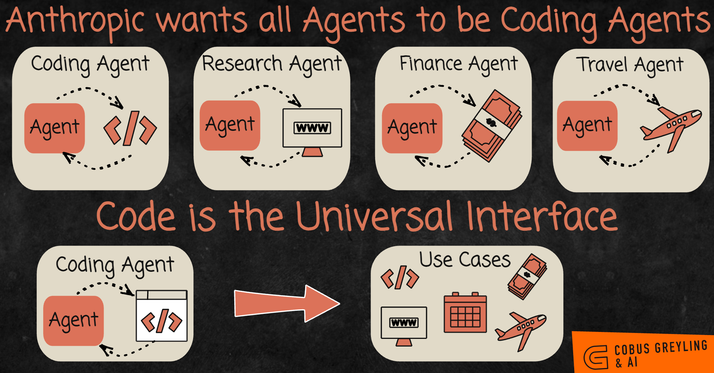
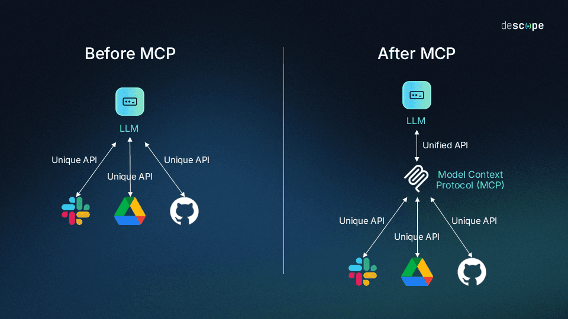
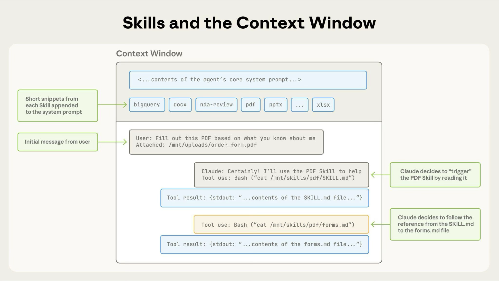

# Coding Agents: Extending Them

[Context Engineering](context_engineering.md) ended on the point that the coding agents you already use are deep agents: they plan, they delegate to subagents, they read and write files. This module is about those agents themselves. We start with why they turned out to be so much more useful than "a thing that writes code", and then go through the eight ways you extend one.

## Why a coding agent can do more than code

Say you have a PNG and you want it compressed, or converted to JPEG. Without an agent, somebody has to write a tool for that and hand it to the model.

A coding agent needs no tool. It can install a Python imaging library and write the four lines that do the conversion. Ask it for a slide deck and it does the same thing: finds a pptx library, installs it, writes the code, hands you the file. Nothing about either job was in its tool list.

This is the part worth sitting with. These agents do not only *use* what exists, they *build* what does not. One story that went around was someone whose printer had no Linux driver, so they asked a coding agent to write one. Whether or not the details survive retelling, the shape of it is real: a model that can write and run code has a way to reach almost anything a computer can do.

  
*The top row is the old way: one agent per domain, each needing its own tools built for it. The bottom row is why coding agents took over. Code reaches the web, the calendar, the bank and the airline, so an agent that writes code covers all four without anybody writing four sets of tools.*

So coding is not just one skill among many. It is the skill that can stand in for the others, and that is why a coding agent helps with work that has nothing to do with software. Look back at the examples above: every one of them was a non-coding task.

The rest of this module is the standard equipment. Almost every modern coding agent has these: Claude Code, Codex, Antigravity, Copilot, OpenCode. The names and file paths differ slightly between them, and the concrete examples here are Claude Code's, listed together in [Claude Code features](https://code.claude.com/docs/en/agent-sdk/claude-code-features).

## AGENTS.md, a README for agents

README is for humans. AGENTS.md is for agents.

It is a plain markdown file in your repository that gets added to the agent's existing system prompt, after the one the vendor wrote. That is the whole mechanism, and [agents.md](https://agents.md/) is the open format behind it: "a dedicated, predictable place to provide the context and instructions to help AI coding agents work on your project".

What belongs in it is the stuff that stays true across the whole repository and does not change much: build and test commands, how the directories are laid out, the conventions your team follows, and the rules an agent would otherwise get wrong twice. What does not belong is anything that goes stale in a week. A file full of details that no longer match the code is worse than no file, because the agent believes it.

You do not have to write it by hand. Run `/init` and the agent reads your codebase and drafts one, then you correct it.

Two practical notes. The first is that Claude Code reads `CLAUDE.md` rather than `AGENTS.md`. So if your repository already has an AGENTS.md for other tools, the documented move is to write a `CLAUDE.md` that imports it with `@AGENTS.md`, then add anything Claude-specific underneath.

The second is that both formats support **nested** files. You can keep one at the root and another inside `frontend/` or `backend/`, and the nested one loads only when the agent is working in that directory. Keeping the frontend rules out of a backend task is context engineering, applied to your own instructions.

## Slash commands, which are saved prompts

A slash command is a prompt you wrote once and can run again by typing `/name`. In Claude Code they live in `.claude/commands/`.

Three that earn their place: `/commit` writes the commit message the way your team writes them, `/review` runs your review checklist against the current diff, and `/changelog` turns merged pull requests into release notes. All three are prompts you would otherwise retype every week.

One thing to know, because it changes the picture below: **custom commands have been merged into skills.** A file at `.claude/commands/deploy.md` and a skill at `.claude/skills/deploy/SKILL.md` both give you `/deploy` and behave the same way. Existing `commands/` files keep working. What used to be the difference between the two is now a frontmatter field, and we get to it in the skills section.

## MCP, so a tool is written once

Here is the problem MCP solves.

Say you write tools for your LangChain agent so it can work with your Jira: tools that wrap the Jira API, one for creating an issue, one for searching, one for commenting. Now you want the same thing in Claude Code, or in Codex, or in a smolagents script. Every one of them expects tool definitions in its own shape, so you write the Jira tools again. And again.

The **Model Context Protocol** makes that one job instead of four. Tools are described in one standard way, and any agent that speaks the protocol can use them.

  
*On the left, every service needs its own integration written for the model it is talking to, so the work multiplies with the number of models. On the right the per-service APIs have not changed at all. What changed is that they are reached through one interface the model already speaks, so the service is integrated once rather than once per agent.*

What you get out of it:

- **No vendor lock-in.** Switching agents does not mean rewriting your tools.
- **Tool sets become portable.** Write once, use everywhere.
- **Somebody else has already written the one you need.** This is the part that surprises people.

That last point is what MCP is famous for. MCP uses a client and server split: the tools live in an **MCP server**, and the agent is a client that connects to it. So an MCP server is a package of tools, and adding one is configuration rather than code. Point your agent at the Jira MCP server and it can now work your Jira.

In Claude Code that is one command, documented in [Connect to MCP servers](https://code.claude.com/docs/en/mcp-quickstart):

```bash
# a hosted server, reached over HTTP
claude mcp add --transport http sentry https://mcp.sentry.dev/mcp

# a local one, run as a process on your machine
claude mcp add playwright -- npx -y @playwright/mcp@latest
```

Then `claude mcp list` tells you whether it actually connected. Add `--scope project` and the server is written into a `.mcp.json` your teammates get when they clone the repository.

For what already exists, [awesome-mcp-servers](https://github.com/punkpeye/awesome-mcp-servers) is the community list.

> **NOTE:** each connected server spends some of the context window, because its tool names and descriptions load into every session. Ten servers you never call still cost you. Remove the ones you do not use, for the reasons in [Context Engineering](context_engineering.md).

## Subagents, with a role you define

[Context Engineering](context_engineering.md) covered why subagents exist: a fresh context window for expensive work, so the main window gains a conclusion instead of the whole investigation.

The extension point is that you can define your own. Every agent ships a general-purpose one, and beside it you can put a security analyst, a frontend specialist, a test writer, each with its own system prompt and its own tool list. In Claude Code they are markdown files in `.claude/agents/`.

A custom subagent is a fixed role. You write the instructions once, and every time that subagent is called it starts from them, in a clean window. [awesome-claude-code-subagents](https://github.com/VoltAgent/awesome-claude-code-subagents) is a collection of more than a hundred if you would rather start from someone else's.

## Skills, which the agent picks up when it needs them

A skill is a folder of instructions the agent can go and read when a task calls for it. Anthropic's [Equipping agents for the real world with Agent Skills](https://www.anthropic.com/engineering/equipping-agents-for-the-real-world-with-agent-skills) defines them as "organized folders of instructions, scripts, and resources that agents can discover and load dynamically to perform better at specific tasks". In Claude Code: `.claude/skills/<name>/SKILL.md`.

The mechanism is the important part, and it has a name worth keeping: **progressive disclosure**.

At startup the agent loads only the `name` and `description` of every installed skill. That is a line or two each, so twenty skills cost almost nothing. The full instructions are read only when the agent decides a skill applies to the task in front of it.

  
*The grey band at the top is all twenty skills cost while unused: one short line each. When the PDF task arrives the agent reads `SKILL.md` with an ordinary Bash call, and then follows a reference inside it to a second file. Notice that the skill enters the context as a tool result, so this is not a new mechanism. It is the tool loop from Tool Calling, used to read instructions instead of data.*

So the reason skills exist rather than one enormous system prompt is context engineering. Everything the agent might need is available, and only what it actually needs is in the window.

**Skills against custom subagents.** A subagent has its instructions fixed and runs in an isolated window: it goes away and comes back with an answer. A skill changes the main agent instead. Reading the security skill makes *this* agent a security reviewer for the rest of the task, in the same window, with everything else it already knows. It is the same agent changing masks, and it can change again a minute later.

**Skills against slash commands.** This is the distinction that survived the merge, and it is about who is allowed to invoke the thing. By default both you and the agent can. Two frontmatter fields narrow it:

```yaml
---
name: deploy
description: Deploy the application to production
disable-model-invocation: true
---
```

`disable-model-invocation: true` means only you can run it, which is what you want for anything that has side effects. You do not want the agent deciding to deploy because the code looked ready to it. The opposite field is `user-invocable: false`, and it means only the agent can reach the skill. That one suits background knowledge, the kind of thing that would make no sense as a command a person types.

For public collections, [anthropics/skills](https://github.com/anthropics/skills) is the official one and [awesome-claude](https://github.com/webfuse-com/awesome-claude) is a broader curated list.

## Hooks, for the things that must always happen

Everything above is advice to a model, which means it is followed most of the time. A hook is not advice. It is a shell command wired to a fixed point in the agent's lifecycle, and it runs whether the model wanted it to or not.

The [hooks reference](https://code.claude.com/docs/en/hooks) lists more than thirty events. The ones people actually use:

- **`PreToolUse`**, before a tool call runs. Block an edit to a file nobody should touch, or refuse a command that would push to main.
- **`PostToolUse`**, after a tool call succeeds. Run the formatter on every file the agent just edited, so style never depends on the agent remembering.
- **`Stop`**, when the agent finishes its turn. Run the test suite and tell it to keep going if something is red.
- **`SessionStart`**, when a session begins. Print the current branch and open tickets into the context.

That first one is the point to hold onto: an instruction in AGENTS.md asking the agent never to touch a file is a request. A `PreToolUse` hook that blocks the write is a rule. This is the beginning of the next module, and the reason it exists.

## Plugins, which bundle all of it

A plugin is a package of the things above: commands, skills, subagents, hooks, MCP servers, shipped together and installed in one step. Instead of asking a new teammate to copy six files into their `.claude/` directory, you hand them one plugin.

The layout differs from vendor to vendor. For Claude Code a plugin is a directory with a manifest, and the manifest says which of those parts the plugin provides. [Discover plugins](https://code.claude.com/docs/en/discover-plugins) covers installing them, and the [plugins reference](https://code.claude.com/docs/en/plugins-reference) covers building one. [claude-plugins-official](https://github.com/anthropics/claude-plugins-official) is the Anthropic-managed directory.

## Auto memory, which the agent writes itself

Every session starts with an empty context window. Two things carry knowledge across that gap, and they are not the same thing.

**AGENTS.md is what you write.** **Auto memory is what the agent writes.** From [How Claude remembers your project](https://code.claude.com/docs/en/memory):

| | CLAUDE.md files | Auto memory |
| --- | --- | --- |
| Who writes it | You | Claude |
| What it contains | Instructions and rules | Learnings and patterns |
| Scope | Project, user, or org | Per repository, shared across worktrees |
| Loaded into | Every session | Every session (first 200 lines or 25KB) |
| Use for | Coding standards, workflows, project architecture | Your preferences, corrections you give Claude, project context Claude cannot derive from the code |

The agent writes these notes based on the corrections you give it, so the thing you had to explain twice this week is still there next Monday. The files live in `~/.claude/projects/<project>/memory/`. A `MEMORY.md` index is loaded every session, and the detailed notes sit beside it and get read only when they are needed, which is progressive disclosure again, this time applied to the agent's own notes.

One thing worth doing on purpose is telling it to remember something. Say "remember that the API tests need a local Redis" and it gets written down. `/memory` shows you everything it has saved, and all of it is plain markdown you can edit or delete.

## Plan mode, for the work you cannot take back

Say you have a large refactor, or several features to land at once. Starting to type code is the wrong first move, for the reason [Context Engineering](context_engineering.md) gave: an agent that has not written the plan down loses the map.

Plan mode is a read-only mode for exactly that. The agent explores the codebase and cannot change a line of it, so the whole first phase is understanding what is actually there. Then it writes a plan, you read it, and only after you approve does it start editing.

Claude Code's version goes a step further. Before it plans anything it asks you clarifying questions, and it can offer you several approaches and let you pick one. That is the genuinely useful part, because the moment to catch a bad plan is before any code exists.

This also connects back to long-horizon work. An agent working from a written plan you approved stays coherent for hours, and the reason is that the plan sits on disk where it keeps reciting the goal back into context. Left in a context window instead, the same goal would quietly rot away.

## Effort, which is the thinking dial

Chain of thought in [Prompt Engineering](prompt_engineering.md) was about getting the model to reason before answering. `/effort` is the dial for how much.

Rough guide:

- **medium** for question answering, documentation, small fixes, simple edits.
- **high** for normal work. This covers most of what you do.
- **xhigh** for heavy coding: a real refactor, a subtle bug, a design decision.
- **max** when something is genuinely hard and the lower settings have failed.

Higher is not free. It costs tokens and time on every single turn, so turning it all the way up to fix a typo is money thrown away. If you want to see how much it actually buys you, [Artificial Analysis](https://artificialanalysis.ai/) publishes benchmark results per model at different reasoning settings, and the gap between one setting and the next is right there in the numbers.

## Notice what all of these are

Look back at the eight sections. AGENTS.md, slash commands, subagents, skills, hooks, plugins, memory, plans.

Almost every one of them is **markdown in a folder**. Not a database, not a plugin API you compile against, not a config format somebody invented. Files on disk you can open in any editor, diff, review in a pull request, and copy to another machine.

That is not laziness. It is the one format both parties handle well. You can read and edit it without tooling, and models are unusually good at markdown and at moving around a filesystem, because that is a very large share of what they were trained on. So the extension mechanism for a coding agent turned out to be the thing it was already best at.

  
*Three different problems, and it is worth naming which is which. The skills on the left are instructions the agent reads to change how it behaves. The MCP servers on the right are tools that let it reach systems it otherwise could not. The subagents below are extra context windows. Everything here is either something to know, something to do, or somewhere to think.*

## Where this fits in the series


## Summary

A coding agent is powerful out of proportion to its name, because writing and running code is a way to reach almost anything. It does not need a tool for every job when it can install a library or write one, and that is why it helps with work that is not coding at all.

You extend one in eight standard ways. Three of them are about what the agent knows: AGENTS.md gives it your repository's rules, auto memory carries what it learned about you into the next session, and skills let it pick up instructions only when a task actually calls for them. That last one is progressive disclosure, and it is the reason twenty skills are affordable.

Three are about what it can do. Slash commands save a prompt you would otherwise retype. MCP makes a whole tool set portable, so the tool gets written once instead of once per agent. And custom subagents give it fixed roles to hand work to, each in a clean context window.

The last two are about control. Hooks are the mechanical part, the things that happen whether the model chose them or not, and plan mode makes it understand the code before it is allowed to edit any. Plugins bundle any of the above into one install, and effort sets how hard it thinks while doing all of it.

Almost all of it is markdown in a folder, which is the format you and the model both handle well.

Next: hooks were the first thing in this module that the model does not get a vote on. That idea has a name, and a module.

**Quick Check**: a skill and a custom subagent both give an agent a specialism. What is the actual difference, and when does each one fit?

## References

- [Claude Code features](https://code.claude.com/docs/en/agent-sdk/claude-code-features): the whole extension surface on one page, useful as a checklist of what your own agent supports
- [agents.md](https://agents.md/): the open format, including how nested files work in a monorepo
- [How Claude remembers your project](https://code.claude.com/docs/en/memory): the CLAUDE.md and auto memory split, and where the files live
- [Connect to MCP servers](https://code.claude.com/docs/en/mcp-quickstart): adding a server end to end, and what to check when it will not connect
- [awesome-mcp-servers](https://github.com/punkpeye/awesome-mcp-servers): the community list, for checking whether your tool already exists
- [Equipping agents for the real world with Agent Skills](https://www.anthropic.com/engineering/equipping-agents-for-the-real-world-with-agent-skills): where progressive disclosure is explained properly
- [Extend Claude with skills](https://code.claude.com/docs/en/skills): the practical version, including the two fields that decide who may invoke a skill
- [anthropics/skills](https://github.com/anthropics/skills): the official skill collection
- [awesome-claude](https://github.com/webfuse-com/awesome-claude): a broader curated list of Claude tooling
- [awesome-claude-code-subagents](https://github.com/VoltAgent/awesome-claude-code-subagents): a hundred-plus subagent definitions to start from
- [Hooks reference](https://code.claude.com/docs/en/hooks): every lifecycle event, and the input each one receives
- [Discover plugins](https://code.claude.com/docs/en/discover-plugins) and the [plugins reference](https://code.claude.com/docs/en/plugins-reference): installing one, then building one
- [claude-plugins-official](https://github.com/anthropics/claude-plugins-official): the managed plugin directory
- [Artificial Analysis](https://artificialanalysis.ai/): benchmark numbers per model and per reasoning setting, if you want to see what effort buys
