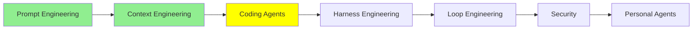

# Coding Agent'lar: Genişletme

*(Bu bir placeholder modül — şimdilik kısa bir özet; tam ders içeriği yakında geliyor.)*

Claude Code gibi kodlama agent'larının, yerleşik davranışlarının ötesinde nasıl genişletildiği ve özelleştirildiği.

**Bu modülde işlenecek konular**:
- Slash Commands
- Skills
- AGENTS.md
- Subagents
- Hooks
- MCP
- Plugins

## Eğitim İlerlemesi

