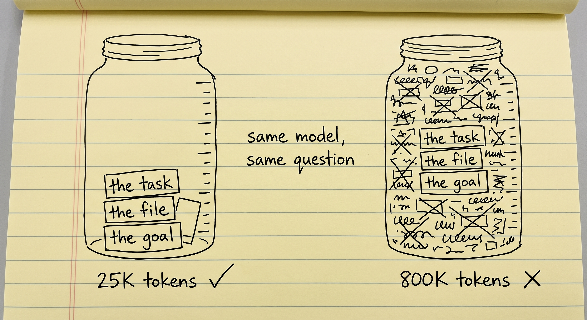
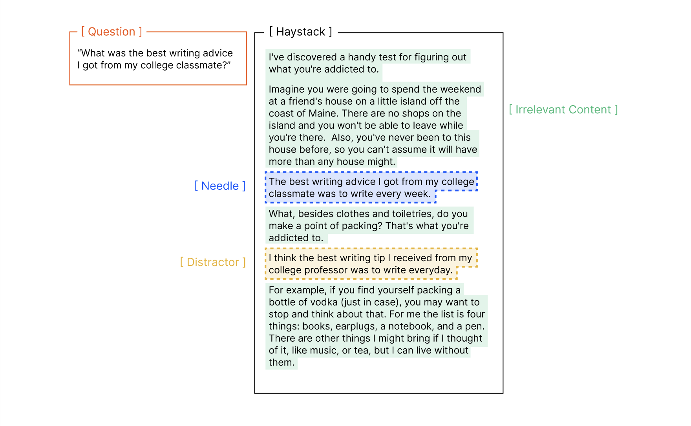
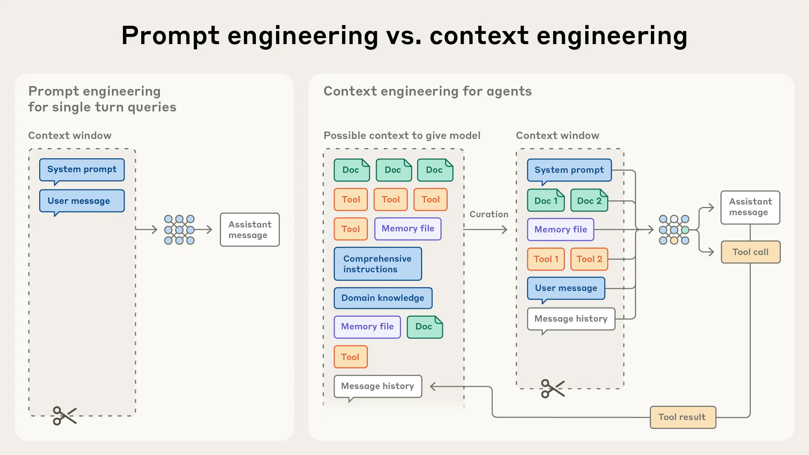
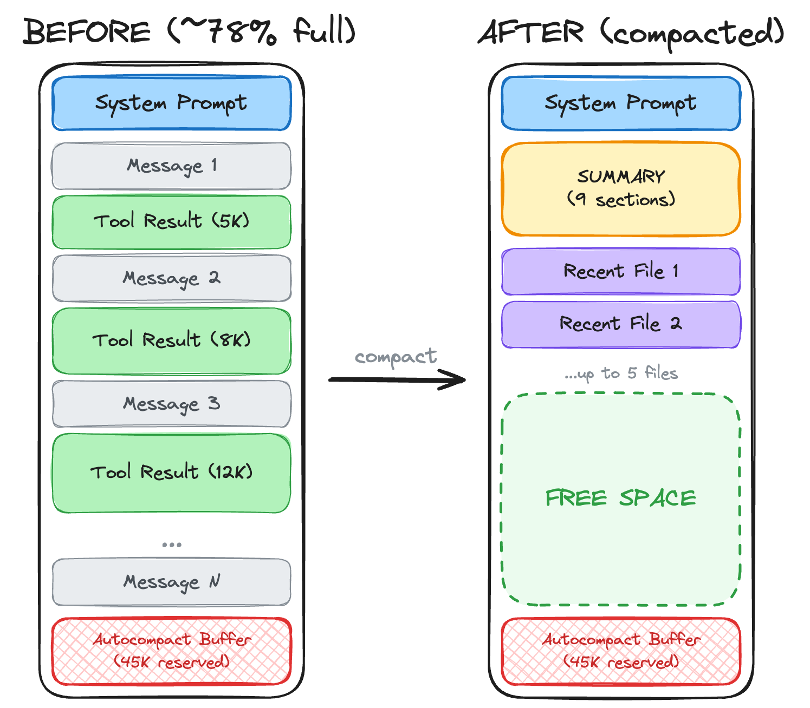
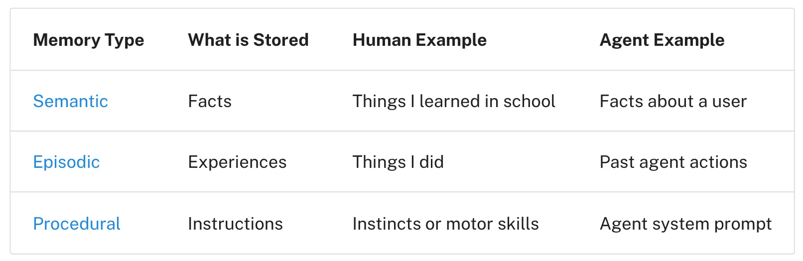
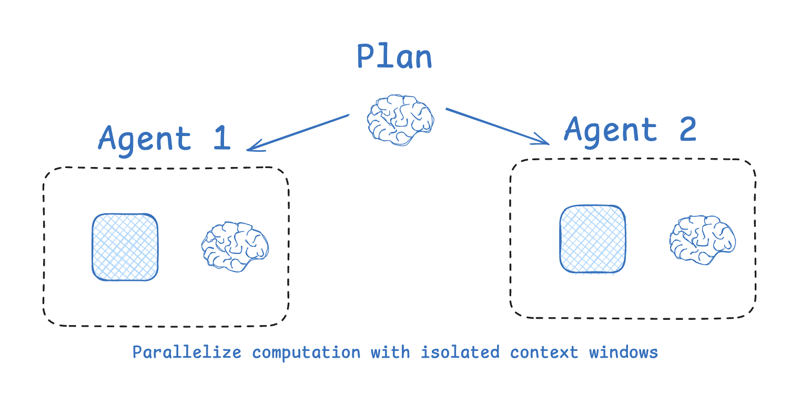
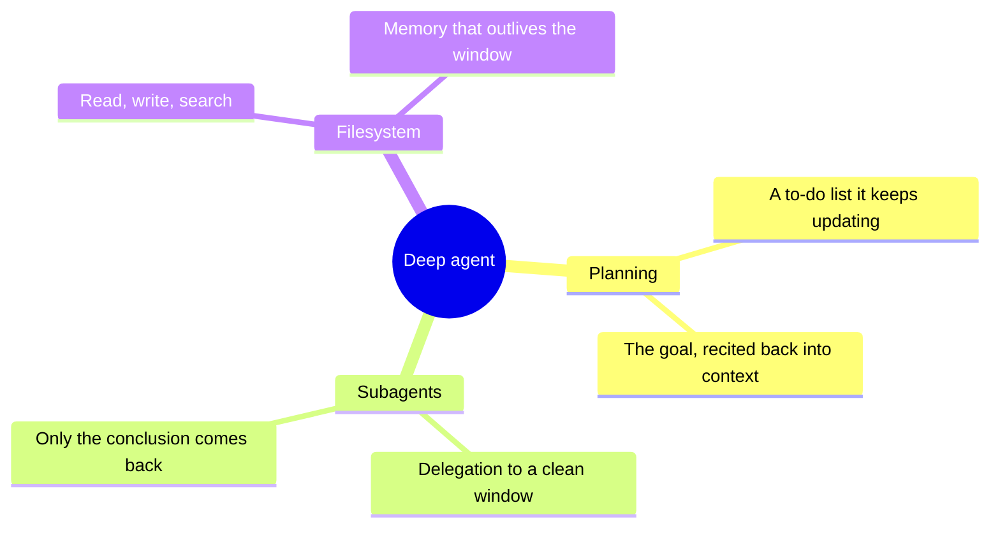
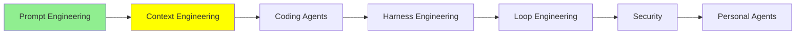

# Context Engineering

[Prompt Engineering](prompt_engineering.md) was about writing one good input. This module is about
everything else that ends up in front of the model, and about the fact that there is not enough
room for all of it.

After prompt engineering came context engineering, which became the trend of late 2025. Here we
cover where it came from, how it developed, and the techniques worth knowing.

## Everybody wanted a bigger window

Back then the whole conversation was about size. People wanted models with larger context windows,
and they were busy giving the model more and more, because more context genuinely did mean better
results.

You know the feeling if you have ever been deep in a session with a coding agent: brainstorming,
designing, going back and forth, and then you are at 95% of the window with no warning. Since more
context helped, people padded their prompts, and the window filled faster than ever.

So what did systems do when the stack outgrew the window? Mostly a **sliding window**. If the model
holds 1M tokens and your history has reached 1.4M, the window slides forward and the model only
sees the last 1M, from 0.4M to 1.4M. The first 0.4M is gone.

That is worse than it sounds. The moment you cross the line you have to sacrifice the *oldest*
context, which is usually where you explained what you were trying to do. The shared understanding
you built with the model is the first thing thrown away, and you are left copying your own earlier
prompts back in by hand to remind it what the job was.

## Then the window turned out to make things worse

While everyone was working around a full window, the Chroma team published
[Context Rot: How Increasing Input Tokens Impacts LLM Performance](https://www.trychroma.com/research/context-rot),
and the finding landed hard: **as the context grows, the model gets worse at the task.**

They ran 18 models, including GPT-4.1, Claude 4 and Gemini 2.5, and the pattern held across all of
them. The same model given the same job does it noticeably better with 25K tokens in its context
than with 800K. Not because the window overflowed. Because of what was already in it.

  
*The three things the model needs are in both jars. On the right they are still there, still legible, and still lost, because everything else in the jar is competing for the same attention.*

The phenomenon has two names in the wild: **context rot** and **context pollution**.

The reason is **attention**, the mechanism a model uses to decide which parts of its input matter
for the token it is about to write. We are not going into the theory of it. What you need is the
consequence: attention is a fixed budget, and it gets divided across everything in the window. Same
as a person. You can hold a few things in your head at once and no more, and the model that is
your agent's brain is no different. Fill its context with a lot of loosely related material and it
carries the same load a person would, and makes the same kind of mistakes.

Worth being precise about one thing, because it is the part people get wrong: this is not the
window "filling up". Performance starts sliding long before you hit the limit. A window that is
40% full can already be producing worse answers than the same window at 5%.

Here is what it feels like in practice. You start a long session to write a book, and you tell the
model up front to write in a clear academic tone. For the first stretch it does. Somewhere past
800K it stops: the tone drifts to something vague and chatty, and the model starts inventing
things. Nothing was deleted, and the window never overflowed. The instruction is still sitting
there. Its share of the attention has just been competing with everything else you have added
since, and it lost. The model has lost the map.

  
*The question asks for the classmate's advice. The needle answers it, and the distractor is the same sentence about a professor. Chroma's finding is that one distractor is enough to hurt, and that the less the needle looks like the question, the faster the whole thing falls apart as the haystack grows.*

That test has a name you will hear constantly: **needle in a haystack**. The version above is the
harder one. The easy version buries an exact phrase and asks for it back, which models do almost
perfectly. Chroma's contribution was to bury something you have to *reason* to find, and to add
plausible near-misses beside it.

Out of all of this came a set of practices, and a name for them.

## So what is context engineering

Context engineering answers one question: **what should go into the context, and what should be
kept out of it?**

The window is limited, so something has to decide. Context engineering is the art and science of
curating what goes into that limited window out of the constantly growing universe of things that
could. The goal is to maximise the tokens in context that carry real signal and minimise the ones
that are noise, so the context does not rot.

  
*On the left, one turn and one decision, which is [Prompt Engineering](prompt_engineering.md). On the right, a universe of things that could go in the window and a decision about what actually does, taken again on every single turn.*

The term took off after a [post by Andrej Karpathy](https://x.com/karpathy/status/1937902205765607626)
in mid-2025 and got its fullest treatment in Anthropic's
[Effective context engineering for AI agents](https://www.anthropic.com/engineering/effective-context-engineering-for-ai-agents),
which calls it "the set of strategies for curating and maintaining the optimal set of tokens
during LLM inference". Philipp Schmid's
[The New Skill in AI is Not Prompting, It's Context Engineering](https://www.philschmid.de/context-engineering)
puts the same idea as a job description: give the model the right information and tools, in the
right format, at the right time. LangChain sorts the techniques into four verbs, in
[Context Engineering](https://www.langchain.com/blog/context-engineering-for-agents) and in Lance
Martin's [Context Engineering for Agents](https://rlancemartin.github.io/2025/06/23/context_engineering/):
write, select, compress, isolate.

Here are the techniques worth knowing now.

## Summarisation, also called compaction

The simplest one. When the context gets long, replace it with a summary of itself: 800K tokens of
conversation become 20K tokens of "here is what we decided, here is what is still broken, here is
where we were".

Most agents now do this on their own when they get close to the limit, and some let you trigger it.
In Claude Code you type `/compact` and it happens on the spot.

  
*Notice what gets kept and what does not. The tool results are the bulk of the window and they go; the summary keeps the decisions; the handful of recent files are kept because they will be read again immediately. The reserved block at the bottom is the agent holding room for its own summarising, so it can never be caught with a full window and nowhere to write.*

The cost is real and worth stating plainly. A summary throws away the 40,000-token output of a
terminal command that nobody needs again, which is the point. But it can also throw away something
you did need, either by accident or because whatever wrote the summary judged it unimportant and was
wrong. Anthropic's own guidance on compaction is to preserve architectural decisions, unresolved
bugs and implementation details for exactly this reason.

## Offloading to files

Instead of keeping something in the context, the agent writes it down somewhere it can read later:
a markdown file, usually. The important facts leave the window and live on disk, and the agent
fetches them back when it actually needs them.

The Manus team, in
[Context Engineering for AI Agents: Lessons from Building Manus](https://manus.im/blog/Context-Engineering-for-AI-Agents-Lessons-from-Building-Manus),
put it as using the file system as context: unlimited in size, persistent by nature, and something
the agent can operate directly.

Many agents build this into a feature called **long-term memory**: an index of the things worth
keeping, so that even after the context is summarised away, the facts survive and can be searched.

Same warning as before, and it is the same root cause. Deciding what is worth keeping is a
judgement call, and the judgement belongs to either you or the model. Both get it wrong. Losing
something valuable this way is common, not rare.

[Memory](../1_fundamentals/memory.md) split memory into parametric, working and long-term. This
is the long-term one, and in practice it is usually organised in three kinds:

  
*The split matters because the three are written and read at different times. Facts about you accumulate quietly, past actions are what stop an agent repeating a mistake, and the instructions layer is just the system prompt from [Tool Calling](../1_fundamentals/tools.md) under another name.*

## A knowledge base the agent can explore

When information is genuinely valuable and stable, such as how your company's internal API works,
do not paste it into every prompt. Put it somewhere the agent can go and look: a folder of markdown
files it can read and search.

Then the agent retrieves your documentation when it decides it needs to, reads the part that
matters, and learns that much in context. Retrieval can be full RAG from
[RAG & Embeddings](../1_fundamentals/rag.md) or just an agent opening files. Either way, the alternative
is dumping the entire API reference into the window and paying for it on every turn.

One tool worth knowing here: [DeepWiki](https://deepwiki.org/) generates a wiki for a GitHub
repository. When your agent has a question about some library's internals, its architecture or its
API, it can read DeepWiki's write-up instead of crawling the repository itself and filling its
context with source files.

## Isolation, which is what subagents are for

Here is the case that makes this click.

Your coding agent needs to tell you what architecture a repository uses, and the repository is a
million lines. To answer, it has to open a lot of files. Say that costs 800K tokens of context, and
the answer is one sentence: the system orchestrates an event-driven microservices fabric, blending
distributed Kafka streams with real-time geospatial processing. One sentence, 800K tokens of context
spent to produce it, and now that 800K is sitting in the window rotting everything that comes next.

The fix is to not do the reading in that context at all. The main agent calls a second agent with
an empty context of its own, a **subagent**. The subagent does the 800K-token crawl, throws away
everything except the conclusion, and hands back the sentence. The main agent's context gains one
sentence.

  
*Each box is a separate context that starts empty and is discarded when the work is done. The main agent never sees the intermediate steps, which is the whole point: what it cannot see cannot rot its window.*

**How it works.** A subagent is a fresh agent with a clean context. The main agent calls it the way
it calls any other tool, something like `Task("find out what architecture this repo uses")`. From
[Tool Calling](../1_fundamentals/tools.md)'s point of view, nothing new is happening: a tool was
called and a tool result came back. The subagent runs its own loop, hides every intermediate step,
and returns the final answer as that result. Anthropic reports these summaries usually landing
around 1,000 to 2,000 tokens.

Modern agents call subagents in sequence or in parallel, which leaves the main agent free to do
what it is actually good at: holding the plan and deciding what happens next.

## Explicit planning, which is a to-do list

Say you ask an agent to build you a portfolio site. That means defining the scope, choosing a
stack, building the layouts, writing the content in, wiring up a CMS and configuring deployment.

Start writing code straight away and the agent will lose the map: it forgets a step, or drifts
somewhere else entirely. So instead it writes the plan down first, as a to-do list with a state on
each item:

```text
[x] Define the scope: one page, three projects, a contact form
[x] Choose the stack: Next.js, static export, no database
[~] Build the layouts: header and hero done, project grid in progress
[ ] Write the content in
[ ] Wire up a CMS
[ ] Configure deployment
```

Then it works through the list, and after each step it goes back, marks what it finished, and picks
up the next one. The big task became small tasks, and there is now a written record of which are
done, so nothing depends on the agent remembering.

The second effect is less obvious and matters more. Re-reading and rewriting that list drags the
goal back into recent context, over and over. Manus calls this **manipulating attention through
recitation**, and it is the most direct answer to the academic-tone problem above: the instruction
loses its share of attention because nothing repeats it, and a to-do list repeats it.

Hold onto the word recitation. It comes back at the end of this module, because the to-do list is
not the only thing that does it.

**How it works.** Modern agents expose this as a built-in tool. If yours does not have one and it
can reach a filesystem, it can keep a markdown file and get the same result.

> **NOTE:** these are not all of them. [Advanced Context Engineering](../3_expert/advanced_context_engineering.md) picks up the harder techniques,
> particularly for software work.

## Deep agents

**Deep agents** are an agent architecture that became popular during all of this. You do not have to
build every technique above into your own agent by hand, and this is the shape that packages them.
There are several architectures worth knowing, covered in
[Advanced Architectures](../3_expert/advanced_architectures.md); this is the one that
belongs in this module, because it is context engineering turned into a design.

To count as deep, an agent needs at least these:



Philipp Schmid's [Agents 2.0: From Shallow Loops to Deep
Agents](https://www.philschmid.de/agents-2.0-deep-agents) adds a fourth: a very long, very specific
system prompt, sometimes thousands of tokens, telling the agent when to plan, when to spawn a
subagent and how to organise its files. NVIDIA's [What Is a Deep
Agent?](https://www.nvidia.com/en-us/glossary/deep-agents/) describes the same architecture in the
same terms. You will also hear the whole idea called **Agents 2.0**, which is the same thing under a
name that makes the break from the plain loop of
[AI Agents](../1_fundamentals/agents.md) sound as big as it is. [The Agent 2.0 Era: Mastering
Long-Horizon Tasks with Deep
Agents](https://medium.com/@amirkiarafiei/the-agent-2-0-era-mastering-long-horizon-tasks-with-deep-agents-part-3-745705e13b16)
walks through it end to end.

To build one, [deepagents](https://github.com/langchain-ai/deepagents) from LangChain is the
straightforward place to start. It calls itself a batteries-included agent harness, and the
batteries are exactly this list: planning, a pluggable filesystem, subagents with isolated windows,
and summarisation of long threads. The [Deep Agents
overview](https://docs.langchain.com/oss/python/deepagents/overview) is the documentation.

The real benefit: a deep agent does most of the context engineering for you. It summarises, it
offloads, it delegates, it plans, without you wiring any of it. Some techniques still need a human,
and those are the advanced module's problem.

And the thing to notice: most agents you already use are deep agents. Claude Code, Codex, Copilot
and OpenCode all have planning, subagents and a filesystem.

## Long-horizon tasks

Put all of this together and something new appears: agents that work for hours without anyone
watching them.

You have probably seen someone get a whole website or a working game out of a single prompt. Those
are **long-horizon tasks**, and they became possible because of the techniques in this module. An
agent that can break a huge job into steps, plan them, write its own notes, offload what it does
not need, spawn subagents for the expensive parts and summarise its own context can keep going long
past the point where it would previously have lost the thread.

How far along this is has an actual measurement, which is more useful than the marketing. METR's
[Measuring AI Ability to Complete Long Software Tasks](https://arxiv.org/abs/2503.14499) asks a
simple question: take the tasks a model finishes about half the time, and how long do those tasks
take a human? That number is the model's **time horizon**. When the paper came out, Claude 3.7
Sonnet sat at roughly 50 minutes of human work, and the trend line has been doubling every seven
months or so since 2019. Extend it and month-long tasks arrive inside five years. METR keeps the
[current numbers](https://metr.org/time-horizons/) for each frontier model on one chart, at both
50% and 80% success, which is the honest way to read a claim that some agent "worked for six
hours".

Long-horizon is the keyword of 2026 and every company is chasing it, because it is the difference
between an agent that helps you work and an agent that does the work. If you want the research
landscape rather than the headline,
[Awesome-Long-Horizon-Agents](https://github.com/RUC-NLPIR/Awesome-Long-Horizon-Agents) is a
maintained reading list that sorts the whole field into what you build around the model and what
you change inside it.

## Chain of thought as a context engineering tool

One last thing, and it sits exactly between this module and the last one.

Chain of thought from [Prompt Engineering](prompt_engineering.md) does more than improve one answer. It
keeps a long session on the rails, because the model writing out its reasoning is the model
repeating the goal to itself. Take the book that drifted out of academic tone. With reasoning
turned on, the trace at that same point in the session looks something like:

```text
<thinking>
The user wants section 8, which is about slang in American society. Before I
start: their instruction from the beginning of this project was a clear academic
tone throughout, and that has not been withdrawn. The subject is informal, but
the treatment of it should not be. Academic register, slang only as quoted
examples.
</thinking>
```

Nothing was retrieved and nothing was added to the window. The model simply wrote the instruction
back into its own recent context, where attention is cheapest.

That is the same move the to-do list makes, and it is why the word recitation is worth keeping. Both
techniques work by **saying the important thing again, close to where the model is about to write**.
A to-do list recites the plan; a chain of thought recites the constraint. Attention goes to what is
near and repeated, so anything you want the model to still care about at 800K tokens has to be
repeated by something. Left alone, it fades. That is chain of thought working as a context
engineering tool, and it is the cheapest one in the module: you do not build it, you turn it on.

## Where this fits in the series



## Summary

A context window is limited, and it degrades before it is full. More context makes the answer
worse, which is the opposite of what everyone assumed in 2025, and the reason is that attention is
a fixed budget divided across whatever is in the window.

Context engineering is deciding what earns a place in there. The techniques are all versions of the
same move: get the tokens out of the window and keep a way back to them. Summarise the history,
offload facts to files, leave documentation where the agent can go and read it, hand expensive work
to a subagent with its own window, and keep a to-do list that recites the goal back into recent
context. A deep agent is an agent that does most of this for you, which is why the coding agents
you use every day already are one.

Next: the coding agents themselves, and the six ways you extend one.

**Quick Check**: why does a model get worse before its window is full, and what does a subagent
actually save you?

## References

- [Context Rot: How Increasing Input Tokens Impacts LLM Performance](https://www.trychroma.com/research/context-rot): the Chroma study behind all of this, 18 models, and the needle-and-distractor experiments
- [Effective context engineering for AI agents](https://www.anthropic.com/engineering/effective-context-engineering-for-ai-agents): the fullest treatment, and the source of the compaction and subagent guidance
- [The New Skill in AI is Not Prompting, It's Context Engineering](https://www.philschmid.de/context-engineering): the shortest good definition
- [Context Engineering](https://www.langchain.com/blog/context-engineering-for-agents): the four verbs, write, select, compress and isolate
- [Context Engineering for Agents](https://rlancemartin.github.io/2025/06/23/context_engineering/): the same four with the diagrams worth stealing
- [Karpathy on context engineering](https://x.com/karpathy/status/1937902205765607626): the post that put the term in front of everyone
- [Context Engineering for AI Agents: Lessons from Building Manus](https://manus.im/blog/Context-Engineering-for-AI-Agents-Lessons-from-Building-Manus): hard-won and specific, especially the filesystem and recitation lessons
- [Stop stuffing your context window (here's why)](https://youtube.com/shorts/9P36wMntNSI): the short version, if you would rather watch
- [DeepWiki](https://deepwiki.org/): a wiki per repository, so your agent reads about the code instead of reading the code
- [Agents 2.0: From Shallow Loops to Deep Agents](https://www.philschmid.de/agents-2.0-deep-agents): what makes an agent deep, and why it is an architecture rather than a feature
- [What Is a Deep Agent?](https://www.nvidia.com/en-us/glossary/deep-agents/): the same definition, stated plainly
- [The Agent 2.0 Era: Mastering Long-Horizon Tasks with Deep Agents](https://medium.com/@amirkiarafiei/the-agent-2-0-era-mastering-long-horizon-tasks-with-deep-agents-part-3-745705e13b16): the same architecture walked through end to end
- [deepagents](https://github.com/langchain-ai/deepagents): the library, and the [Deep Agents overview](https://docs.langchain.com/oss/python/deepagents/overview) that documents it
- [Measuring AI Ability to Complete Long Software Tasks](https://arxiv.org/abs/2503.14499): where the time-horizon number comes from, and the doubling trend
- [Task-completion time horizons](https://metr.org/time-horizons/): the current numbers per model, kept up to date
- [Awesome-Long-Horizon-Agents](https://github.com/RUC-NLPIR/Awesome-Long-Horizon-Agents): the research landscape, sorted, if you want to go deeper than this module
- [Advanced Context Engineering](../3_expert/advanced_context_engineering.md): the techniques this module left out
