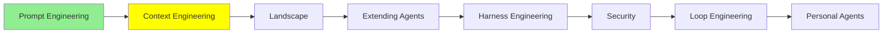

# Context Engineering

*(Bu bir placeholder modül — şimdilik kısa bir özet; tam ders içeriği yakında geliyor.)*

Bir agent'ın sınırlı context window'una neyin gireceğine karar vermek, ve görev uzadıkça context'i kullanışlı tutmak.

**Bu modülde işlenecek konular**:
- Context özetleme
- Persistent memory / context offloading (uzun süreli hafıza)
- Subagent'lar
- TODO listeleri / açık planlama

## Eğitim İlerlemesi

