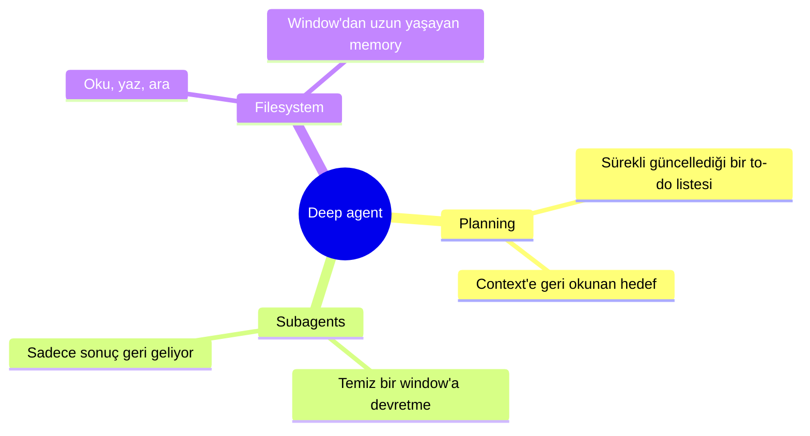
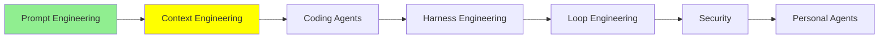

# Context Engineering

[Prompt Engineering](prompt_engineering_tr.md) tek bir iyi input yazmakla ilgiliydi. Bu modül, modelin önüne çıkan geri kalan her şeyle ve hepsi için yeterli yer olmadığı gerçeğiyle ilgili.

Prompt engineering'den sonra context engineering geldi, ve 2025'in sonlarının trendi oldu. Burada nereden çıktığını, nasıl geliştiğini ve bilinmeye değer teknikleri işliyoruz.

## Herkes daha büyük bir window istiyordu

O zamanlar bütün konuşma boyutla ilgiliydi. İnsanlar daha büyük context window'u olan modeller istiyordu, ve modele durmadan daha fazlasını veriyorlardı, çünkü daha fazla context gerçekten daha iyi sonuç demekti.

Bir coding agent'la derin bir session'da bulunduysan bu hissi biliyorsun: beyin fırtınası, tasarım, ileri geri gidiş, ve sonra hiçbir uyarı olmadan window'un %95'indesin. Daha fazla context işe yaradığı için insanlar prompt'larını doldurdu, ve window her zamankinden hızlı doldu.

Peki stack window'u aştığında sistemler ne yapıyordu? Çoğunlukla bir **sliding window**. Model 1M token tutuyorsa ve geçmişin 1.4M'ye ulaştıysa, window ileri kayıyor ve model sadece son 1M'i görüyor, yani 0.4M'den 1.4M'ye kadarını. İlk 0.4M gitmiş oluyor.

Bu kulağa geldiğinden kötü. Sınırı geçtiğin anda *en eski* context'i feda etmek zorunda kalıyorsun, ki orası da genelde ne yapmaya çalıştığını anlattığın yer. Modelle kurduğun ortak anlayış atılan ilk şey oluyor, ve işin ne olduğunu ona hatırlatmak için kendi eski prompt'larını elle geri kopyalıyorsun.

## Sonra window'un işleri kötüleştirdiği ortaya çıktı

Herkes dolu bir window'un etrafından dolaşmaya çalışırken, Chroma ekibi [Context Rot: How Increasing Input Tokens Impacts LLM Performance](https://www.trychroma.com/research/context-rot) çalışmasını yayınladı, ve bulgu ağır düştü: **context büyüdükçe model işi yapmakta kötüleşiyor.**

GPT-4.1, Claude 4 ve Gemini 2.5 dahil 18 model çalıştırdılar, ve desen hepsinde tutuyordu. Aynı iş verilen aynı model, context'inde 800K token varken olduğundan 25K token varken belirgin biçimde daha iyi yapıyor. Window taştığı için değil. İçinde zaten olan şey yüzünden.

  
*Modelin ihtiyaç duyduğu üç şey iki kavanozun da içinde. Sağdakinde hâlâ orada, hâlâ okunur, ve hâlâ kaybolmuş durumda; çünkü kavanozdaki geri kalan her şey aynı dikkat için yarışıyor.*

Bu olgunun sahada iki adı var: **context rot** ve **context pollution**.

Sebebi **attention**, yani modelin yazmak üzere olduğu token için input'un hangi kısımlarının önemli olduğuna karar vermek için kullandığı mekanizma. Teorisine girmiyoruz. İhtiyacın olan şey sonucu: attention sabit bir bütçe, ve window'daki her şeye bölünüyor. İnsanla aynı. Kafanda bir anda birkaç şey tutabiliyorsun, fazlasını değil, ve agent'ının beyni olan model de farklı değil. Context'ini birbiriyle gevşek ilgili bir sürü malzemeyle doldur, bir insanın taşıyacağı yükü taşıyor ve aynı tür hataları yapıyor.

Bir şey konusunda net olmakta değer var, çünkü insanların yanlış anladığı kısım bu: bu, window'un "dolması" değil. Performans limite çarpmadan çok önce kaymaya başlıyor. %40 dolu bir window, aynı window %5'teyken verdiğinden daha kötü cevaplar üretiyor olabilir.

Pratikte hissi şöyle. Bir kitap yazmak için uzun bir session başlatıyorsun, ve modele en başta net bir akademik tonda yazmasını söylüyorsun. Bir süre öyle yapıyor. 800K'yı geçtikten bir yerde duruyor: ton belirsiz ve sohbet havasına kayıyor, ve model şeyler uydurmaya başlıyor. Hiçbir şey silinmedi, ve window hiç taşmadı. Talimat hâlâ orada duruyor. Sadece attention'daki payı, o zamandan beri eklediğin her şeyle yarışıyordu, ve kaybetti. Model haritayı kaybetti.

  
*Soru sınıf arkadaşının tavsiyesini istiyor. Needle onu cevaplıyor, distractor da bir profesör hakkındaki aynı cümle. Chroma'nın bulgusu şu: bir tane distractor zarar vermeye yetiyor, ve needle soruya ne kadar az benzerse, haystack büyüdükçe her şey o kadar hızlı çöküyor.*

O testin sürekli duyacağın bir adı var: **needle in a haystack**. Yukarıdaki versiyonu zor olanı. Kolay versiyonu tam bir ifadeyi gömüp geri istiyor, ki modeller bunu neredeyse kusursuz yapıyor. Chroma'nın katkısı, bulmak için *akıl yürütmen* gereken bir şeyi gömmek ve yanına inandırıcı yakın-benzerler koymak oldu.

Bütün bunlardan bir pratikler kümesi ve onlara bir isim çıktı.

## Peki context engineering ne demek

Context engineering tek bir soruyu cevaplıyor: **context'e ne girmeli, ve ne dışarıda tutulmalı?**

Window sınırlı, yani bir şeyin karar vermesi gerekiyor. Context engineering, girebilecek şeylerin sürekli büyüyen evreninden o sınırlı window'a ne gireceğini seçme sanatı ve bilimi. Amaç, context'te gerçek sinyal taşıyan token'ları en yükseğe çıkarmak ve gürültü olanları en aza indirmek, böylece context çürümesin.

  
*Solda tek bir tur ve tek bir karar, ki o da Prompt Engineering. Sağda window'a girebilecek şeylerin bir evreni ve gerçekte ne girdiğine dair bir karar; hem de her turda yeniden alınan bir karar.*

Terim, 2025 ortalarında [Andrej Karpathy'nin bir post'undan](https://x.com/karpathy/status/1937902205765607626) sonra yayıldı ve en dolu işlenişini Anthropic'in [Effective context engineering for AI agents](https://www.anthropic.com/engineering/effective-context-engineering-for-ai-agents) yazısında buldu; orada "LLM inference sırasında en uygun token kümesini seçme ve koruma stratejileri kümesi" diye tanımlanıyor. Philipp Schmid'in [The New Skill in AI is Not Prompting, It's Context Engineering](https://www.philschmid.de/context-engineering) yazısı aynı fikri bir iş tanımı gibi koyuyor: modele doğru bilgiyi ve tool'ları, doğru biçimde, doğru zamanda ver. LangChain teknikleri dört fiile ayırıyor, [Context Engineering](https://www.langchain.com/blog/context-engineering-for-agents) yazısında ve Lance Martin'in [Context Engineering for Agents](https://rlancemartin.github.io/2025/06/23/context_engineering/) yazısında: write, select, compress, isolate.

Şimdi bilinmeye değer teknikler.

## Summarisation, yani compaction

En basit olanı. Context uzayınca onu kendisinin bir özetiyle değiştir: 800K token'lık konuşma, 20K token'lık "şuna karar verdik, şu hâlâ bozuk, şurada kalmıştık"a dönüşüyor.

Çoğu agent artık limite yaklaşınca bunu kendi başına yapıyor, bazıları da tetiklemene izin veriyor. Claude Code'da `/compact` yazıyorsun ve anında oluyor.

  
*Neyin tutulduğuna ve neyin tutulmadığına dikkat et. Tool sonuçları window'un büyük kısmı ve gidiyorlar; özet kararları tutuyor; birkaç yeni dosya tutuluyor çünkü hemen tekrar okunacaklar. Alttaki ayrılmış blok, agent'ın kendi özetlemesi için yer tutması; böylece hiç dolu bir window'la ve yazacak yeri olmadan yakalanamıyor.*

Maliyeti gerçek ve düpedüz söylemeye değer. Bir özet, kimsenin bir daha ihtiyaç duymadığı bir terminal komutunun 40.000 token'lık çıktısını atıyor, ki amaç da bu. Ama ihtiyacın olan bir şeyi de atabiliyor; ya kazara, ya da özeti yazan şey onu önemsiz sayıp yanıldığı için. Anthropic'in compaction hakkındaki kendi rehberi de tam bu yüzden mimari kararların, çözülmemiş bug'ların ve implementasyon detaylarının korunmasını söylüyor.

## Dosyalara offloading

Bir şeyi context'te tutmak yerine agent onu sonradan okuyabileceği bir yere yazıyor: genelde bir markdown dosyasına. Önemli gerçekler window'dan çıkıp diskte yaşıyor, ve agent gerçekten ihtiyaç duyduğunda onları geri getiriyor.

Manus ekibi, [Context Engineering for AI Agents: Lessons from Building Manus](https://manus.im/blog/Context-Engineering-for-AI-Agents-Lessons-from-Building-Manus) yazısında, bunu filesystem'i context olarak kullanmak diye koyuyor: boyutta sınırsız, doğası gereği kalıcı, ve agent'ın doğrudan işletebildiği bir şey.

Birçok agent bunu **long-term memory** adlı bir feature olarak içine kuruyor: tutulmaya değer şeylerin bir index'i, böylece context özetlenip gittikten sonra bile gerçekler hayatta kalıyor ve aranabiliyor.

Aynı uyarı, ve aynı kök sebep. Neyin tutulmaya değer olduğuna karar vermek bir yargı, ve yargı ya senin ya modelin. İkisi de yanlış yapıyor. Değerli bir şeyi böyle kaybetmek nadir değil, yaygın.

[Memory](../1_fundamentals/memory_tr.md) memory'yi parametrik, working ve long-term diye ayırmıştı. Bu, long-term olanı, ve pratikte genelde üç türde düzenleniyor:

  
*Ayrım önemli çünkü üçü farklı zamanlarda yazılıp okunuyor. Senin hakkındaki gerçekler sessizce birikiyor, geçmiş eylemler bir agent'ın aynı hatayı tekrarlamasını engelleyen şey, ve talimatlar katmanı da Tool Calling'deki system prompt'un başka bir isim altındaki hâli.*

## Agent'ın gezebileceği bir knowledge base

Bilgi gerçekten değerli ve durağan olduğunda, mesela şirketinin iç API'sinin nasıl çalıştığı gibi, onu her prompt'a yapıştırma. Agent'ın gidip bakabileceği bir yere koy: okuyup arayabileceği bir markdown dosyaları klasörüne.

Sonra agent ihtiyaç duyduğuna karar ettiğinde dokümantasyonunu getiriyor, önemli olan kısmı okuyor, ve o kadarını context'te öğreniyor. Getirme işi [RAG & Embeddings](../1_fundamentals/rag_tr.md)'deki tam RAG olabilir ya da sadece dosya açan bir agent. Her iki durumda da alternatifi, bütün API referansını window'a boşaltmak ve her turda onun bedelini ödemek.

Burada bilinmeye değer bir tool: [DeepWiki](https://deepwiki.org/) bir GitHub repo'su için wiki üretiyor. Agent'ının bir library'nin iç yapısı, mimarisi ya da API'si hakkında sorusu olduğunda, repo'yu kendisi taramak ve context'ini kaynak dosyalarla doldurmak yerine DeepWiki'nin yazdığını okuyabiliyor.

## Isolation, yani subagent'ların varlık sebebi

İşi netleştiren durum şu.

Coding agent'ının sana bir repo'nun hangi mimariyi kullandığını söylemesi gerekiyor, ve repo bir milyon satır. Cevaplamak için bir sürü dosya açması lazım. Diyelim bu 800K token'lık context'e mal oluyor, ve cevap tek bir cümle: sistem, dağıtık Kafka stream'lerini gerçek zamanlı geospatial işlemeyle harmanlayan event-driven bir microservices dokusunu orkestre ediyor. Tek cümle, onu üretmek için harcanmış 800K token'lık context, ve şimdi o 800K window'da oturup sonrasında gelen her şeyi çürütüyor.

Çözüm, okumayı o context'te hiç yapmamak. Ana agent, kendi boş context'i olan ikinci bir agent'ı çağırıyor: bir **subagent**. Subagent 800K token'lık taramayı yapıyor, sonuç dışındaki her şeyi atıyor, ve cümleyi geri veriyor. Ana agent'ın context'i bir cümle kazanıyor.

  
*Her kutu, boş başlayan ve iş bitince atılan ayrı bir context. Ana agent ara adımları hiç görmüyor, ki bütün amaç da bu: göremediği şey window'unu çürütemiyor.*

**Nasıl çalışıyor.** Subagent, temiz context'i olan yeni bir agent. Ana agent onu başka herhangi bir tool'u çağırdığı gibi çağırıyor, `Task("bu repo'nun hangi mimariyi kullandığını bul")` gibi bir şeyle. [Tool Calling](../1_fundamentals/tools_tr.md)'in bakış açısından yeni bir şey olmuyor: bir tool çağrıldı ve bir tool sonucu geldi. Subagent kendi loop'unu çalıştırıyor, her ara adımı saklıyor, ve son cevabı o sonuç olarak döndürüyor. Anthropic bu özetlerin genelde 1.000 ile 2.000 token civarına düştüğünü bildiriyor.

Modern agent'lar subagent'ları sırayla ya da paralel çağırıyor, ki bu da ana agent'ı gerçekten iyi olduğu şeyi yapmak için serbest bırakıyor: planı tutmak ve sırada ne olacağına karar vermek.

## Explicit planning, yani bir to-do listesi

Diyelim bir agent'tan sana bir portfolyo sitesi yapmasını istiyorsun. Bu, kapsamı tanımlamak, bir stack seçmek, layout'ları kurmak, içeriği yazmak, bir CMS bağlamak ve deployment'ı yapılandırmak demek.

Hemen kod yazmaya başla, agent haritayı kaybediyor: bir adımı atlıyor, ya da tamamen başka bir yere kayıyor. Bunun yerine planı önce yazıyor, her maddesinde bir durum olan bir to-do listesi olarak:

```text
[x] Kapsamı tanımla: tek sayfa, üç proje, bir iletişim formu
[x] Stack'i seç: Next.js, static export, veritabanı yok
[~] Layout'ları kur: header ve hero bitti, proje grid'i devam ediyor
[ ] İçeriği yaz
[ ] Bir CMS bağla
[ ] Deployment'ı yapılandır
```

Sonra listede ilerliyor, ve her adımdan sonra geri dönüp bitirdiğini işaretliyor ve sıradakini alıyor. Büyük iş küçük işlere dönüştü, ve artık hangilerinin bittiğine dair yazılı bir kayıt var, yani hiçbir şey agent'ın hatırlamasına bağlı değil.

İkinci etki daha az belli ve daha çok önemli. O listeyi tekrar tekrar okumak ve yeniden yazmak, hedefi durmadan yakın context'e geri çekiyor. Manus buna **recitation ile attention'ı yönlendirmek** diyor, ve bu, yukarıdaki akademik ton probleminin en doğrudan cevabı: talimat attention payını kaybediyor çünkü hiçbir şey onu tekrarlamıyor, ve bir to-do listesi onu tekrarlıyor.

Recitation kelimesini akılda tut. Bu modülün sonunda geri geliyor, çünkü to-do listesi bunu yapan tek şey değil.

**Nasıl çalışıyor.** Modern agent'lar bunu yerleşik bir tool olarak veriyor. Seninkinde yoksa ve bir filesystem'e ulaşabiliyorsa, bir markdown dosyası tutup aynı sonucu alabiliyor.

> **NOT:** bunlar hepsi değil. [Advanced Context Engineering](../3_expert/advanced_context_engineering_tr.md) daha zor teknikleri, özellikle yazılım işi için olanları alıyor.

## Deep agent'lar

**Deep agent'lar**, bütün bunlar olurken popüler olan bir agent mimarisi. Yukarıdaki her tekniği kendi agent'ına elle kurmak zorunda değilsin, ve onları paketleyen şekil bu. Bilinmeye değer birkaç mimari var, [Advanced Architectures](../3_expert/advanced_architectures_tr.md)'da işleniyor; bu modüle ait olan bu, çünkü tasarıma dönüşmüş context engineering.

Deep sayılmak için bir agent'ın en azından bunlara ihtiyacı var:



Philipp Schmid'in [Agents 2.0: From Shallow Loops to Deep Agents](https://www.philschmid.de/agents-2.0-deep-agents) yazısı bir dördüncüsünü ekliyor: çok uzun, çok özgül, bazen binlerce token'lık bir system prompt; agent'a ne zaman plan yapacağını, ne zaman subagent açacağını ve dosyalarını nasıl düzenleyeceğini söyleyen. NVIDIA'nın [What Is a Deep Agent?](https://www.nvidia.com/en-us/glossary/deep-agents/) sayfası aynı mimariyi aynı terimlerle anlatıyor. Bütün fikri **Agents 2.0** diye de duyacaksın, ki [AI Agent'lar](../1_fundamentals/agents_tr.md)'daki düz loop'tan kopuşu olduğu kadar büyük gösteren bir isim altında aynı şey. [The Agent 2.0 Era: Mastering Long-Horizon Tasks with Deep Agents](https://medium.com/@amirkiarafiei/the-agent-2-0-era-mastering-long-horizon-tasks-with-deep-agents-part-3-745705e13b16) onu baştan sona geziyor.

Bir tane kurmak için LangChain'in [deepagents](https://github.com/langchain-ai/deepagents) kütüphanesi başlanacak en düz yer. Kendisine batteries-included bir agent harness diyor, ve bataryalar tam olarak bu liste: planlama, takılabilir bir filesystem, izole window'ları olan subagent'lar, ve uzun thread'lerin özetlenmesi. [Deep Agents overview](https://docs.langchain.com/oss/python/deepagents/overview) de dokümantasyonu.

Gerçek faydası: bir deep agent context engineering'in çoğunu senin için yapıyor. Özetliyor, offload ediyor, devrediyor, plan yapıyor; sen hiçbirini bağlamadan. Bazı teknikler hâlâ bir insan gerektiriyor, ve onlar da advanced modülün problemi.

Ve dikkat edilecek şey: zaten kullandığın agent'ların çoğu deep agent. Claude Code, Codex, Copilot ve OpenCode'un hepsinde planlama, subagent'lar ve bir filesystem var.

## Long-horizon işler

Bütün bunları bir araya koy ve yeni bir şey ortaya çıkıyor: kimse izlemeden saatlerce çalışan agent'lar.

Birinin tek bir prompt'tan koca bir web sitesi ya da çalışan bir oyun çıkardığını muhtemelen gördün. Bunlar **long-horizon** işler, ve bu modüldeki teknikler sayesinde mümkün oldular. Kocaman bir işi adımlara bölebilen, onları planlayabilen, kendi notlarını yazabilen, ihtiyaç duymadığını offload edebilen, pahalı kısımlar için subagent açabilen ve kendi context'ini özetleyebilen bir agent, daha önce ipi kaybedeceği noktanın çok ötesine devam edebiliyor.

Bunun ne kadar ilerlediğinin gerçek bir ölçümü var, ki pazarlamadan daha faydalı. METR'in [Measuring AI Ability to Complete Long Software Tasks](https://arxiv.org/abs/2503.14499) çalışması basit bir soru soruyor: bir modelin yaklaşık yarı yarıya bitirdiği işleri al, ve o işler bir insanın ne kadar zamanını alıyor? O sayı modelin **time horizon**'u. Makale çıktığında Claude 3.7 Sonnet kabaca 50 dakikalık insan işinde duruyordu, ve trend çizgisi 2019'dan beri yedi ayda bir ikiye katlanıyor. Uzat, ve aylık işler beş yıl içinde geliyor. METR her frontier model için [güncel sayıları](https://metr.org/time-horizons/) tek bir grafikte, hem %50 hem %80 başarıda tutuyor, ki bir agent'ın "altı saat çalıştığı" iddiasını okumanın dürüst yolu da bu.

Long-horizon 2026'nın anahtar kelimesi ve her şirket peşinde, çünkü sana çalışmanda yardım eden agent ile işi yapan agent arasındaki fark bu. Manşet yerine araştırma manzarasını istersen, [Awesome-Long-Horizon-Agents](https://github.com/RUC-NLPIR/Awesome-Long-Horizon-Agents) bütün alanı modelin etrafında ne kurduğun ve içinde ne değiştirdiğin diye ayıran, güncel tutulan bir okuma listesi.

## Bir context engineering tool'u olarak chain of thought

Son bir şey, ve tam olarak bu modülle bir öncekinin arasında duruyor.

[Prompt Engineering](prompt_engineering_tr.md)'deki chain of thought tek bir cevabı iyileştirmekten fazlasını yapıyor. Uzun bir session'ı rayda tutuyor, çünkü akıl yürütmesini yazan model, hedefi kendine tekrarlayan model. Akademik tondan kayan kitabı al. Reasoning açıkken, session'ın aynı noktasındaki trace şuna benzer bir şey oluyor:

```text
<thinking>
Kullanıcı 8. bölümü istiyor, konusu Amerikan toplumunda argo. Başlamadan
önce: bu projenin başındaki talimatı baştan sona net bir akademik tondu,
ve o geri alınmadı. Konu resmî değil, ama işlenişi öyle olmamalı.
Akademik register, argo sadece alıntılanan örnekler olarak.
</thinking>
```

Hiçbir şey getirilmedi ve window'a hiçbir şey eklenmedi. Model sadece talimatı kendi yakın context'ine geri yazdı, ki attention'ın en ucuz olduğu yer de orası.

Bu, to-do listesinin yaptığı hamlenin aynısı, ve recitation kelimesini tutmaya değmesinin sebebi de bu. İki teknik de **önemli olan şeyi, modelin yazmak üzere olduğu yerin yakınında tekrar söyleyerek** çalışıyor. To-do listesi planı tekrarlıyor; chain of thought kısıtı tekrarlıyor. Attention yakın ve tekrarlanan şeye gidiyor, yani modelin 800K token'da hâlâ önemsemesini istediğin her şeyin bir şey tarafından tekrarlanması gerekiyor. Kendi hâline bırakılırsa soluyor. Bu, chain of thought'un bir context engineering tool'u olarak çalışması, ve modüldeki en ucuz olanı: onu kurmuyorsun, açıyorsun.

## Bu serinin neresindeyiz



## Özet

Bir context window sınırlı, ve dolmadan önce bozulmaya başlıyor. Daha fazla context cevabı kötüleştiriyor, ki bu 2025'te herkesin varsaydığının tersi, ve sebebi de attention'ın window'da ne varsa ona bölünen sabit bir bütçe olması.

Context engineering, oraya neyin girmeyi hak ettiğine karar vermek. Teknikler hepsi aynı hamlenin versiyonları: token'ları window'dan çıkar ve onlara geri dönen bir yol bırak. Geçmişi özetle, gerçekleri dosyalara offload et, dokümantasyonu agent'ın gidip okuyabileceği bir yerde bırak, pahalı işi kendi window'u olan bir subagent'a devret, ve hedefi yakın context'e geri okuyan bir to-do listesi tut. Deep agent, bunun çoğunu senin için yapan agent, ki her gün kullandığın coding agent'ların zaten bir tane olmasının sebebi de bu.

Sırada: agent'ların kendisi, ve birini genişletmenin altı yolu.

**Hızlı Kontrol**: bir model neden window'u dolmadan önce kötüleşiyor, ve bir subagent gerçekte sana neyi kazandırıyor?

## Kaynaklar

- [Context Rot: How Increasing Input Tokens Impacts LLM Performance](https://www.trychroma.com/research/context-rot): bütün bunların arkasındaki Chroma çalışması, 18 model, ve needle ile distractor deneyleri
- [Effective context engineering for AI agents](https://www.anthropic.com/engineering/effective-context-engineering-for-ai-agents): en dolu işlenişi, ve compaction ile subagent rehberliğinin kaynağı
- [The New Skill in AI is Not Prompting, It's Context Engineering](https://www.philschmid.de/context-engineering): en kısa iyi tanım
- [Context Engineering](https://www.langchain.com/blog/context-engineering-for-agents): dört fiil, write, select, compress ve isolate
- [Context Engineering for Agents](https://rlancemartin.github.io/2025/06/23/context_engineering/): aynı dördü, alınmaya değer diyagramlarla
- [Karpathy on context engineering](https://x.com/karpathy/status/1937902205765607626): terimi herkesin önüne koyan post
- [Context Engineering for AI Agents: Lessons from Building Manus](https://manus.im/blog/Context-Engineering-for-AI-Agents-Lessons-from-Building-Manus): zor kazanılmış ve özgül, özellikle filesystem ile recitation dersleri
- [Stop stuffing your context window (here's why)](https://youtube.com/shorts/9P36wMntNSI): izlemeyi tercih edersen kısa versiyon
- [DeepWiki](https://deepwiki.org/): repo başına bir wiki, böylece agent'ın kodu okumak yerine kod hakkında okuyor
- [Agents 2.0: From Shallow Loops to Deep Agents](https://www.philschmid.de/agents-2.0-deep-agents): bir agent'ı deep yapan şey, ve neden bir feature değil mimari olduğu
- [What Is a Deep Agent?](https://www.nvidia.com/en-us/glossary/deep-agents/): aynı tanım, düpedüz söylenmiş
- [The Agent 2.0 Era: Mastering Long-Horizon Tasks with Deep Agents](https://medium.com/@amirkiarafiei/the-agent-2-0-era-mastering-long-horizon-tasks-with-deep-agents-part-3-745705e13b16): aynı mimari baştan sona gezilmiş
- [deepagents](https://github.com/langchain-ai/deepagents): kütüphane, ve onu dokümante eden [Deep Agents overview](https://docs.langchain.com/oss/python/deepagents/overview)
- [Measuring AI Ability to Complete Long Software Tasks](https://arxiv.org/abs/2503.14499): time-horizon sayısının çıktığı yer, ve ikiye katlanma trendi
- [Task-completion time horizons](https://metr.org/time-horizons/): model başına güncel sayılar, güncel tutuluyor
- [Awesome-Long-Horizon-Agents](https://github.com/RUC-NLPIR/Awesome-Long-Horizon-Agents): araştırma manzarası, sıralanmış, bu modülden daha derine gitmek istersen
- [Advanced Context Engineering](../3_expert/advanced_context_engineering_tr.md): bu modülün dışarıda bıraktığı teknikler
