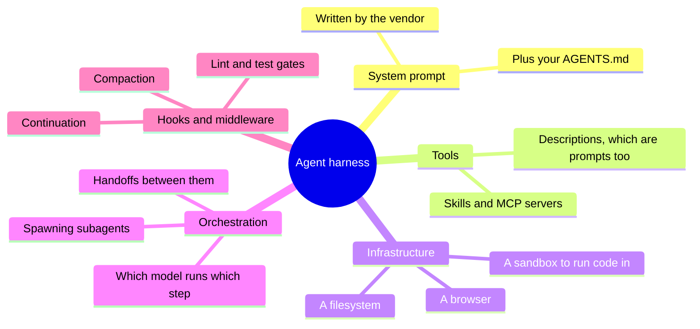
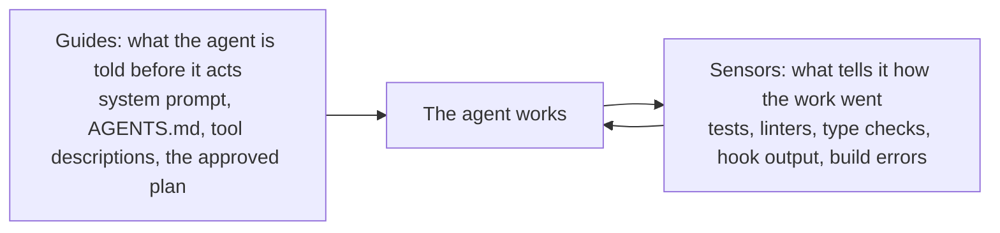
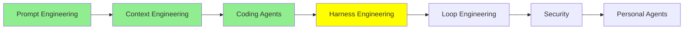

# Harness Engineering

[Coding Agents: Extending Them](coding_agents.md) ended on hooks, which were the first thing in that module the model does not get a vote on. Everything else was advice: good advice, usually followed, never guaranteed. A hook is a shell command wired to a fixed point in the agent's life, and it runs regardless.

That difference is this whole module.

## The problem prompts do not solve

LLMs are non-deterministic. Whatever you do with the prompt and whatever you put in the context, the same input can produce a different answer next time, and an agent running for two hours has a lot of next times.

So no amount of asking nicely gets you a guarantee. If the agent must never push to main, "please do not push to main" is a request with a good success rate, and a good success rate is not what you want from that particular sentence. You need something mechanical: deterministic wiring around the model that holds while the model does whatever it is going to do.

Designing that wiring is **harness engineering**.

  
*The engine is the prompt: the thing that makes power. The car is the context: the body built around the engine that decides what the power can do. The track and the barriers are the harness. Notice the barriers do not steer, and that is the point. They do not make the car go the right way, they make going the wrong way impossible.*

The analogy is from [Harness Engineering: What It Is and How It Complements Context Engineering](https://medium.com/@amirkiarafiei/harness-engineering-what-it-is-and-how-it-complements-context-engineering-6545b40bfc84), and it carries into the next two modules, so it is worth holding.

## What an agent harness is

Apply harness engineering and what you end up with is an **agent harness**: an agent plus the mechanical wiring and the environment it runs in.

LangChain's [The Anatomy of an Agent Harness](https://www.langchain.com/blog/the-anatomy-of-an-agent-harness) reduces it to one line: **Agent = Model + Harness.** The model supplies the intelligence. The harness is what makes that intelligence do useful work in a real place with real files.

Which means the products you already use are harnesses. Claude Code is a harness. Codex is a harness. Pi is a harness. None of them is a model, and swapping the model inside one changes far less than people expect.

One thing to get straight, because the word is used loosely: the harness is the **outer** layer, not a competing one. It contains the prompt and context work rather than replacing it.

  
*Each ring contains the one inside it, which is why these are never alternatives. Choosing a harness has already decided things about your context, because the harness is what compacts the window, spawns the subagents and writes the system prompt. You cannot do context engineering "instead of" harness engineering; you do it inside whichever harness you picked.*

## Four disciplines, four questions

By 2026 this has settled into four jobs with four different questions.

  
*Read it bottom to top and each layer takes in the one below it. Saying is one turn. Seeing is the whole window. Building the world is everything the agent can reach and everything that stops it, and the human moves from talking to the robot to constructing the place it works in.*

- **Prompt engineering**: what, and how, should I ask?
- **Context engineering**: what should the model see in its context, and in what form?
- **Harness engineering**: how should I design the environment around the agent?
- **Loop engineering**: who decides when it runs again, and when it stops? That is the next module.

## What a harness is made of

[The Anatomy of an Agent Harness](https://www.langchain.com/blog/the-anatomy-of-an-agent-harness) lists the parts, and most of them are things you now recognise from the last module:

Notice that the tool *descriptions* are in there. A tool's description is a prompt the model reads when deciding whether to call it, so renaming a tool or rewriting one sentence of its description changes behaviour. That is harness work, not prompt work, because you are editing the environment rather than the request.

The sharpest way to organise all of this comes from Birgitta Böckeler's [Harness engineering for coding agent users](https://martinfowler.com/articles/harness-engineering.html), which splits a harness into two kinds of thing:

Guides go in front of the work. Sensors report on it afterwards, and their output goes back to the agent so it can fix what it broke. Most harness engineering is adding one or the other, and if you are ever unsure whether something counts as harness work, ask which of the two it is.

## Some actual examples

Concretely, then. A few things people do, all of them small:

- **A sandbox.** The agent runs commands in a container with no network and a mounted copy of the repository. Now "delete everything" costs you a container.
- **A permission gate.** A `PreToolUse` hook that refuses writes outside `src/` and refuses `git push` entirely. The model can attempt it and simply cannot do it.
- **A test gate on finishing.** A `Stop` hook that runs the suite and, if anything is red, tells the agent it is not done. The agent does not get to decide it finished.
- **A format-on-write hook.** `PostToolUse` runs the formatter on every edited file, so style stops depending on the agent remembering the style.
- **A loop detector.** Count edits per file, and after the fifth edit to the same file tell the agent to stop and reconsider, because five edits to one file usually means it is going in circles.

That last one is real and it came with numbers. LangChain's [Improving Deep Agents with harness engineering](https://www.langchain.com/blog/improving-deep-agents-with-harness-engineering) describes five changes to their coding agent's harness: a restructured system prompt around plan, build, verify and fix; a checklist middleware that intercepts the agent before it exits and makes it verify its work against the spec; a startup step that maps the directory tree and available tools; the per-file edit counter above; and a "reasoning sandwich" that spends maximum reasoning on planning and verification while dropping it for the mechanical middle.

**The model did not change.** Terminal Bench 2.0 went from 52.8% to 66.5%.

Hold that number, because it is the argument for this module existing. Nearly fourteen points from editing the environment, with the same weights doing the thinking.

If you want to build one rather than read about one, [How to Build a Custom Agent Harness](https://www.langchain.com/blog/how-to-build-a-custom-agent-harness) walks through doing it with middleware. OpenAI's [Harness engineering: leveraging Codex in an agent-first world](https://openai.com/index/harness-engineering/) is the same discipline from the other side, and its main lesson is about knowledge: they keep a structured `docs/` directory as the system of record, keep `AGENTS.md` short as a map into it, and then run linters, CI jobs and a recurring gardening agent whose whole job is finding documentation that has gone stale. Which is a sensor pointed at the guides.

## No harness is best for every model

Here is the finding that surprises people.

Take one model, run it on one benchmark, and change nothing but the harness. The scores move a lot.

  
*One model, one task set, eight harnesses, and the spread runs from 14 to 20 out of 30. The bottom bar and the top bar are the same weights doing the thinking. Also worth reading past the winner: the source measured cost and speed too, and the fastest harness here was also the most expensive per success, because it barely reused its prompt cache.*

That chart is from Composio's [Finding the Best Harness for DeepSeek V4 Flash](https://composio.dev/content/best-agent-harness-deepseek-v4-flash), which ran the model through Pi Agent, Prime Agent, OMP, Claude Code, Codex, DeepAgents, Hermes Agent and OpenCode. Pi Agent came first at 66.7%, twenty of thirty workflows, and Claude Code was the fastest at 122.7 seconds per task while costing the most per success.

The lesson is not "use Pi Agent". It is that **the pairing matters**, and it is a bit like a t-shirt: there is no single size that fits everybody. Claude Code's harness is tuned for Claude models. Codex's is tuned for GPT models. A harness makes assumptions about how its model plans, how it handles long tool outputs, how eagerly it calls things, and a model with different habits does worse inside those assumptions than inside ones built for it.

So when you read that some model is state of the art, the honest question is which harness the number came from.

## The harnesses are open now

The other thing that changed by 2026: a lot of these are open source, including commercial ones.

Claude Code's harness is open. So is [DeepSeek's](https://github.com/deepseek-ai/deepseek-harness), published beside the model it was tuned for, which tells you the two are designed together. OpenCode, Pi and LangChain's [deepagents](https://github.com/langchain-ai/deepagents) are open. So are the personal agent harnesses, Hermes and OpenClaw, which get their own module in [Personal Agents](personal_agents.md).

This is genuinely useful, and not only for reading. You can take a harness that works and change the parts that do not suit your job: swap the system prompt, add a middleware, change a tool description, point it at a different model.

Two maintained lists if you want to shop around: [best-of-Agent-Harnesses](https://github.com/RyanAlberts/best-of-Agent-Harnesses) ranks more than a hundred of them and rescores weekly, and [awesome-harness-engineering](https://github.com/walkinglabs/awesome-harness-engineering) collects the tools and guides.

> **NOTE:** this module stays at the level of what a harness is and why it matters. [Advanced Harness Engineering](../3_expert/advanced_harness_engineering.md) takes on harness profiles, self-evolving harnesses, and the question of how much of the harness is moving inside the model. Böckeler's [Harness engineering for coding agent users](https://martinfowler.com/articles/harness-engineering.html) is the deepest treatment available and belongs with that module rather than this one.

## Where this fits in the series

## Summary

A model is non-deterministic, so instructions get you a good success rate and never a guarantee. A harness is the mechanical part that holds anyway: the system prompt, the tools and their descriptions, the filesystem and sandbox, the orchestration of subagents, and the hooks that fire whether the model wanted them to or not.

Agent = Model + Harness. Claude Code, Codex and Pi are harnesses, and the harness is the outer ring that contains your prompt and context work rather than competing with it. Split it into guides, which the agent reads before acting, and sensors, which tell it how the work went.

It is worth real effort, because the effect is measurable: five harness changes moved one agent from 52.8% to 66.5% on Terminal Bench 2.0 with the model untouched. And the pairing is specific, because one model across eight harnesses scored anywhere from 14 to 20 out of 30. There is no best harness, only a best fit.

Next: everything so far still has you in the driver's seat. You prompt, you read the output, you decide what happens next. The next module replaces that person.

**Quick Check**: an instruction in AGENTS.md and a `PreToolUse` hook can both stop an agent touching a file. Why is only one of them harness engineering, and when does the difference actually matter?

## References

- [Harness Engineering: What It Is and How It Complements Context Engineering](https://medium.com/@amirkiarafiei/harness-engineering-what-it-is-and-how-it-complements-context-engineering-6545b40bfc84): the car, the track and the barriers, at length
- [The Anatomy of an Agent Harness](https://www.langchain.com/blog/the-anatomy-of-an-agent-harness): Agent = Model + Harness, and the component list this module works from
- [How to Build a Custom Agent Harness](https://www.langchain.com/blog/how-to-build-a-custom-agent-harness): the same thing as a build, using middleware
- [Improving Deep Agents with harness engineering](https://www.langchain.com/blog/improving-deep-agents-with-harness-engineering): five concrete changes and the 52.8% to 66.5% they produced
- [Harness engineering: leveraging Codex in an agent-first world](https://openai.com/index/harness-engineering/): a team that built a product with agents, and what they had to do to their repository first
- [Harness engineering for coding agent users](https://martinfowler.com/articles/harness-engineering.html): the guides-and-sensors framing, and the most thorough treatment of the subject
- [Finding the Best Harness for DeepSeek V4 Flash](https://composio.dev/content/best-agent-harness-deepseek-v4-flash): eight harnesses, one model, with cost and speed alongside the pass rate
- [DeepSeek Harness](https://github.com/deepseek-ai/deepseek-harness): a harness published beside the model it was tuned for
- [deepagents](https://github.com/langchain-ai/deepagents): the open harness from the anatomy article
- [best-of-Agent-Harnesses](https://github.com/RyanAlberts/best-of-Agent-Harnesses): a ranked list of more than a hundred, rescored weekly
- [awesome-harness-engineering](https://github.com/walkinglabs/awesome-harness-engineering): tools and guides for the practice
- [Agent Harness Explained in 2 minutes](https://youtube.com/shorts/IVdJj_aNwhE): the short version, if you would rather watch
- [Advanced Harness Engineering](../3_expert/advanced_harness_engineering.md): profiles, self-evolving harnesses, and what is moving into the model
