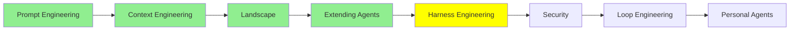

# Harness Engineering

*(Bu bir placeholder modül — şimdilik kısa bir özet; tam ders içeriği yakında geliyor.)*

Agent loop'unu saran programın ('harness') tasarımı, ki agent güvenli ve öngörülebilir şekilde çalışsın.

**Bu modülde işlenecek konular**:
- Guardrails
- Hooks
- Sandboxes

## Eğitim İlerlemesi

