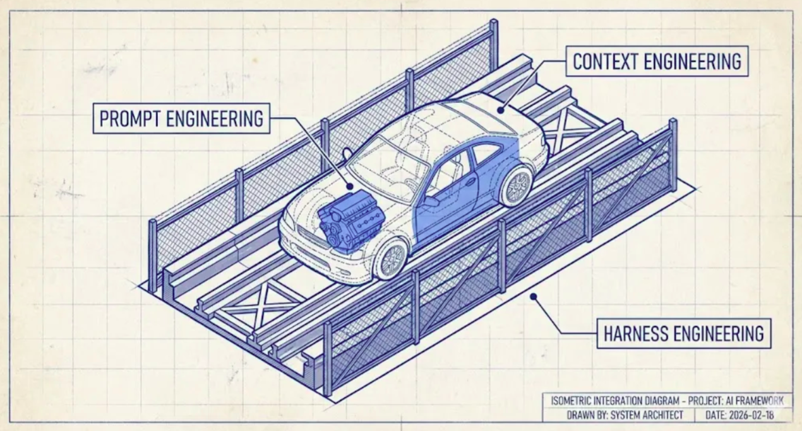
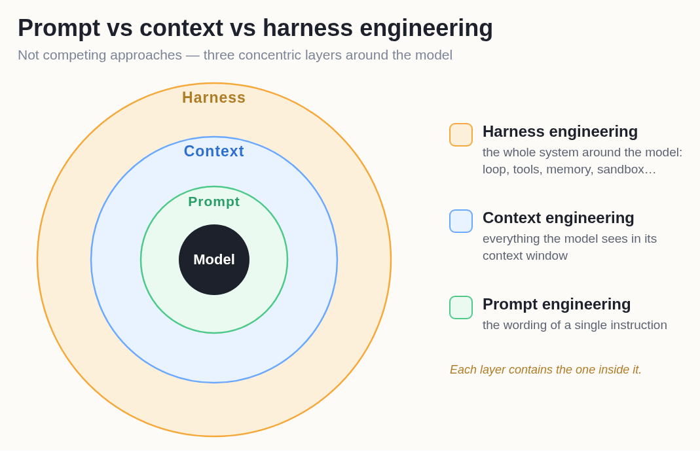
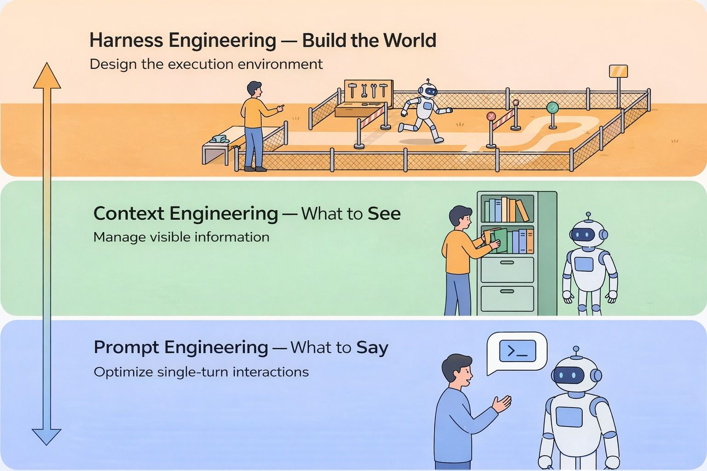
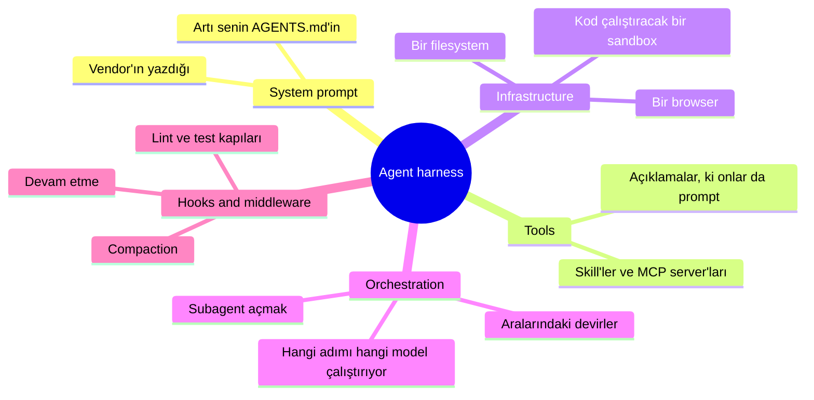
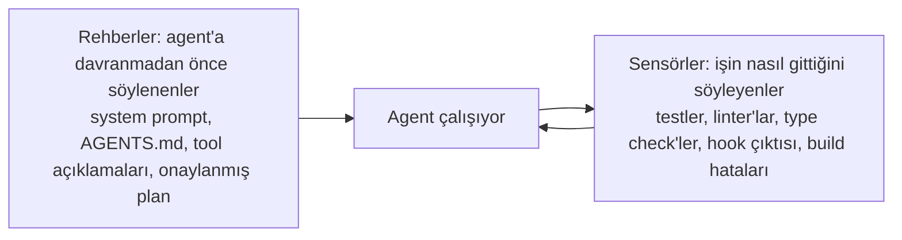
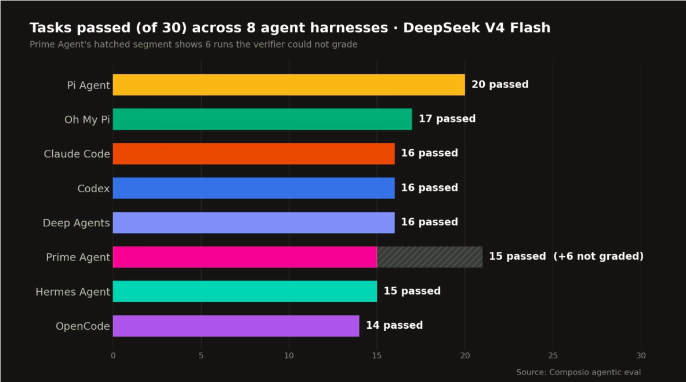
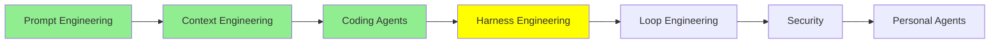

# Harness Engineering

[Coding Agent'lar: Genişletme](coding_agents_tr.md) sonunda agent'ın bir motoru, bir gövdesi ve bariyerli bir pisti vardı. Çizime bir daha bak ve sürücü koltuğunda kimin oturduğuna dikkat et.

Sen. Prompt'u sen yazıyorsun. Geri geleni sen okuyorsun. Yeterince iyi olup olmadığına ve sırada ne olacağına sen karar veriyorsun. Modern agent'lar çok şeyi devraldı: kendi context'lerini yönetiyorlar, uzayınca sıkıştırıyorlar, kendi subagent'larını açıyorlar, kendi to-do listelerini tutuyorlar. Ve hâlâ, merkezde bir insan oturup enter'a basıyor.

Bu modül o insanı çıkarmakla ilgili.

## Prompt'ların çözmediği problem

LLM'ler non-deterministic. Prompt'la ne yaparsan yap, context'e ne koyarsan koy, aynı input bir sonraki seferde farklı bir çıktı verebilir; ve iki saat çalışan bir agent'ın çok "sonraki sefer"i var.

Yani kibarca istemek sana garanti getirmiyor. Agent main'e asla push etmemeliyse, "lütfen main'e push etme" yüksek başarı oranı olan bir rica, ve o cümleden istediğin şey yüksek başarı oranı değil. Mekanik bir şeye ihtiyacın var: model ne yapacaksa yaparken ayakta kalan, modelin etrafına kurulmuş deterministic kablolama.

O kablolamayı tasarlamak **harness engineering**.

  
*Motor prompt: gücü üreten şey. Araba context: motorun etrafına kurulan ve o gücün ne yapabileceğine karar veren gövde. Pist ve bariyerler ise harness. Bariyerlerin direksiyon çevirmediğine dikkat et, ve asıl nokta bu. Arabayı doğru yöne götürmüyorlar, yanlış yöne gitmeyi imkânsız kılıyorlar.*

Analoji [Harness Engineering: What It Is and How It Complements Context Engineering](https://medium.com/@amirkiarafiei/harness-engineering-what-it-is-and-how-it-complements-context-engineering-6545b40bfc84) yazısından, ve sonraki iki modüle taşınıyor, yani akılda tutmaya değer.

## Agent harness ne demek

Harness engineering uygularsan elde ettiğin şey bir **agent harness**: bir agent, artı mekanik kablolaması ve içinde çalıştığı ortam.

LangChain'in [The Anatomy of an Agent Harness](https://www.langchain.com/blog/the-anatomy-of-an-agent-harness) yazısı bunu tek satıra indiriyor: **Agent = Model + Harness.** Zekâyı model sağlıyor. Harness ise o zekâyı gerçek dosyaların olduğu gerçek bir yerde işe yarar hâle getiren şey.

Yani zaten kullandığın ürünler harness. Claude Code bir harness. Codex bir harness. Pi bir harness. Hiçbiri model değil, ve birinin içindeki modeli değiştirmek insanların beklediğinden çok daha azını değiştiriyor.

Kelime gevşek kullanıldığı için netleştirmeye değer bir şey: harness **dış** katman, rakip bir katman değil. Prompt ve context işini değiştirmiyor, içine alıyor.

  
*Her halka içindekini kapsıyor, ve bunların asla alternatif olmamasının sebebi bu. Bir harness seçmek context'inle ilgili şeylere zaten karar vermiş oluyor, çünkü window'u sıkıştıran, subagent'ları açan ve system prompt'u yazan şey harness. Context engineering'i harness engineering'in "yerine" yapamıyorsun; seçtiğin harness'ın içinde yapıyorsun.*

## Dört disiplin, dört soru

2026'ya gelindiğinde bu, dört farklı soruyla dört işe oturdu.

  
*Aşağıdan yukarı oku, her katman altındakini içine alıyor. Söylemek tek bir tur. Görmek bütün window. Dünyayı inşa etmek ise agent'ın erişebildiği her şey ve onu durduran her şey; insan da robotla konuşmaktan onun çalıştığı yeri kurmaya geçiyor.*

- **Prompt engineering**: ne, ve nasıl sormalıyım?
- **Context engineering**: model context'inde ne görmeli, ve hangi biçimde?
- **Harness engineering**: agent'ın etrafındaki ortamı nasıl tasarlamalıyım?
- **Loop engineering**: tekrar ne zaman çalışacağına ve ne zaman duracağına kim karar veriyor? O, sonraki modül.

## Bir harness neden oluşuyor

[The Anatomy of an Agent Harness](https://www.langchain.com/blog/the-anatomy-of-an-agent-harness) parçaları listeliyor, ve çoğu artık geçen modülden tanıdığın şeyler:

Tool *açıklamalarının* da listede olduğuna dikkat et. Bir tool'un açıklaması, modelin onu çağırıp çağırmayacağına karar verirken okuduğu bir prompt; yani bir tool'u yeniden adlandırmak ya da açıklamasının bir cümlesini değiştirmek davranışı değiştiriyor. Bu prompt işi değil harness işi, çünkü isteği değil ortamı düzenliyorsun.

Bütün bunları düzenlemenin en keskin yolu Birgitta Böckeler'in [Harness engineering for coding agent users](https://martinfowler.com/articles/harness-engineering.html) yazısından geliyor; harness'ı iki tür şeye ayırıyor:

Rehberler işin önüne geçiyor. Sensörler sonrasında rapor veriyor, ve çıktıları agent'a geri gidiyor, böylece bozduğunu düzeltebiliyor. Harness engineering'in çoğu bu ikisinden birini eklemek, ve bir şeyin harness işi olup olmadığından emin değilsen hangisi olduğunu sor.

## Birkaç gerçek örnek

Somut olarak. İnsanların yaptığı birkaç şey, hepsi küçük:

- **Bir sandbox.** Agent komutlarını network'ü olmayan ve repo'nun bir kopyası bağlanmış bir container'da çalıştırıyor. Artık "her şeyi sil" sana bir container'a mal oluyor.
- **Bir izin kapısı.** `src/` dışındaki yazmaları reddeden ve `git push`'u tamamen reddeden bir `PreToolUse` hook'u. Model deneyebiliyor ve basitçe yapamıyor.
- **Bitirmede bir test kapısı.** Suite'i çalıştıran ve kırmızı bir şey varsa agent'a bitmediğini söyleyen bir `Stop` hook'u. Bittiğine agent karar vermiyor.
- **Yazmada format hook'u.** `PostToolUse` düzenlenen her dosyada formatter'ı çalıştırıyor, böylece stil agent'ın stili hatırlamasına bağlı olmaktan çıkıyor.
- **Bir loop dedektörü.** Dosya başına edit'leri say, ve aynı dosyadaki beşinci edit'ten sonra agent'a durup yeniden düşünmesini söyle, çünkü tek dosyaya beş edit genelde daireler çizdiği anlamına geliyor.

Son madde gerçek ve sayılarla geldi. LangChain'in [Improving Deep Agents with harness engineering](https://www.langchain.com/blog/improving-deep-agents-with-harness-engineering) yazısı coding agent'larının harness'ında beş değişikliği anlatıyor: plan, build, verify ve fix etrafında yeniden yapılandırılmış bir system prompt; agent çıkmadan önce araya giren ve işini spec'e karşı doğrulamaya zorlayan bir checklist middleware'i; dizin ağacını ve mevcut tool'ları haritalayan bir açılış adımı; yukarıdaki dosya başına edit sayacı; ve planlama ile doğrulamaya maksimum reasoning harcayıp mekanik ortada onu düşüren bir "reasoning sandwich".

**Model değişmedi.** Terminal Bench 2.0 %52,8'den %66,5'e çıktı.

Bu sayıyı tut, çünkü bu modülün var olma gerekçesi. Ortamı düzenlemekten neredeyse on dört puan, ve düşünmeyi yapan weight'ler aynı.

Okumak yerine bir tane inşa etmek istersen [How to Build a Custom Agent Harness](https://www.langchain.com/blog/how-to-build-a-custom-agent-harness) middleware ile bunu adım adım gösteriyor. OpenAI'ın [Harness engineering: leveraging Codex in an agent-first world](https://openai.com/index/harness-engineering/) yazısı aynı disiplinin öbür yüzü, ve asıl dersi bilgiyle ilgili: yapılandırılmış bir `docs/` dizinini tek doğru kaynak olarak tutuyorlar, `AGENTS.md`'yi oraya giden kısa bir harita olarak bırakıyorlar, sonra da linter'lar, CI job'ları ve bütün işi eskimiş dokümantasyon bulmak olan tekrarlayan bir bahçıvan agent çalıştırıyorlar. Ki bu da rehberlere yöneltilmiş bir sensör.

## Hiçbir harness her model için en iyisi değil

İnsanları şaşırtan bulgu şu.

Bir model al, bir benchmark'ta çalıştır, ve harness dışında hiçbir şeyi değiştirme. Skorlar ciddi biçimde oynuyor.

  
*Bir model, bir iş kümesi, sekiz harness, ve dağılım 30 üzerinden 14 ile 20 arasında. En alttaki çubukla en üstteki çubukta düşünmeyi yapan weight'ler aynı. Kazananın ötesini okumaya da değer: kaynak maliyeti ve hızı da ölçmüş, ve buradaki en hızlı harness aynı zamanda başarı başına en pahalı olanıydı, çünkü prompt cache'ini neredeyse hiç yeniden kullanmıyordu.*

Bu grafik Composio'nun [Finding the Best Harness for DeepSeek V4 Flash](https://composio.dev/content/best-agent-harness-deepseek-v4-flash) çalışmasından; modeli Pi Agent, Prime Agent, OMP, Claude Code, Codex, DeepAgents, Hermes Agent ve OpenCode üzerinden geçirmiş. Pi Agent %66,7 ile birinci, otuz workflow'un yirmisi, ve Claude Code iş başına 122,7 saniyeyle en hızlısı olurken başarı başına en pahalısıydı.

Ders "Pi Agent kullan" değil. **Eşleşmenin önemli olduğu**, ve bu biraz tişört gibi: herkese uyan tek bir beden yok. Claude Code'un harness'ı Claude modellerine göre ayarlı. Codex'in harness'ı GPT modellerine göre. Bir harness, modelinin nasıl plan yaptığı, uzun tool çıktılarını nasıl idare ettiği, tool'ları ne kadar istekli çağırdığı hakkında varsayımlar yapıyor; farklı alışkanlıkları olan bir model de o varsayımların içinde, kendisi için kurulmuş olanların içinde olduğundan kötü çalışıyor.

Yani bir modelin state of the art olduğunu okuduğunda dürüst soru, sayının hangi harness'tan geldiği.

## Harness'lar artık açık

2026'ya gelirken değişen öbür şey: bunların çoğu, ticari olanlar dahil, açık kaynak.

Claude Code'un harness'ı açık. [DeepSeek'in](https://github.com/deepseek-ai/deepseek-harness) de, ve ayarlandığı modelin yanında yayınlanmış olması sana ikisinin birlikte tasarlandığını söylüyor. OpenCode, Pi ve LangChain'in [deepagents](https://github.com/langchain-ai/deepagents)'ı açık. Kişisel agent harness'ları Hermes ve OpenClaw da öyle, ki onlar [Personal Agent'lar](personal_agents_tr.md) modülünü alıyor.

Bu gerçekten faydalı, ve sadece okumak için değil. İşe yarayan bir harness'ı alıp işine uymayan parçalarını değiştirebiliyorsun: system prompt'u değiştir, bir middleware ekle, bir tool açıklamasını değiştir, başka bir modele yönlendir.

Etrafa bakmak istersen iki güncel liste: [best-of-Agent-Harnesses](https://github.com/RyanAlberts/best-of-Agent-Harnesses) yüzden fazlasını sıralıyor ve haftalık yeniden puanlıyor, [awesome-harness-engineering](https://github.com/walkinglabs/awesome-harness-engineering) ise araçları ve rehberleri topluyor.

> **NOT:** bu modül bir harness'ın ne olduğu ve neden önemli olduğu seviyesinde kalıyor. [Advanced Harness Engineering](../3_expert/advanced_harness_engineering_tr.md) harness profillerini, kendi kendini geliştiren harness'ları ve harness'ın ne kadarının modelin içine taşındığı sorusunu alıyor. Böckeler'in [Harness engineering for coding agent users](https://martinfowler.com/articles/harness-engineering.html) yazısı konunun mevcut en derin işlenişi ve bu modülden çok o modüle ait.

## Bu serinin neresindeyiz

## Özet

Bir model non-deterministic, yani talimatlar sana yüksek bir başarı oranı veriyor ve asla garanti vermiyor. Harness, buna rağmen ayakta kalan mekanik kısım: system prompt, tool'lar ve açıklamaları, filesystem ve sandbox, subagent'ların orkestrasyonu, ve model istesin istemesin tetiklenen hook'lar.

Agent = Model + Harness. Claude Code, Codex ve Pi birer harness, ve harness prompt ile context işini kapsayan dış halka, onlarla yarışan bir şey değil. Onu iki parçaya ayır: agent'ın davranmadan önce okuduğu rehberler, ve işin nasıl gittiğini söyleyen sensörler.

Gerçek emek harcamaya değer, çünkü etkisi ölçülebilir: beş harness değişikliği bir agent'ı Terminal Bench 2.0'da model hiç değişmeden %52,8'den %66,5'e taşıdı. Ve eşleşme özgül, çünkü sekiz harness üzerindeki tek bir model 30 üzerinden 14 ile 20 arasında herhangi bir yerde skor yaptı. En iyi harness yok, en iyi uyum var.

Sırada: buraya kadar her şeyde sürücü koltuğunda sen varsın. Sen prompt'luyorsun, çıktıyı okuyorsun, sırada ne olacağına karar veriyorsun. Sonraki modül o insanın yerine geçiyor.

**Hızlı Kontrol**: AGENTS.md'deki bir talimat da bir `PreToolUse` hook'u da agent'ın bir dosyaya dokunmasını engelleyebilir. Neden sadece biri harness engineering, ve fark gerçekte ne zaman önemli oluyor?

## Kaynaklar

- [Harness Engineering: What It Is and How It Complements Context Engineering](https://medium.com/@amirkiarafiei/harness-engineering-what-it-is-and-how-it-complements-context-engineering-6545b40bfc84): araba, pist ve bariyerler, uzun hâliyle
- [The Anatomy of an Agent Harness](https://www.langchain.com/blog/the-anatomy-of-an-agent-harness): Agent = Model + Harness, ve bu modülün çalıştığı bileşen listesi
- [How to Build a Custom Agent Harness](https://www.langchain.com/blog/how-to-build-a-custom-agent-harness): aynı şeyin middleware ile inşa hâli
- [Improving Deep Agents with harness engineering](https://www.langchain.com/blog/improving-deep-agents-with-harness-engineering): beş somut değişiklik ve ürettikleri %52,8'den %66,5'e sıçrama
- [Harness engineering: leveraging Codex in an agent-first world](https://openai.com/index/harness-engineering/): agent'larla ürün kuran bir ekip, ve önce repo'larına ne yapmak zorunda kaldıkları
- [Harness engineering for coding agent users](https://martinfowler.com/articles/harness-engineering.html): rehberler ve sensörler çerçevesi, ve konunun en kapsamlı işlenişi
- [Finding the Best Harness for DeepSeek V4 Flash](https://composio.dev/content/best-agent-harness-deepseek-v4-flash): sekiz harness, bir model, pass oranının yanında maliyet ve hız
- [DeepSeek Harness](https://github.com/deepseek-ai/deepseek-harness): ayarlandığı modelin yanında yayınlanmış bir harness
- [deepagents](https://github.com/langchain-ai/deepagents): anatomi yazısındaki açık harness
- [best-of-Agent-Harnesses](https://github.com/RyanAlberts/best-of-Agent-Harnesses): yüzden fazlasının sıralı listesi, haftalık yeniden puanlanıyor
- [awesome-harness-engineering](https://github.com/walkinglabs/awesome-harness-engineering): pratiğe dair araçlar ve rehberler
- [Agent Harness Explained in 2 minutes](https://youtube.com/shorts/IVdJj_aNwhE): izlemeyi tercih edersen kısa versiyon
- [Advanced Harness Engineering](../3_expert/advanced_harness_engineering_tr.md): profiller, kendi kendini geliştiren harness'lar, ve modelin içine ne taşınıyor
