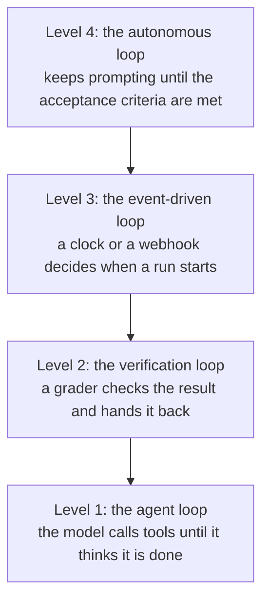
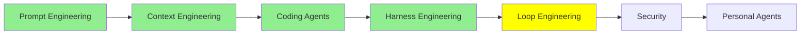

# Loop Engineering

By the end of [Harness Engineering](harness_engineering.md) the agent had an engine, a body and a track with barriers. Look at the drawing again and notice who is still in the driver's seat.

You are. You type the prompt. You read what came back. You decide whether it was good enough, and you decide what happens next. Modern agents took over a great deal: they manage their own context, they compact it when it gets long, they spawn their own subagents, they keep their own to-do list. And still, at the centre of it, a person is sitting there pressing enter.

This module is about removing that person.

## What loop engineering is

Loop engineering is the practice of designing automated, repeating loops that carry an agent through cycles of acting, observing and adjusting until a defined goal is met. Instead of prompting turn by turn, you build the control system: what starts a run, what the agent gets, and above all **when it stops**.

That last one is the design. The single question loop engineering asks is: **what is the stop condition?** Everything else follows from it. Get it wrong in one direction and the loop stops before the work is done. Get it wrong in the other and it runs until your bill arrives.

Back to the car. The engine is the prompt, the body is the context, the track and barriers are the harness, and until now the driver was a human. Loop engineering is the AI driving. It is the difference between a car and a car that drives itself, and everything that follows is about how much of the steering you are willing to hand over.

  
*The joke works because each panel is a real job that existed, and the arrows are the whole argument. In 2026 the human points at agents. By 2026.5 the human points at one agent that points at the others, and the panel after that is the honest question about where this goes. The thing being automated in the last two panels is not the coding. It is the supervising.*

## Loops happen at four levels

When people say "loop engineering" they usually mean the outermost one, but it helps to see all four, because they stack. LangChain's [The Art of Loop Engineering](https://www.langchain.com/blog/the-art-of-loop-engineering) calls the practice "the art of stacking loops", which is exactly right.



*Each level wraps the one below it, and each one takes a decision away from you. Level 1 decides which tool to call next. Level 2 decides whether the answer was good enough. Level 3 decides when to start. Only level 4 decides whether to try again, which is the decision you were actually making.*

### Level 1: the agent loop

The agent itself is a loop. A model calls a tool, reads the result, calls another, and keeps going until it decides the task is done. That is the loop from [AI Agents](../1_fundamentals/agents.md), and it is the lowest level, at the model's own turn.

Nobody engineers this one. LangChain, the other frameworks and every coding agent already implement it, and when people talk about loop engineering they do not mean this. It is here so the other three have something to sit on.

### Level 2: the verification loop

The agent finishes, and something checks the work against criteria before anyone accepts it. If the work falls short, the feedback goes back to the agent and it goes round again.

This is the [Harness Engineering](harness_engineering.md) sensor idea turned into a loop: the sensor no longer just reports, it decides whether there is another iteration. The stop condition here is a **goal**, so this is the goal-based loop.

The criteria can be anything you can check. A test suite passing. A type check clean. A Lighthouse score above 90. Or a rubric, which is a written list of what a good result looks like, graded by another model call for the things a test cannot check.

In LangChain you build it with rubric middleware. In Claude Code it is `/goal`, and per [Loop engineering: Getting started with loops](https://claude.com/blog/getting-started-with-loops) it stops when the goal is achieved or a maximum number of turns is reached:

```text
/goal get the homepage Lighthouse score to 90 or above, stop after 5 tries
```

Read the shape of that: a target, and a cap. The cap is not decoration. A loop whose only stop condition is success will not stop when success is impossible.

### Level 3: the event-driven loop

Here something outside the conversation decides when a run happens: a schedule, or a webhook. The agent stops being a thing you open and becomes a thing that runs.

The stop condition is time-based rather than goal-based. The loop is not iterating towards a target, it is waking up, doing a job, and going back to sleep until the next trigger.

In Claude Code that is `/loop` for a recurring job on your own machine and `/schedule` for the same thing in the cloud, so it keeps happening while your laptop is shut:

```text
/loop 5m check my PR, address review comments, and fix failing CI
```

Both stop when you cancel or the work is finished. What makes this level worth having is that the agent is now wired into the systems around it: a pull request opening, a build failing, an alert firing, and the agent already responding before anybody has read the notification.

### Level 4: the autonomous loop

This is the one that made loop engineering a topic.

Its history starts with the **Ralph loop**, from Geoffrey Huntley's [everything is a ralph loop](https://ghuntley.com/loop/). You write a script, shell or JavaScript, that mechanically prompts the agent again and again until the acceptance criteria are met. In its purest and most oversimplified form:

```bash
while true; do
  claude -p "$PROMPT"
done
```

That is genuinely most of the idea. The loop keeps prompting until the job is done, and because a fresh session starts with a fresh context window, the rot problem from [Context Engineering](context_engineering.md) never gets a chance to build up. The state lives on disk, in the plan and the code, not in a window.

  
*Named after the Simpsons character, and the joke is affectionate rather than dismissive: the technique works precisely because it is too simple to be clever, and keeps going after setbacks that would stop something more sophisticated.*

The one rule that matters most: **Ralph does one task per loop.** Not the whole backlog per iteration, one item. Each pass reads the plan, picks the next unfinished thing, does it, records that it is done, and exits. The next pass starts clean and picks the next one.

This is what pushed coding agents past the several-hour mark that [Context Engineering](context_engineering.md) described. A loop like this runs for days, because no single session has to survive that long.

The real versions are considerably more careful than four lines of bash. What people add is failure handling: you watch which iterations fail, work out the failure mode, and engineer that mode out so it cannot recur. Huntley's own framing is that software becomes clay on a pottery wheel rather than bricks laid one at a time, and a failed iteration is a reason to refine rather than a reason to stop.

Places to get a real one: the [ralph-loop plugin](https://claude.com/plugins/ralph-loop) for Claude Code, [snarktank/ralph](https://github.com/snarktank/ralph), which runs until every item in a product requirements document is complete, and [loop-engineering](https://github.com/cobusgreyling/loop-engineering), a collection of patterns and CLI tools including cost auditing. [Ralph Wiggum Loop for Claude Code](https://awesomeclaude.ai/ralph-wiggum) is a good written walkthrough, and it makes the point that results here depend more on the operator's prompt-writing than on the model.

> **NOTE:** LangChain names a different fourth level, the **hill climbing loop**, which reads production traces to find problems and improve the agent's own configuration. It is worth knowing as the level above this one: a loop whose output is a better harness rather than finished work.

## When the AI designs the loop

Everything to this point is a loop a human designed. The script is mechanical, the criteria are written by you, and the structure is either yours or a known pattern like Ralph's.

The next step is letting the agent design and run the loop itself. Back to the car one last time: here the AI is not only driving, it is deciding the route. An AI orchestrating other AIs.

Claude Code has two features for this, and they are not the same shape.

### Agent teams

An agent team is several full Claude Code sessions working together. One is the lead: it breaks the work into a shared task list, spawns the others, and pulls the results together. The teammates each have their own context window, claim tasks off the shared list, and message each other directly rather than reporting only upward.

That creates a loop almost as a side effect. The lead is watching what the others are doing and deciding what happens next, which is the job you used to do.

Against subagents, from [Orchestrate teams of Claude Code sessions](https://code.claude.com/docs/en/agent-teams):

| | Subagents | Agent teams |
| --- | --- | --- |
| Context | Own context window; results return to the caller | Own context window; fully independent |
| Communication | Return a result to the caller. Subagents that Claude named when it spawned them can also message each other | Teammates message each other directly |
| Coordination | Main agent manages all work | Self-coordination through messages, plus a shared task list |
| Best for | Focused tasks where only the result matters | Complex work requiring discussion and collaboration |
| Token cost | Lower: results summarized back to main context | Higher: each teammate is a separate Claude instance |

The line to notice is the last one. Each teammate is a whole separate instance, so cost scales with the number of them. Three focused teammates usually beat five scattered ones, and the docs suggest starting at three to five.

> **NOTE:** agent teams are experimental and off by default. You turn them on with `CLAUDE_CODE_EXPERIMENTAL_AGENT_TEAMS=1`.

### Dynamic workflows

A dynamic workflow is a JavaScript script that orchestrates many subagents at once. Claude writes the script for the task you described, and a runtime executes it in the background while your session stays free.

The difference from everything above is **who holds the plan**. With subagents, skills and agent teams, Claude is the orchestrator and decides turn by turn what to run next. A workflow moves that decision into code: the script holds the loop, the branching and the intermediate results, so your context receives only the final answer.

From [Orchestrate subagents at scale with dynamic workflows](https://code.claude.com/docs/en/workflows):

| | Subagents | Skills | Agent teams | Workflows |
| --- | --- | --- | --- | --- |
| What it is | A worker Claude spawns | Instructions Claude follows | A lead agent supervising peer sessions | A script the runtime executes |
| Who decides what runs next | Claude, turn by turn | Claude, following the prompt | The lead agent, turn by turn | The script |
| Where intermediate results live | Claude's context window | Claude's context window | A shared task list | Script variables |
| What is repeatable | The worker definition | The instructions | The team definition | The orchestration itself |
| Scale | A few delegated tasks per turn | Same as subagents | A handful of long-running peers | Dozens to hundreds of agents per run |
| Interruption | Restarts the turn | Restarts the turn | Teammates keep running | Resumable in the same session |

Two rows deserve attention. **Scale**: dozens to hundreds of agents in one run, against a handful of teammates, because a script does not need a context window to remember what it is doing. And **what is repeatable**: with a team you can reuse the team definition, but with a workflow the orchestration itself is a file you can read, edit, rerun and commit.

That also buys a quality pattern you cannot easily get otherwise. Because the script is in charge, it can have independent agents adversarially review each other's findings before any of them are reported, or draft a plan from several angles and weigh them against each other. Not just more agents, but agents checking each other.

You turn it on with `/effort ultracode`, which combines the highest reasoning setting with automatic workflow orchestration, or you include the word `ultracode` in a single prompt to run just that task as a workflow.

> **NOTE:** dynamic workflows do not exist only because of loop engineering. They are also the practical form of an idea called **recursive language modelling**, and of architectures like **CodeAct**, both covered in [Advanced Architectures](../3_expert/advanced_architectures.md). CodeAct, from [Executable Code Actions Elicit Better LLM Agents](https://arxiv.org/abs/2402.01030), makes executable code the agent's action space instead of JSON tool calls. [Recursive Language Models](https://arxiv.org/abs/2512.24601) has a model treat its input as a variable it can grep, slice and hand to recursive copies of itself, which is how a script full of agents starts looking like one model with an unbounded window. Alex Zhang's [write-up](https://alexzhang13.github.io/blog/2025/rlm/) is the readable version and [rlm](https://github.com/alexzhang13/rlm) is the library.

## The trend, stated plainly

Put the last four modules next to each other and the direction is hard to miss. Better models, then better use of the context window, then better environments around them, then better loops around those. Every layer added length: from one good answer, to a session that stays coherent, to hours of unattended work, to runs measured in days.

None of the layers replaced the one before it. They stacked, which is why the whole series has been one drawing with more parts added to it.

## Where this fits in the series



## Summary

Loop engineering is designing the repeating cycle that carries an agent to a goal without a person in it, and the design is the stop condition.

The loops stack. The agent loop is the model calling tools until it is done, and frameworks already give you that. The verification loop adds a grader that sends work back, and its stop condition is a goal plus a cap on tries. The event-driven loop lets a clock or a webhook decide when a run starts. The autonomous loop, the Ralph loop, is a script that prompts the agent again and again until the acceptance criteria are met, one task per iteration, with each pass starting from a clean window and the state living on disk. That is what took agents from hours to days.

Above that, the agent designs the loop. Agent teams give you peer sessions with a shared task list and a lead that coordinates. Dynamic workflows move the plan into a script, which scales to hundreds of agents, makes the orchestration itself the reusable thing, and lets agents check each other's work.

Next: everything in this module made an agent harder to supervise. Security is what that costs.

**Quick Check**: a verification loop and an autonomous loop both keep going until something is satisfied. What is the difference, and which one needs a maximum number of tries?

## References

- [The Art of Loop Engineering](https://www.langchain.com/blog/the-art-of-loop-engineering): loop engineering as stacking loops, and the four levels
- [Loop engineering: Getting started with loops](https://claude.com/blog/getting-started-with-loops): `/goal`, `/loop` and `/schedule`, with the stop condition each one uses
- [everything is a ralph loop](https://ghuntley.com/loop/): the original technique, and the one-task-per-loop rule
- [ralph-loop plugin](https://claude.com/plugins/ralph-loop): the packaged version for Claude Code
- [snarktank/ralph](https://github.com/snarktank/ralph): an autonomous loop that runs until every item in a requirements document is complete
- [loop-engineering](https://github.com/cobusgreyling/loop-engineering): patterns, starters and CLI tools, including cost auditing for a long run
- [Ralph Wiggum Loop for Claude Code](https://awesomeclaude.ai/ralph-wiggum): a written walkthrough, and why the operator's prompt matters more than the model
- [Orchestrate teams of Claude Code sessions](https://code.claude.com/docs/en/agent-teams): agent teams, the shared task list, and the architecture behind it
- [Orchestrate subagents at scale with dynamic workflows](https://code.claude.com/docs/en/workflows): what a workflow script looks like, its limits, and the four-way comparison
- [Executable Code Actions Elicit Better LLM Agents](https://arxiv.org/abs/2402.01030): CodeAct, where code becomes the action space
- [Recursive Language Models](https://arxiv.org/abs/2512.24601): the paper, with [Alex Zhang's write-up](https://alexzhang13.github.io/blog/2025/rlm/) and the [rlm](https://github.com/alexzhang13/rlm) library
- [Advanced Architectures](../3_expert/advanced_architectures.md): CodeAct, recursive language models and the rest, properly
