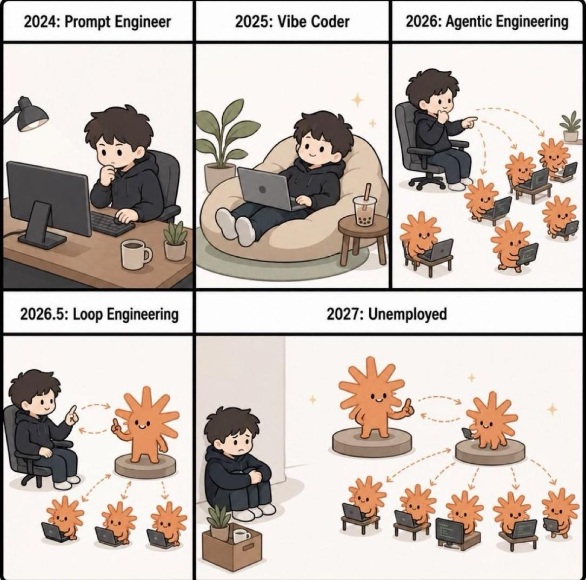
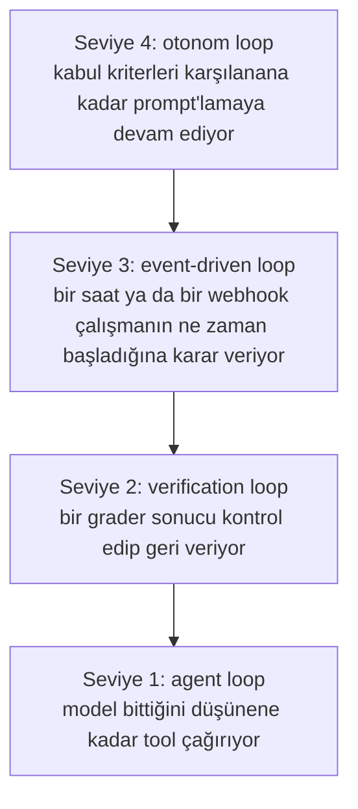
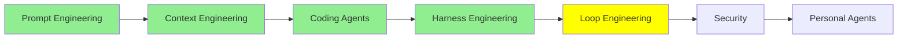

# Loop Engineering

[Harness Engineering](harness_engineering_tr.md) bittiğinde agent'ın bir motoru, bir gövdesi ve bariyerli bir pisti vardı. Çizime bir daha bak ve sürücü koltuğunda hâlâ kimin oturduğuna dikkat et.

Sen. Prompt'u sen yazıyorsun. Geri geleni sen okuyorsun. Yeterince iyi olup olmadığına, ve sırada ne olacağına sen karar veriyorsun. Modern agent'lar çok şeyi devraldı: kendi context'lerini yönetiyorlar, uzayınca sıkıştırıyorlar, kendi subagent'larını açıyorlar, kendi to-do listelerini tutuyorlar. Ve hâlâ, merkezde bir insan oturup enter'a basıyor.

Bu modül o insanı çıkarmakla ilgili.

## Loop engineering ne demek

Loop engineering, bir agent'ı tanımlanmış bir hedefe ulaşana kadar davranma, gözlemleme ve ayarlama döngülerinden geçiren otomatik ve tekrarlayan loop'ları tasarlama pratiği. Tur tur prompt'lamak yerine kontrol sistemini kuruyorsun: bir çalışmayı ne başlatıyor, agent ne alıyor, ve hepsinden önemlisi **ne zaman duruyor**.

Tasarım o son madde. Loop engineering'in sorduğu tek soru: **stop condition nedir?** Geri kalan her şey ondan çıkıyor. Bir yönde yanlış yaparsan loop iş bitmeden duruyor. Öbür yönde yanlış yaparsan faturan gelene kadar çalışıyor.

Arabaya dönelim. Motor prompt, gövde context, pist ve bariyerler harness, ve şimdiye kadar sürücü bir insandı. Loop engineering, arabayı AI'ın sürmesi. Bir araba ile kendini süren araba arasındaki fark, ve bundan sonraki her şey direksiyonun ne kadarını devretmeye razı olduğunla ilgili.

  
*Şaka işliyor, çünkü her kare gerçekten var olan bir iş, ve oklar bütün argüman. 2026'da insan agent'ları işaret ediyor. 2026.5'te insan, diğerlerini işaret eden tek bir agent'ı işaret ediyor, ve sonraki kare bunun nereye gittiğine dair dürüst soru. Son iki karede otomatikleştirilen şey coding değil. Denetim.*

## Loop'lar dört seviyede oluyor

İnsanlar "loop engineering" dediğinde genelde en dıştakini kastediyor, ama dördünü de görmek işe yarıyor, çünkü üst üste biniyorlar. LangChain'in [The Art of Loop Engineering](https://www.langchain.com/blog/the-art-of-loop-engineering) yazısı pratiği "loop'ları üst üste koyma sanatı" diye adlandırıyor, ki tam olarak doğru.



*Her seviye altındakini kapsıyor, ve her biri senden bir karar alıyor. Seviye 1 sırada hangi tool'un çağrılacağına karar veriyor. Seviye 2 cevabın yeterince iyi olup olmadığına karar veriyor. Seviye 3 ne zaman başlanacağına karar veriyor. Sadece seviye 4 tekrar denenip denenmeyeceğine karar veriyor, ki gerçekte verdiğin karar da o.*

### Seviye 1: agent loop

Agent'ın kendisi bir loop. Model bir tool çağırıyor, sonucu okuyor, bir başkasını çağırıyor, ve işin bittiğine karar edene kadar devam ediyor. Bu [AI Agent'lar](../1_fundamentals/agents_tr.md)'daki loop, ve en alt seviye, modelin kendi turunda.

Bunu kimse engineer etmiyor. LangChain, diğer framework'ler ve her coding agent bunu zaten implement ediyor, ve insanlar loop engineering derken bunu kastetmiyor. Diğer üçünün üzerine oturacağı bir şey olsun diye burada.

### Seviye 2: verification loop

Agent bitiriyor, ve biri kabul etmeden önce işi kriterlere karşı kontrol ediyor. İş yetersizse geri bildirim agent'a gidiyor ve bir tur daha atıyor.

Bu, [Harness Engineering](harness_engineering_tr.md)'in sensör fikrinin loop'a dönüşmüş hâli: sensör artık sadece rapor vermiyor, bir iterasyon daha olup olmadığına karar veriyor. Buradaki stop condition bir **hedef**, yani bu goal-based loop.

Kriterler kontrol edebildiğin herhangi bir şey olabilir. Geçen bir test suite. Temiz bir type check. 90'ın üzerinde bir Lighthouse skoru. Ya da bir rubric, yani iyi bir sonucun neye benzediğinin yazılı listesi; bir test'in kontrol edemeyeceği şeyler için başka bir model çağrısıyla notlanıyor.

LangChain'de bunu rubric middleware ile kuruyorsun. Claude Code'da `/goal`, ve [Loop engineering: Getting started with loops](https://claude.com/blog/getting-started-with-loops) sayfasına göre hedefe ulaşıldığında ya da maksimum tur sayısına gelindiğinde duruyor:

```text
/goal get the homepage Lighthouse score to 90 or above, stop after 5 tries
```

Şeklini oku: bir hedef, ve bir üst sınır. Üst sınır süs değil. Tek stop condition'ı başarı olan bir loop, başarı imkânsız olduğunda durmayacak.

### Seviye 3: event-driven loop

Burada bir çalışmanın ne zaman olacağına konuşmanın dışındaki bir şey karar veriyor: bir zamanlama, ya da bir webhook. Agent açtığın bir şey olmaktan çıkıp çalışan bir şey oluyor.

Stop condition goal-based değil time-based. Loop bir hedefe doğru iterasyon yapmıyor; uyanıyor, bir iş yapıyor, ve sonraki tetiklemeye kadar uykuya dönüyor.

Claude Code'da bu, kendi makinende tekrarlayan bir iş için `/loop`, aynı şeyin bulutta olması için de `/schedule`; böylece laptop'un kapalıyken de olmaya devam ediyor:

```text
/loop 5m check my PR, address review comments, and fix failing CI
```

İkisi de sen iptal ettiğinde ya da iş bittiğinde duruyor. Bu seviyeyi değerli yapan şey, agent'ın artık etrafındaki sistemlere bağlı olması: bir pull request açılıyor, bir build düşüyor, bir alarm çalıyor, ve agent bildirimi kimse okumadan önce cevap veriyor.

### Seviye 4: otonom loop

Loop engineering'i bir konu hâline getiren bu.

Tarihi **Ralph loop** ile başlıyor, Geoffrey Huntley'in [everything is a ralph loop](https://ghuntley.com/loop/) yazısından. Kabul kriterleri karşılanana kadar agent'ı mekanik biçimde tekrar tekrar prompt'layan bir script yazıyorsun; shell ya da JavaScript. En saf ve en basite indirgenmiş hâliyle:

```bash
while true; do
  claude -p "$PROMPT"
done
```

Fikrin çoğu gerçekten bu. Loop, iş bitene kadar prompt'lamaya devam ediyor, ve yeni bir session temiz bir context window'la başladığı için [Context Engineering](context_engineering_tr.md)'deki çürüme problemi birikme şansı bulamıyor. State bir window'da değil, diskte, planda ve kodda duruyor.

  
*Adı Simpsons karakterinden geliyor, ve şaka küçümseyici değil sevecen: teknik tam olarak zekice olmayacak kadar basit olduğu için işliyor, ve daha sofistike bir şeyi durduracak aksiliklerden sonra devam ediyor.*

En çok önemli olan tek kural: **Ralph loop başına bir iş yapıyor.** İterasyon başına bütün backlog değil, tek bir kalem. Her geçiş planı okuyor, bitmemiş sıradaki şeyi seçiyor, yapıyor, bittiğini kaydediyor, ve çıkıyor. Sonraki geçiş temiz başlayıp sıradakini alıyor.

[Context Engineering](context_engineering_tr.md)'in anlattığı birkaç saatlik sınırı coding agent'ların aşmasını sağlayan şey bu. Böyle bir loop günlerce çalışıyor, çünkü tek bir session'ın o kadar dayanması gerekmiyor.

Gerçek versiyonlar dört satır bash'ten belirgin biçimde daha dikkatli. İnsanların eklediği şey hata yönetimi: hangi iterasyonların düştüğünü izliyorsun, hata modunu çıkarıyorsun, ve o modu tekrar edemeyecek şekilde engineer ediyorsun. Huntley'in kendi çerçevesi, yazılımın tek tek dizilen tuğlalar yerine çömlekçi çarkındaki kile dönüşmesi; düşen bir iterasyon da durma sebebi değil, iyileştirme sebebi.

Gerçek bir tane bulacağın yerler: Claude Code için [ralph-loop plugin'i](https://claude.com/plugins/ralph-loop), bir ürün gereksinim dokümanındaki her kalem tamamlanana kadar çalışan [snarktank/ralph](https://github.com/snarktank/ralph), ve maliyet denetimi de dahil desenler ile CLI araçları toplayan [loop-engineering](https://github.com/cobusgreyling/loop-engineering). [Ralph Wiggum Loop for Claude Code](https://awesomeclaude.ai/ralph-wiggum) iyi bir yazılı anlatım, ve buradaki sonuçların modelden çok operatörün prompt yazmasına bağlı olduğunu söylüyor.

> **NOT:** LangChain farklı bir dördüncü seviye adlandırıyor, **hill climbing loop**: production trace'lerini okuyup problem bulan ve agent'ın kendi konfigürasyonunu iyileştiren loop. Bunun bir üst seviye olarak bilinmesi değerli: çıktısı bitmiş iş değil, daha iyi bir harness olan bir loop.

## Loop'u AI tasarladığında

Buraya kadar her şey bir insanın tasarladığı loop. Script mekanik, kriterleri sen yazıyorsun, ve yapı ya senin ya da Ralph'inki gibi bilinen bir desen.

Sonraki adım, loop'u agent'ın kendisinin tasarlayıp çalıştırması. Son bir kez arabaya dönelim: burada AI sadece sürmüyor, güzergâha da karar veriyor. Başka AI'ları orkestre eden bir AI.

Claude Code'un bunun için iki özelliği var, ve aynı şekilde değiller.

### Agent teams

Agent team, birlikte çalışan birkaç tam Claude Code session'ı. Biri lead: işi paylaşılan bir task listesine bölüyor, diğerlerini açıyor, ve sonuçları bir araya getiriyor. Teammate'lerin her birinin kendi context window'u var, paylaşılan listeden task alıyorlar, ve sadece yukarı rapor vermek yerine birbirlerine doğrudan mesaj atıyorlar.

Bu, neredeyse yan etki olarak bir loop yaratıyor. Lead diğerlerinin ne yaptığını izliyor ve sırada ne olacağına karar veriyor, ki bu da eskiden senin yaptığın iş.

Subagent'lara karşı, [Orchestrate teams of Claude Code sessions](https://code.claude.com/docs/en/agent-teams) sayfasından:

| | Subagent'lar | Agent teams |
| --- | --- | --- |
| Context | Kendi context window'u; sonuçlar çağırana dönüyor | Kendi context window'u; tamamen bağımsız |
| İletişim | Çağırana bir sonuç döndürüyor. Claude'un açarken isim verdiği subagent'lar birbirine de mesaj atabiliyor | Teammate'ler birbirine doğrudan mesaj atıyor |
| Koordinasyon | Bütün işi ana agent yönetiyor | Mesajlarla kendi kendine koordinasyon, artı paylaşılan bir task listesi |
| En uygun | Sadece sonucun önemli olduğu odaklı işler | Tartışma ve iş birliği gerektiren karmaşık işler |
| Token maliyeti | Daha düşük: sonuçlar ana context'e özetlenerek dönüyor | Daha yüksek: her teammate ayrı bir Claude instance'ı |

Dikkat edilecek satır son satır. Her teammate ayrı bir instance, yani maliyet onların sayısıyla ölçekleniyor. Odaklı üç teammate genelde dağınık beşten iyi, ve dokümanlar üç ile beş arasında başlamayı öneriyor.

> **NOT:** agent teams deneysel ve varsayılan olarak kapalı. `CLAUDE_CODE_EXPERIMENTAL_AGENT_TEAMS=1` ile açıyorsun.

### Dynamic workflows

Dynamic workflow, aynı anda çok sayıda subagent'ı orkestre eden bir JavaScript script'i. Claude script'i anlattığın iş için yazıyor, bir runtime da onu arka planda çalıştırıyor, session'ın boş kalırken.

Yukarıdaki her şeyden farkı, **planı kimin tuttuğu**. Subagent'lar, skill'ler ve agent teams'te orkestratör Claude ve sırada ne çalışacağına tur tur karar veriyor. Workflow o kararı kodun içine taşıyor: loop'u, dallanmayı ve ara sonuçları script tutuyor, yani senin context'ine sadece son cevap geliyor.

[Orchestrate subagents at scale with dynamic workflows](https://code.claude.com/docs/en/workflows) sayfasından:

| | Subagent'lar | Skill'ler | Agent teams | Workflow'lar |
| --- | --- | --- | --- | --- |
| Nedir | Claude'un açtığı bir işçi | Claude'un uyduğu talimatlar | Eş session'ları denetleyen bir lead agent | Runtime'ın çalıştırdığı bir script |
| Sırada ne çalışacağına kim karar veriyor | Claude, tur tur | Claude, prompt'u izleyerek | Lead agent, tur tur | Script |
| Ara sonuçlar nerede duruyor | Claude'un context window'u | Claude'un context window'u | Paylaşılan bir task listesi | Script değişkenleri |
| Tekrar kullanılabilir olan | İşçi tanımı | Talimatlar | Team tanımı | Orkestrasyonun kendisi |
| Ölçek | Tur başına birkaç devredilmiş iş | Subagent'larla aynı | Bir tutam uzun çalışan eş | Çalışma başına düzinelerce ya da yüzlerce agent |
| Kesinti | Turu baştan başlatıyor | Turu baştan başlatıyor | Teammate'ler çalışmaya devam ediyor | Aynı session içinde devam ettirilebilir |

İki satır dikkat hak ediyor. **Ölçek**: bir tutam teammate'e karşı tek çalışmada düzinelerce ya da yüzlerce agent, çünkü bir script'in ne yaptığını hatırlamak için context window'a ihtiyacı yok. Ve **tekrar kullanılabilir olan**: bir team'de team tanımını yeniden kullanabiliyorsun, ama bir workflow'da orkestrasyonun kendisi okuyabildiğin, düzenleyebildiğin, yeniden çalıştırabildiğin ve commit'leyebildiğin bir dosya.

Bu aynı zamanda başka türlü kolay elde edemeyeceğin bir kalite deseni kazandırıyor. Script kontrolde olduğu için, bağımsız agent'ların birbirinin bulgularını raporlanmadan önce çekişmeli biçimde review etmesini sağlayabiliyor, ya da bir planı birkaç açıdan çizip birbirine karşı tartabiliyor. Sadece daha çok agent değil, birbirini kontrol eden agent'lar.

`/effort ultracode` ile açıyorsun; en yüksek reasoning ayarını otomatik workflow orkestrasyonuyla birleştiriyor. Ya da tek bir prompt'ta `ultracode` kelimesini geçirip sadece o işi workflow olarak çalıştırıyorsun.

> **NOT:** dynamic workflow'lar sadece loop engineering yüzünden var değil. Aynı zamanda **recursive language modelling** denen bir fikrin ve **CodeAct** gibi mimarilerin pratik hâli; ikisi de [Advanced Architectures](../3_expert/advanced_architectures_tr.md)'da işleniyor. CodeAct, [Executable Code Actions Elicit Better LLM Agents](https://arxiv.org/abs/2402.01030)'dan geliyor ve JSON tool çağrıları yerine çalıştırılabilir kodu agent'ın action space'i yapıyor. [Recursive Language Models](https://arxiv.org/abs/2512.24601) ise modelin input'unu grep'leyebildiği, dilimleyebildiği ve kendisinin recursive kopyalarına verebildiği bir değişken gibi ele almasını sağlıyor; agent dolu bir script'in neden sınırsız window'lu tek bir model gibi görünmeye başladığı da bu. Alex Zhang'in [yazısı](https://alexzhang13.github.io/blog/2025/rlm/) okunabilir versiyonu, [rlm](https://github.com/alexzhang13/rlm) de library.

## Trend, düpedüz söylenmiş hâliyle

Son dört modülü yan yana koy ve yön gözden kaçmıyor. Daha iyi modeller, sonra context window'un daha iyi kullanılması, sonra etraflarında daha iyi ortamlar, sonra onların etrafında daha iyi loop'lar. Her katman uzunluk ekledi: tek bir iyi cevaptan, tutarlı kalan bir session'a, saatlerce denetimsiz işe, günlerle ölçülen çalışmalara.

Katmanların hiçbiri öncekinin yerini almadı. Üst üste bindiler, ve bütün serinin üzerine parça eklenen tek bir çizim olmasının sebebi de bu.

## Bu serinin neresindeyiz



## Özet

Loop engineering, bir agent'ı içinde insan olmadan bir hedefe taşıyan tekrarlayan döngüyü tasarlamak, ve tasarımın kendisi stop condition.

Loop'lar üst üste biniyor. Agent loop, modelin bitene kadar tool çağırması, ve onu framework'ler zaten veriyor. Verification loop, işi geri gönderen bir grader ekliyor, ve stop condition'ı bir hedef artı deneme sayısına bir üst sınır. Event-driven loop, bir saatin ya da bir webhook'un çalışmanın ne zaman başlayacağına karar vermesini sağlıyor. Otonom loop, yani Ralph loop, kabul kriterleri karşılanana kadar agent'ı tekrar tekrar prompt'layan bir script; iterasyon başına bir iş, her geçiş temiz bir window'dan başlıyor ve state diskte duruyor. Agent'ları saatlerden günlere taşıyan şey bu.

Onun üzerinde loop'u agent tasarlıyor. Agent teams sana paylaşılan bir task listesi olan eş session'lar ve koordine eden bir lead veriyor. Dynamic workflow'lar planı bir script'e taşıyor; bu da yüzlerce agent'a ölçekleniyor, orkestrasyonun kendisini tekrar kullanılabilir şey yapıyor, ve agent'ların birbirinin işini kontrol etmesini sağlıyor.

Sırada: bu modüldeki her şey bir agent'ı denetlemeyi zorlaştırdı. Security de bunun maliyeti.

**Hızlı Kontrol**: bir verification loop da bir otonom loop da bir şey sağlanana kadar devam ediyor. Aradaki fark nedir, ve hangisinin maksimum deneme sayısına ihtiyacı var?

## Kaynaklar

- [The Art of Loop Engineering](https://www.langchain.com/blog/the-art-of-loop-engineering): loop engineering'in loop üst üste koyma olarak tanımı, ve dört seviye
- [Loop engineering: Getting started with loops](https://claude.com/blog/getting-started-with-loops): `/goal`, `/loop` ve `/schedule`, her birinin kullandığı stop condition ile
- [everything is a ralph loop](https://ghuntley.com/loop/): tekniğin orijinali, ve loop başına bir iş kuralı
- [ralph-loop plugin](https://claude.com/plugins/ralph-loop): Claude Code için paketlenmiş hâli
- [snarktank/ralph](https://github.com/snarktank/ralph): bir gereksinim dokümanındaki her kalem tamamlanana kadar çalışan otonom bir loop
- [loop-engineering](https://github.com/cobusgreyling/loop-engineering): desenler, başlangıç şablonları ve CLI araçları, uzun bir çalışma için maliyet denetimi dahil
- [Ralph Wiggum Loop for Claude Code](https://awesomeclaude.ai/ralph-wiggum): yazılı bir anlatım, ve operatörün prompt'unun neden modelden önemli olduğu
- [Orchestrate teams of Claude Code sessions](https://code.claude.com/docs/en/agent-teams): agent teams, paylaşılan task listesi ve arkasındaki mimari
- [Orchestrate subagents at scale with dynamic workflows](https://code.claude.com/docs/en/workflows): bir workflow script'i neye benziyor, limitleri, ve dörtlü karşılaştırma
- [Executable Code Actions Elicit Better LLM Agents](https://arxiv.org/abs/2402.01030): CodeAct, kodun action space olduğu yer
- [Recursive Language Models](https://arxiv.org/abs/2512.24601): makale, [Alex Zhang'in yazısı](https://alexzhang13.github.io/blog/2025/rlm/) ve [rlm](https://github.com/alexzhang13/rlm) library'si ile
- [Advanced Architectures](../3_expert/advanced_architectures_tr.md): CodeAct, recursive language model'ler ve gerisi, düzgün hâliyle
