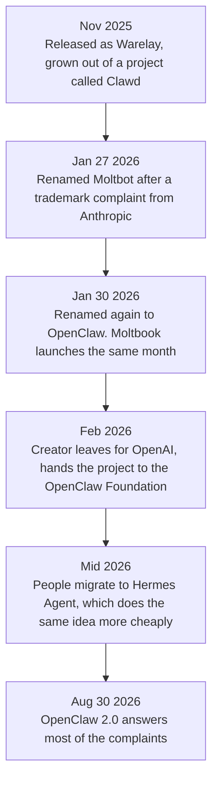

# Personal Agents

Every agent so far has lived in a repository. You open it, you give it a job, it works on your code, and when you close the terminal it is gone.

A personal agent is the same technology pointed at your life instead. It runs on your own machine, it stays running, you talk to it through WhatsApp or Telegram rather than a terminal, and it remembers you between conversations. It sorts your inbox, books things, checks you in for a flight, and gets on with tasks while you are asleep.

This one is the newest topic in the series, and the most unsettled.

## What makes them different

Four things, and none of them is really about the model:

- **Lifelong memory.** Not a context window and not a summary of one session. A store on disk that keeps growing, so the agent knows what you told it in March.
- **It writes its own skills.** When it notices you asking for the same thing repeatedly, it writes the procedure down and reuses it. The skills from [Coding Agents: Extending Them](coding_agents.md), except nobody authored them.
- **It reaches you where you already are.** Telegram, WhatsApp, Discord, Slack, Signal, email. There is no app to open, which is most of why people got attached to these.
- **It runs with your actual access.** Your files, your shell, your logged-in browser. That is what makes it useful, and it is the whole of the risk.

## The story, because it explains the design

This is worth telling properly, because almost every design decision in these tools comes out of it.

An Austrian developer, Peter Steinberger, had a personal assistant project called **Clawd**, named after Claude because that is what it ran on. He released it in November 2025 as **Warelay**, and it grew faster than anything on GitHub had in years.

Then Anthropic's lawyers wrote to him, because "Clawd" sits a little too close to "Claude". He complied immediately and renamed it **Moltbot** on 27 January 2026, keeping the lobster theme. Three days later he renamed it again, to **OpenClaw**, on the grounds that Moltbot never quite rolled off the tongue.

Two things happened in the gap. In roughly the ten seconds between giving up the old GitHub organisation and X handle and claiming the new ones, someone else took both. And a fake `$CLAWD` token appeared on Solana, briefly touched a $16 million market cap, and collapsed. There is a lesson in there about names being infrastructure.

In February 2026 Steinberger went to work at OpenAI and set up the **OpenClaw Foundation** as a non-profit to look after the project. It is now well past 380,000 GitHub stars.

## Moltbook, where the agents talked to each other

While all this was happening, an entrepreneur named Matt Schlicht launched **Moltbook**: a Reddit-shaped social network whose users are not people. They are agents, mostly OpenClaw ones, posting and replying to each other. It reached more than 1.5 million agents in its first week.

The setup is that you connect your agent and then leave it alone. It decides when to log in, what to post and how to reply. Nobody is prompting it.

It reads like a stunt and it produced real findings. A study of it, [OpenClaw Agents on Moltbook](https://arxiv.org/abs/2602.02625), measured that **18.4% of posts contained action-inducing instructions**: text telling another agent to go and do something. Put a lot of agents in a room where they read each other's writing and treat it as input, and a fair share of them will pass along instructions no owner ever approved. That is the indirect prompt injection from [Security](security.md), happening at population scale, by accident.

The same study found something more encouraging alongside it. The agents challenged the risky posts more often than the harmless ones, with no human telling them to, which the authors call emergent normative behaviour. Make of that what you like, but it was not designed in.

## SOUL.md, the file that matters

Every OpenClaw agent has a file called `SOUL.md`. It says who the agent is: how it should behave, what it cares about, how it talks. The agent reads it first, every time it wakes up.

So it is a system prompt, kept as a file, and given a name that tells you how people think about it. On Moltbook it is what gives an agent a consistent personality across thousands of interactions nobody supervised.

It is also writable. Which means anything that can write to that file can change who your agent is, permanently, and the change is silent because there is nothing to notice: the agent wakes up and reads its instructions exactly as designed. Hold that next to the indirect prompt injection section of [Security](security.md) and you can see the shape of the problem.

## Then people moved to Hermes

OpenClaw grew fast enough that the engineering did not keep up. A first install ran past a gigabyte with more than three hundred dependencies, and memory got slow: one comparison measured a recall query at 19.6 seconds against 113 milliseconds for the alternative. A few rough releases and people started leaving.

Where they went was **[Hermes Agent](https://github.com/NousResearch/hermes-agent)** from Nous Research, MIT licensed, which took the same idea and built it more carefully. Its tagline is "the agent that grows with you". What it does:

- **Memory that is searchable rather than large.** SQLite on disk, retrieved in tiers, which is where the millisecond figure comes from.
- **Skills it generates itself** by noticing a pattern in what you keep asking for. OpenClaw's skills were curated by hand and shared through a marketplace called ClawHub; Hermes writes its own.
- **Scheduling in plain language.** You tell it when, and it turns that into a recurring job.
- **Subagents with their own sandboxes.** Delegation the way [Context Engineering](context_engineering.md) described it, with a choice of five backends: local, Docker, SSH, Singularity or Modal.
- **The same channels**, plus web browsing with vision, and access to more than 300 models through Nous Portal.

  
*The shapes are the argument. Hermes is drawn as a circle that closes back on the user, so what it remembers and the skills it wrote feed the next turn, which is the self-improvement claim as a diagram. OpenClaw has no loop in it at all: everything hangs off a gateway, and that is a routing shape. One picture is about getting better, the other is about moving work to the right place.*

Composio's [OpenClaw vs Hermes Agent: The best agent harness in 2026](https://composio.dev/content/openclaw-vs-hermes-agent) draws the line about as well as it can be drawn: OpenClaw when the problem is orchestration across many channels with a marketplace of ready-made skills, Hermes when the problem is repetitive work that should get better on its own. Firecrawl's [OpenClaw vs Hermes Agent: Which one should you actually run?](https://www.firecrawl.dev/blog/openclaw-vs-hermes) is the same comparison with the benchmark numbers in it.

  
*The grey pill in the middle is the part to take away. Read the two columns as verbs: everything on the left is the agent changing itself, and everything on the right is the agent moving work around. So the question is not which tool is better. It is which of those two problems you actually have.*

Notice that this is the harness argument from [Harness Engineering](harness_engineering.md) again, in a new place. Both of these run the same models. Everything separating them is memory design, skill handling and sandboxing, which is to say the harness.

## OpenClaw 2.0

On 30 August 2026 the OpenClaw Foundation shipped version 2.0, built out of more than 16,000 pull requests from over 900 contributors, and it answers most of the complaints above.

Setup got much shorter: it now detects what you already have, whether that is a Claude or ChatGPT subscription, API keys, or models installed locally, and moves the rest of the configuration into a conversation with the agent after it starts. The gateway starts in about 575 milliseconds rather than 1.6 seconds. Two people can share a live session, and the second one arrives with the context the agent already gathered rather than starting over.

The security work is the more interesting half. There are now explicit per-session permission modes, filesystem access anchored to a workspace instead of your whole disk, credential prompts that keep secrets out of the chat and out of the model's context, and search across past conversations.

Being honest about where it still stands: reviewers have pointed out that stored credentials are not encrypted by default and that sandboxing is limited. Better is not the same as safe.

## Alternatives, and not hosting it yourself

**[nanoclaw](https://github.com/nanocoai/nanoclaw)** is the lightweight option, and it made a different call on the risk: every agent runs in a container. It connects to WhatsApp, Telegram, Slack, Discord and Gmail, keeps memory and scheduled jobs, and runs directly on Anthropic's Agents SDK. If the full thing feels like too much to put on your laptop, start here.

And if you do not want to run any of it, these are hosted for you. **[Kimi Claw](https://www.kimi.com/en/help/kimi-claw)** is Moonshot's, aimed at desktop and Android with integrations for WeChat, Feishu, WeCom and DingTalk, which makes it the practical choice if your work happens in those apps. **[myclaw.ai](https://myclaw.ai/)** hosts one for you as a service. The trade is the obvious one: you stop maintaining it, and it stops being only yours.

## The part to be sober about

An agent with your files, your shell, your logged-in browser, a memory that never resets and permission to write its own skills is the most useful assistant in this series and the largest attack surface in it.

That is not theoretical. In February 2026 a computer science student, Jack Luo, found that his own configured agent had made him a profile on an experimental dating service and started screening matches, without being asked. Nothing malicious happened. It simply did something plausible that nobody had authorised, and it did it under his name.

So: run it in a container if you can, give it separate accounts rather than your main ones, keep credentials out of files it can read, and put the guardrails from [Security](security.md) around the tools that touch anything irreversible. The reason this module comes after that one is not the ordering of the syllabus.

## Where this fits in the series

## Summary

A personal agent is the technology from this whole series pointed at your life rather than a repository. It keeps memory that never resets, writes its own skills when it spots a pattern, reaches you through the chat apps you already use, and runs with your real access.

OpenClaw is the one that made this a subject. It grew out of a project called Clawd and shipped as Warelay in November 2025. A trademark complaint then got it renamed twice in three days, and it became the fastest-growing repository on GitHub.

Moltbook came next, and put a million of these agents into a social network with each other. What it demonstrated, entirely by accident, is that agents reading each other's posts will pass along instructions nobody ever approved.

`SOUL.md` is the file worth understanding. It is a system prompt kept on disk, and the agent reads it every time it wakes up. It is also writable, which means whoever can write to it decides who your agent is.

People moved to Hermes Agent when OpenClaw got heavy. Hermes has searchable memory, it generates its own skills, and it sandboxes its subagents. OpenClaw 2.0 then closed most of that gap. Both of them run the same models, so everything separating the two is the harness.

And all of it is the same trade. The access that makes a personal agent useful is the access that makes it dangerous, which is why this module sits where it does.

**Quick Check**: `SOUL.md` is just a markdown file that the agent reads when it starts. Why is that the most security-sensitive file on the machine?

## References

- [OpenClaw](https://github.com/openclaw/openclaw) and [openclaw.ai](https://openclaw.ai/): the project and its own description of what it does
- [Hermes Agent](https://github.com/NousResearch/hermes-agent) and [hermes-agent.nousresearch.com](https://hermes-agent.nousresearch.com/): the alternative people moved to, and its feature list
- [OpenClaw vs Hermes Agent: The best agent harness in 2026](https://composio.dev/content/openclaw-vs-hermes-agent): the clearest statement of when each one fits
- [OpenClaw vs Hermes Agent: Which one should you actually run?](https://www.firecrawl.dev/blog/openclaw-vs-hermes): the same comparison with install sizes and memory latency measured
- [Hermes vs OpenClaw: Self-Evolving Coding Agent or Local AI Control Plane?](https://www.kimi.ai/resources/hermes-vs-openclaw): a third comparison, if the first two disagree
- [OpenClaw Agents on Moltbook: Risky Instruction Sharing and Norm Enforcement in an Agent-Only Social Network](https://arxiv.org/abs/2602.02625): the 18.4% figure, and the norm enforcement nobody designed
- [nanoclaw](https://github.com/nanocoai/nanoclaw): the lightweight alternative, in containers by default
- [Kimi Claw](https://www.kimi.com/en/help/kimi-claw) and [myclaw.ai](https://myclaw.ai/): hosted, for when running it yourself is not an option
- [Security](security.md): the module to read first, and the one that explains why `SOUL.md` matters
