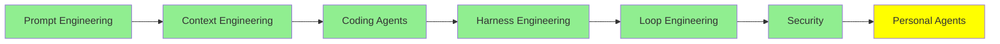

# Kişisel Agent'lar

*(Bu bir placeholder modül — şimdilik kısa bir özet; tam ders içeriği yakında geliyor.)*

Paylaşılan bir servis değil de kendi cihazların/hesaplarında sürekli çalışan kişisel agent'lar.

**Bu modülde işlenecek konular**:
- Openclaw
- Hermes Agent
- Moltbook

## Eğitim İlerlemesi

