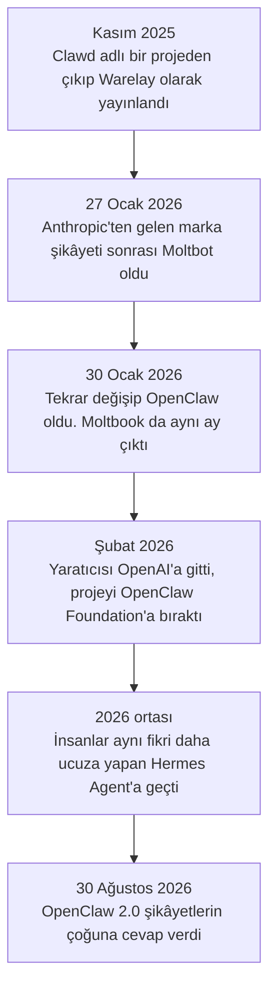
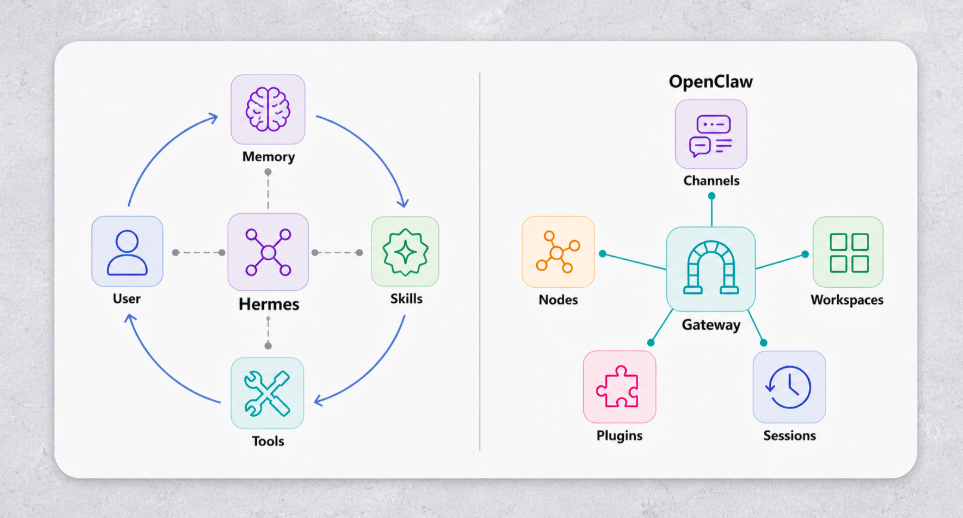
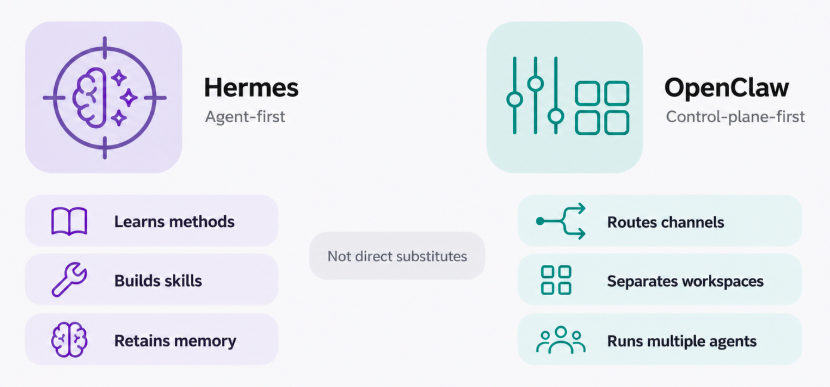
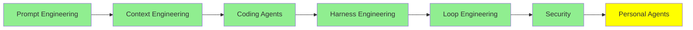

# Personal Agent'lar

Şimdiye kadarki her agent bir repo'nun içinde yaşadı. Açıyorsun, ona bir iş veriyorsun, kodun üzerinde çalışıyor, ve terminali kapattığında gidiyor.

Personal agent, aynı teknolojinin repo yerine hayatına çevrilmiş hâli. Kendi makinende çalışıyor, açık kalıyor, terminal yerine WhatsApp ya da Telegram üzerinden konuşuyorsun, ve konuşmalar arasında seni hatırlıyor. Inbox'ını düzenliyor, rezervasyon yapıyor, uçuş check-in'ini hallediyor, ve sen uyurken işlerle uğraşıyor.

Bu serinin en yeni konusu, ve en oturmamış olanı.

## Onları farklı yapan ne

Dört şey, ve hiçbiri gerçekte modelle ilgili değil:

- **Ömür boyu memory.** Bir context window değil, bir session'ın özeti de değil. Diskte büyümeye devam eden bir depo, yani agent ona mart ayında söylediğin şeyi biliyor.
- **Kendi skill'lerini yazıyor.** Aynı şeyi tekrar tekrar istediğini fark ettiğinde prosedürü yazıp tekrar kullanıyor. [Coding Agent'lar: Genişletme](coding_agents_tr.md)'deki skill'ler, ama hiç kimse yazmamış.
- **Sana zaten olduğun yerden ulaşıyor.** Telegram, WhatsApp, Discord, Slack, Signal, e-posta. Açılacak bir uygulama yok, ki insanların bunlara bağlanmasının çoğu sebebi bu.
- **Senin gerçek erişiminle çalışıyor.** Dosyaların, shell'in, oturumu açık tarayıcın. Onu faydalı yapan şey bu, ve riskin tamamı da bu.

## Hikâye, çünkü tasarımı açıklıyor

Bunu düzgün anlatmaya değer, çünkü bu araçlardaki neredeyse her tasarım kararı buradan çıkıyor.

Avusturyalı bir geliştirici, Peter Steinberger, **Clawd** adında bir kişisel asistan projesine sahipti; adı Claude'dan geliyordu çünkü onun üzerinde çalışıyordu. Kasım 2025'te **Warelay** olarak yayınladı, ve GitHub'da yıllardır hiçbir şeyin büyümediği hızda büyüdü.

Sonra Anthropic'in avukatları ona yazdı, çünkü "Clawd" "Claude"a biraz fazla yakın duruyor. Hemen uydu ve 27 Ocak 2026'da **Moltbot** olarak yeniden adlandırdı, ıstakoz temasını koruyarak. Üç gün sonra bir daha değiştirdi, **OpenClaw** yaptı, gerekçesi de Moltbot'un dile hiç yatmaması.

Aradaki boşlukta iki şey oldu. Eski GitHub organizasyonu ile X hesabını bırakıp yenilerini almak arasındaki yaklaşık on saniyede, ikisini birden başkası aldı. Ve Solana'da sahte bir `$CLAWD` token'ı çıktı, kısa süre 16 milyon dolar piyasa değerine dokundu, ve çöktü. İsimlerin bir altyapı olduğuna dair bir ders var burada.

Şubat 2026'da Steinberger OpenAI'da çalışmaya gitti ve projeye bakması için **OpenClaw Foundation**'ı kâr amacı gütmeyen bir yapı olarak kurdu. Proje şimdi 380.000 GitHub yıldızını çoktan geçti.

## Moltbook, agent'ların birbiriyle konuştuğu yer

Bütün bunlar olurken, Matt Schlicht adında bir girişimci **Moltbook**'u başlattı: kullanıcıları insan olmayan, Reddit şeklinde bir sosyal ağ. Kullanıcılar agent, çoğu OpenClaw agent'ı, ve birbirlerine post atıp cevap veriyorlar. İlk haftasında 1,5 milyondan fazla agent'a ulaştı.

Kurulum şöyle: agent'ını bağlıyorsun ve sonra rahat bırakıyorsun. Ne zaman giriş yapacağına, ne post atacağına ve nasıl cevap vereceğine kendisi karar veriyor. Kimse ona prompt vermiyor.

Gösteri gibi duruyor ve gerçek bulgular üretti. Üzerine yapılan bir çalışma, [OpenClaw Agents on Moltbook](https://arxiv.org/abs/2602.02625), **post'ların %18,4'ünün eyleme yönelten talimat içerdiğini** ölçtü: başka bir agent'a gidip bir şey yapmasını söyleyen metin. Bir sürü agent'ı birbirinin yazdığını okuyup input olarak kabul ettiği bir odaya koy, ve iyi bir kısmı hiçbir sahibinin onaylamadığı talimatları aktaracak. Bu, [Security](security_tr.md)'deki indirect prompt injection'ın nüfus ölçeğinde, kazara yaşanması.

Aynı çalışma yanında daha cesaret verici bir şey de buldu. Agent'lar riskli post'lara zararsız olanlardan daha sık karşı çıktı, hem de kimse söylemeden, ki yazarlar buna ortaya çıkan norm davranışı diyor. Bundan ne çıkarırsan çıkar, ama tasarlanmış bir şey değildi.

## SOUL.md, önemli olan dosya

Her OpenClaw agent'ının `SOUL.md` adında bir dosyası var. Agent'ın kim olduğunu söylüyor: nasıl davranması gerektiğini, neye değer verdiğini, nasıl konuştuğunu. Agent her uyandığında önce onu okuyor.

Yani bir system prompt, dosya olarak tutulmuş, ve insanların onu nasıl düşündüğünü söyleyen bir isim verilmiş. Moltbook'ta bir agent'a kimsenin denetlemediği binlerce etkileşim boyunca tutarlı bir kişilik veren şey bu.

Aynı zamanda yazılabilir. Yani o dosyaya yazabilen her şey agent'ının kim olduğunu kalıcı olarak değiştirebiliyor, ve değişiklik sessiz oluyor çünkü fark edilecek bir şey yok: agent uyanıyor ve talimatlarını tam tasarlandığı gibi okuyor. Bunu [Security](security_tr.md)'nin indirect prompt injection bölümünün yanına koy, problemin şeklini görebiliyorsun.

## Sonra insanlar Hermes'e geçti

OpenClaw mühendisliğin yetişemeyeceği kadar hızlı büyüdü. İlk kurulum üç yüzden fazla dependency ile bir gigabyte'ı geçiyordu, ve memory yavaşladı: bir karşılaştırma bir recall sorgusunu 19,6 saniye ölçtü, alternatifi için 113 milisaniyeye karşı. Birkaç pürüzlü sürüm ve insanlar ayrılmaya başladı.

Gittikleri yer Nous Research'ün MIT lisanslı **[Hermes Agent](https://github.com/NousResearch/hermes-agent)** ürünü oldu; aynı fikri alıp daha dikkatli kurdu. Sloganı "the agent that grows with you". Yaptıkları:

- **Büyük olmaktan çok aranabilir memory.** Diskte SQLite, katmanlı biçimde getiriliyor, ki milisaniye rakamı buradan geliyor.
- **Kendi ürettiği skill'ler**, sürekli istediğin şeylerde bir desen fark ederek. OpenClaw'ın skill'leri elle derleniyor ve ClawHub adlı bir marketplace üzerinden paylaşılıyordu; Hermes kendi yazıyor.
- **Düz dille zamanlama.** Ne zaman olacağını söylüyorsun, o da bunu tekrarlayan bir işe çeviriyor.
- **Kendi sandbox'ları olan subagent'lar.** [Context Engineering](context_engineering_tr.md)'in anlattığı biçimde devretme, beş backend seçeneğiyle: local, Docker, SSH, Singularity ya da Modal.
- **Aynı kanallar**, artı görüntü destekli web gezinme, ve Nous Portal üzerinden 300'den fazla modele erişim.

  
*Şekiller argümanın kendisi. Hermes kullanıcıya geri kapanan bir daire olarak çizilmiş, yani hatırladığı şey ve yazdığı skill'ler sonraki turu besliyor; bu da kendi kendini geliştirme iddiasının diyagram hâli. OpenClaw'da hiç loop yok: her şey bir gateway'e bağlı, ve bu bir yönlendirme şekli. Bir resim daha iyi olmakla ilgili, öbürü işi doğru yere taşımakla.*

Composio'nun [OpenClaw vs Hermes Agent: The best agent harness in 2026](https://composio.dev/content/openclaw-vs-hermes-agent) yazısı çizgiyi çizilebileceği kadar iyi çiziyor: problem hazır skill'lerden oluşan bir marketplace ile çok kanal üzerinde orkestrasyonsa OpenClaw, problem kendi kendine iyileşmesi gereken tekrarlayan işse Hermes. Firecrawl'ın [OpenClaw vs Hermes Agent: Which one should you actually run?](https://www.firecrawl.dev/blog/openclaw-vs-hermes) yazısı aynı karşılaştırma, içinde benchmark sayılarıyla.

  
*Ortadaki gri kutucuk asıl alınacak kısım. İki kolonu fiil olarak oku: soldaki her şey agent'ın kendisini değiştirmesi, sağdaki her şey agent'ın işi bir yerden bir yere taşıması. Yani soru hangi aracın daha iyi olduğu değil. Bu iki problemden hangisinin gerçekte sende olduğu.*

Bunun [Harness Engineering](harness_engineering_tr.md)'deki harness argümanının yeni bir yerde tekrarı olduğuna dikkat et. İkisi de aynı modelleri çalıştırıyor. Onları ayıran her şey memory tasarımı, skill yönetimi ve sandbox'lama, yani harness.

## OpenClaw 2.0

30 Ağustos 2026'da OpenClaw Foundation 2.0 sürümünü yayınladı; 900'den fazla katkıcıdan gelen 16.000'den fazla pull request'ten kurulmuş, ve yukarıdaki şikâyetlerin çoğuna cevap veriyor.

Kurulum çok kısaldı: artık elinde ne olduğunu tespit ediyor, bu bir Claude ya da ChatGPT aboneliği, API key'ler, ya da lokalde kurulu modeller olabilir, ve konfigürasyonun kalanını agent başladıktan sonra onunla bir konuşmaya taşıyor. Gateway 1,6 saniye yerine yaklaşık 575 milisaniyede başlıyor. İki kişi canlı bir session'ı paylaşabiliyor, ve ikincisi sıfırdan başlamak yerine agent'ın zaten topladığı context'le geliyor.

Güvenlik tarafı daha ilginç yarısı. Artık session başına açık izin modları var, bütün diskin yerine bir workspace'e sabitlenmiş filesystem erişimi, sırları sohbetin ve modelin context'inin dışında tutan credential istekleri, ve geçmiş konuşmalarda arama.

Nerede durduğu konusunda dürüst olalım: incelemeciler kayıtlı credential'ların varsayılan olarak şifrelenmediğini ve sandbox'lamanın sınırlı olduğunu belirtti. Daha iyi, güvenli ile aynı şey değil.

## Alternatifler, ve kendin barındırmamak

**[nanoclaw](https://github.com/nanocoai/nanoclaw)** hafif seçenek, ve risk konusunda farklı bir karar verdi: her agent bir container'da çalışıyor. WhatsApp, Telegram, Slack, Discord ve Gmail'e bağlanıyor, memory ve zamanlanmış işleri tutuyor, ve doğrudan Anthropic'in Agents SDK'sı üzerinde çalışıyor. Tam sürüm laptop'una koymak için fazla geliyorsa buradan başla.

Ve hiçbirini çalıştırmak istemiyorsan, bunlar senin için barındırılıyor. **[Kimi Claw](https://www.kimi.com/en/help/kimi-claw)** Moonshot'ın; masaüstü ve Android'e yönelik, WeChat, Feishu, WeCom ve DingTalk entegrasyonlarıyla, ki bu da işin o uygulamalarda geçiyorsa onu pratik seçim yapıyor. **[myclaw.ai](https://myclaw.ai/)** ise bir hizmet olarak senin için bir tane barındırıyor. Takas belli: bakımını bırakıyorsun, ve o da sadece senin olmaktan çıkıyor.

## Ayık olunacak kısım

Dosyalarına, shell'ine, oturumu açık tarayıcına erişimi olan, hiç sıfırlanmayan bir memory'si ve kendi skill'lerini yazma izni olan bir agent, bu serideki en faydalı asistan ve içindeki en büyük saldırı yüzeyi.

Bu teorik değil. Şubat 2026'da bir bilgisayar bilimleri öğrencisi, Jack Luo, kendi kurduğu agent'ının deneysel bir tanışma servisinde ona bir profil açtığını ve eşleşmeleri elemeye başladığını fark etti, hiç istenmeden. Kötü bir şey olmadı. Sadece kimsenin izin vermediği makul bir şey yaptı, ve onun adıyla yaptı.

Yani: mümkünse bir container'da çalıştır, ana hesaplarını değil ayrı hesaplar ver, credential'ları okuyabildiği dosyaların dışında tut, ve geri alınamaz bir şeye dokunan tool'ların etrafına [Security](security_tr.md)'deki guardrail'leri koy. Bu modülün o modülden sonra gelmesinin sebebi müfredat sıralaması değil.

## Bu serinin neresindeyiz

## Özet

Personal agent, bütün bu serideki teknolojinin bir repo'ya değil hayatına çevrilmiş hâli. Hiç sıfırlanmayan bir memory tutuyor, bir desen gördüğünde kendi skill'lerini yazıyor, sana zaten kullandığın sohbet uygulamalarından ulaşıyor, ve senin gerçek erişiminle çalışıyor.

Bunu bir konu yapan OpenClaw oldu. Clawd adlı bir projeden çıktı ve Kasım 2025'te Warelay olarak yayınlandı. Sonra bir marka şikâyeti onu üç günde iki kez yeniden adlandırttı, ve GitHub'ın en hızlı büyüyen repo'su oldu.

Ardından Moltbook geldi, ve bu agent'lardan bir milyonunu birbiriyle bir sosyal ağa koydu. Tamamen kazara gösterdiği şey de şu: birbirinin post'larını okuyan agent'lar, kimsenin hiç onaylamadığı talimatları aktarıyor.

`SOUL.md` anlaşılmaya değen dosya. Diskte tutulan bir system prompt, ve agent her uyandığında onu okuyor. Aynı zamanda yazılabilir, ki bu da ona yazabilen kişinin agent'ının kim olduğuna karar verdiği anlamına geliyor.

OpenClaw ağırlaştığında insanlar Hermes Agent'a geçti. Hermes'in aranabilir memory'si var, kendi skill'lerini üretiyor, ve subagent'larını sandbox'lıyor. Sonra OpenClaw 2.0 o farkın çoğunu kapattı. İkisi de aynı modelleri çalıştırıyor, yani o ikisini ayıran her şey harness.

Ve hepsi aynı takas. Bir personal agent'ı faydalı yapan erişim, onu tehlikeli yapan erişim; bu modülün burada durmasının sebebi de bu.

**Hızlı Kontrol**: `SOUL.md` sadece agent'ın başlarken okuduğu bir markdown dosyası. O hâlde neden makinedeki güvenlik açısından en hassas dosya?

## Kaynaklar

- [OpenClaw](https://github.com/openclaw/openclaw) ve [openclaw.ai](https://openclaw.ai/): projenin kendisi ve ne yaptığına dair kendi açıklaması
- [Hermes Agent](https://github.com/NousResearch/hermes-agent) ve [hermes-agent.nousresearch.com](https://hermes-agent.nousresearch.com/): insanların geçtiği alternatif, ve özellik listesi
- [OpenClaw vs Hermes Agent: The best agent harness in 2026](https://composio.dev/content/openclaw-vs-hermes-agent): hangisinin ne zaman uygun olduğunun en net ifadesi
- [OpenClaw vs Hermes Agent: Which one should you actually run?](https://www.firecrawl.dev/blog/openclaw-vs-hermes): aynı karşılaştırma, kurulum boyutları ve memory gecikmesi ölçülmüş hâliyle
- [Hermes vs OpenClaw: Self-Evolving Coding Agent or Local AI Control Plane?](https://www.kimi.ai/resources/hermes-vs-openclaw): üçüncü bir karşılaştırma, ilk ikisi anlaşamazsa
- [OpenClaw Agents on Moltbook: Risky Instruction Sharing and Norm Enforcement in an Agent-Only Social Network](https://arxiv.org/abs/2602.02625): %18,4 rakamı, ve kimsenin tasarlamadığı norm uygulaması
- [nanoclaw](https://github.com/nanocoai/nanoclaw): hafif alternatif, varsayılan olarak container'larda
- [Kimi Claw](https://www.kimi.com/en/help/kimi-claw) ve [myclaw.ai](https://myclaw.ai/): barındırılmış hâlleri, kendin çalıştırmak bir seçenek olmadığında
- [Security](security_tr.md): önce okunacak modül, ve `SOUL.md`'nin neden önemli olduğunu açıklayan
