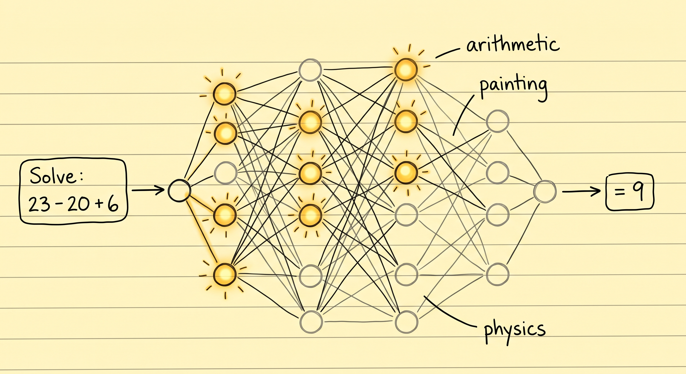
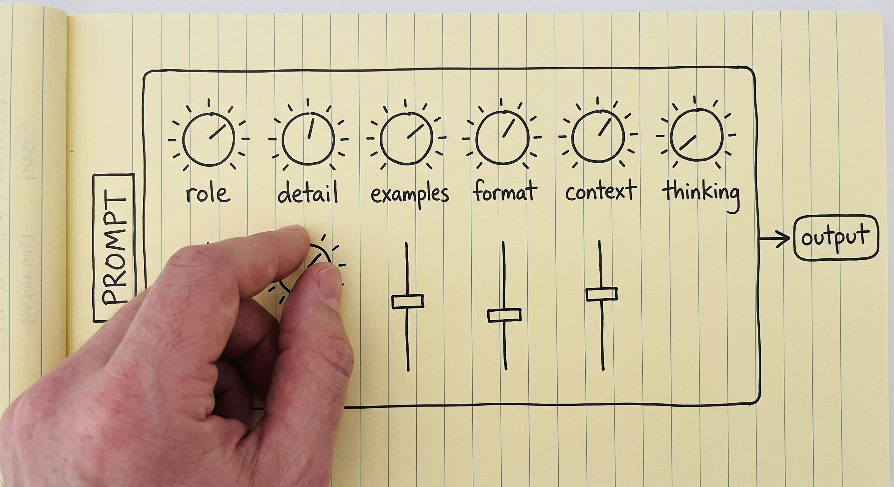
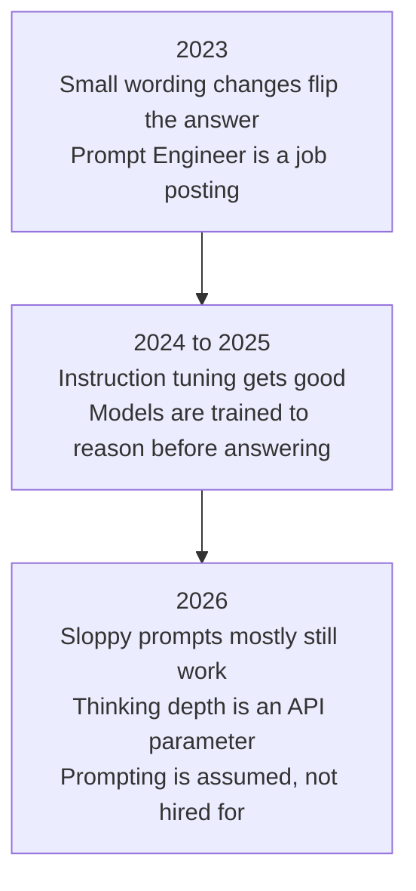

# Prompt Engineering

[LLM Fundamentals](../1_fundamentals/llms.md) ended with one paragraph about prompt engineering.
This module is that paragraph, opened up.

> **Prompt engineering is writing an input that leads the model to the output you expect.**

Start from what a model actually is. A pre-trained neural network, weights frozen, no state and no
memory. Input in, output out, every time, with nothing carried over. So the model is fixed and the
input is the only thing you control, which makes the input the only thing that can decide the
quality of what comes back.

[LLM Fundamentals](../1_fundamentals/llms.md) wrote down what the model computes:

```
P(next token | context)
```

Your prompt *is* that context. So the whole discipline is one search problem:

```
best prompt = the prompt that maximises P(the output you want | prompt)
```

Everything below is a technique for answering one question: how do I write the prompt so I get the
output I expect?

## The same question, asked twice

Here is the objection that should already be bothering you. If the weights are frozen and the model
remembers nothing, why does asking the same question in two different ways give two different
answers?

Because two phrasings are not the same input, and the model does not answer questions. It runs a
network.

Inside that network are neurons, and a prompt decides which ones fire. Some activate strongly, some
weakly, some not at all. Change the words and you change that pattern, which changes the output.

  
*The weights are identical in both cases. A prompt only decides which of them get used, which is why the same model answers an arithmetic question with one part of itself and a painting question with another.*

Think of a DJ mixer. Volume, bass, echo, one knob each. The DJ never swaps the hardware, they move
the knobs, listen, and move them again until the room sounds right. Your prompt is a setting of
those knobs, and prompt engineering is writing the text that turns up the parts of the network you
need for this job.

  
*Every knob here is something this module covers. None of them has a panel you can reach: the prompt text is the only thing that moves them.*

The knobs, though, are unlabelled and out of reach, and text is your only handle on them. Which is
why this work is experimental rather than theoretical, and why nobody can hand you the correct
prompt for your task.

## What a weak prompt costs you

Two drivers take the same car around the same track and post different lap times. Same engine, same
horsepower, same grip, same corners. The better driver simply gets more out of the machine.

Models work like this, and it explains a complaint you have probably already heard. Someone without
much prompting skill fails to get what they wanted, and concludes the model is weak, or not that
intelligent, or that it can only do seventy percent of the job. Someone else takes the same model,
writes a better prompt, and finishes the task.

So when a model disappoints you, the first question is not which model to switch to.

## Prompt engineering is dead in 2026

Yes, really.

When the first LLM APIs opened up around 2023, the models were fragile. A small change in wording
could turn a good answer into a wrong one, and the sensitivity was measured, not imagined: on
open models of that era, formatting changes that left the meaning untouched moved accuracy by up to
[76 points](https://arxiv.org/abs/2310.11324). **Prompt Engineer** was a job title. Companies
hired people whose whole day was trial and error until the model produced the expected output.

Those days are gone. Models are far more capable, and they now arrive with abilities like chain of
thought, further down this page, that let them work out what you meant from a sloppy prompt. In
2026 prompt engineering is not a career. It is a basic skill everyone working with these systems is
expected to have.



That is why this module only covers what is genuinely useful in a daily AI engineering job. The
sophisticated end of the subject lives in
[Advanced Prompting](../3_expert/advanced_prompting.md).

When you want the full catalogue rather than the useful subset, the [Prompt Engineering
Guide](https://www.promptingguide.ai/) has it. And treat what follows as starting points, not a
syllabus: prompting is experimental, and you get good at it by writing a prompt, reading the
output, and changing the prompt.

## Two templates

The rule is simply that a clearer, more detailed prompt gets a better answer. Two templates are
worth knowing anyway, because they show what "clear and detailed" means in practice: a prompt whose
boundaries are defined.

The simple one:

```text
{Goal}
{Output Format}
{Warnings}
{Context}
```

- **Goal**: what you want, in a sentence or two.
- **Output Format**: the shape the answer has to arrive in.
- **Warnings**: the mistakes you already suspect it will make.
- **Context**: everything about your situation a stranger would need in order to help you.

  
*The context dump is the longest part and the least polished, and that is fine. It is the part no template can write for you.*

The more detailed one:

```text
{Role}
{Task}
{Context}
{Reasoning}
{Output Format}
{Stop Conditions}
```

- **Role**: who the model should be while it works, covered under role prompting below.
- **Task**: the work itself, as numbered steps when the order matters.
- **Context**: background, constraints, and what to stay away from.
- **Reasoning**: how you want it to think before it commits to an answer.
- **Output Format**: the exact shape, down to the table columns when you need them.
- **Stop Conditions**: how the model knows it is finished.

  
*Stop conditions are the slot people forget. Without one, "done" is the model's guess rather than your definition.*

Today's models do not need you to follow either template strictly, and most of the time you will
not. They are here so that "write a clear prompt" stops being vague advice.

## In-context learning, and few-shot prompting

Models can learn things that are not in their weights. Not through pre-training, not through
fine-tuning, but from what is sitting in the context, the working memory from
[Memory](../1_fundamentals/memory.md) . This is called **in-context learning**, or ICL.

It is also the reason RAG works at all. In [RAG & Embeddings](../1_fundamentals/rag.md) the weights never
change; the retrieved documents land in the context and the model uses them on the spot. The
library stays closed, and you put what you need on the desk.

Look again at both templates: each has a slot for context. That slot is the one place where you
hand the model knowledge it did not have a second ago.

ICL also buys you a technique. **Few-shot prompting** means showing the model a few examples of the
task done correctly before you give it the real one:

```text
Classify the sentiment of each message as positive, negative or neutral.

Message: "the package arrived two days early"
Sentiment: positive

Message: "the box was crushed and the mug inside was broken"
Sentiment: negative

Message: "delivery is scheduled for Thursday"
Sentiment: neutral

Message: "it works, but the app crashed twice"
Sentiment:
```

Those three examples do two jobs at once. They fix the label set, so the answer is one of three
words rather than a paragraph of nuance, and they fix the format, so the answer arrives as
`Sentiment: <label>` and your code can read it. That combination is usually why examples succeed
where an instruction alone did not.

A handful of examples is **few-shot**. No examples at all is **zero-shot**, which is what you have
been doing every time you typed a question into a chat window.

## Some things that reliably help

### Be clear and direct

Less effective:

```text
Create an analytics dashboard
```

More effective:

```text
Create an analytics dashboard. Include as many relevant features and interactions as possible. Go beyond the basics to create a fully-featured implementation.
```

The second prompt is not more polite or better written. It just says considerably more about what
finished looks like. Both examples come from Anthropic's [prompting best
practices](https://platform.claude.com/docs/en/build-with-claude/prompt-engineering/claude-prompting-best-practices).

### Add context, including your reasons

Since the model learns from what is in the context, tell it *why* a rule exists and not only what
the rule is.

Less effective:

```text
NEVER use ellipses
```

More effective:

```text
Your response will be read aloud by a text-to-speech engine, so never use ellipses since the text-to-speech engine will not know how to pronounce them.
```

The first is a rule to be obeyed blindly. The second lets the model generalise: it will also avoid
the other punctuation a speech engine mangles, which you never thought to list.

### Give the prompt a structure

Often you want to split a prompt into sections, so the model can tell which part is an instruction,
which part is data, which part is the goal and which part describes the output. It is a readability
and separation win, and it measurably moves results.

XML tags, which is what Anthropic's models are tuned for:

```xml
<identity>
You are a support engineer for a company that hosts Postgres databases.
</identity>

<goal>
Read the customer ticket below and decide whether it is a billing question, a
technical question, or both.
</goal>

<output_format>
One line: BILLING, TECHNICAL or BOTH, followed by a one-sentence reason.
</output_format>
```

The same thing in markdown:

```markdown
## Identity
You are a support engineer for a company that hosts Postgres databases.

## Goal
Decide whether the ticket below is a billing question, a technical question, or both.

### How to do it
Read the whole ticket first. Ignore the customer's own guess about the cause.

## Output format
One line: BILLING, TECHNICAL or BOTH, followed by a one-sentence reason.
```

Nesting works in both, and the model reads the hierarchy as a hierarchy: a `###` under a `##` is
detail belonging to it, and the higher level carries more weight.

The format does not have to be a standard one. Invent your own when it fits:

```text
Please read the emails below from my boss and my friend:

=== Boss Email ===
Write down the report of what you have done.

=== Friend Email ===
Write a poem for me.

=== Your Task ===
Please write a polite reply to both emails.
```

Why bother with the fences? Because without them, "Write a poem for me" looks exactly like an
instruction from you, and the model may cheerfully write a poem instead of replying to anyone. On a
long, crowded prompt this is most of what structure buys you: the model can tell your instructions
from the text you pasted in. When the pasted text is hostile rather than merely confusing, the same
problem has a name, prompt injection, and it gets its own module in
[Security](security.md).

## Chain of Thought

Research found something that sounds obvious once you hear it: if a model breaks a hard task into
smaller ones and writes the intermediate steps *before* the final answer, the final answer gets
better. The same way you would do the arithmetic on paper instead of in your head.

Ask a model this:

```text
The cafeteria had 23 apples. They used 20 for lunch and bought 6 more. How many now?
```

With a plain prompt, it answers straight out:

```text
Final Answer: 32 apples
```

Which is wrong. Now force it to think first, and produce its intermediate results before it commits
to anything:

```text
<thinking>
The user wants the final number of apples in the cafeteria. Steps:
start with the initial number, subtract the apples used for lunch, add the apples bought later.

Initial apples: 23. Apples used for lunch: 20. Apples bought: 6.

Step 1: apples remaining after lunch. 23 - 20 = 3 apples.
Step 2: final number after buying more. 3 + 6 = 9 apples.
</thinking>

Final Answer: 9 apples
```

Feels like magic. It is closer to housekeeping. A model is **autoregressive**: every token it
writes becomes part of the input it reads for the next token. When it writes out `23 - 20 = 3`,
that result is now sitting in its context, and it no longer has to hold it in its head while
working out the rest. For a model, writing is thinking.

To watch the two side by side on a set of puzzles, the author of this course built a
[Chain of Thought Visualizer](https://cot-visualizer.online/). It is a demonstration rather than a
benchmark: the plain side is deliberately prompted to answer badly. For why any of this works,
[Why Can Large Language Models Generate Correct
Chain-of-Thoughts?](https://arxiv.org/abs/2310.13571) is the extra read.

### Chain of thought is also why the job title disappeared

In 2026 you almost never write a chain of thought prompt by hand.

When ChatGPT or an agent shows you that it is "thinking", that is chain of thought. It is happening
not because someone typed *let us think step by step*, but because the model was trained to reason
before it answers, always, whether you asked or not.

The amount of it is now a dial rather than a prompt. It is what people mean by running a model on
high thinking, or low effort, or max effort. Anthropic's [effort
parameter](https://platform.claude.com/docs/en/build-with-claude/effort) takes `low`, `medium`,
`high`, `xhigh` and `max`, and the other providers have their own version of the same knob. More
thinking means better answers on hard problems. It also means more cost, slower responses, and a
context window that fills up faster.

> **NOTE: more thinking is not always better.** Like people, models can overthink, and their
> performance degrades when they do. It is well documented: [Stop
> Overthinking](https://arxiv.org/abs/2503.16419) surveys the whole area, [The Danger of
> Overthinking](https://arxiv.org/abs/2502.08235) found nearly 30% better results on software
> engineering tasks by picking the solutions that overthought least, [When More Thinking
> Hurts](https://aclanthology.org/2026.findings-acl.1199/) shows models abandoning answers that
> were already correct, and [OptimalThinkingBench](https://proceedings.iclr.cc/paper_files/paper/2026/hash/0f63515b14f33c008158213c7b6191c6-Abstract-Conference.html)
> concludes that no model yet thinks the right amount for the question in front of it.

So the real skill is matching the thinking budget to the difficulty of the task. Which is a
parameter you set, not a sentence you write.

## Role prompting

Role prompting is giving the model a job, a persona or a character before you give it the task.

> **NOTE: what is a system prompt?** The system prompt sits at the top of the context, once, and
> defines how the model behaves for the whole conversation. The developer of the model or the agent
> writes it, not the user, and it is usually long. It is also where the tools are registered, with
> their schemas and descriptions ([Tool Calling](../1_fundamentals/tools.md)). If you want to see
> real ones, [system prompt leaks](https://github.com/asgeirtj/system_prompts_leaks) collects them
> verbatim from ChatGPT, Claude, Gemini, Grok and others.

  
*The same figure from [LLM Fundamentals](../1_fundamentals/llms.md). Identity and instructions are where a role goes, and everything in this box is written before the user says anything.*

That is why role prompting belongs here: the system prompt is where a role does its best work.
Examples of the technique itself are as simple as they look:

```text
Act as a senior software engineer. Review this code and find security bugs.
```

```text
You are William Shakespeare. Write a short poem about summer.
```

A role does two things well. It sets the perspective, telling the model who it is, an HR manager or
a chef or a data science interviewer. And it shapes tone and style, pulling vocabulary, assumed
expertise and formatting into line with that.

What it does not reliably do is make the model smarter. That was the early hope, and it has not
held up: personas in system prompts [do not improve
performance](https://arxiv.org/abs/2311.10054) across a broad range of questions, and a 2026
follow-up found persona prompting [increases expertise depth while reducing
clarity](https://arxiv.org/abs/2605.29420), with the effect depending on the question and the
domain. Use a role to shape *how* an answer reads. Do not expect it to raise the ceiling.

Where roles genuinely earn their place is in building agents. When we talk about designing an
agent, we mostly mean choosing a system prompt and a set of tools for one job. Say you want a code
review team:

1. **Code Review Agent.** System prompt: review code for structural, logic and architectural
   flaws; return a bulleted list of bugs and performance bottlenecks; never comment on style or
   security. Tools: `fetch_repository_files`, `run_ast_parser`.
2. **Security Auditor Agent.** System prompt: scan strictly for vulnerabilities, data leaks and
   dependency risks; grade each as High, Medium or Low; do not suggest features or refactoring.
   Tools: `run_sast_scanner`, `check_cve_database`.
3. **Clean Code Formatter Agent.** System prompt: refactor working code for readability and
   maintainability, applying DRY and standard naming; do not alter logic or hunt for bugs. Tools:
   `execute_linter_auto_fix`, `generate_docstrings`.

Three agents, one model. The only differences are the role, the instructions and the tools, which
is what [Multi-Agent Systems](../1_fundamentals/multi_agent.md) was quietly assuming when it drew a
supervisor handing work to specialists.

Be careful, though, because a role changes the whole behaviour and not just the part you were
aiming at. Assign a security expert and then ask it about art history, and the answer can come back
worse than it would have with no role at all.

Which brings us back to the mixer. "Act as a security expert" turns up the parts of the network
holding security knowledge and leaves the ones holding art history turned down. Seen that way, role
prompting is a retrieval problem: you are not adding knowledge to the model, you are choosing which
of the knowledge it already has gets used. And that is also the catch, because the knobs you turned
down stay down when the question changes.

## Where this fits in the series


## Summary

Prompt engineering is writing the input that makes the output you want the most likely one. The
weights are frozen, so the prompt is the only knob you have, and different phrasings activate
different parts of the same network.

The things that reliably help are unglamorous: say exactly what you want, explain why, hand over
the context, show an example or two, and structure a long prompt so your instructions cannot be
confused with your data. Chain of thought used to be one of those techniques and is now built into
the models, which is most of the reason the job title disappeared and prompting became a baseline
skill instead.

Next: everything that ends up in the context window, and how to decide what deserves the space.

**Quick Check**: why does a frozen model answer the same question differently when you rephrase it,
and what does a role prompt actually change?

## References

- [Prompt Engineering Guide](https://www.promptingguide.ai/): the full catalogue of techniques, well beyond what we covered
- [Prompting best practices](https://platform.claude.com/docs/en/build-with-claude/prompt-engineering/claude-prompting-best-practices): Anthropic's current guidance, and the source of the two before-and-after examples
- [Quantifying Language Models' Sensitivity to Spurious Features in Prompt Design](https://arxiv.org/abs/2310.11324): how fragile the 2023 generation really was, measured
- [Why Can Large Language Models Generate Correct Chain-of-Thoughts?](https://arxiv.org/abs/2310.13571): the theory behind writing as thinking
- [Chain of Thought Visualizer](https://cot-visualizer.online/): a side-by-side demo of reasoning versus answering straight away
- [Effort](https://platform.claude.com/docs/en/build-with-claude/effort): the thinking dial, and what each level is for
- [Stop Overthinking: A Survey on Efficient Reasoning for Large Language Models](https://arxiv.org/abs/2503.16419): the overthinking literature in one place
- [When "A Helpful Assistant" Is Not Really Helpful](https://arxiv.org/abs/2311.10054): the study that took the shine off persona prompts
- [System prompt leaks](https://github.com/asgeirtj/system_prompts_leaks): production system prompts, captured verbatim
- [Advanced Prompting](../3_expert/advanced_prompting.md): the techniques this module deliberately skipped
