# Güvenlik (Security)

*(Bu bir placeholder modül — şimdilik kısa bir özet; tam ders içeriği yakında geliyor.)*

Agent'lara saldırma ve onları savunma: jailbreak'lerin nasıl çalıştığı, ve onlara karşı nasıl test edilip korunulacağı.

**Bu modülde işlenecek konular**:
- Jailbreaking
- White-box testi
- Black-box testi
- Guardrails

## Eğitim İlerlemesi

```mermaid
graph LR
    A[Prompt Engineering] --> B[Context Engineering]
    B --> C[Landscape]
    C --> D[Extending Agents]
    D --> E[Harness Engineering]
    E --> F[Security]
    F --> G[Loop Engineering]
    G --> H[Personal Agents]
    style A fill:#90EE90
    style B fill:#90EE90
    style C fill:#90EE90
    style D fill:#90EE90
    style E fill:#90EE90
    style F fill:#FFFF00
```

