# Generative UI

*(Placeholder module: a short overview for now, full lesson content is coming soon.)*

How an agent's output reaches a screen while it is still being produced, and what changes when the
model generates the interface itself rather than filling one in.

**Topics this module will cover**:
- Generative UI: the model producing the interface, not just the text inside it
- Event streaming: sending a run's steps to the front end as they happen
- Server-Sent Events, and why they fit an agent better than a single response does

## Tutorial Progress

```mermaid
graph LR
    A[Prompt Engineering] --> B[Context Engineering]
    B --> C[Coding Agents]
    C --> D[Harness Engineering]
    D --> E[Loop Engineering]
    E --> F[Generative UI]
    F --> G[Security]
    G --> H[Personal Agents]
    style A fill:#90EE90
    style B fill:#90EE90
    style C fill:#90EE90
    style D fill:#90EE90
    style E fill:#90EE90
    style F fill:#FFFF00
```

