# Generative UI

*(Bu bir placeholder modül: şimdilik kısa bir özet, tam ders içeriği yakında geliyor.)*

Bir agent'ın çıktısının, hâlâ üretilirken ekrana nasıl ulaştığı, ve modelin arayüzü doldurmak
yerine kendisinin ürettiğinde nelerin değiştiği.

**Bu modülde işlenecek konular**:
- Generative UI: modelin sadece içindeki metni değil arayüzün kendisini üretmesi
- Event streaming: bir çalışmanın adımlarını olurken ön yüze göndermek
- Server-Sent Events, ve bir agent'a neden tek bir cevaptan daha iyi uyduğu

## Eğitim İlerlemesi

```mermaid
graph LR
    A[Prompt Engineering] --> B[Context Engineering]
    B --> C[Coding Agents]
    C --> D[Harness Engineering]
    D --> E[Loop Engineering]
    E --> F[Generative UI]
    F --> G[Security]
    G --> H[Personal Agents]
    style A fill:#90EE90
    style B fill:#90EE90
    style C fill:#90EE90
    style D fill:#90EE90
    style E fill:#90EE90
    style F fill:#FFFF00
```

