# Module 16: Advanced UI

*Category: Expert — Module 16 (1 of 10 in this category)*

*(Placeholder module — a short overview for now; full lesson content is coming soon.)*

UI that agents can drive or generate live, and the emerging protocols connecting agents to interfaces.

**Topics this module will cover**:
- Agentic UI
- Generative UI
- Event streaming
- AG-UI
- MCP-Apps UI
- A2UI
- CopilotKit
- Agent Client Protocol (ACP)

## Tutorial Progress

```mermaid
graph LR
    A[16: Advanced UI] --> B[17: Advanced Architectures]
    B --> C[18: Advanced Tools]
    C --> D[19: Advanced Memory]
    D --> E[20: Advanced Multi-Agent]
    E --> F[21: Advanced Prompting]
    F --> G[22: Adv. Context Eng.]
    G --> H[23: Adv. Harness Eng.]
    H --> I[24: Advanced Deployment]
    I --> J[25: Advanced Training]
    style A fill:#FFFF00
```

**Previous Module:** [Intermediate — Module 15: Personal Agents](../2_intermediate/15_personal_agents.md)
**Next Module:** [Module 17: Advanced Architectures](17_advanced_architectures.md)
