# Module 16: İleri Seviye UI

*Kategori: Expert — Modül 16 (bu kategoride 1/9)*

*(Bu bir placeholder modül — şimdilik kısa bir özet; tam ders içeriği yakında geliyor.)*

Agent'ların canlı olarak yönlendirebildiği veya oluşturabildiği arayüzler, ve agent'ları arayüzlere bağlayan ortaya çıkan protokoller.

**Bu modülde işlenecek konular**:
- Agentic UI
- Generative UI
- Event streaming
- AG-UI
- MCP-Apps UI
- A2UI
- CopilotKit
- Agent Client Protocol (ACP)

## Eğitim İlerlemesi

```mermaid
graph LR
    A[16: Advanced UI] --> B[17: Advanced Architectures]
    B --> C[18: Advanced Tools]
    C --> D[19: Advanced Memory]
    D --> E[20: Advanced Multi-Agent]
    E --> F[21: Advanced Prompting]
    F --> G[22: Adv. Context Eng.]
    G --> H[23: Adv. Harness Eng.]
    H --> I[24: Advanced Deployment]
    style A fill:#FFFF00
```

**Önceki Modül:** [Intermediate — Modül 15: Kişisel Agent'lar](../2_intermediate/15_personal_agents_tr.md)
**Sonraki Modül:** [Modül 17: İleri Seviye Mimariler](17_advanced_architectures_tr.md)
