# Module 21: Advanced Prompting

*Category: Expert — Module 21 (6 of 9 in this category)*

*(Placeholder module — a short overview for now; full lesson content is coming soon.)*

Reasoning and prompting strategies that go well beyond the basics from Module 8.

**Topics this module will cover**:
- Reflexion
- Tree of Thought
- LLM Council
- Caveman
- Ponytail

## Tutorial Progress

```mermaid
graph LR
    A[16: Advanced UI] --> B[17: Advanced Architectures]
    B --> C[18: Advanced Tools]
    C --> D[19: Advanced Memory]
    D --> E[20: Advanced Multi-Agent]
    E --> F[21: Advanced Prompting]
    F --> G[22: Adv. Context Eng.]
    G --> H[23: Adv. Harness Eng.]
    H --> I[24: Advanced Deployment]
    style A fill:#90EE90
    style B fill:#90EE90
    style C fill:#90EE90
    style D fill:#90EE90
    style E fill:#90EE90
    style F fill:#FFFF00
```

**Previous Module:** [Module 20: Advanced Multi-Agent](20_advanced_multiagent.md)
**Next Module:** [Module 22: Advanced Context Engineering](22_advanced_context_engineering.md)
