# Module 22: Advanced Context Engineering

*Category: Expert — Module 22 (7 of 9 in this category)*

*(Placeholder module — a short overview for now; full lesson content is coming soon.)*

Frameworks and specs for structuring an agent's context and goals at a bigger scale than Module 9.

**Topics this module will cover**:
- Superpowers
- SpecKit
- GSD
- AgentOS
- Claude Native Plan / Goals / Ultrathink / Playground

## Tutorial Progress

```mermaid
graph LR
    A[16: Advanced UI] --> B[17: Advanced Architectures]
    B --> C[18: Advanced Tools]
    C --> D[19: Advanced Memory]
    D --> E[20: Advanced Multi-Agent]
    E --> F[21: Advanced Prompting]
    F --> G[22: Adv. Context Eng.]
    G --> H[23: Adv. Harness Eng.]
    H --> I[24: Advanced Deployment]
    style A fill:#90EE90
    style B fill:#90EE90
    style C fill:#90EE90
    style D fill:#90EE90
    style E fill:#90EE90
    style F fill:#90EE90
    style G fill:#FFFF00
```

**Previous Module:** [Module 21: Advanced Prompting](21_advanced_prompting.md)
**Next Module:** [Module 23: Advanced Harness Engineering](23_advanced_harness_engineering.md)
