# Module 23: Advanced Harness Engineering

*Category: Expert — Module 23 (8 of 9 in this category)*

*(Placeholder module — a short overview for now; full lesson content is coming soon.)*

Fine-tuning the harness itself, beyond the guardrails/hooks/sandboxes basics from Module 11.

**Topics this module will cover**:
- Harness profiles
- System prompts
- Renaming/reshaping tools for a given context

## Tutorial Progress

```mermaid
graph LR
    A[16: Advanced UI] --> B[17: Advanced Architectures]
    B --> C[18: Advanced Tools]
    C --> D[19: Advanced Memory]
    D --> E[20: Advanced Multi-Agent]
    E --> F[21: Advanced Prompting]
    F --> G[22: Adv. Context Eng.]
    G --> H[23: Adv. Harness Eng.]
    H --> I[24: Advanced Deployment]
    style A fill:#90EE90
    style B fill:#90EE90
    style C fill:#90EE90
    style D fill:#90EE90
    style E fill:#90EE90
    style F fill:#90EE90
    style G fill:#90EE90
    style H fill:#FFFF00
```

**Previous Module:** [Module 22: Advanced Context Engineering](22_advanced_context_engineering.md)
**Next Module:** [Module 24: Advanced Deployment](24_advanced_deployment.md)
