# Module 24: İleri Seviye Deployment

*Kategori: Expert — Modül 24 (bu kategoride 9/10)*

*(Bu bir placeholder modül — şimdilik kısa bir özet; tam ders içeriği yakında geliyor.)*

Agent'ları tek seferlik script'ler veya chat oturumları olarak değil, gerçek production servisleri olarak çalıştırmak.

**Bu modülde işlenecek konular**:
- Agent server'lar
- LangChain Agent Protocol

## Eğitim İlerlemesi

```mermaid
graph LR
    A[16: Advanced UI] --> B[17: Advanced Architectures]
    B --> C[18: Advanced Tools]
    C --> D[19: Advanced Memory]
    D --> E[20: Advanced Multi-Agent]
    E --> F[21: Advanced Prompting]
    F --> G[22: Adv. Context Eng.]
    G --> H[23: Adv. Harness Eng.]
    H --> I[24: Advanced Deployment]
    I --> J[25: Advanced Training]
    style A fill:#90EE90
    style B fill:#90EE90
    style C fill:#90EE90
    style D fill:#90EE90
    style E fill:#90EE90
    style F fill:#90EE90
    style G fill:#90EE90
    style H fill:#90EE90
    style I fill:#FFFF00
```

**Önceki Modül:** [Modül 23: İleri Seviye Harness Engineering](23_advanced_harness_engineering_tr.md)
**Sonraki Modül:** [Modül 25: İleri Seviye Training](25_advanced_training_tr.md)
