# İleri Seviye Mimariler

*(Bu bir placeholder modül — şimdilik kısa bir özet; tam ders içeriği yakında geliyor.)*

AI Agent'lar modülündeki temel Observe-Decide-Act loop'unun ötesine geçen mimari desenler.

**Bu modülde işlenecek konular**:
- THREAD
- ReAct
- CodeAct
- RLM
- Dynamic Workflows

## Eğitim İlerlemesi

```mermaid
graph LR
    A[Advanced Tools] --> B[Advanced Memory]
    B --> C[Advanced Multi-Agent]
    C --> D[Advanced Prompting]
    D --> E[Adv. Context Eng.]
    E --> F[Adv. Coding Agents]
    F --> G[Adv. Harness Eng.]
    G --> H[Adv. Agent Arch.]
    H --> I[Advanced UI]
    I --> J[Advanced Deployment]
    J --> K[Advanced Training]
    style A fill:#90EE90
    style B fill:#90EE90
    style C fill:#90EE90
    style D fill:#90EE90
    style E fill:#90EE90
    style F fill:#90EE90
    style G fill:#90EE90
    style H fill:#FFFF00
```

